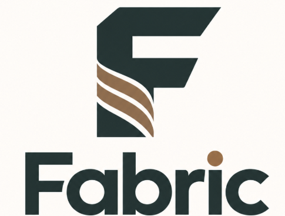

# Capítulo II: Requirements Elicitation and Analysis

## 2.1. Competidores

* **SI-TEXT Perú (competidor directo):** Es una plataforma ERP peruana especializada en la industria textil y de confecciones que permite gestionar inventarios, órdenes de producción, fichas técnicas, insumos, mermas, ventas y reportes. Está orientada principalmente a talleres de confección, fábricas de ropa, marcas y servicios textiles. Su propuesta busca centralizar la información de la empresa y mejorar el control de la producción mediante una solución Cloud/SaaS.

* **Datatex - CAMS (competidor directo):** Es una solución internacional especializada en la gestión de producción para empresas textiles y de confecciones. Su sistema CAMS permite recopilar información del proceso productivo, registrar cantidades producidas, monitorear máquinas, detectar tiempos de inactividad, registrar defectos y analizar la productividad de operarios y procesos.

* **Coats Digital - FastReactPlan (competidor directo):** Es una solución de software especializada en la planificación y control de la producción de prendas de vestir. Permite gestionar la capacidad productiva, órdenes, materiales y líneas de confección, además de comparar la producción planificada con la producción real y visualizar indicadores mediante reportes y dashboards.

### 2.1.1. Análisis competitivo

Para este análisis competitivo se realizó un benchmark parcial enfocado en identificar soluciones digitales orientadas a la gestión, monitoreo y control de los procesos productivos dentro de la industria textil y de confecciones. La evaluación considera tres competidores directos: SI-TEXT Perú, como solución local enfocada en talleres y empresas textiles; Datatex - CAMS, como solución internacional especializada en el monitoreo de información de producción; y Coats Digital - FastReactPlan, como solución internacional especializada en la planificación y control de la producción de prendas.

Las métricas analizadas incluyen el perfil del producto, mercado objetivo, estrategias de marketing, productos y servicios, precios, canales de distribución y análisis FODA. Se seleccionaron estos competidores debido a que presentan diferentes enfoques para resolver problemas relacionados con el control de la producción textil. Esto permite identificar oportunidades de diferenciación para **Fabric**, principalmente mediante una plataforma orientada a las necesidades de las MYPES textiles y de confecciones de Lima que facilite el seguimiento de la producción, rendimiento de las máquinas, trazabilidad de lotes y registro de incidencias de calidad.

<table style="border-collapse: collapse; width: 100%;">
<tr>
<th colspan="6" style="vertical-align: top;">Competitive Analysis Landscape</th>
</tr>

<tr>
<td colspan="2" style="vertical-align: top;">¿Por qué llevar a cabo este análisis?</td>
<td colspan="4" style="vertical-align: top;">El objetivo de este análisis es identificar las características de los competidores y encontrar maneras de diferenciarnos.</td>
</tr>

<tr>
<td colspan="2" rowspan="2" style="vertical-align: top;">Startup y Competidores</td>
<td style="vertical-align: top;">Nuestra Startup</td>
<td style="vertical-align: top;">SI-TEXT Perú</td>
<td style="vertical-align: top;">Datatex - CAMS</td>
<td style="vertical-align: top;">Trama</td>
</tr>

<tr>
<td style="vertical-align: top;"></td>
<td style="vertical-align: top;"></td>
<td style="vertical-align: top;"></td>
<td style="vertical-align: top;"></td>
</tr>

<tr>
<td rowspan="2" style="vertical-align: top;">Perfil</td>
<td style="vertical-align: top;">Overview</td>
<td style="vertical-align: top;">Fabric es una aplicación web orientada a las MYPES textiles y de confecciones de Lima que busca centralizar información relacionada con la producción, rendimiento de máquinas, trazabilidad de lotes y controles de calidad.</td>
<td style="vertical-align: top;">SI-TEXT Perú es un ERP especializado en la industria textil y de confecciones peruana que permite centralizar información de producción, inventarios, ventas, fichas técnicas, insumos y reportes.</td>
<td style="vertical-align: top;">Datatex - CAMS es una solución especializada en la gestión del piso de producción que permite recopilar y analizar información relacionada con máquinas, operarios y procesos productivos textiles.</td>
<td style="vertical-align: top;">Trama es una plataforma ERP especializada en empresas de confecciones y maquila que integra la gestión de producción, calidad, inventarios y fichas técnicas.</td>
</tr>

<tr>
<td style="vertical-align: top;">Ventaja competitiva ¿Qué valor ofrece a los clientes?</td>
<td style="vertical-align: top;">Fabric busca ofrecer una solución sencilla y adaptada a las MYPES textiles y de confecciones de Lima, integrando el seguimiento de la producción, rendimiento de máquinas, trazabilidad de lotes y registro de incidencias de calidad.</td>
<td style="vertical-align: top;">Su principal ventaja es su adaptación al mercado textil peruano y la integración de diferentes procesos empresariales dentro de una plataforma Cloud/SaaS.</td>
<td style="vertical-align: top;">Destaca por su capacidad para recopilar información del proceso productivo y monitorear máquinas, cantidades producidas, tiempos de inactividad, defectos y productividad.</td>
<td style="vertical-align: top;">Su principal valor es integrar la gestión de producción y calidad dentro de una solución especializada para empresas de confecciones.</td>
</tr>

<tr>
<td rowspan="2" style="vertical-align: top;">Perfil de Marketing</td>
<td style="vertical-align: top;">Mercado objetivo</td>
<td style="vertical-align: top;">MYPES textiles y de confecciones de Lima, especialmente aquellas que requieren mejorar el control de sus procesos productivos y de calidad.</td>
<td style="vertical-align: top;">Talleres de confección, fábricas de ropa, marcas y empresas de servicios textiles del mercado peruano.</td>
<td style="vertical-align: top;">Empresas fabricantes del sector textil y de confecciones que requieren monitorear y controlar sus operaciones productivas.</td>
<td style="vertical-align: top;">Empresas de confecciones y maquila que requieren gestionar sus procesos productivos y controles de calidad.</td>
</tr>

<tr>
<td style="vertical-align: top;">Estrategias de marketing</td>
<td style="vertical-align: top;">Marketing digital, acercamiento directo a MYPES textiles, demostraciones de la plataforma y enfoque inicial en empresas ubicadas en Lima y Gamarra.</td>
<td style="vertical-align: top;">Contacto comercial directo, demostraciones personalizadas y promoción digital de sus soluciones para empresas textiles.</td>
<td style="vertical-align: top;">Marketing B2B, demostraciones de soluciones empresariales y promoción de herramientas especializadas para la industria textil.</td>
<td style="vertical-align: top;">Promoción digital de su plataforma y contacto con empresas del sector de confecciones interesadas en digitalizar sus procesos.</td>
</tr>

<tr>
<td rowspan="3" style="vertical-align: top;">Perfil de Producto</td>
<td style="vertical-align: top;">Productos & Servicios</td>
<td style="vertical-align: top;">Seguimiento de producción, monitoreo del rendimiento de máquinas, trazabilidad de lotes, registro de defectos de calidad e indicadores para apoyar la toma de decisiones.</td>
<td style="vertical-align: top;">Inventarios, órdenes de producción, fichas técnicas, telas e insumos, mermas, ventas y reportes.</td>
<td style="vertical-align: top;">Seguimiento de producción, cantidades producidas, máquinas, operarios, tiempos de inactividad, defectos y parámetros relacionados con el proceso productivo.</td>
<td style="vertical-align: top;">Gestión de producción, órdenes de trabajo, fichas técnicas, inventarios, controles de calidad, revisión de prendas y registro de defectos.</td>
</tr>

<tr>
<td style="vertical-align: top;">Precios & Costos</td>
<td style="vertical-align: top;">Fabric plantea un modelo de suscripción accesible orientado a las MYPES textiles y de confecciones, sujeto a validación durante el desarrollo del modelo de negocio.</td>
<td style="vertical-align: top;">Ofrece diferentes planes de suscripción mensual de acuerdo con las funcionalidades y necesidades de la empresa.</td>
<td style="vertical-align: top;">No presenta públicamente una tarifa estándar; el acceso a la solución requiere contacto comercial.</td>
<td style="vertical-align: top;">No presenta públicamente una tarifa estándar; requiere contacto con la empresa para conocer sus planes y costos.</td>
</tr>

<tr>
<td style="vertical-align: top;">Canales de distribución (Web y/o Móvil)</td>
<td style="vertical-align: top;">Aplicación web accesible mediante dispositivos con conexión a Internet.</td>
<td style="vertical-align: top;">Plataforma Cloud/SaaS accesible desde computadora, tablet y dispositivos móviles.</td>
<td style="vertical-align: top;">Plataforma empresarial integrada con sistemas de gestión y dispositivos utilizados dentro del proceso productivo.</td>
<td style="vertical-align: top;">Plataforma digital orientada a la gestión de empresas de confecciones.</td>
</tr>

<tr>
<td rowspan="4" style="vertical-align: top;">Análisis SWOT</td>
<td style="vertical-align: top;">Fortalezas</td>
<td style="vertical-align: top;">Enfoque específico en MYPES textiles y de confecciones de Lima, facilidad de uso propuesta e integración del seguimiento de producción, máquinas, lotes y calidad.</td>
<td style="vertical-align: top;">Conocimiento del mercado peruano, variedad de funcionalidades y especialización en empresas textiles y de confecciones.</td>
<td style="vertical-align: top;">Monitoreo detallado de producción, máquinas, operarios, tiempos de inactividad y defectos.</td>
<td style="vertical-align: top;">Integración de producción y control de calidad dentro de una plataforma especializada en confecciones.</td>
</tr>

<tr>
<td style="vertical-align: top;">Debilidades</td>
<td style="vertical-align: top;">Producto nuevo, sin posicionamiento inicial en el mercado y con funcionalidades que todavía deben ser validadas con los usuarios objetivo.</td>
<td style="vertical-align: top;">Su amplitud como ERP puede incluir funcionalidades que una MYPE pequeña no necesariamente requiere para controlar únicamente sus procesos productivos.</td>
<td style="vertical-align: top;">Su alcance empresarial y variedad de funcionalidades pueden implicar una implementación más compleja para pequeñas empresas.</td>
<td style="vertical-align: top;">Su enfoque amplio de gestión empresarial puede incorporar funcionalidades adicionales frente a una solución enfocada específicamente en producción, máquinas, lotes y calidad.</td>
</tr>

<tr>
<td style="vertical-align: top;">Oportunidades</td>
<td style="vertical-align: top;">Alta concentración de MYPES textiles y de confecciones en Lima y creciente necesidad de digitalizar procesos productivos actualmente registrados de manera manual o dispersa.</td>
<td style="vertical-align: top;">Crecimiento de la digitalización de talleres y empresas textiles peruanas.</td>
<td style="vertical-align: top;">Mayor adopción de tecnologías para digitalizar y automatizar los procesos de producción textil.</td>
<td style="vertical-align: top;">Crecimiento de la digitalización y necesidad de mejorar la trazabilidad y el control de calidad en empresas de confecciones.</td>
</tr>

<tr>
<td style="vertical-align: top;">Amenazas</td>
<td style="vertical-align: top;">Presencia de competidores especializados ya establecidos y resistencia al cambio tecnológico por parte de algunas MYPES.</td>
<td style="vertical-align: top;">Ingreso de nuevas soluciones especializadas y de menor costo dirigidas a pequeñas empresas textiles.</td>
<td style="vertical-align: top;">Aparición de soluciones locales más sencillas y económicas orientadas específicamente a MYPES.</td>
<td style="vertical-align: top;">Aparición de soluciones especializadas con mayor automatización del seguimiento de producción y calidad.</td>
</tr>

</table>

El análisis competitivo realizado ha permitido identificar las principales fortalezas, debilidades, oportunidades y amenazas del mercado, lo que nos ha llevado a definir las siguientes estrategias y tácticas para posicionar a Fabric de manera competitiva frente a SI-TEXT Perú, Datatex y Trama.

#### Estrategias

1. **Reducción de incidencias durante la producción:** Posicionar a Fabric como una herramienta que permita identificar oportunamente problemas durante el proceso productivo, estableciendo como objetivo contribuir a reducir en un 20% las incidencias asociadas a máquinas y procesos mediante el seguimiento de indicadores y registros de producción.

2. **Reducción de defectos y reprocesos:** Facilitar el registro, clasificación y seguimiento de defectos de calidad, con el objetivo de contribuir a reducir en un 15% la cantidad de productos que requieren reprocesos por problemas detectados durante la producción.

3. **Mejora de la trazabilidad de la producción:** Centralizar la información de producción y calidad para lograr que el 100% de los lotes registrados en Fabric puedan ser rastreados, permitiendo consultar su estado, incidencias de calidad y procesos relacionados.

4. **Optimización del control de producción:** Facilitar a los supervisores el acceso a indicadores sobre producción, máquinas y calidad, buscando reducir en un 30% el tiempo empleado en consultar y analizar información relacionada con el proceso productivo.

#### Tácticas

1. **Dashboard centralizado de producción:** Implementar un panel que concentre indicadores de producción, rendimiento de máquinas, defectos e incidencias, permitiendo que los supervisores consulten la información desde un único lugar y buscando reducir en un 30% el tiempo destinado a recopilar y analizar información.

2. **Pruebas piloto con MYPES textiles:** Realizar pruebas piloto gratuitas con al menos 5 MYPES textiles y de confecciones de Lima durante un periodo de 30 días, permitiendo evaluar el funcionamiento de Fabric en procesos reales y medir cambios en incidencias, reprocesos y tiempos de consulta de información.

3. **Interfaz sencilla para supervisores:** Diseñar la aplicación web con una interfaz en español, tipografía mínima de 16 px, formularios simplificados y alertas visuales mediante colores rojo, amarillo y verde, facilitando su utilización por supervisores y responsables de producción y calidad.

4. **Registro y clasificación de defectos:** Implementar formularios que permitan registrar y clasificar los defectos encontrados durante la producción según su tipo, asociándolos con el lote, proceso y máquina correspondiente, con el objetivo de identificar defectos recurrentes y contribuir a reducir en un 15% los reprocesos.

5. **Trazabilidad digital de lotes:** Asignar un identificador único a cada lote registrado en Fabric, permitiendo consultar su historial de producción, controles de calidad, incidencias y procesos relacionados, con el objetivo de alcanzar una trazabilidad del 100% de los lotes gestionados mediante la plataforma.
   
## 2.2. Entrevistas

### 2.2.1. Diseño de entrevistas

**Segmento Objetivo 1: MYPES textiles y de confecciones de Lima**

1. ¿A qué tipo de actividad textil o de confección se dedica actualmente su empresa y qué productos elaboran?

2. ¿Cómo está organizado actualmente el proceso de producción dentro de su empresa?

3. ¿Cómo registran y hacen seguimiento a la cantidad de productos que se encuentran en producción y los que ya fueron terminados?

4. ¿Cómo controlan actualmente los lotes u órdenes de producción desde que inicia el proceso hasta que finaliza?

5. ¿De qué manera realizan el seguimiento del rendimiento y funcionamiento de las máquinas utilizadas durante la producción?

6. ¿Cuáles son los principales problemas o incidencias que suelen presentarse con las máquinas durante el proceso productivo?

7. ¿Cómo realizan actualmente los controles de calidad de los productos durante y al finalizar la producción?

8. ¿Qué tipos de defectos o problemas de calidad se presentan con mayor frecuencia?

9. Cuando detectan un producto defectuoso, ¿cómo identifican en qué lote, proceso o máquina pudo haberse originado el problema?

10. ¿Qué impacto generan actualmente los productos defectuosos, desperdicios o reprocesos en su empresa?

11. ¿Qué herramientas utilizan actualmente para registrar información de producción y calidad, por ejemplo, cuadernos, hojas de cálculo o algún software?

12. ¿Qué dificultades encuentran al momento de consultar o reunir información sobre producción, máquinas, lotes y calidad?

13. ¿Qué información o indicadores consideran más importantes para conocer si su proceso de producción está funcionando adecuadamente?

14. ¿Qué aspectos considerarían importantes antes de implementar una plataforma digital para gestionar la producción y el control de calidad de su empresa?

15. ¿Qué funcionalidades les gustaría encontrar en una plataforma que les permita gestionar mejor la producción, las máquinas, los lotes y los controles de calidad?
    
**Segmento Objetivo 2: Supervisores y responsables de producción y calidad**

1. ¿Cuál es su función dentro del proceso de producción o control de calidad y cuáles son sus principales responsabilidades?

2. ¿Cómo realiza actualmente el seguimiento del estado de la producción durante su jornada de trabajo?

3. ¿Qué información necesita revisar con mayor frecuencia para saber si la producción se está desarrollando correctamente?

4. ¿Cómo supervisa actualmente el rendimiento y funcionamiento de las máquinas involucradas en el proceso productivo?

5. ¿Cómo identifica cuando una máquina o proceso está presentando problemas que pueden afectar la producción?

6. ¿Cómo registran actualmente los defectos o incidencias de calidad que encuentran durante la producción?

7. ¿Qué tipos de defectos encuentra con mayor frecuencia y cómo los clasifican actualmente?

8. Cuando encuentra un defecto, ¿cómo determina a qué lote, proceso o máquina está relacionado?

9. ¿Qué procedimiento sigue después de detectar un defecto o problema durante la producción?

10. ¿Cuánto tiempo suele tomarle recopilar la información necesaria para investigar un problema de producción o calidad?

11. ¿Qué herramientas utiliza actualmente para registrar y consultar información sobre producción, máquinas, lotes y controles de calidad?

12. ¿Qué dificultades encuentra al trabajar con estas herramientas o registros?

13. ¿Qué indicadores considera más importantes para tomar decisiones sobre la producción y el control de calidad?

14. ¿De qué manera le ayudaría contar con alertas e información centralizada sobre incidencias, defectos y rendimiento de las máquinas?

15. ¿Qué funciones considera indispensables en una plataforma digital para facilitar su trabajo como supervisor o responsable de producción y calidad?

### 2.2.2. Registro de entrevistas

**Segmento Objetivo 2**

**Nombre:** Betsabé
**Edad:** 52
**Ciudad:** Chancay

Mira la entrevista completa [aquí](https://upcedupe-my.sharepoint.com/:v:/g/personal/u202223405_upc_edu_pe/IQBCECavpqvwSrBSHyJaf8b0ARLKjbNLtTMtxAAm5XAoTSo?nav=eyJyZWZlcnJhbEluZm8iOnsicmVmZXJyYWxBcHAiOiJPbmVEcml2ZUZvckJ1c2luZXNzIiwicmVmZXJyYWxBcHBQbGF0Zm9ybSI6IldlYiIsInJlZmVycmFsTW9kZSI6InZpZXciLCJyZWZlcnJhbFZpZXciOiJNeUZpbGVzTGlua0NvcHkifX0&e=w1WlMq)

**Resumen de la entrevista:**
Betsabé nos cuenta la constante lucha de los supervisores textiles contra la poca eficiencia operativa al seguir utilizando soluciones muy anticuadas como el papel, las pizarras y la información desfasada. Aquí se pone en evidencia la urgencia de pasar de una supervisión reactiva a un control preventivo más modernizado, buscando herramientas ágiles que frenen las ineficiencia antes de que afecte la rentabilidad del taller.

**Nombre:** Luciana
**Edad:** 19
**Ciudad:** Lima

Mira la entrevista completa [aquí](https://upcedupe-my.sharepoint.com/:v:/g/personal/u202223405_upc_edu_pe/IQD0lPUhdUifTIG8ujt3qpIoAauq6Yzjzo3coqyEuXg_CBE?nav=eyJyZWZlcnJhbEluZm8iOnsicmVmZXJyYWxBcHAiOiJPbmVEcml2ZUZvckJ1c2luZXNzIiwicmVmZXJyYWxBcHBQbGF0Zm9ybSI6IldlYiIsInJlZmVycmFsTW9kZSI6InZpZXciLCJyZWZlcnJhbFZpZXciOiJNeUZpbGVzTGlua0NvcHkifX0&e=gVBCqJ)

**Resumen de la entrevista:**
Luciana nos cuenta la necesidad de conectar la trazabilidad de los rollos de tela con las prendas terminadas en tiempo real, transformando el control de calidad en un filtro preventivo capaz de transparentar las discrepancias entre áreas y frenar a tiempo el alto costo de los reprocesos.
