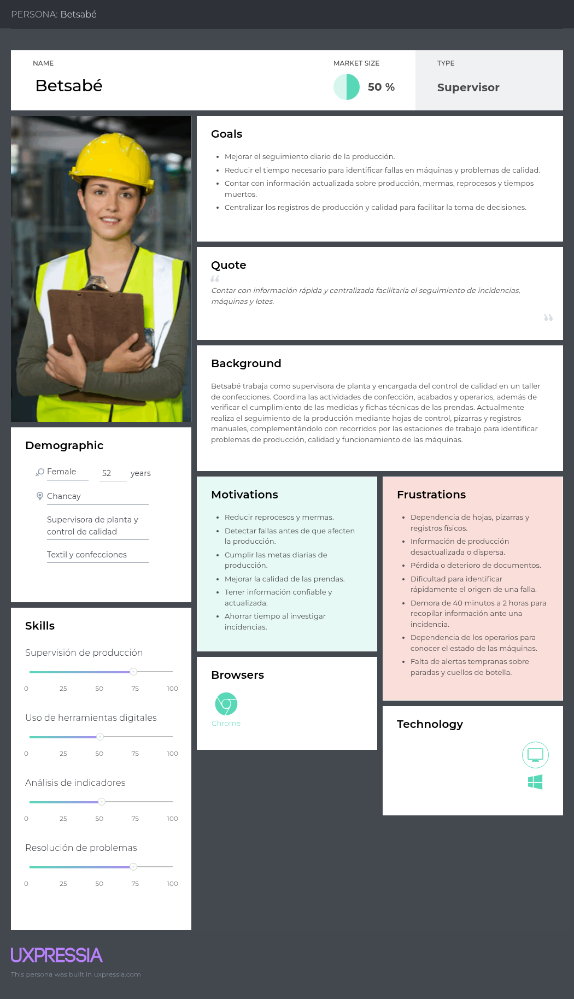
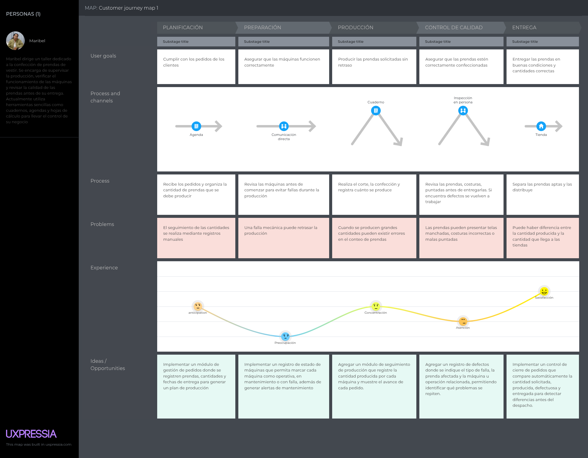
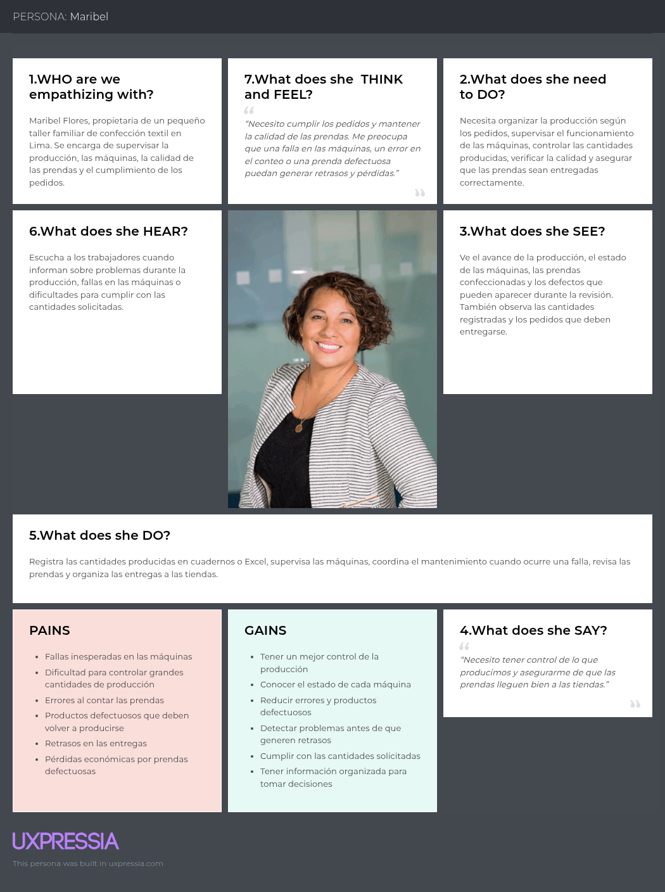

# Capítulo II: Requirements Elicitation and Analysis

## 2.1. Competidores

* **SI-TEXT Perú (competidor directo):** Es una plataforma ERP peruana especializada en la industria textil y de confecciones que permite gestionar inventarios, órdenes de producción, fichas técnicas, insumos, mermas, ventas y reportes. Está orientada principalmente a talleres de confección, fábricas de ropa, marcas y servicios textiles. Su propuesta busca centralizar la información de la empresa y mejorar el control de la producción mediante una solución Cloud/SaaS.

* **Datatex - CAMS (competidor directo):** Es una solución internacional especializada en la gestión de producción para empresas textiles y de confecciones. Su sistema CAMS permite recopilar información del proceso productivo, registrar cantidades producidas, monitorear máquinas, detectar tiempos de inactividad, registrar defectos y analizar la productividad de operarios y procesos.

* **Coats Digital - FastReactPlan (competidor directo):** Es una solución de software especializada en la planificación y control de la producción de prendas de vestir. Permite gestionar la capacidad productiva, órdenes, materiales y líneas de confección, además de comparar la producción planificada con la producción real y visualizar indicadores mediante reportes y dashboards.

### 2.1.1. Análisis competitivo

El análisis competitivo presentado a continuación emplea una matriz de variables del mercado (Landscape) junto con un análisis FODA (SWOT) para evaluar el posicionamiento de Fabric frente a soluciones del sector textil e identificar oportunidades de diferenciación orientadas a las MYPES textiles y de confecciones de Lima.

| ¿Por qué llevar a cabo este análisis? | SI-TEXT Perú | Datatex - CAMS | Trama | Fabric |
| :--- | :--- | :--- | :--- | :--- |
| Identificar las características y fortalezas de soluciones existentes en el sector textil y de confecciones para determinar oportunidades de diferenciación y desarrollar una propuesta accesible, sencilla y adaptada a las necesidades de las MYPES textiles de Lima. |  |  |  |  |
| Overview / Perfil | SI-TEXT Perú es un ERP especializado en la industria textil y de confecciones peruana que permite centralizar información de producción, inventarios, ventas, fichas técnicas, insumos y reportes. | Datatex - CAMS es una solución especializada en la gestión del piso de producción que permite recopilar y analizar información relacionada con máquinas, operarios y procesos productivos textiles. | Trama es una plataforma ERP especializada en empresas de confecciones y maquila que integra la gestión de producción, calidad, inventarios y fichas técnicas. | Fabric es una aplicación web orientada a las MYPES textiles y de confecciones de Lima que busca centralizar información relacionada con la producción, rendimiento de máquinas, trazabilidad de lotes y controles de calidad. |
| Ventaja competitiva | Adaptación al mercado textil peruano e integración de diferentes procesos empresariales dentro de una plataforma Cloud/SaaS. | Capacidad para recopilar información del proceso productivo y monitorear máquinas, cantidades producidas, tiempos de inactividad, defectos y productividad. | Integración de la gestión de producción y calidad dentro de una solución especializada para empresas de confecciones. | Solución sencilla y enfocada específicamente en las necesidades de las MYPES textiles, integrando producción, rendimiento de máquinas, trazabilidad y control de calidad. |
| ¿Qué valor ofrece a los clientes? | Permite centralizar diferentes procesos de una empresa textil, facilitando la gestión de producción, inventarios, ventas e insumos. | Proporciona información detallada del piso de producción para mejorar el seguimiento del rendimiento de máquinas, operarios y procesos. | Facilita la administración de procesos de confección mediante herramientas de producción, inventario y control de calidad. | Permite organizar y visualizar información productiva que normalmente se encuentra registrada de manera manual o dispersa, facilitando la identificación de problemas y la toma de decisiones. |
| Mercado objetivo | Talleres de confección, fábricas de ropa, marcas y empresas de servicios textiles del mercado peruano. | Empresas fabricantes del sector textil y de confecciones que requieren monitorear y controlar sus operaciones productivas. | Empresas de confecciones y maquila que requieren gestionar sus procesos productivos y controles de calidad. | MYPES textiles y de confecciones de Lima, especialmente talleres que necesitan mejorar el control de producción, rendimiento y calidad. |
| Estrategias de marketing | Contacto comercial directo, demostraciones personalizadas y promoción digital de soluciones para empresas textiles. | Marketing B2B, demostraciones de soluciones empresariales y promoción de herramientas especializadas para la industria textil. | Promoción digital y contacto con empresas del sector de confecciones interesadas en digitalizar sus procesos. | Marketing digital, acercamiento directo a MYPES textiles, demostraciones de la plataforma y enfoque inicial en empresas ubicadas en Lima y el Emporio Comercial de Gamarra. |
| Productos & Servicios | Gestión de inventarios, órdenes de producción, fichas técnicas, telas e insumos, mermas, ventas y reportes. | Seguimiento de producción, cantidades producidas, máquinas, operarios, tiempos de inactividad, defectos y parámetros del proceso productivo. | Gestión de producción, órdenes de trabajo, fichas técnicas, inventarios, controles de calidad, revisión de prendas y registro de defectos. | Seguimiento de producción, monitoreo del rendimiento de máquinas, trazabilidad de lotes, registro de incidencias de calidad e indicadores para apoyar la toma de decisiones. |
| Precios & Costos | Ofrece planes de suscripción de acuerdo con las funcionalidades y necesidades de cada empresa. | No presenta públicamente una tarifa estándar; el acceso a la solución requiere contacto comercial. | No presenta públicamente una tarifa estándar; requiere contacto con la empresa para conocer sus planes y costos. | Modelo de suscripción accesible orientado a MYPES textiles y de confecciones, sujeto a validación durante el desarrollo del modelo de negocio. |
| Canales de distribución | Plataforma Cloud/SaaS accesible mediante dispositivos conectados a Internet. | Plataforma empresarial integrada con sistemas de gestión y dispositivos utilizados dentro del proceso productivo. | Plataforma digital orientada a la gestión de empresas de confecciones. | Aplicación web accesible desde dispositivos con conexión a Internet. |
| Análisis SWOT: Fortalezas | Conocimiento del mercado peruano, variedad de funcionalidades y especialización en empresas textiles y de confecciones. | Monitoreo detallado de producción, máquinas, operarios, tiempos de inactividad y defectos. | Integración de producción y control de calidad dentro de una plataforma especializada en confecciones. | Enfoque específico en MYPES textiles de Lima, facilidad de uso propuesta e integración del seguimiento de producción, máquinas, lotes y calidad. |
| Análisis SWOT: Debilidades | Su amplitud como ERP puede incluir funcionalidades que una MYPE pequeña no necesariamente necesita para controlar únicamente sus procesos productivos. | Su alcance empresarial y variedad de funcionalidades pueden implicar una implementación más compleja para pequeñas empresas. | Su enfoque amplio de gestión empresarial puede incorporar funcionalidades adicionales frente a las necesidades específicas de pequeñas empresas textiles. | Producto nuevo, sin posicionamiento inicial en el mercado y con funcionalidades que todavía deben ser validadas con los usuarios objetivo. |
| Análisis SWOT: Oportunidades | Crecimiento de la digitalización de talleres y empresas textiles peruanas. | Mayor adopción de tecnologías para digitalizar y automatizar los procesos de producción textil. | Creciente necesidad de mejorar la trazabilidad y el control de calidad en empresas de confecciones. | Alta concentración de MYPES textiles y de confecciones en Lima y necesidad de digitalizar procesos productivos actualmente registrados de manera manual o dispersa. |
| Análisis SWOT: Amenazas | Aparición de nuevas soluciones especializadas y de menor costo dirigidas a pequeñas empresas textiles. | Aparición de soluciones locales más sencillas y económicas orientadas específicamente a MYPES. | Aparición de soluciones especializadas con mayor automatización del seguimiento de producción y calidad. | Presencia de competidores especializados ya establecidos y resistencia al cambio tecnológico por parte de algunas MYPES textiles. |

El análisis competitivo realizado ha permitido identificar las principales fortalezas, debilidades, oportunidades y amenazas del mercado, lo que nos ha llevado a definir las siguientes estrategias y tácticas para posicionar a Fabric de manera competitiva frente a SI-TEXT Perú, Datatex y Trama.

#### Estrategias

1. **Reducción de incidencias durante la producción:** Posicionar a Fabric como una herramienta que permita identificar oportunamente problemas durante el proceso productivo, estableciendo como objetivo contribuir a reducir en un 20% las incidencias asociadas a máquinas y procesos mediante el seguimiento de indicadores y registros de producción.

2. **Reducción de defectos y reprocesos:** Facilitar el registro, clasificación y seguimiento de defectos de calidad, con el objetivo de contribuir a reducir en un 15% la cantidad de productos que requieren reprocesos por problemas detectados durante la producción.

3. **Mejora de la trazabilidad de la producción:** Centralizar la información de producción y calidad para lograr que el 100% de los lotes registrados en Fabric puedan ser rastreados, permitiendo consultar su estado, incidencias de calidad y procesos relacionados.

4. **Optimización del control de producción:** Facilitar a los supervisores el acceso a indicadores sobre producción, máquinas y calidad, buscando reducir en un 30% el tiempo empleado en consultar y analizar información relacionada con el proceso productivo.

#### Tácticas

1. **Dashboard centralizado de producción:** Implementar un panel que concentre indicadores de producción, rendimiento de máquinas, defectos e incidencias, permitiendo que los supervisores consulten la información desde un único lugar y buscando reducir en un 30% el tiempo destinado a recopilar y analizar información.

2. **Pruebas piloto con MYPES textiles:** Realizar pruebas piloto gratuitas con al menos 5 MYPES textiles y de confecciones de Lima durante un periodo de 30 días, permitiendo evaluar el funcionamiento de Fabric en procesos reales y medir cambios en incidencias, reprocesos y tiempos de consulta de información.

3. **Interfaz sencilla para supervisores:** Diseñar la aplicación web con una interfaz en español, tipografía mínima de 16 px, formularios simplificados y alertas visuales mediante colores rojo, amarillo y verde, facilitando su utilización por supervisores y responsables de producción y calidad.

4. **Registro y clasificación de defectos:** Implementar formularios que permitan registrar y clasificar los defectos encontrados durante la producción según su tipo, asociándolos con el lote, proceso y máquina correspondiente, con el objetivo de identificar defectos recurrentes y contribuir a reducir en un 15% los reprocesos.

5. **Trazabilidad digital de lotes:** Asignar un identificador único a cada lote registrado en Fabric, permitiendo consultar su historial de producción, controles de calidad, incidencias y procesos relacionados, con el objetivo de alcanzar una trazabilidad del 100% de los lotes gestionados mediante la plataforma.
   
## 2.2. Entrevistas

### 2.2.1. Diseño de entrevistas

**Segmento Objetivo 1: MYPES textiles y de confecciones de Lima**

1. ¿A qué tipo de actividad textil o de confección se dedica actualmente su empresa y qué productos elaboran?

2. ¿Cómo está organizado actualmente el proceso de producción dentro de su empresa?

3. ¿Cómo registran y hacen seguimiento a la cantidad de productos que se encuentran en producción y los que ya fueron terminados?

4. ¿Cómo controlan actualmente los lotes u órdenes de producción desde que inicia el proceso hasta que finaliza?

5. ¿De qué manera realizan el seguimiento del rendimiento y funcionamiento de las máquinas utilizadas durante la producción?

6. ¿Cuáles son los principales problemas o incidencias que suelen presentarse con las máquinas durante el proceso productivo?

7. ¿Cómo realizan actualmente los controles de calidad de los productos durante y al finalizar la producción?

8. ¿Qué tipos de defectos o problemas de calidad se presentan con mayor frecuencia?

9. Cuando detectan un producto defectuoso, ¿cómo identifican en qué lote, proceso o máquina pudo haberse originado el problema?

10. ¿Qué impacto generan actualmente los productos defectuosos, desperdicios o reprocesos en su empresa?

11. ¿Qué herramientas utilizan actualmente para registrar información de producción y calidad, por ejemplo, cuadernos, hojas de cálculo o algún software?

12. ¿Qué dificultades encuentran al momento de consultar o reunir información sobre producción, máquinas, lotes y calidad?

13. ¿Qué información o indicadores consideran más importantes para conocer si su proceso de producción está funcionando adecuadamente?

14. ¿Qué aspectos considerarían importantes antes de implementar una plataforma digital para gestionar la producción y el control de calidad de su empresa?

15. ¿Qué funcionalidades les gustaría encontrar en una plataforma que les permita gestionar mejor la producción, las máquinas, los lotes y los controles de calidad?
    
**Segmento Objetivo 2: Supervisores y responsables de producción y calidad**

1. ¿Cuál es su función dentro del proceso de producción o control de calidad y cuáles son sus principales responsabilidades?

2. ¿Cómo realiza actualmente el seguimiento del estado de la producción durante su jornada de trabajo?

3. ¿Qué información necesita revisar con mayor frecuencia para saber si la producción se está desarrollando correctamente?

4. ¿Cómo supervisa actualmente el rendimiento y funcionamiento de las máquinas involucradas en el proceso productivo?

5. ¿Cómo identifica cuando una máquina o proceso está presentando problemas que pueden afectar la producción?

6. ¿Cómo registran actualmente los defectos o incidencias de calidad que encuentran durante la producción?

7. ¿Qué tipos de defectos encuentra con mayor frecuencia y cómo los clasifican actualmente?

8. Cuando encuentra un defecto, ¿cómo determina a qué lote, proceso o máquina está relacionado?

9. ¿Qué procedimiento sigue después de detectar un defecto o problema durante la producción?

10. ¿Cuánto tiempo suele tomarle recopilar la información necesaria para investigar un problema de producción o calidad?

11. ¿Qué herramientas utiliza actualmente para registrar y consultar información sobre producción, máquinas, lotes y controles de calidad?

12. ¿Qué dificultades encuentra al trabajar con estas herramientas o registros?

13. ¿Qué indicadores considera más importantes para tomar decisiones sobre la producción y el control de calidad?

14. ¿De qué manera le ayudaría contar con alertas e información centralizada sobre incidencias, defectos y rendimiento de las máquinas?

15. ¿Qué funciones considera indispensables en una plataforma digital para facilitar su trabajo como supervisor o responsable de producción y calidad?

### 2.2.2. Registro de entrevistas

**Segmento Objetivo 1**

**Nombre:** Maribel
**Edad:** 41
**Ciudad:** Lima

Entrevista completa: [https://shorturl.at/bXqB4](https://shorturl.at/bXqB4)

**Resumen de la entrevista:**
Maribel, encargada de la empresa Creaciones Flores, dedicada a la confección de prendas de vestir como poleras, polos, pantalonetas y shorts, explicó que su proceso productivo inicia con el corte de las telas, continúa con la confección mediante las máquinas y finaliza con la distribución de las prendas a las tiendas.

Actualmente, el seguimiento de la producción se realiza principalmente mediante agendas, cuadernos y hojas de cálculo, donde registran la cantidad de prendas producidas y las que salen hacia las tiendas. El mantenimiento de las máquinas se realiza aproximadamente cada seis meses e incluye cambio de aceite y revisiones generales. Cuando una máquina presenta una falla, se contacta a un técnico para evitar retrasos en la producción.

Entre los principales problemas identificados se encuentran las fallas en el garfio, motores y agujas, además de problemas ocasionados por una incorrecta manipulación de las máquinas. En cuanto al control de calidad, se cuenta con una persona encargada de revisar las costuras, puntadas y estado de las prendas. Los defectos más frecuentes son las telas manchadas y las costuras incorrectas, como puntadas abiertas o demasiado cerradas. Las prendas defectuosas son separadas y no se incluyen en la venta, lo que representa una pérdida económica para la empresa.

Una de las principales dificultades es el manejo de grandes cantidades de producción y mercadería, especialmente cuando no se cuenta con suficiente personal para realizar los conteos. Esto puede ocasionar diferencias entre las cantidades registradas y las que finalmente llegan a las tiendas. Para evaluar el funcionamiento de la producción, consideran importantes los pedidos y opiniones de los clientes, ya que una buena calidad permite recibir nuevos pedidos y aumentar la producción.

Maribel considera que una plataforma digital podría facilitar la gestión de la producción y el control de calidad, siempre que sea sencilla de utilizar. También considera importante contar con información clara y un manual que explique cómo acceder y utilizar correctamente el software dentro del taller.

**Nombre:** José del Carmen
**Edad:** 40
**Ciudad:** Lima

Entrevista completa: [https://shorturl.at/fr8yY](https://shorturl.at/fr8yY)

**Resumen de la entrevista:**
José del Carmen, indicó que su empresa se dedica principalmente a la confección de pantalones de vestir. El proceso de producción se encuentra organizado de manera familiar y el seguimiento de los productos se realiza de acuerdo con los pedidos que reciben de los clientes. Del mismo modo, las órdenes de producción se gestionan según las cantidades solicitadas.

Antes de iniciar la producción, se revisan las máquinas con el objetivo de prevenir fallas y asegurar que el proceso se desarrolle correctamente. Sin embargo, se señaló que en algunas ocasiones pueden presentarse fallas mecánicas debido a que no se realiza el mantenimiento necesario antes de comenzar a trabajar.

El control de calidad se realiza principalmente de manera interna y con apoyo de los integrantes de la familia, quienes revisan las prendas para verificar que se encuentren en buenas condiciones antes de ser entregadas. José indica que actualmente no se presentan muchos problemas de calidad debido a que los productos son revisados antes de su entrega. Cuando se identifica algún defecto, este se atribuye principalmente a errores del personal y no necesariamente a fallas de las máquinas o de las telas.

Respecto al impacto de los productos defectuosos, desperdicios o reprocesos, se indicó que actualmente no representa un problema frecuente, aunque anteriormente podían presentarse casos relacionados con trabajadores aprendices. Para registrar información de la producción utilizan ocasionalmente calculadoras. Asimismo, no se identificaron dificultades importantes relacionadas con la consulta de información sobre lotes.

Como principal indicador para verificar que el proceso funciona adecuadamente, consideran la revisión completa de los productos antes de realizar la entrega. Finalmente, antes de implementar una plataforma digital, consideran importante tener en cuenta las características y condiciones de las telas que adquieren para la producción.

**Segmento Objetivo 2**

**Nombre:** Betsabé
**Edad:** 52
**Ciudad:** Chancay

Entrevista completa: [https://shorturl.at/mHlW6](https://shorturl.at/mHlW6)

**Resumen de la entrevista:**
Betsabé, supervisora de planta y encargada del control de calidad en un taller de confecciones, coordina las labores de confección, acabados y operarios, además de verificar que las prendas cumplan con las medidas y fichas técnicas. Para el seguimiento de la producción utiliza hojas de control, pizarras acrílicas y registros manuales, junto con recorridos periódicos por las estaciones para revisar el avance, detectar operaciones críticas y verificar el estado de las máquinas.

Entre las principales dificultades destacan la dependencia de registros físicos, la información desactualizada, la pérdida o deterioro de documentos y la necesidad de recopilar datos de distintas fuentes para investigar problemas. La detección de fallas en las máquinas se apoya principalmente en la observación visual, la comunicación con los operarios y la revisión de los defectos producidos. Ante una incidencia, recopilar la información necesaria puede tomar entre 40 minutos y 2 horas, debido a la búsqueda de hojas de corte, archivadores y consultas al personal.

Betsabé considera clave indicadores como el porcentaje de merma y reproceso por lote, las prendas aprobadas por hora y el tiempo muerto por fallas mecánicas. Por ello, estima que una herramienta digital debería permitir registrar rápidamente fallas asociadas a máquinas o lotes, hacer seguimiento visual de las incidencias, recibir alertas tempranas sobre cuellos de botella y paradas de máquinas, y consultar métricas claras del día. Para ella, la herramienta debe ser rápida, sencilla y funcionar bien en las computadoras disponibles en el piso de planta.

**Nombre:** Luciana
**Edad:** 19
**Ciudad:** Lima

Entrevista completa: [https://shorturl.at/ZPY8m](https://shorturl.at/ZPY8m)

**Resumen de la entrevista:**
Luciana, supervisora de calidad en un taller de confecciones de Lima, participa en el control del proceso desde la recepción de los rollos de tela hasta el empaque final. Entre sus responsabilidades están revisar el tono y encogimiento de las telas, auditar las primeras piezas de cada lote, verificar las medidas de las fichas técnicas y aprobar las prendas antes del planchado y despacho. Para supervisar la producción realiza rondas continuas por las mesas de trabajo y zonas de acabado, usando hojas de ruta y registros físicos para verificar el avance de las órdenes y detectar acumulaciones.

Actualmente, gran parte del seguimiento se hace de forma manual. Los defectos se registran en hojas de auditoría físicas y se identifican con etiquetas adhesivas, mientras que la trazabilidad depende de tarjetas de lote y fichas de corte que acompañan los paquetes. Para consultar información utiliza cuadernos, fotografías por WhatsApp y hojas compartidas en Google Sheets. Esto genera desfases de información, errores de conteo, documentos extraviados o ilegibles y dificultades para ubicar dónde se produjo una desviación. Investigar un problema puede tomar entre una y dos horas debido a la revisión de archivos, muestras, fichas técnicas y consultas a distintos trabajadores.

Los indicadores que considera más relevantes son el porcentaje de reprocesos por lote, la merma irrecuperable de tela y el tiempo de inactividad de las máquinas críticas, ya que permiten medir el impacto de los problemas en la rentabilidad del lote. Luciana considera que una plataforma digital permitiría pasar de una reacción posterior a un control preventivo, sobre todo mediante alertas cuando una máquina o rollo acumula múltiples prendas observadas. Entre las funciones indispensables están el registro de inspecciones de tela, la trazabilidad entre rollos y lotes, el registro rápido de fallas, un tablero visual con el avance de las órdenes y la información sobre las paradas de máquinas.

FALTA 
## 2.3. Needfinding

En esta sección se presentan los artefactos obtenidos a partir del análisis de la información recolectada mediante las entrevistas realizadas a los segmentos objetivo de Fabric. Este proceso permite identificar las principales necesidades, dificultades, comportamientos y expectativas de los usuarios respecto al control de la producción y la calidad dentro de los talleres textiles y de confecciones. A continuación, se presentan los User Personas, User Task Matrix, User Journey Maps, Empathy Mapping y As-Is Scenario Maps.

### 2.3.1. User Personas

En esta sección se presentan los User Personas elaborados a partir de los principales hallazgos obtenidos durante las entrevistas. Estos arquetipos representan las características, necesidades, objetivos y dificultades de los usuarios involucrados en la gestión y supervisión de los procesos productivos textiles.

Se ha desarrollado un User Persona representativo para cada uno de los segmentos objetivo de Fabric: las MYPES textiles y de confecciones, y los supervisores o encargados de producción y calidad.

#### Segmento 1: MYPES textiles y de confecciones de Lima

#### Segmento 2: Supervisores y responsables de producción y calidad

### 2.3.2. Task Matrix
A continuación, se presenta el User Task Matrix, el cual reúne las principales tareas realizadas por los usuarios de los dos segmentos objetivo identificados para Fabric. La matriz permite comparar la frecuencia e importancia de cada actividad entre Maribel, representante de las MYPES textiles y de confecciones de Lima, y Betsabé, supervisora y encargada del control de calidad.

| Tareas (Tasks) | Maribel (Segmento 1) - Frecuencia | Maribel (Segmento 1) - Importancia | Betsabé (Segmento 2) - Frecuencia | Betsabé (Segmento 2) - Importancia |
| :--- | :---: | :---: | :---: | :---: |
| Seguimiento del avance de producción | Alta | Muy Alta | Muy alta | Muy alta |
| Verificación de calidad de prendas | Alta | Muy Alta | Muy alta | Muy alta |
| Verificación de medidas y fichas técnicas | Media | Alta | Alta | Muy alta |
| Coordinación de labores y operarios | Alta | Alta | Alta | Alta |
| Detección de operaciones críticas | Media | Alta | Alta | Muy alta |
| Verificación y detección de fallas en máquinas | Media | Alta | Alta | Muy alta |
| Recopilación de información ante incidencias | Media | Alta | Media | Muy alta |

### 2.3.3. Journey Mapping
En esta sección se presentan los User Journey Maps en su versión "As-Is", elaborados para cada User Persona. Estos mapas representan las actividades que realizan actualmente los usuarios y permiten identificar sus principales necesidades, dificultades y puntos de fricción durante los procesos de producción y control de calidad.

#### User Persona 1: 

#### User Persona 2: Betsabé

### 2.3.4. Empathy Mapping
Para la elaboración de los Empathy Maps, se analizaron las entrevistas de cada User Persona considerando qué piensa y siente, qué oye, qué ve y qué dice y hace durante sus actividades. A partir de este análisis, se identificaron sus principales Pains, relacionados con los registros manuales, la información desactualizada y la dificultad para detectar incidencias, así como sus Gains, enfocados en mejorar el acceso a la información y el seguimiento de la producción.
#### User Persona 1:

#### User Persona 2: Betsabé

### 2.3.5. As-Is Scenario Mapping

#### User Persona 1: 

#### User Persona 2: Betsabé

## 2.4. Big Picture Event Storming
