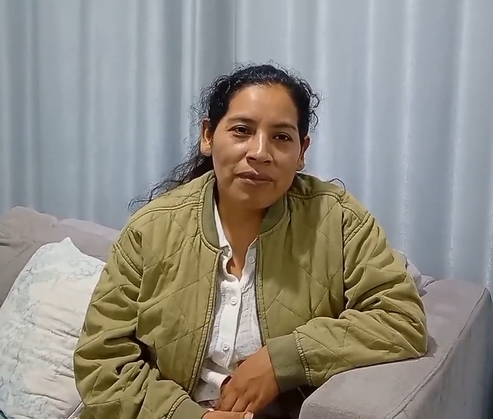
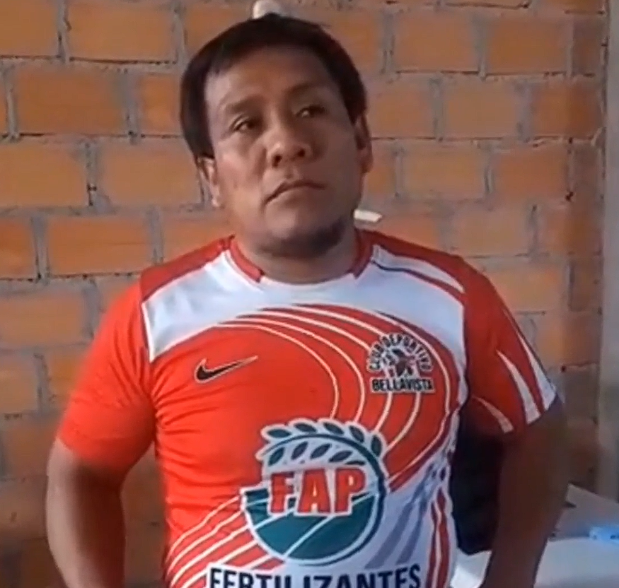
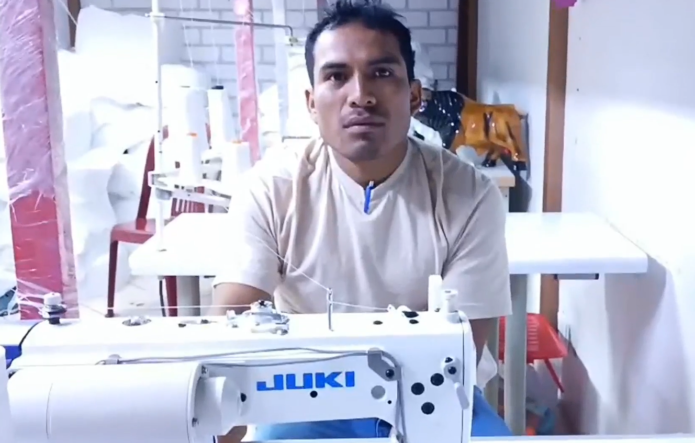

## 2.2. Entrevistas

### 2.2.1. Diseño de entrevistas

**Segmento Objetivo 1: MYPES textiles y de confecciones de Lima**

1. ¿A qué tipo de actividad textil o de confección se dedica actualmente su empresa y qué productos elaboran?

2. ¿Cómo está organizado actualmente el proceso de producción dentro de su empresa?

3. ¿Cómo registran y hacen seguimiento a la cantidad de productos que se encuentran en producción y los que ya fueron terminados?

4. ¿Cómo controlan actualmente los lotes u órdenes de producción desde que inicia el proceso hasta que finaliza?

5. ¿De qué manera realizan el seguimiento del rendimiento y funcionamiento de las máquinas utilizadas durante la producción?

6. ¿Cuáles son los principales problemas o incidencias que suelen presentarse con las máquinas durante el proceso productivo?

7. ¿Cómo realizan actualmente los controles de calidad de los productos durante y al finalizar la producción?

8. ¿Qué tipos de defectos o problemas de calidad se presentan con mayor frecuencia?

9. Cuando detectan un producto defectuoso, ¿cómo identifican en qué lote, proceso o máquina pudo haberse originado el problema?

10. ¿Qué impacto generan actualmente los productos defectuosos, desperdicios o reprocesos en su empresa?

11. ¿Qué herramientas utilizan actualmente para registrar información de producción y calidad, por ejemplo, cuadernos, hojas de cálculo o algún software?

12. ¿Qué dificultades encuentran al momento de consultar o reunir información sobre producción, máquinas, lotes y calidad?

13. ¿Qué información o indicadores consideran más importantes para conocer si su proceso de producción está funcionando adecuadamente?

14. ¿Qué aspectos considerarían importantes antes de implementar una plataforma digital para gestionar la producción y el control de calidad de su empresa?

15. ¿Qué funcionalidades les gustaría encontrar en una plataforma que les permita gestionar mejor la producción, las máquinas, los lotes y los controles de calidad?
    
16. ¿Qué dispositivos utilizan con mayor frecuencia en su trabajo (PC, laptop, tablet o celular) y qué navegador suelen utilizar para acceder a páginas o sistemas web?
    
**Segmento Objetivo 2: Supervisores y responsables de producción y calidad**

1. ¿Cuál es su función dentro del proceso de producción o control de calidad y cuáles son sus principales responsabilidades?

2. ¿Cómo realiza actualmente el seguimiento del estado de la producción durante su jornada de trabajo?

3. ¿Qué información necesita revisar con mayor frecuencia para saber si la producción se está desarrollando correctamente?

4. ¿Cómo supervisa actualmente el rendimiento y funcionamiento de las máquinas involucradas en el proceso productivo?

5. ¿Cómo identifica cuando una máquina o proceso está presentando problemas que pueden afectar la producción?

6. ¿Cómo registran actualmente los defectos o incidencias de calidad que encuentran durante la producción?

7. ¿Qué tipos de defectos encuentra con mayor frecuencia y cómo los clasifican actualmente?

8. Cuando encuentra un defecto, ¿cómo determina a qué lote, proceso o máquina está relacionado?

9. ¿Qué procedimiento sigue después de detectar un defecto o problema durante la producción?

10. ¿Cuánto tiempo suele tomarle recopilar la información necesaria para investigar un problema de producción o calidad?

11. ¿Qué herramientas utiliza actualmente para registrar y consultar información sobre producción, máquinas, lotes y controles de calidad?

12. ¿Qué dificultades encuentra al trabajar con estas herramientas o registros?

13. ¿Qué indicadores considera más importantes para tomar decisiones sobre la producción y el control de calidad?

14. ¿De qué manera le ayudaría contar con alertas e información centralizada sobre incidencias, defectos y rendimiento de las máquinas?

15. ¿Qué funciones considera indispensables en una plataforma digital para facilitar su trabajo como supervisor o responsable de producción y calidad?

### 2.2.2. Registro de entrevistas

**Segmento Objetivo 1**

**Nombre:** Maribel
**Edad:** 41
**Ciudad:** Lima

**Minuto Inicio:** 00:00
**Minuto Final:** 04:53

Entrevista completa: [https://shorturl.at/pI0QC](https://shorturl.at/pI0QC)

**Resumen de la entrevista:**
Maribel, de 41 años y residente en Lima, es encargada de la empresa Creaciones Flores, dedicada a la confección de prendas de vestir como poleras, polos, pantalonetas y shorts. El proceso productivo inicia con el corte de las telas, continúa con la confección mediante máquinas y finaliza
con la distribución de las prendas hacia las tiendas.

Actualmente, realiza el seguimiento de la producción principalmente mediante agendas, cuadernos y hojas de cálculo, donde registra las cantidades de prendas producidas y las que son enviadas a las tiendas. El mantenimiento de las máquinas se realiza aproximadamente cada seis meses e incluye
cambios de aceite y revisiones generales. Cuando se presenta una falla, se contacta a un técnico para evitar retrasos en la producción.

Entre los principales problemas identificados se encuentran las fallas en el garfio, motores y agujas, además de inconvenientes ocasionados por una incorrecta manipulación de las máquinas. Para el control de calidad cuenta con una persona encargada de revisar las costuras, puntadas y estado
general de las prendas. Los defectos más frecuentes son las telas manchadas y las costuras incorrectas, como puntadas abiertas o demasiado cerradas. Cuando una prenda presenta defectos, es separada y no se incluye en la venta, generando pérdidas económicas.

Maribel señala que una de las principales dificultades se presenta al manejar grandes cantidades de producción y mercadería cuando no se cuenta con suficiente personal para realizar los conteos. Esta situación puede ocasionar diferencias entre las cantidades registradas y las que finalmente
llegan a las tiendas. Para evaluar el funcionamiento de la producción considera importantes los pedidos y las opiniones de los clientes, debido a que una buena calidad permite recibir nuevos pedidos y aumentar la producción.

En cuanto a la tecnología, utiliza una laptop y un celular para realizar sus actividades y consultas relacionadas con el trabajo. Para acceder a páginas y sistemas web utiliza principalmente Google Chrome. Respecto a una plataforma digital, considera que podría facilitar la gestión de la
producción y el control de calidad, siempre que sea sencilla de utilizar. También considera importante contar con información clara y un manual que explique cómo acceder y utilizar correctamente el software dentro del taller.

**Nombre:** José del Carmen
**Edad:** 40
**Ciudad:** Lima

**Minuto Inicio:** 04:54
**Minuto Final:** 08:24

Entrevista completa: [https://shorturl.at/pI0QC](https://shorturl.at/pI0QC)

**Resumen de la entrevista:**
José del Carmen, de 40 años y residente en Lima, pertenece a una empresa dedicada principalmente a la confección de pantalones de vestir. El proceso de producción se encuentra organizado de manera familiar y el seguimiento de los productos se realiza de acuerdo con los pedidos recibidos de
los clientes. Las órdenes de producción se gestionan considerando las cantidades solicitadas.

Antes de iniciar la producción se revisan las máquinas con el objetivo de prevenir fallas y asegurar el correcto desarrollo del proceso. Sin embargo, pueden presentarse fallas mecánicas cuando no se realiza el mantenimiento necesario antes de comenzar las actividades. El control de calidad
se realiza principalmente de manera interna y con apoyo de los integrantes de la familia, quienes revisan las prendas antes de su entrega.

José señala que actualmente no se presentan muchos problemas de calidad debido a las revisiones realizadas antes de entregar los productos. Cuando se identifica algún defecto, este se atribuye principalmente a errores del personal y no necesariamente a fallas de las máquinas o de las telas.
Asimismo, indicó que los productos defectuosos, desperdicios o reprocesos no representan actualmente un problema frecuente.

Para registrar información relacionada con la producción utiliza ocasionalmente calculadoras y no identifica dificultades importantes para consultar información sobre los lotes. Como principal indicador para verificar que el proceso funciona adecuadamente considera la revisión completa de
los productos antes de realizar la entrega.

En cuanto a la tecnología, utiliza una PC y un celular para sus actividades y consultas relacionadas con el trabajo. Para acceder a páginas y sistemas web utiliza principalmente Google Chrome. Antes de implementar una plataforma digital, considera importante tener en cuenta las
características y condiciones de las telas utilizadas para la producción. La información obtenida muestra que actualmente mantiene una gestión sencilla y principalmente manual, apoyada en la organización familiar y en la revisión directa de los productos y máquinas.

**Nombre:** Julio Sanchez
**Edad:** 43
**Ciudad:** Lima

**Minuto Inicio:** 08:24
**Minuto Final:** 11:56

Entrevista completa:  [https://shorturl.at/pI0QC](https://shorturl.at/pI0QC)

**Resumen de la entrevista:**
Julio Sánchez, de 43 años y residente en Lima, es encargado de la empresa Decoración en Marimelo, dedicada a la decoración textil mediante la elaboración de fundas para mesas, sillas y otros productos. El proceso productivo se encuentra organizado de manera familiar y se desarrolla
principalmente de acuerdo con los pedidos de los clientes.

El seguimiento de la producción se realiza mediante el conteo de productos y considerando las cantidades solicitadas en cada pedido. Los lotes u órdenes de producción son identificados mediante códigos. Para realizar el seguimiento del rendimiento y funcionamiento de las máquinas se toma
como referencia el trabajo realizado por el personal.

Entre los principales problemas identificados se encuentran la falta de personal y algunas situaciones en las que se altera el orden del proceso productivo. Los productos son revisados antes de ser entregados y normalmente no se presentan defectos. Sin embargo, algunos problemas pueden
estar relacionados con fallas de las máquinas o con la utilización de colores similares.

Cuando se presentan problemas de calidad, uno de los principales impactos para la empresa son las devoluciones de productos. Actualmente, la información de producción y calidad se registra mediante un cuaderno. Julio no identifica dificultades importantes para consultar o reunir esta
información, debido a que considera que actualmente el proceso se encuentra conforme.

Para evaluar el funcionamiento de la producción considera importante conocer la cantidad producida diariamente por cada trabajador. En cuanto a la tecnología, utiliza una laptop y un celular para sus actividades y consultas relacionadas con el trabajo. Para acceder a páginas y sistemas web
utiliza principalmente Google Chrome.

Antes de implementar una plataforma digital, considera necesario verificar que las telas utilizadas se encuentren en buen estado y que no presenten fallas. En general, la información obtenida evidencia un proceso de gestión principalmente manual, basado en el conteo de productos, códigos de
identificación y registros en cuadernos.

**Análisis de la entrevista:**
La entrevista permitió identificar que el taller realiza el seguimiento de la producción mediante el conteo de productos y códigos para identificar los lotes u órdenes. La producción se encuentra organizada de manera familiar y uno de los indicadores considerados importantes es la cantidad
producida diariamente por cada trabajador. Aunque actualmente no presenta dificultades importantes para consultar la información, se identificaron problemas relacionados con la falta de personal y la alteración del orden del proceso productivo. Además, los problemas de calidad pueden ocasionar devoluciones. 
Por ello, existe una oportunidad para mejorar el seguimiento de la producción, el control por lotes y el registro de cantidades producidas mediante una plataforma digital.

**Segmento Objetivo 2**

**Entrevistas completas:** [Video completo](https://upcedupe-my.sharepoint.com/:v:/g/personal/u202223405_upc_edu_pe/IQDTb8o_i89yTqbE9f67aJlzAf_eIL71NuT22ra5DxwZz7U?nav=eyJyZWZlcnJhbEluZm8iOnsicmVmZXJyYWxBcHAiOiJPbmVEcml2ZUZvckJ1c2luZXNzIiwicmVmZXJyYWxBcHBQbGF0Zm9ybSI6IldlYiIsInJlZmVycmFsTW9kZSI6InZpZXciLCJyZWZlcnJhbFZpZXciOiJNeUZpbGVzTGlua0NvcHkifX0&e=ZNMYwu)

**Nombre:** Betsabé
**Edad:** 52
**Ciudad:** Chancay

Entrevista completa: [https://shorturl.at/mHlW6](https://shorturl.at/mHlW6)

**Resumen de la entrevista:**
Betsabé, supervisora de planta y encargada del control de calidad en un taller de confecciones, coordina las labores de confección, acabados y operarios, además de verificar que las prendas cumplan con las medidas y fichas técnicas. Para el seguimiento de la producción utiliza hojas de control, pizarras acrílicas
y registros manuales, junto con recorridos periódicos por las estaciones para revisar el avance, detectar operaciones críticas y verificar el estado de las máquinas.

Entre las principales dificultades destacan la dependencia de registros físicos, la información desactualizada, la pérdida o deterioro de documentos y la necesidad de recopilar datos de distintas fuentes para investigar problemas. La detección de fallas en las máquinas se apoya principalmente en la observación
visual, la comunicación con los operarios y la revisión de los defectos producidos. Ante una incidencia, recopilar la información necesaria puede tomar entre 40 minutos y 2 horas, debido a la búsqueda de hojas de corte, archivadores y consultas al personal.

Betsabé considera clave indicadores como el porcentaje de merma y reproceso por lote, las prendas aprobadas por hora y el tiempo muerto por fallas mecánicas. Por ello, estima que una herramienta digital debería permitir registrar rápidamente fallas asociadas a máquinas o lotes, hacer seguimiento visual de las
incidencias, recibir alertas tempranas sobre cuellos de botella y paradas de máquinas, y consultar métricas claras del día. Para ella, la herramienta debe ser rápida, sencilla y funcionar bien en las computadoras disponibles en el piso de planta.

**Análisis de la entrevista:**
La entrevista con Betsabé identificar que una de las principales dificultades del taller es la dependencia de registros físicos y la dispersión de la información. La búsqueda de datos ante una incidencia puede tomar entre 40 minutos y 2 horas, debido a que es necesario revisar hojas, archivadores y
consultar al personal. Además, las fallas de las máquinas se detectan principalmente mediante observación y comunicación con los operarios. Por ello, se evidencia la necesidad de centralizar la información de producción, máquinas y calidad, permitiendo registrar incidencias rápidamente y consultar indicadores
como merma, reproceso, producción y tiempo muerto. La herramienta también debe ser sencilla y rápida para facilitar su uso directamente en planta.

**Nombre:** Luciana
**Edad:** 19
**Ciudad:** Lima

Entrevista completa: [https://shorturl.at/ZPY8m](https://shorturl.at/ZPY8m)

**Resumen de la entrevista:**
Luciana, supervisora de calidad en un taller de confecciones de Lima, participa en el control del proceso desde la recepción de los rollos de tela hasta el empaque final. Entre sus responsabilidades están revisar el tono y encogimiento de las telas, auditar las primeras piezas de cada lote, verificar las medidas de las fichas técnicas y aprobar las prendas antes del planchado y despacho. Para supervisar la producción realiza rondas continuas por las mesas de trabajo y zonas de acabado, usando hojas de ruta y registros físicos para verificar el avance de las órdenes y detectar acumulaciones.

Actualmente, gran parte del seguimiento se hace de forma manual. Los defectos se registran en hojas de auditoría físicas y se identifican con etiquetas adhesivas, mientras que la trazabilidad depende de tarjetas de lote y fichas de corte que acompañan los paquetes. Para consultar información utiliza cuadernos, fotografías por WhatsApp y hojas compartidas en Google Sheets. Esto genera desfases de información, errores de conteo, documentos extraviados o ilegibles y dificultades para ubicar dónde se produjo una desviación. Investigar un problema puede tomar entre una y dos horas debido a la revisión de archivos, muestras, fichas técnicas y consultas a distintos trabajadores.

Los indicadores que considera más relevantes son el porcentaje de reprocesos por lote, la merma irrecuperable de tela y el tiempo de inactividad de las máquinas críticas, ya que permiten medir el impacto de los problemas en la rentabilidad del lote. Luciana considera que una plataforma digital permitiría pasar de una reacción posterior a un control preventivo, sobre todo mediante alertas cuando una máquina o rollo acumula múltiples prendas observadas. Entre las funciones indispensables están el registro de inspecciones de tela, la trazabilidad entre rollos y lotes, el registro rápido de fallas, un tablero visual con el avance de las órdenes y la información sobre las paradas de máquinas.

**Análisis de la entrevista:**
La entrevista permitió identificar que el proceso de control de calidad requiere realizar un seguimiento constante desde la recepción de los rollos de tela hasta el despacho de las prendas. Actualmente, la información se encuentra distribuida entre hojas físicas, etiquetas, cuadernos, fotografías de
whatsApp y hojas de cálculo, lo que puede generar errores de conteo, información desactualizada y dificultades para determinar dónde se originó una desviación. La investigación de una incidencia puede tomar entre una y dos horas. Por ello, se identifica la necesidad de contar con una plataforma que centralice la
trazabilidad de rollos y lotes, registre las inspecciones y fallas, permita visualizar el avance de las órdenes y genere alertas ante problemas recurrentes.

**Nombre:** Luis
**Edad:** 54
**Ciudad:** Huaral

Entrevista completa: [aquí](https://upcedupe-my.sharepoint.com/:v:/g/personal/u202223405_upc_edu_pe/IQDNMJo77aYGSod5zZJzMReOAffpojMVnzjg39E7u8k452w?nav=eyJyZWZlcnJhbEluZm8iOnsicmVmZXJyYWxBcHAiOiJPbmVEcml2ZUZvckJ1c2luZXNzIiwicmVmZXJyYWxBcHBQbGF0Zm9ybSI6IldlYiIsInJlZmVycmFsTW9kZSI6InZpZXciLCJyZWZlcnJhbFZpZXciOiJNeUZpbGVzTGlua0NvcHkifX0&e=e5wIca)

**Resumen de la entrevista:**
Luis refleja la tensión operativa del supervisor que lucha a diario con la confección de telas técnicas y la dependencia de servicios tercerizados como estampado y bordado sin trazabilidad digital. Aquí subraya la urgencia de contar con una herramienta ágil que frene el extravío de piezas entre talleres externos y alerte a tiempo sobre fallas mecánicas en maquinaria especializada, evitando que los retrasos y mermas terminen liquidando el margen del pedido.

**Análisis de la entrevista:**
La entrevista permitió identificar dificultades relacionadas con el seguimiento de la producción y la coordinación con servicios externos de estampado y bordado. La falta de trazabilidad digital puede ocasionar el extravío de piezas durante el traslado entre talleres, mientras que las fallas de maquinaria
especializada pueden generar retrasos y mermas que afectan el margen de los pedidos. Por ello, se evidencia la necesidad de una herramienta ágil que permita realizar seguimiento al estado y ubicación de las piezas, controlar las actividades tercerizadas y registrar oportunamente las fallas de las máquinas para
reducir retrasos y mejorar el control de los pedidos.
