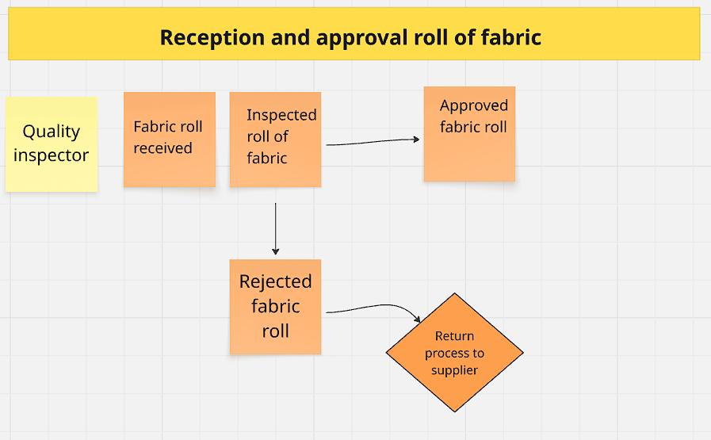
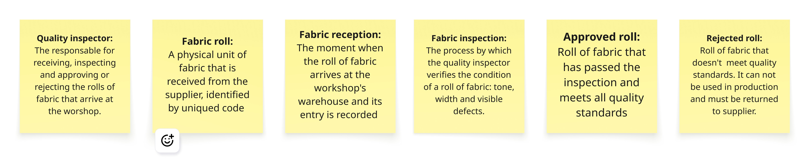
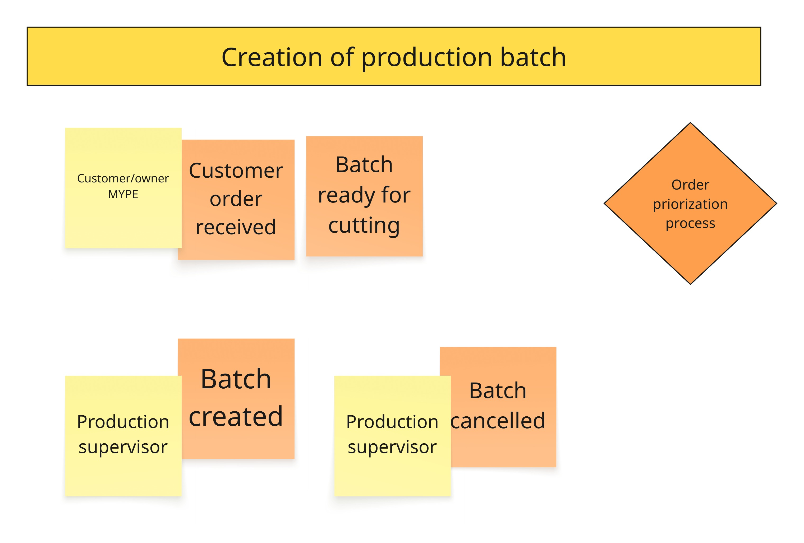
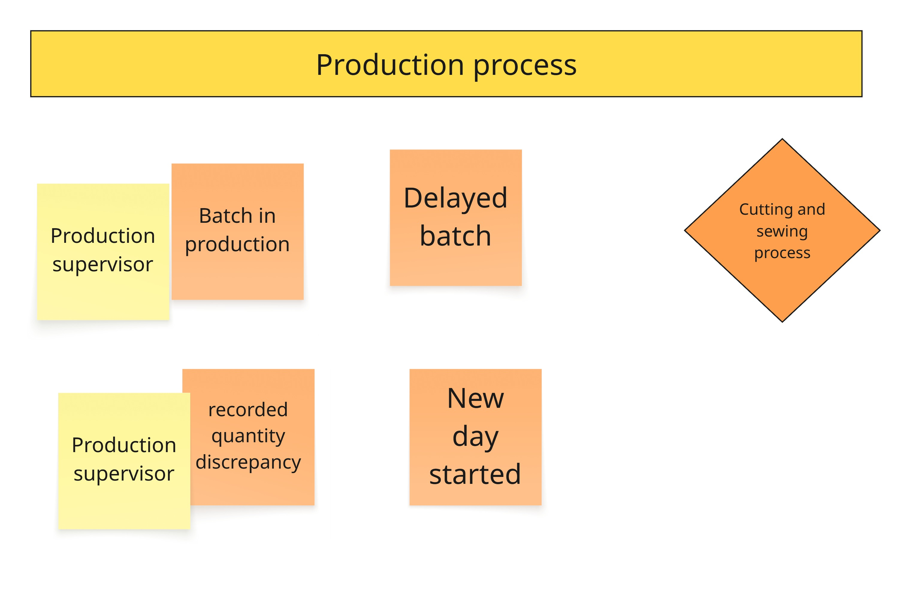
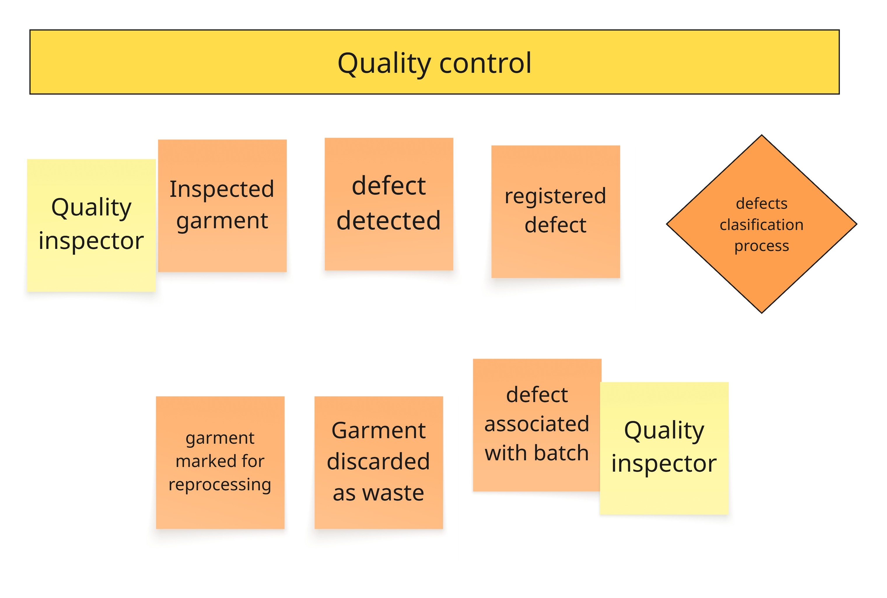
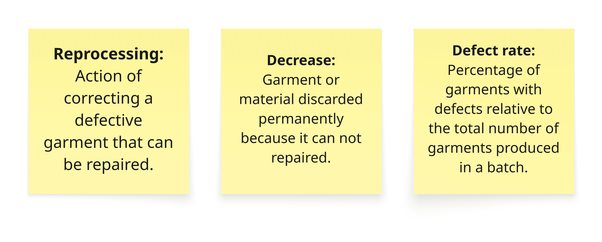

# 2.4. Big picture event storming

En esta sección presentamos el Big Picture Event Storming, es una sesión colaborativa que tuvimos como equipo para enfocarnos en entender el dominio del negocio en general, anotando eventos significativos relacionados al proceso de corte y confección y sus relaciones. Todo este proceso fue hecho en Miro, por su facilidad de uso colaborativo y comrensión de los procesos de dominio. A continuación, se evidencia el proceso realizado por el equipo.

 

Iniciamos la exploración del dominio con notas adhesivas y un rotulador. Lo que resultó ser el primer descubrimiento fue el proceso de **recepción y aprobación de un rollo de tela**

    

Todo empieza cuando llega la tela al taller. El **inspector de calidad** recibe el rollo y lo revisa antes de que se use en corte. Si el rollo cumple con los estándares (tono, ancho, largo, sin defectos graves) se **aprueba** y queda disponible para producción. Si no cumple, se **rechaza**.

 

A nivel general el proceso parece claro, pero no todos interpretamos igual cada palabra. Por eso establecimos algunas definiciones:

    

 

Descubrimientos similares se hicieron en torno al proceso de creación del lote de producción:

    

 

- Un cliente puede hacer un pedido al taller
- Un supervisor de producción puede crear un lote a partir de ese pedido
- El lote se crea con un ID único y queda en estado "Pendiente de corte"
- El cliente puede cancelar el pedido antes de que inicie la producción
- Cuando hay varios pedidos activos, no sabemos cómo se priorizan (marcado como hot spot).

 
 

Estos dos procesos son muy similares. La parte que tienen en común, y de la que aún no sabemos nada, es el proceso de producción:

    

 

- Un supervisor de producción monitorea el avance del lote durante su proceso productivo
- El lote puede retrasarse respecto a la fecha de entrega comprometida
- Cada nuevo día se revisa el avance de los lotes activos para detectar problemas
- Si las piezas que salen de una etapa no coinciden con las que entraron, se registra un descuadre
- Los detalles internos de cada etapa (corte, confección, acabado) aún no se conocen y se marcaron como hot spot

 
 

Ahora surge otra pregunta fundamental: ¿cómo se controla la calidad durante la producción? Este proceso lo comparten todos los lotes, pero no lo conocemos en detalle. Lo modelamos así:

    

 

- Un auditor de calidad inspecciona las prendas durante o después de la confección
- Si encuentra un defecto, lo registra y lo clasifica según su tipo
- El defecto se asocia a un lote específico y, si es posible, a una máquina
- Si la prenda puede repararse, se marca para reproceso; si no, se descarta como merma
- El supervisor de calidad calcula la tasa de defectos del lote
- Si la tasa supera el umbral permitido, se genera una alerta

Aqui establecemos algunas deficiones para entender con claridad este proceso:

    

 

