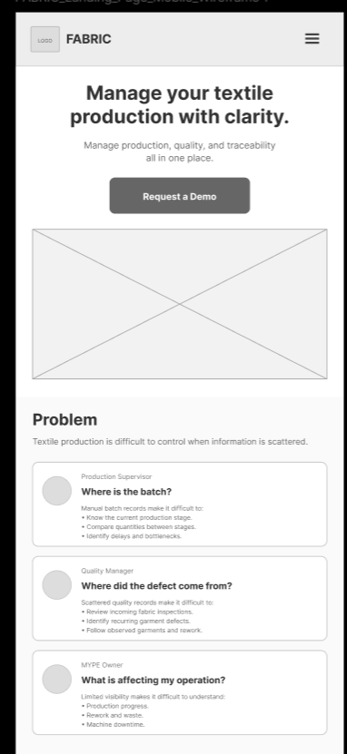
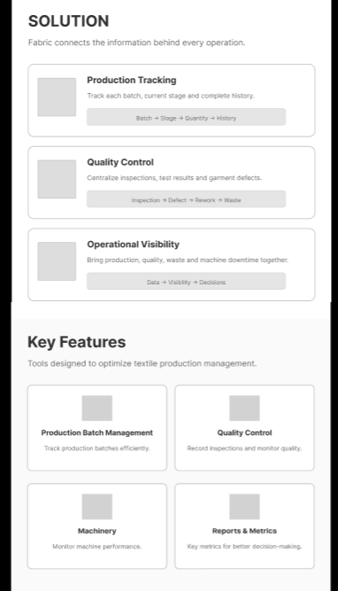
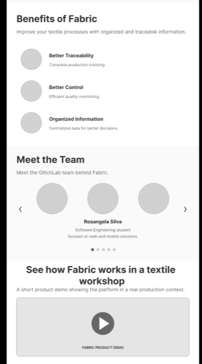
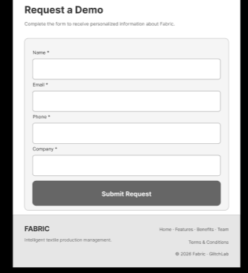
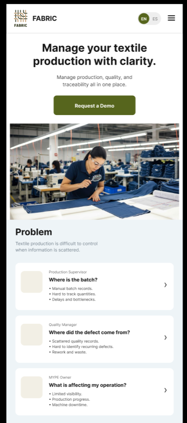
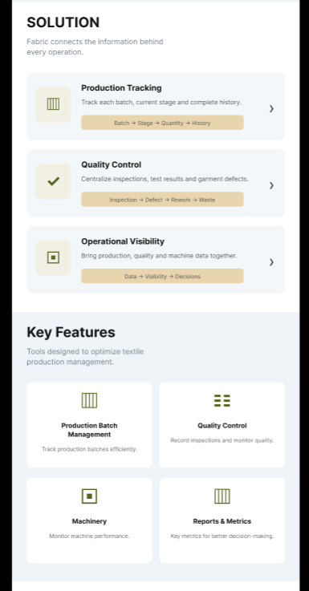
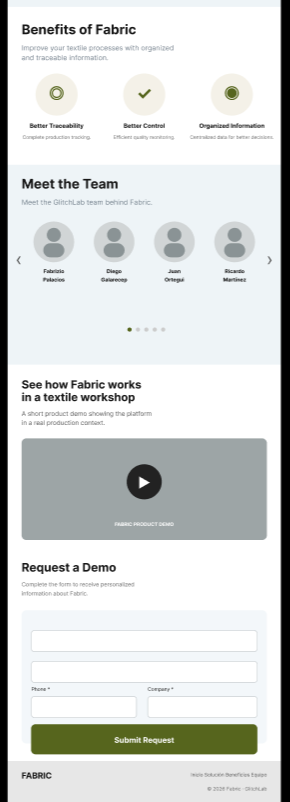

### 4.3.1. Landing Page Wireframe

Los wireframes de la Landing Page de Fabric representan la estructura, jerarquía y distribución inicial de los contenidos de la plataforma antes de la aplicación del diseño visual de alta fidelidad. Se desarrollaron propuestas para Desktop Web Browser y Mobile Web Browser, manteniendo consistencia entre ambas versiones y adaptando la distribución de los elementos según el tamaño de pantalla.

La arquitectura de información sigue una estructura secuencial que permite al usuario comprender progresivamente la propuesta de Fabric: inicia con la propuesta de valor, continúa con la problemática identificada y la solución planteada, presenta las principales funcionalidades y beneficios, introduce al equipo de desarrollo y finaliza con una demostración del producto y un formulario de contacto.

En ambas versiones se aplican principios de diseño como jerarquía visual, consistencia, proximidad, alineación y simplicidad. Asimismo, se consideran criterios de diseño inclusivo mediante textos legibles, elementos claramente identificables, llamados a la acción visibles y una organización predecible de la información.

#### 4.3.1.1. Desktop Web Browser Wireframe

La versión Desktop Web Browser aprovecha el mayor espacio disponible para distribuir los contenidos de manera horizontal y facilitar la visualización simultánea de información relacionada.
El encabezado presenta el logo de Fabric, las principales opciones de navegación, el selector de idioma y el botón **“Request a Demo”**. El Hero organiza la propuesta de valor y el llamado a la acción junto con un espacio destinado al contenido visual.
Las secciones **Problem**, **Solution**, **Key Features** y **Benefits of Fabric** utilizan una distribución basada en columnas y tarjetas, permitiendo comparar información y reconocer rápidamente las principales funcionalidades de la plataforma. Posteriormente, **Meet the Team**, la demostración del producto y **Request a Demo** completan el recorrido del usuario.
Esta distribución mantiene una jerarquía visual clara y una arquitectura de información organizada, utilizando agrupación, proximidad y alineación para facilitar el escaneo del contenido. Los elementos interactivos mantienen una ubicación consistente y claramente reconocible.

#### 4.3.1.2. Mobile Web Browser Wireframe

La versión Mobile Web Browser adapta la misma arquitectura de información a una pantalla de menor tamaño, priorizando una navegación sencilla y una lectura vertical del contenido.
El encabezado se simplifica mediante un **menú hamburguesa**, manteniendo visibles la identidad de Fabric y las opciones esenciales. El Hero presenta primero la propuesta de valor y el botón **“Request a Demo”**, seguido del contenido visual principal.
Las secciones **Problem** y **Solution** reorganizan sus tarjetas en una sola columna, mientras que **Key Features** utiliza una distribución compacta para aprovechar mejor el espacio disponible. Los beneficios, integrantes del equipo, demostración del producto y formulario de contacto también se reorganizan siguiendo un flujo vertical.
Esta adaptación responde al principio de diseño responsive, evitando trasladar directamente la distribución Desktop a una pantalla pequeña. Se priorizan la legibilidad, el tamaño adecuado de los elementos interactivos, el espaciado entre componentes y una navegación predecible. De esta manera, se mantienen los criterios de diseño inclusivo y la jerarquía de información establecidos en la versión Desktop.

### 4.3.2. Landing Page Mock-up

Los mock-ups de la Landing Page de Fabric representan la propuesta visual de alta fidelidad desarrollada a partir de los wireframes previamente definidos. Se diseñaron versiones para Desktop Web Browser y Mobile Web Browser, manteniendo una experiencia visual consistente y adaptando la disposición de los componentes a las características de cada tamaño de pantalla.
En ambas versiones se aplica el Design System de Fabric, utilizando de manera consistente la paleta de colores, tipografías, botones, tarjetas, iconografía, campos de formulario y demás componentes de interfaz. La propuesta mantiene una identidad visual uniforme y permite reconocer fácilmente los elementos interactivos a lo largo de la Landing Page.
La arquitectura de información conserva un recorrido progresivo: inicia con la propuesta de valor de Fabric, continúa con la problemática y la solución, presenta las principales funcionalidades y beneficios de la plataforma, introduce al equipo y finaliza con una demostración del producto y el formulario **“Request a Demo”**.
Asimismo, se aplican principios de diseño como jerarquía visual, contraste, alineación, proximidad, consistencia y simplicidad. Como parte del diseño inclusivo, se consideran textos legibles, contrastes adecuados entre contenido y fondo, componentes claramente identificables y llamados a la acción visibles.

#### 4.3.2.1. Desktop Web Browser Mock-up

La versión Desktop Web Browser utiliza el espacio horizontal disponible para presentar los contenidos de manera amplia y organizada. El encabezado incluye el logotipo de Fabric, las principales opciones de navegación, el selector de idioma y el botón **“Request a Demo”**, estableciendo desde el inicio los principales puntos de interacción.

El Hero combina la propuesta de valor con una imagen relacionada con el contexto de producción textil y un llamado a la acción principal. Las secciones **Problem**, **Solution**, **Key Features** y **Benefits of Fabric** emplean tarjetas, iconografía y distribuciones en columnas que permiten identificar y comparar rápidamente la información.

Posteriormente, la sección **Meet the Team** presenta a los integrantes del equipo, seguida de una demostración visual del funcionamiento de Fabric y el formulario de solicitud de una demo. La composición utiliza los colores, estilos tipográficos, botones y componentes establecidos en el Design System, asegurando consistencia entre las diferentes secciones.

La distribución Desktop mantiene una jerarquía visual clara mediante diferencias de tamaño, peso tipográfico, espaciado y agrupación. Además, los llamados a la acción utilizan un tratamiento visual diferenciado para facilitar su reconocimiento y orientar al usuario durante su recorrido.

#### 4.3.2.2. Mobile Web Browser Mock-up

La versión Mobile Web Browser adapta la propuesta visual de Fabric a dispositivos de menor tamaño manteniendo la identidad definida en el Design System. La información se reorganiza principalmente en un flujo vertical para favorecer la lectura, navegación e interacción mediante dispositivos táctiles.
El encabezado se simplifica mediante un **menú hamburguesa**, conservando el logotipo de Fabric y el selector de idioma. En el Hero se prioriza la propuesta de valor, el botón **“Start App”** y posteriormente la imagen relacionada con el entorno de producción textil.

### Link de la web site: 
https://upc-pre-202620-1asi0730-8150-glitchlab.github.io/Fabric-web-site/