## 4.3. Landing Page UI Design

El diseño de la Landing Page de Fabric representa el primer contacto de los usuarios con nuestra plataforma. Su estructura traduce las decisiones definidas en la arquitectura de información mediante una organización jerárquica y una navegación clara entre sus principales secciones. De esta manera, se presenta de forma ordenada el problema identificado, la solución propuesta, las funcionalidades y los principales beneficios de Fabric, facilitando que los visitantes comprendan la propuesta de valor y puedan conocer más sobre la plataforma.
### 4.3.1. Landing Page Wireframe
El wireframe de la Landing Page de Fabric presenta la estructura y distribución inicial del contenido. Inicia con un encabezado que contiene el logo, el menú de navegación, la opción de idioma y el botón “Request a Demo”. Posteriormente, se presenta el Hero con la propuesta de valor de Fabric, seguido de las secciones que explican el problema, la solución, las funcionalidades y los principales beneficios de la plataforma.
La distribución mantiene una jerarquía visual clara, priorizando la propuesta de valor y los principales llamados a la acción. Asimismo, se emplean etiquetas simples, una navegación consistente y una organización secuencial del contenido para facilitar su comprensión. Como parte del diseño inclusivo, se consideran textos legibles, elementos claramente identificables y una distribución ordenada que facilite la interacción y el acceso a la información.

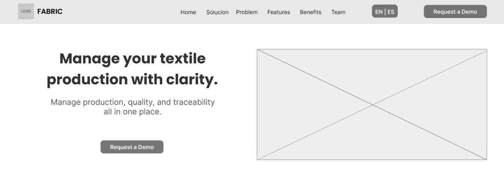

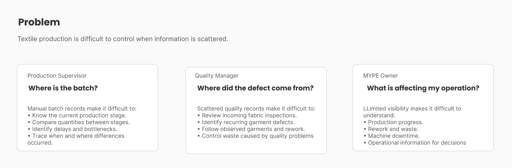

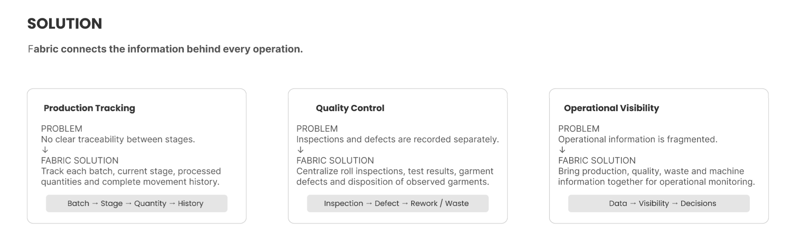

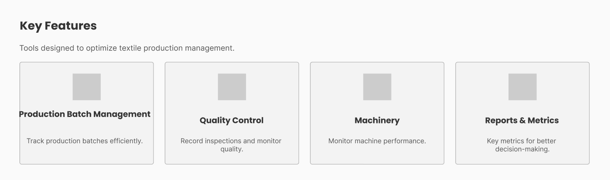

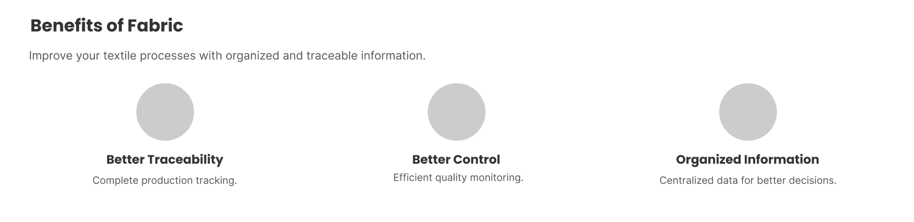

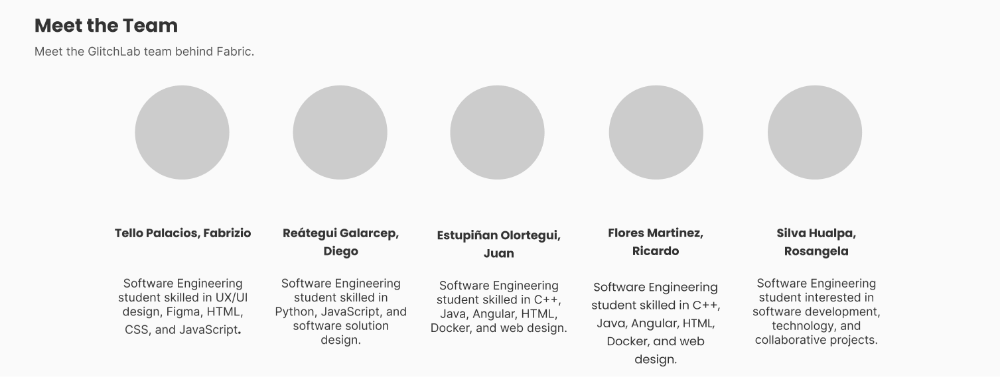

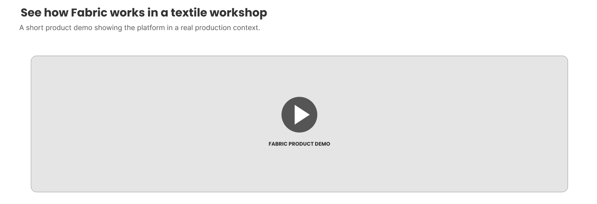

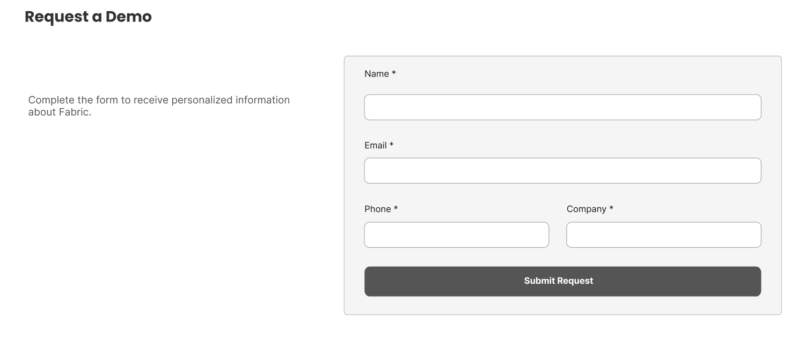

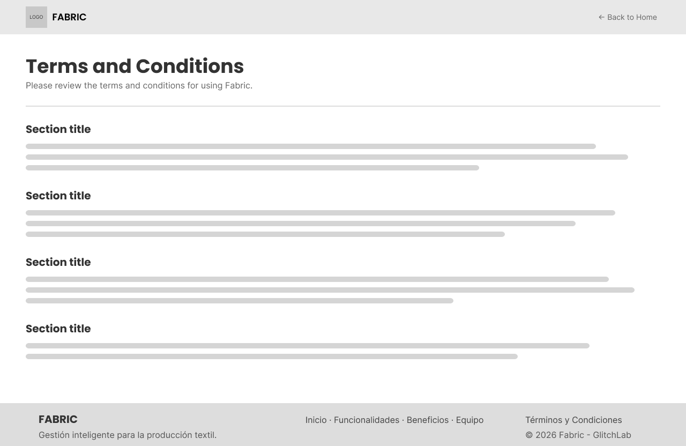

### 4.3.2. Landing Page Mock-up
El mockup de la Landing Page de Fabric muestra el diseño final de la página a partir de los wireframes realizados previamente. Se aplican los colores, tipografías, botones y componentes visuales definidos en el Design System de Fabric, manteniendo consistencia visual en toda la experiencia.
La página presenta de forma ordenada el problema, la solución, los beneficios y las principales funcionalidades de la plataforma, siguiendo una jerarquía visual y una organización clara del contenido. Además, se utilizan textos legibles, contrastes adecuados y elementos fácilmente identificables como parte del diseño inclusivo. Finalmente, se incorporan llamados a la acción como “Request a Demo”, facilitando la interacción y orientando al visitante durante su recorrido por la Landing Page.

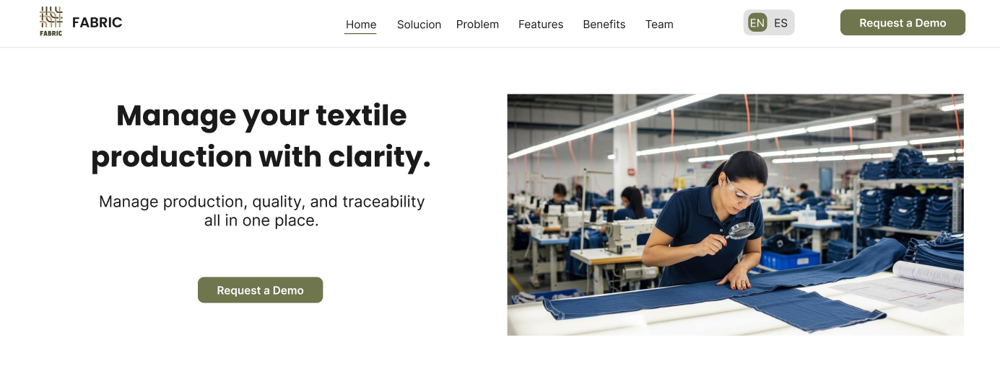

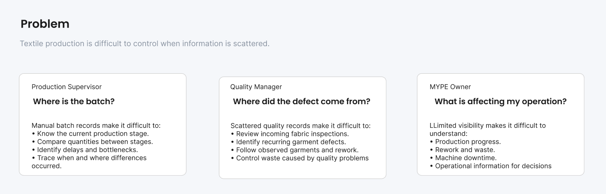

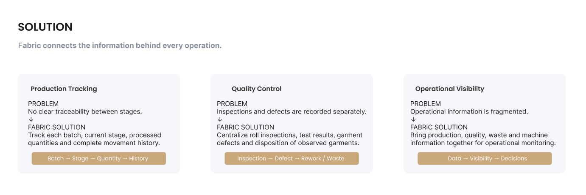

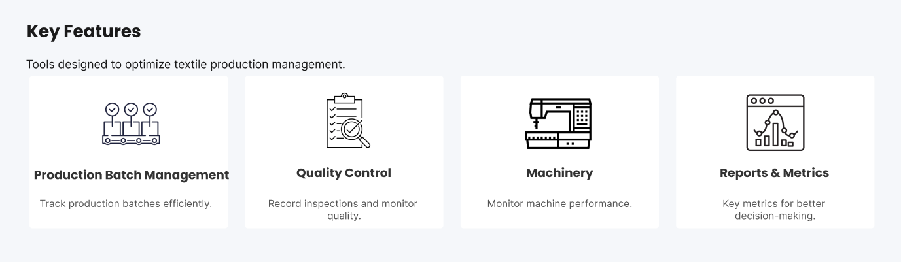

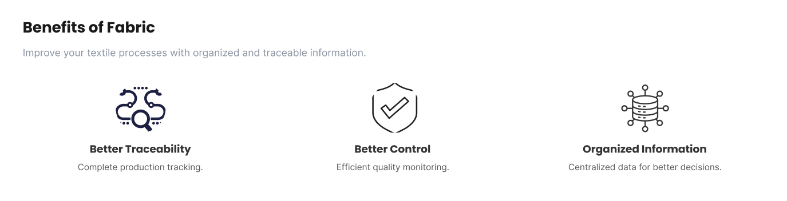

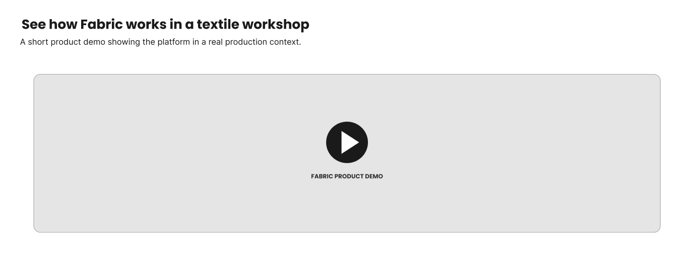

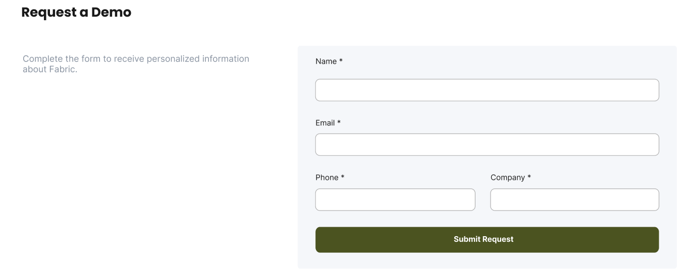

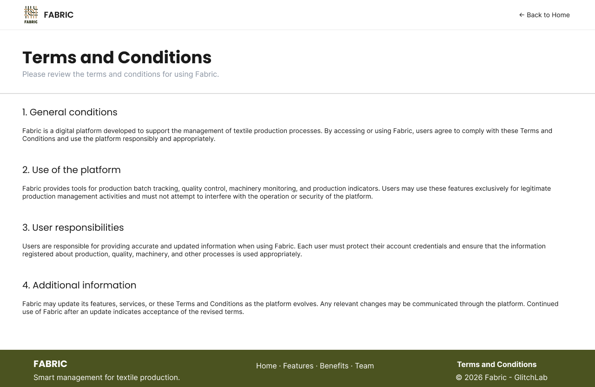

