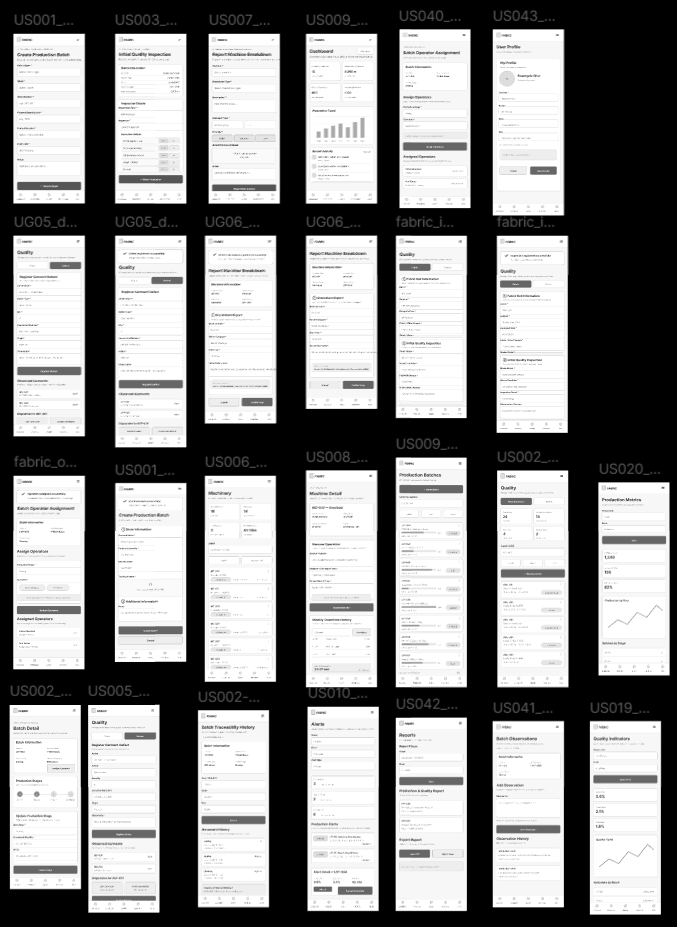
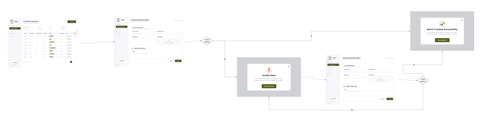
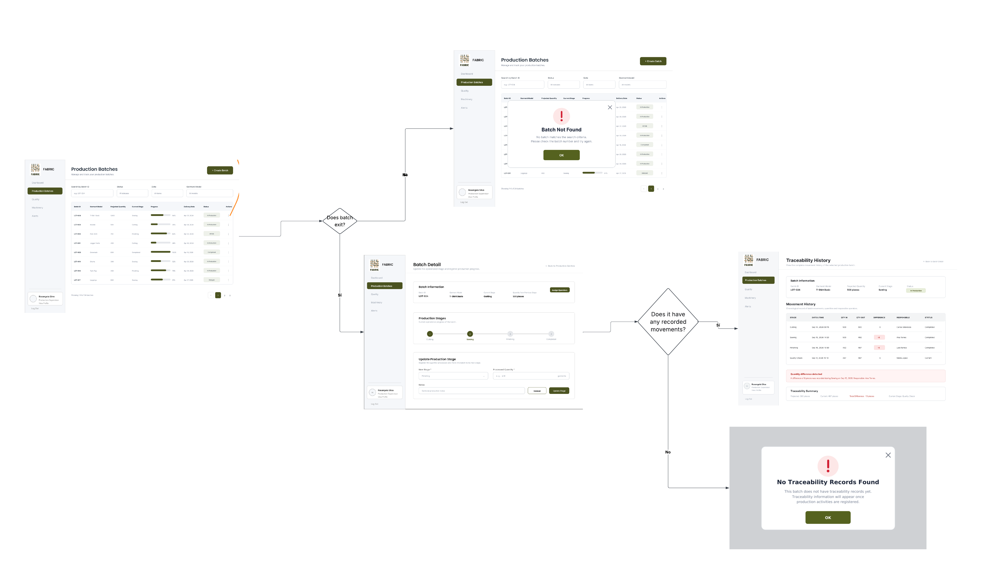
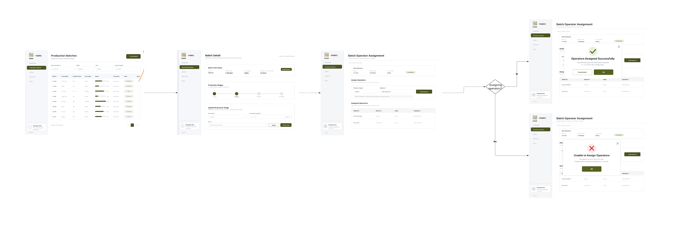
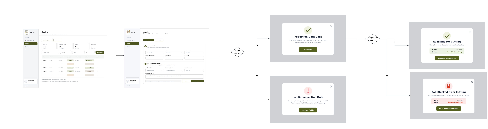
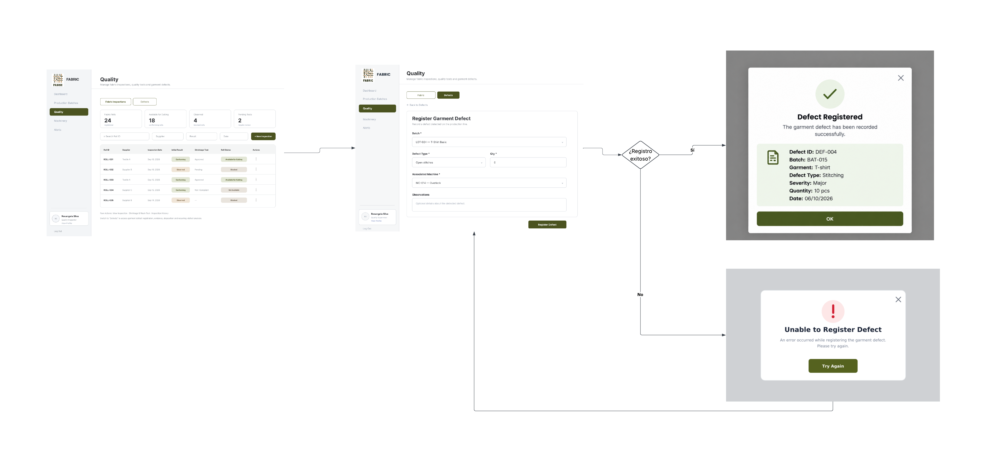
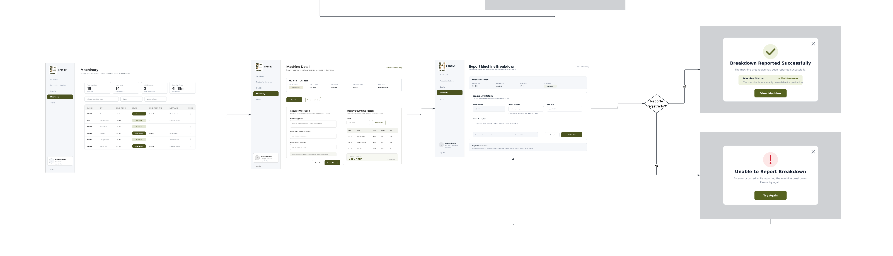
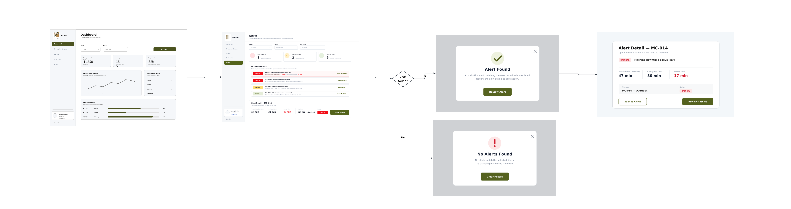

## 4.4. Web Applications UX/UI Design

El diseño UX/UI de la aplicación web de Fabric se enfoca en ofrecer una experiencia clara y sencilla para la gestión de los procesos de producción y calidad en talleres textiles. Desde la perspectiva UX, se prioriza que los usuarios puedan consultar el estado de los lotes, realizar su trazabilidad, registrar inspecciones, controlar defectos, revisar el estado de las máquinas y detectar alertas de manera rápida.
En cuanto al diseño UI, Fabric utiliza una interfaz limpia y organizada, con un menú lateral para acceder a las principales secciones del sistema, además de tablas, formularios, indicadores, filtros y alertas que facilitan la visualización de la información.
En conjunto, el diseño busca centralizar la información del proceso productivo y facilitar las tareas de supervisores de producción, encargados de calidad y responsables de la MYPE.

### 4.4.1. Web Applications Wireframes
Los wireframes de Fabric representan la estructura inicial de las principales vistas de la aplicación y permiten definir la distribución de los elementos antes de aplicar el diseño visual final. Estos fueron planteados considerando las necesidades de los usuarios y los principales procesos de producción y control de calidad de los talleres textiles.
La propuesta mantiene una jerarquía visual clara, organizando la información mediante menús, tablas, formularios, indicadores y acciones principales. Asimismo, se aplican principios de consistencia, simplicidad y diseño inclusivo, utilizando elementos claramente identificables y una distribución que facilite la comprensión de la información.
La estructura de las vistas responde a la arquitectura de información definida para Fabric, agrupando las funcionalidades según los principales módulos del sistema y permitiendo que los usuarios puedan desplazarse entre ellos de manera sencilla y realizar sus tareas con el menor esfuerzo posible.

https://sl1nk.com/fosw8bt

### 4.4.2. Web Applications Wireflow Diagrams

https://sl1nk.com/1iklbff

Los Wireflow Diagrams de Fabric representan de forma visual los recorridos que realizan los usuarios para alcanzar los principales objetivos dentro de la aplicación web. Para su elaboración se utilizan los wireframes desarrollados previamente, conectados mediante flechas que representan las acciones y transiciones entre las diferentes interfaces.
Los wireflows se organizan de acuerdo con los User Goals identificados para los User Personas de Fabric, considerando los pasos necesarios para completar cada tarea. Asimismo, cuando una interacción genera un cambio en el estado de una interfaz, este se representa mediante un nuevo wireframe dentro del flujo.

#### UG01 – Registrar un nuevo lote de producción

**User Persona:** Maribel – Supervisora de Producción

**User Goal:** Registrar un nuevo lote de producción para iniciar su seguimiento dentro del proceso productivo.

**Wireflow:**

**Explicación del flujo:**

El flujo inicia cuando Maribel accede al módulo "Production Batches". Desde esta vista selecciona la opción para crear un nuevo lote, completa la información requerida y realiza el registro. Una vez finalizado el proceso, el sistema incorpora el nuevo lote a los registros de producción, permitiendo realizar posteriormente su seguimiento y trazabilidad.

---

#### UG02 – Consultar el avance y trazabilidad de un lote

**User Persona:** Maribel – Supervisora de Producción

**User Goal:** Consultar el estado, avance y trazabilidad de un lote para supervisar su progreso durante la producción.

**Wireflow:**

**Explicación del flujo:**

El flujo inicia cuando Maribel accede a "Production Batches", donde puede visualizar los lotes registrados. Luego, selecciona el lote que desea consultar y accede a su información detallada. Desde esta vista puede revisar su estado, etapa actual, progreso y registros de movimientos para conocer el avance del lote dentro del proceso productivo.

---

#### UG03 – Asignar operarios a un lote de producción

**User Persona:** Maribel – Supervisora de Producción

**User Goal:** Asignar operarios a un lote de producción para organizar a los responsables de su ejecución.

**Wireflow:**

**Explicación del flujo:**

El flujo inicia cuando Maribel selecciona un lote desde "Production Batches" y accede a las opciones relacionadas con su gestión. Posteriormente, ingresa a la asignación de operarios, selecciona a los responsables correspondientes y confirma la asignación. Finalmente, el sistema registra a los operarios asociados al lote y a la etapa correspondiente.

---

#### UG04 – Registrar una inspección de tela

**User Persona:** Betsabé – Encargada de Calidad

**User Goal:** Registrar una inspección de tela para verificar su conformidad antes de ingresar al proceso productivo.

**Wireflow:**

**Explicación del flujo:**

El flujo inicia cuando Betsabé accede al módulo "Quality" y selecciona "Fabric Inspections". Desde esta sección inicia el registro de una nueva inspección, completa la información correspondiente al material evaluado y registra el resultado obtenido. Finalmente, el sistema almacena la inspección para mantener un historial de los controles de calidad realizados.

---

#### UG05 – Registrar y consultar defectos de prendas

**User Persona:** Betsabé – Encargada de Calidad

**User Goal:** Registrar y consultar defectos encontrados en las prendas para realizar el seguimiento de los problemas de calidad.

**Wireflow:**

**Explicación del flujo:**

El flujo inicia cuando Betsabé accede al módulo "Quality" y selecciona la sección "Garment Defects". Desde esta vista puede consultar los defectos previamente registrados o iniciar el registro de uno nuevo. Para registrar un defecto, completa la información correspondiente y confirma la operación. El sistema almacena el registro para permitir su posterior consulta y seguimiento.

---

#### UG06 – Consultar el estado de las máquinas y registrar incidencias

**User Persona:** Maribel – Supervisora de Producción

**User Goal:** Consultar el estado de las máquinas y registrar incidencias para identificar problemas que puedan afectar la producción.

**Wireflow:**

**Explicación del flujo:**

El flujo inicia cuando Maribel accede al módulo “Machinery” y selecciona la opción para reportar la avería de una máquina. El sistema muestra la información de la máquina y el formulario “Report Machine Breakdown”, donde registra la categoría de la falla, la hora de detención y una descripción de lo ocurrido. Luego, confirma el reporte mediante “Confirm Stop”. Finalmente, el sistema registra la avería, cambia el estado de la máquina a “In Maintenance”, inicia el conteo del tiempo de inactividad y muestra un mensaje de confirmación.

---

#### UG07 – Consultar indicadores y alertas

**User Persona:** Maribel – Supervisora de Producción / Betsabé – Encargada de Calidad

**User Goal:** Consultar indicadores y alertas para identificar desviaciones en la producción y calidad que requieran atención.

**Wireflow:**

**Explicación del flujo:**

El flujo inicia cuando el usuario accede al "Dashboard", donde puede visualizar los principales indicadores relacionados con la producción y calidad. Desde esta vista puede identificar información relevante sobre el estado de las operaciones y acceder al módulo "Alerts" para consultar las alertas generadas. Esto permite reconocer situaciones que requieren atención y acceder a la información relacionada para realizar su seguimiento.

### 4.4.3. Web Applications Mock-ups

Los mock-ups de Fabric representan el diseño visual final de la aplicación web, desarrollado a partir de los wireframes y siguiendo el Design System establecido. Se aplican principios de **jerarquía visual, consistencia y simplicidad**, utilizando colores, tipografías y componentes uniformes en las diferentes interfaces.
Además, se consideran criterios de **diseño inclusivo**, como textos legibles, contrastes adecuados y elementos claramente identificables. La información se organiza según la arquitectura definida para Fabric, facilitando la navegación y el acceso a las principales funcionalidades.

### 4.4.4. Web Applications User Flow Diagrams

Los User Flow Diagrams representan los recorridos que realizan los usuarios para alcanzar los principales objetivos dentro de la aplicación web. Estos diagramas se derivan de los Wireflows definidos previamente y utilizan los mock-ups finales de la aplicación para representar las interfaces involucradas en cada proceso.

---

#### User Flow 1 – Registrar un nuevo lote de producción

**User Persona:** Maribel – Supervisora de Producción

**User Goal:** Registrar un nuevo lote de producción para iniciar su seguimiento dentro del proceso productivo.

  

 
El flujo inicia cuando Maribel accede al módulo **Production Batches** y selecciona la opción **Create Batch**. El sistema muestra el formulario de creación, donde se registra la información correspondiente al nuevo lote. Al seleccionar **Create Batch**, el sistema verifica si los datos ingresados son válidos. Si la validación es correcta, el lote se registra y se muestra el mensaje **Batch Created Successfully**.
**Unhappy Path:**  
Si durante la validación se detecta información incompleta o incorrecta, el sistema muestra **Invalid Data**. Mediante la opción **Review Fields**, el usuario regresa al formulario para corregir la información y volver a intentar el registro.
**Condición principal:**  
La decisión **“Datos válidos?”** determina si el lote puede ser registrado o si el usuario debe corregir los datos ingresados.

#### User Flow 2 – Consultar el avance y trazabilidad de un lote

**User Persona:** Maribel – Supervisora de Producción

**User Goal:** Consultar el estado, avance y trazabilidad de un lote para supervisar su progreso durante la producción.

  

**Happy Path:**  
El flujo inicia en **Production Batches**, donde Maribel busca o selecciona un lote. Si el lote existe, accede a **Batch Detail**, desde donde puede consultar su información y los movimientos registrados. Si existen registros de movimientos, el sistema muestra **Traceability History**, permitiendo revisar el historial del lote durante las diferentes etapas del proceso productivo.

**Unhappy Paths:**  
El primer flujo alternativo ocurre cuando el lote buscado no existe. En este caso, el sistema muestra **Batch Not Found**. El segundo ocurre cuando el lote existe, pero todavía no cuenta con movimientos registrados; en este escenario se muestra **No Traceability Records Found**.

**Condiciones principales:**  
La primera decisión verifica **“Does batch exist?”**. Si existe, se continúa con la consulta del lote. Posteriormente, la condición **“Does it have any recorded movements?”** determina si se puede mostrar el historial de trazabilidad.

---

#### User Flow 3 – Asignar operarios a un lote de producción

**User Persona:** Maribel – Supervisora de Producción

**User Goal:** Asignar operarios a un lote de producción para organizar a los responsables de su ejecución.

  

**Happy Path:**  
Maribel accede a **Production Batches**, selecciona el lote correspondiente y visualiza **Batch Detail**. Posteriormente, ingresa a **Batch Operator Assignment**, donde selecciona la etapa productiva y los operarios que serán asignados. Si se seleccionaron correctamente los operarios, el sistema realiza la asignación y muestra **Operators Assigned Successfully**.

**Unhappy Path:**  
Si se intenta realizar la asignación sin haber seleccionado ningún operario, el sistema no completa la operación y muestra **Unable to Assign Operators**, indicando que se debe seleccionar al menos un operario antes de continuar.

**Condición principal:**  
La decisión **“Assigning operators?”** verifica que exista una selección válida de operarios antes de confirmar la asignación.

---

#### User Flow 4 – Registrar una inspección de tela

**User Persona:** Betsabé – Encargada de Calidad

**User Goal:** Registrar una inspección de tela para verificar su conformidad antes de ingresar al proceso productivo.

  

**Happy Path:**  
El flujo inicia cuando Betsabé accede al módulo **Quality** y selecciona **Fabric Inspections**. Luego ingresa al formulario de inspección, donde registra la información del rollo y los resultados de la evaluación inicial. El sistema valida la información ingresada y, si es correcta, continúa con la evaluación del resultado de la inspección. Cuando el resultado es **Conforming**, el rollo queda en estado **Available for Cutting**, permitiendo su utilización en producción.

**Unhappy Paths:**  
Si los datos de la inspección son incorrectos o están incompletos, se muestra **Invalid Inspection Data**, permitiendo revisar los campos antes de guardar. Por otro lado, si los datos son válidos pero el resultado de la inspección determina que el rollo presenta observaciones, este pasa al estado **Roll Blocked from Cutting**, evitando su utilización en lotes de corte.

**Condiciones principales:**  
La primera condición **“Datos válidos?”** verifica que la información de la inspección sea correcta. Posteriormente, **“Inspection Result?”** determina si el rollo queda disponible para corte o bloqueado.

---

#### User Flow 5 – Registrar y consultar defectos de prendas

**User Persona:** Betsabé – Encargada de Calidad

**User Goal:** Registrar defectos encontrados en las prendas para mantener un control de los problemas de calidad detectados durante la producción.

  

**Happy Path:**  
Betsabé accede al módulo **Quality** y selecciona la sección correspondiente a defectos. Desde esta interfaz ingresa a **Register Garment Defect**, donde registra el lote, tipo de defecto, cantidad afectada, máquina asociada y observaciones. Al seleccionar **Register Defect**, si la operación se ejecuta correctamente, el sistema muestra **Defect Registered**, confirmando que el defecto fue almacenado.

**Unhappy Path:**  
Si ocurre un problema durante el registro, el sistema muestra **Unable to Register Defect**. Desde esta interfaz el usuario puede seleccionar **Try Again** para regresar al formulario e intentar nuevamente el registro.

**Condición principal:**  
La decisión **“¿Registro exitoso?”** determina si el defecto fue almacenado correctamente o si se debe volver a intentar la operación.

---

#### User Flow 6 – Consultar el estado de las máquinas y registrar incidencias

**User Persona:** Maribel – Supervisora de Producción

**User Goal:** Consultar el estado de las máquinas y registrar incidencias para identificar problemas que puedan afectar la producción.

  

**Happy Path:**  
El flujo comienza cuando Maribel accede al módulo **Machinery** y selecciona una máquina para visualizar **Machine Detail**. Desde esta pantalla accede a **Report Machine Breakdown**, donde registra la información relacionada con la avería. Si el reporte se registra correctamente, el sistema muestra **Breakdown Reported Successfully** y actualiza el estado de la máquina a **In Maintenance**.

**Unhappy Path:**  
Si ocurre un error durante el registro de la avería, el sistema muestra **Unable to Report Breakdown**. El usuario puede seleccionar **Try Again** para regresar al formulario y volver a intentar el registro.

**Condición principal:**  
La decisión **“¿Reporte registrado?”** verifica si la incidencia pudo almacenarse correctamente. Un resultado positivo actualiza el estado de la máquina, mientras que un resultado negativo permite volver a intentar la operación.

---

#### User Flow 7 – Consultar indicadores y alertas

**User Persona:** Maribel – Supervisora de Producción / Betsabé – Encargada de Calidad

**User Goal:** Consultar indicadores y alertas para identificar desviaciones en la producción y calidad que requieran atención.

  

**Happy Path:**  
El flujo inicia en el **Dashboard**, donde el usuario puede visualizar los principales indicadores relacionados con la producción. Posteriormente, accede al módulo **Alerts**, donde se muestran las alertas generadas por el sistema. Si se encuentra una alerta relacionada con los criterios seleccionados, se muestra **Alert Found** y el usuario puede seleccionar **Review Alert** para acceder a **Alert Detail**, donde consulta información detallada sobre la situación detectada.

**Unhappy Path:**  
Si no existen alertas que coincidan con los criterios o filtros utilizados, el sistema muestra **No Alerts Found**. Desde esta interfaz el usuario puede seleccionar **Clear Filters** para eliminar los filtros aplicados y regresar a la consulta de alertas.

**Condición principal:**  
La decisión **“Alert found?”** determina si el sistema muestra el detalle de una alerta encontrada o informa que no existen resultados para los criterios seleccionados.