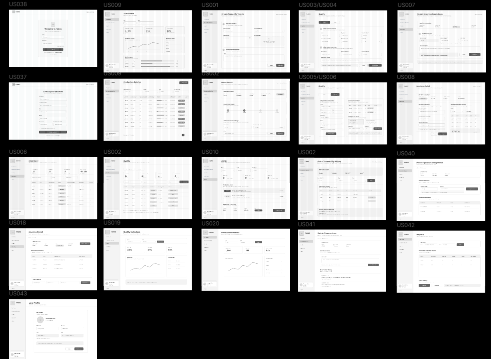
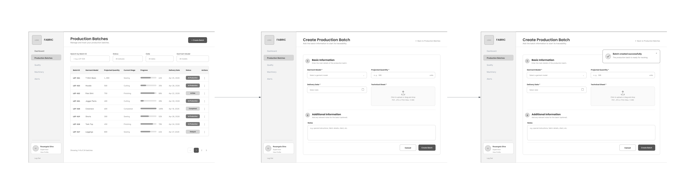
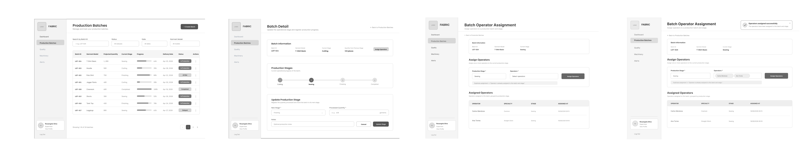
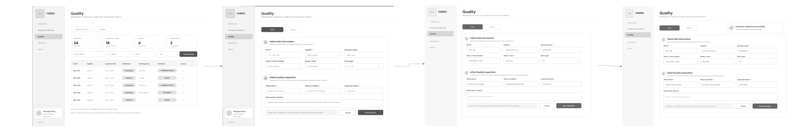
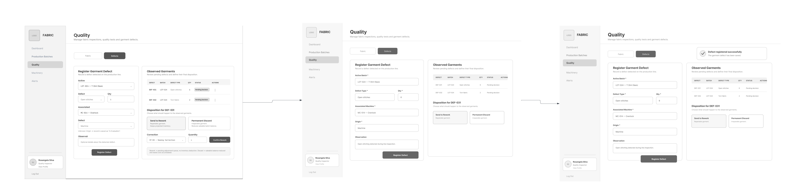
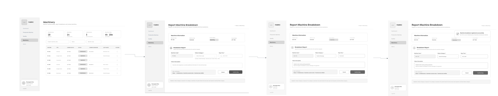
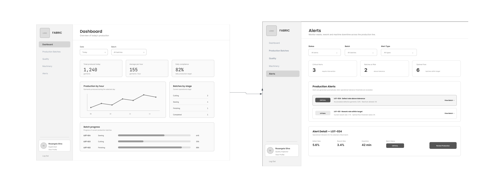
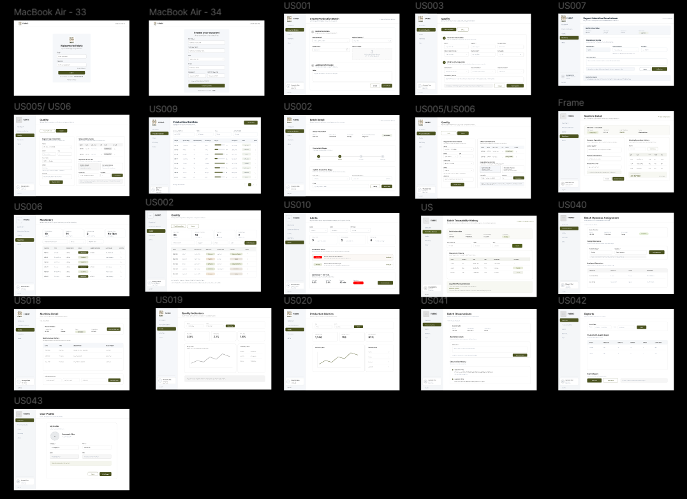
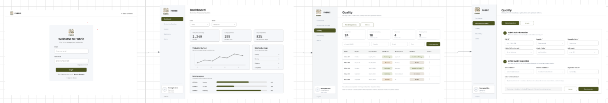
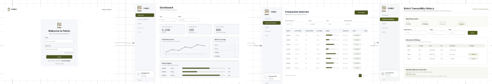

## 4.4. Web Applications UX/UI Design

El diseño UX/UI de la aplicación web de Fabric se enfoca en ofrecer una experiencia clara y sencilla para la gestión de los procesos de producción y calidad en talleres textiles. Desde la perspectiva UX, se prioriza que los usuarios puedan consultar el estado de los lotes, realizar su trazabilidad, registrar inspecciones, controlar defectos, revisar el estado de las máquinas y detectar alertas de manera rápida.
En cuanto al diseño UI, Fabric utiliza una interfaz limpia y organizada, con un menú lateral para acceder a las principales secciones del sistema, además de tablas, formularios, indicadores, filtros y alertas que facilitan la visualización de la información.
En conjunto, el diseño busca centralizar la información del proceso productivo y facilitar las tareas de supervisores de producción, encargados de calidad y responsables de la MYPE.

### 4.4.1. Web Applications Wireframes
Los wireframes de Fabric representan la estructura inicial de las principales vistas de la aplicación y permiten definir la distribución de los elementos antes de aplicar el diseño visual final. Estos fueron planteados considerando las necesidades de los usuarios y los principales procesos de producción y control de calidad de los talleres textiles.
La propuesta mantiene una jerarquía visual clara, organizando la información mediante menús, tablas, formularios, indicadores y acciones principales. Asimismo, se aplican principios de consistencia, simplicidad y diseño inclusivo, utilizando elementos claramente identificables y una distribución que facilite la comprensión de la información.
La estructura de las vistas responde a la arquitectura de información definida para Fabric, agrupando las funcionalidades según los principales módulos del sistema y permitiendo que los usuarios puedan desplazarse entre ellos de manera sencilla y realizar sus tareas con el menor esfuerzo posible.

https://sl1nk.com/fosw8bt

### 4.4.2. Web Applications Wireflow Diagrams

https://sl1nk.com/1iklbff

Los Wireflow Diagrams de Fabric representan de forma visual los recorridos que realizan los usuarios para alcanzar los principales objetivos dentro de la aplicación web. Para su elaboración se utilizan los wireframes desarrollados previamente, conectados mediante flechas que representan las acciones y transiciones entre las diferentes interfaces.
Los wireflows se organizan de acuerdo con los User Goals identificados para los User Personas de Fabric, considerando los pasos necesarios para completar cada tarea. Asimismo, cuando una interacción genera un cambio en el estado de una interfaz, este se representa mediante un nuevo wireframe dentro del flujo.

#### UG01 – Registrar un nuevo lote de producción

**User Persona:** Maribel – Supervisora de Producción

**User Goal:** Registrar un nuevo lote de producción para iniciar su seguimiento dentro del proceso productivo.

**Wireflow:**

**Explicación del flujo:**

El flujo inicia cuando Maribel accede al módulo "Production Batches". Desde esta vista selecciona la opción para crear un nuevo lote, completa la información requerida y realiza el registro. Una vez finalizado el proceso, el sistema incorpora el nuevo lote a los registros de producción, permitiendo realizar posteriormente su seguimiento y trazabilidad.

---

#### UG02 – Consultar el avance y trazabilidad de un lote

**User Persona:** Maribel – Supervisora de Producción

**User Goal:** Consultar el estado, avance y trazabilidad de un lote para supervisar su progreso durante la producción.

**Wireflow:**

**Explicación del flujo:**

El flujo inicia cuando Maribel accede a "Production Batches", donde puede visualizar los lotes registrados. Luego, selecciona el lote que desea consultar y accede a su información detallada. Desde esta vista puede revisar su estado, etapa actual, progreso y registros de movimientos para conocer el avance del lote dentro del proceso productivo.

---

#### UG03 – Asignar operarios a un lote de producción

**User Persona:** Maribel – Supervisora de Producción

**User Goal:** Asignar operarios a un lote de producción para organizar a los responsables de su ejecución.

**Wireflow:**

**Explicación del flujo:**

El flujo inicia cuando Maribel selecciona un lote desde "Production Batches" y accede a las opciones relacionadas con su gestión. Posteriormente, ingresa a la asignación de operarios, selecciona a los responsables correspondientes y confirma la asignación. Finalmente, el sistema registra a los operarios asociados al lote y a la etapa correspondiente.

---

#### UG04 – Registrar una inspección de tela

**User Persona:** Betsabé – Encargada de Calidad

**User Goal:** Registrar una inspección de tela para verificar su conformidad antes de ingresar al proceso productivo.

**Wireflow:**

**Explicación del flujo:**

El flujo inicia cuando Betsabé accede al módulo "Quality" y selecciona "Fabric Inspections". Desde esta sección inicia el registro de una nueva inspección, completa la información correspondiente al material evaluado y registra el resultado obtenido. Finalmente, el sistema almacena la inspección para mantener un historial de los controles de calidad realizados.

---

#### UG05 – Registrar y consultar defectos de prendas

**User Persona:** Betsabé – Encargada de Calidad

**User Goal:** Registrar y consultar defectos encontrados en las prendas para realizar el seguimiento de los problemas de calidad.

**Wireflow:**

**Explicación del flujo:**

El flujo inicia cuando Betsabé accede al módulo "Quality" y selecciona la sección "Garment Defects". Desde esta vista puede consultar los defectos previamente registrados o iniciar el registro de uno nuevo. Para registrar un defecto, completa la información correspondiente y confirma la operación. El sistema almacena el registro para permitir su posterior consulta y seguimiento.

---

#### UG06 – Consultar el estado de las máquinas y registrar incidencias

**User Persona:** Maribel – Supervisora de Producción

**User Goal:** Consultar el estado de las máquinas y registrar incidencias para identificar problemas que puedan afectar la producción.

**Wireflow:**

**Explicación del flujo:**

El flujo inicia cuando Maribel accede al módulo “Machinery” y selecciona la opción para reportar la avería de una máquina. El sistema muestra la información de la máquina y el formulario “Report Machine Breakdown”, donde registra la categoría de la falla, la hora de detención y una descripción de lo ocurrido. Luego, confirma el reporte mediante “Confirm Stop”. Finalmente, el sistema registra la avería, cambia el estado de la máquina a “In Maintenance”, inicia el conteo del tiempo de inactividad y muestra un mensaje de confirmación.

---

#### UG07 – Consultar indicadores y alertas

**User Persona:** Maribel – Supervisora de Producción / Betsabé – Encargada de Calidad

**User Goal:** Consultar indicadores y alertas para identificar desviaciones en la producción y calidad que requieran atención.

**Wireflow:**

**Explicación del flujo:**

El flujo inicia cuando el usuario accede al "Dashboard", donde puede visualizar los principales indicadores relacionados con la producción y calidad. Desde esta vista puede identificar información relevante sobre el estado de las operaciones y acceder al módulo "Alerts" para consultar las alertas generadas. Esto permite reconocer situaciones que requieren atención y acceder a la información relacionada para realizar su seguimiento.

### 4.4.3. Web Applications Mock-ups

Los mock-ups de Fabric representan el diseño visual final de la aplicación web, desarrollado a partir de los wireframes y siguiendo el Design System establecido. Se aplican principios de **jerarquía visual, consistencia y simplicidad**, utilizando colores, tipografías y componentes uniformes en las diferentes interfaces.
Además, se consideran criterios de **diseño inclusivo**, como textos legibles, contrastes adecuados y elementos claramente identificables. La información se organiza según la arquitectura definida para Fabric, facilitando la navegación y el acceso a las principales funcionalidades.

### 4.4.4. Web Applications User Flow Diagrams

#### User Flow 1: Registro de inspección de tela

#### User Flow 2: Consulta de trazabilidad de lote

