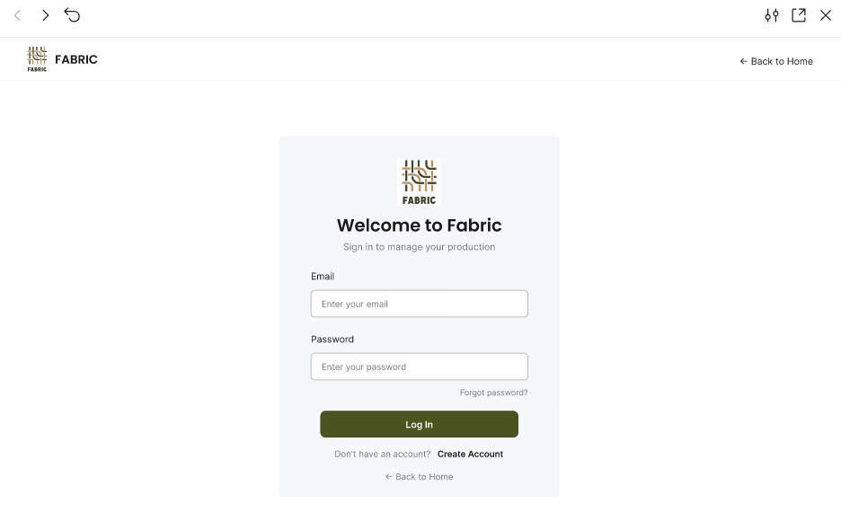

## 4.5. Web Applications Prototyping

Se desarrolló un prototipo interactivo de Fabric que simula la navegación y los principales flujos de interacción definidos previamente en los User Flow Diagrams. El prototipo permite representar acciones como la consulta de información, navegación entre módulos, registro de datos, selección de opciones, confirmación de operaciones y visualización de mensajes de respuesta del sistema.

Las interacciones mantienen las decisiones establecidas en la arquitectura de información de Fabric. La navegación principal se realiza mediante el Sidebar, desde el cual el usuario puede acceder a módulos como "Dashboard", "Production Batches", "Quality", "Machinery" y "Alerts". Asimismo, se utilizan botones, formularios, filtros y enlaces contextuales para guiar al usuario durante cada flujo.

La siguiente figura muestra una vista previa del prototipo interactivo:

**Video demostrativo del prototipo:**  
https://sl1nk.com/25xhu6l

