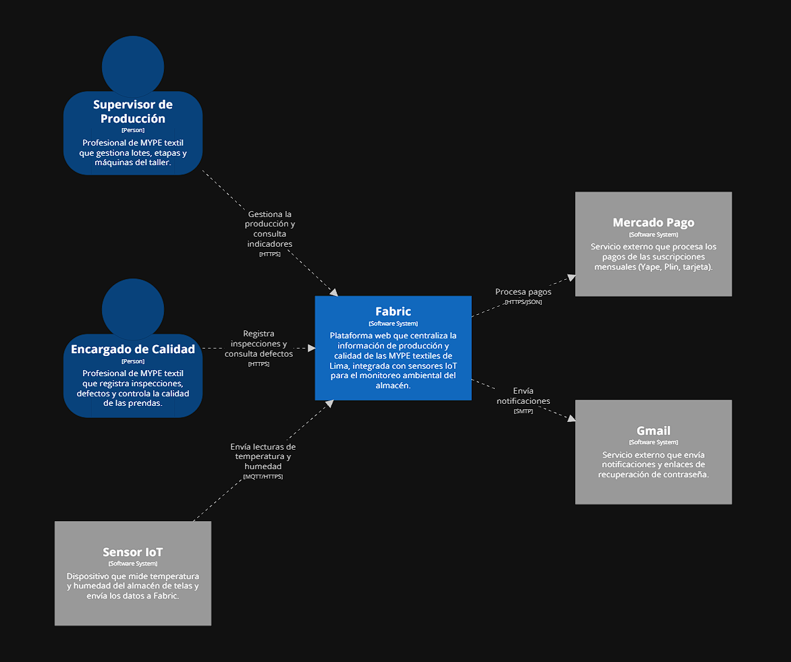
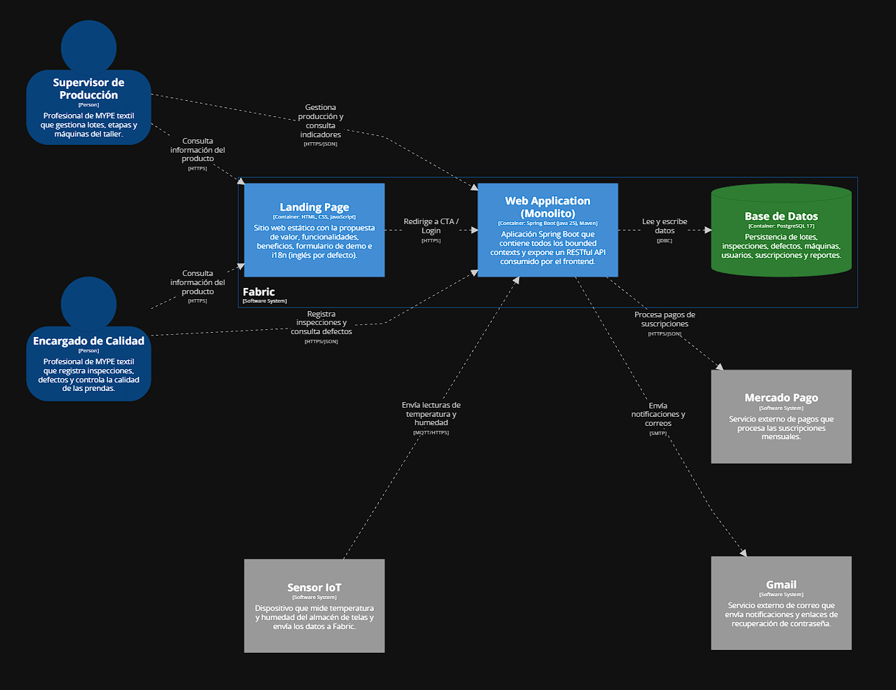
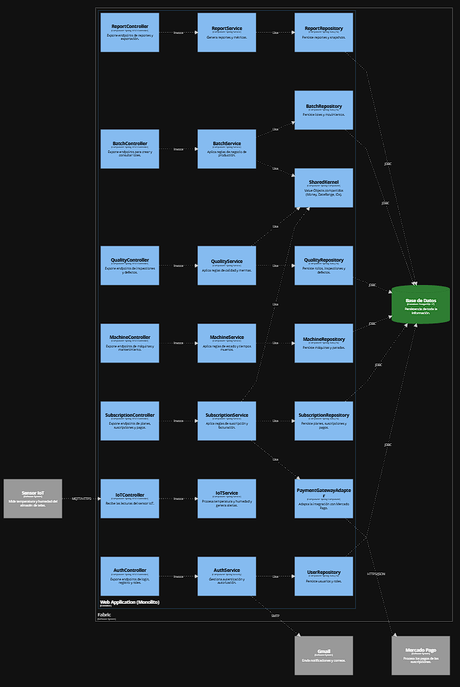

## 4.6. Domain-Driven Software Architecture

### 4.6.1. Design-Level Storming

Se muestra el Design-Level Event Storming de nuestra aplicación. En esta sección se profundizó a mayor detalle nuestro Big Picture Event Storming, enfocandonos en la arquitectura interna, componentes y resultados finales.

**Paso 1: Definition of Commands and Actors**

Identificamos las acciones específicas (Comandos) que disparan los procesos en cada sub-dominio y  a los actores (usuarios o sistemas) responsables de ejecutar dichas acciones.

**Paso 2: Policy Design and Inter-Context Orchestration**

Establecemos con paciencia las Policies para gestionar el comportamiento reactivo y la comunicación entre los Bounded Contexts.

**Paso 3: Aggregate Modeling and Business Logic Rules**

Introducimos los Agregados para definir las fronteras de consistencia, agrupando los comandos y eventos bajo entidades lógicas.

**Paso 4: Identification of External Systems, Read Models and Attribute Refinement**

Por último, integramos los sistemas externos que el actor necesita visualizar antes de ejecutar un comando, asegurando una interfaz informada, incorporamos los Read Models y desglosamos los atributos técnicos dentro de cada aggregate para descartar ambigüedades.

### 4.6.2. Software Architecture Context Diagrams

El diagrama de contexto presenta a Fabric como un sistema central que interactúa con dos segmentos objetivo: supervisores de producción y encargados de calidad de MYPE textiles. Ambos acceden a la plataforma vía HTTPS para gestionar lotes, registrar inspecciones y consultar indicadores. 

    

 

### 4.6.3. Software Architecture Container Diagrams

El diagrama de contenedores muestra cómo está armado **Fabric**. Tiene tres partes: **la Landing Page**, que es la página web donde se presenta el producto y se pide una demo; **la Web Application**, que es el sistema principal donde los usuarios gestionan la producción y la calidad; y la **Base de Datos**, donde se guarda toda la información. Además, Fabric se conecta con tres servicios externos: el **Sensor IoT**, que mide la temperatura y humedad del almacén; Mercado Pago, que cobra las suscripciones; y Gmail, que envía los correos.

    

 

### 4.6.4. Software Architecture Component Diagrams

El diagrama de componentes muestra cómo está organizada la aplicación web de Fabric por dentro. Cada bounded context está agrupado y separado en tres capas: un Controller que recibe las peticiones, un Service que aplica las reglas de negocio, y un Repository que se conecta a la base de datos.

    

 
