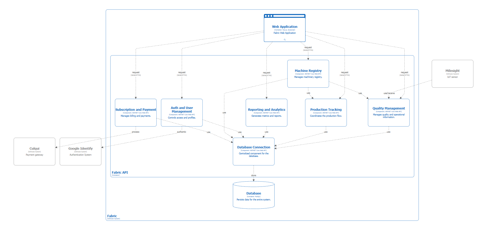
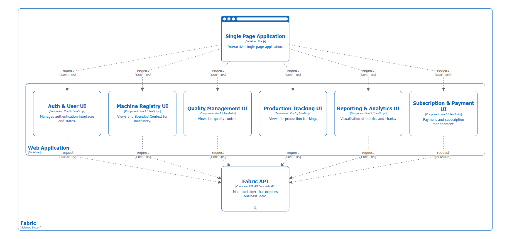

## 4.6. Domain-Driven Software Architecture

### 4.6.1. Design-Level Storming

Se muestra el Design-Level Event Storming de nuestra aplicación. En esta sección se profundizó a mayor detalle nuestro Big Picture Event Storming, enfocandonos en la arquitectura interna, componentes y resultados finales.

**Paso 1: Definition of Commands and Actors**

Identificamos las acciones específicas (Comandos) que disparan los procesos en cada sub-dominio y  a los actores (usuarios o sistemas) responsables de ejecutar dichas acciones.

**Paso 2: Policy Design and Inter-Context Orchestration**

Establecemos con paciencia las Policies para gestionar el comportamiento reactivo y la comunicación entre los Bounded Contexts.

**Paso 3: Aggregate Modeling and Business Logic Rules**

Introducimos los Agregados para definir las fronteras de consistencia, agrupando los comandos y eventos bajo entidades lógicas.

**Paso 4: Identification of External Systems, Read Models and Attribute Refinement**

Por último, integramos los sistemas externos que el actor necesita visualizar antes de ejecutar un comando, asegurando una interfaz informada, incorporamos los Read Models y desglosamos los atributos técnicos dentro de cada aggregate para descartar ambigüedades.

### 4.6.2. Software Architecture Context Diagrams

El diagrama de contexto presenta a Fabric como un sistema central que interactúa con dos actores humanos y tres sistemas externos. En este nivel podemos visualizar el alcance del sistema sin entrar en detalles de implementación, mostrando únicamente las relaciones de alto nivel entre el sistema y su entorno.

    

 

### 4.6.3. Software Architecture Container Diagram

Este diagrama descompone el sistema Fabric en sus principales unidades desplegables o contenedores. En él se distinguen dos contenedores públicos: la Landing Page, que actúa como sitio de presentación, y la Single Page Application (SPA), que ofrece una experiencia interactiva a los visitantes. Para los usuarios internos, como el Supervisor de Producción y el Inspector de Calidad, se dispone de la Web Application, desarrollada en Vue.js. Esta aplicación se comunica con el Fabric API, un backend en ASP.NET Core que centraliza la lógica de negocio. A su vez, el API se apoya en una base de datos MySQL para la persistencia y se integra con sistemas externos como Google Identity, Culqui y Milesight. El flujo de comunicación se aprecia con claridad: los actores acceden a las interfaces web, estas consumen el API, y el API gestiona tanto la lógica como la comunicación con la base de datos y los servicios de terceros.

    

 

### 4.6.4. Software Architecture Components Diagrams

El primer diagrama detalla la estructura interna del contenedor Fabric API. Aquí se visualizan los componentes modulares que dan soporte a la lógica de negocio, como Auth and User Management, Machine Registry, Quality Management, Production Tracking, Reporting & Analytics, Subscription and Payment, y el componente central Database Connection. El diagrama muestra cómo la Web Application externa consume estos componentes a través de peticiones JSON/HTTPS, cómo interactúan entre ellos, y cómo se comunican con los sistemas externos y la base de datos a través de la capa de conexión.

    

 
 

El segundo diagrama desglosa la estructura interna del contenedor Web Application, desarrollado en Vue.js. Muestra los componentes de la interfaz de usuario divididos por dominios o Bounded Contexts: Auth & User UI, Machine Registry UI, Quality Management UI, Production Tracking UI, Reporting & Analytics UI y Subscription & Payment UI. El diagrama ilustra cómo la Single Page Application (SPA) externa consume estos componentes de UI, y cómo cada uno de ellos se comunica directamente con el contenedor Fabric API para obtener o enviar datos.

    

 
 
