## 4.6. Domain-Driven Software Architecture

### 4.6.1. Design-Level Storming

Se muestra el Design-Level Event Storming de nuestra aplicación. En esta sección se profundizó a mayor detalle nuestro Big Picture Event Storming, enfocandonos en la arquitectura interna, componentes y resultados finales.

**Paso 1: Definition of Commands and Actors**

Identificamos las acciones específicas (Comandos) que disparan los procesos en cada sub-dominio y  a los actores (usuarios o sistemas) responsables de ejecutar dichas acciones.

**Paso 2: Policy Design and Inter-Context Orchestration**

Establecemos con paciencia las Policies para gestionar el comportamiento reactivo y la comunicación entre los Bounded Contexts.

**Paso 3: Aggregate Modeling and Business Logic Rules**

Introducimos los Agregados para definir las fronteras de consistencia, agrupando los comandos y eventos bajo entidades lógicas.

**Paso 4: Identification of External Systems, Read Models and Attribute Refinement**

Por último, integramos los sistemas externos que el actor necesita visualizar antes de ejecutar un comando, asegurando una interfaz informada, incorporamos los Read Models y desglosamos los atributos técnicos dentro de cada aggregate para descartar ambigüedades.

### 4.6.2. Software Architecture Context Diagrams

El diagrama de contexto presenta a Fabric como un sistema central que interactúa con tres actores humanos y tres sistemas externos. En este nivel podemos visualizar el alcance del sistema sin entrar en detalles de implementación, mostrando únicamente las relaciones de alto nivel entre el sistema y su entorno.

    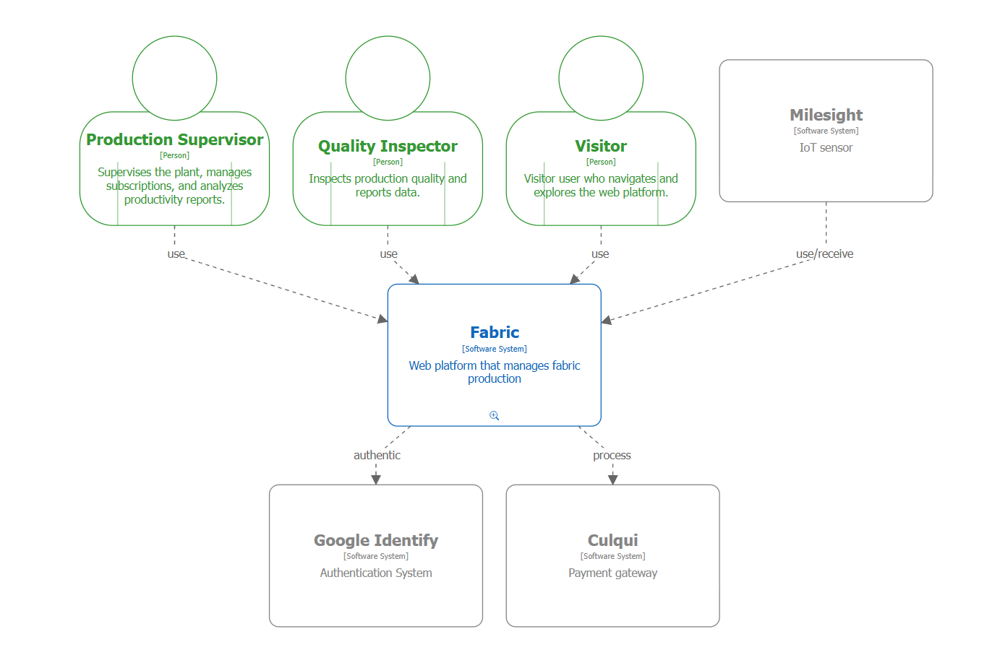

 

### 4.6.3. Software Architecture Container Diagrams

Fabric está compuesto por tres contenedores principales: la Landing Page (HTML, CSS y JavaScript) que presenta la propuesta de valor y capta leads; la Web Application (Vue.js), una SPA que concentra la lógica de negocio organizada en seis bounded contexts (Auth, Production Tracking, Quality Management, Machine Registry, Subscription & Payment, Reporting & Analytics); y la Base de Datos. El sistema se integra con tres servicios externos: Culqi (pasarela de pagos peruana), Gmail (notificaciones por correo) y un Sensor IoT (lecturas de temperatura y humedad vía MQTT). Los actores acceden al sistema mediante HTTPS, mientras que los módulos internos se comunican entre sí y persisten datos en la base de datos, dando soporte a los procesos de producción y control de calidad de las MYPE textiles.

    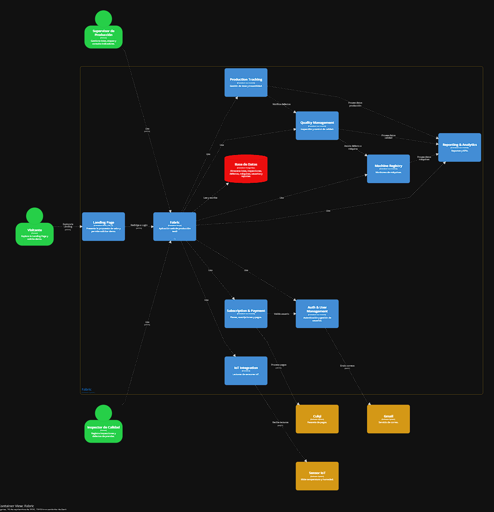

 

    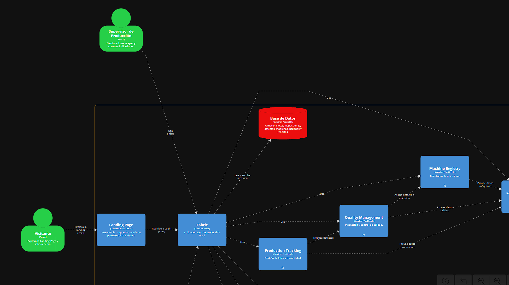

 

    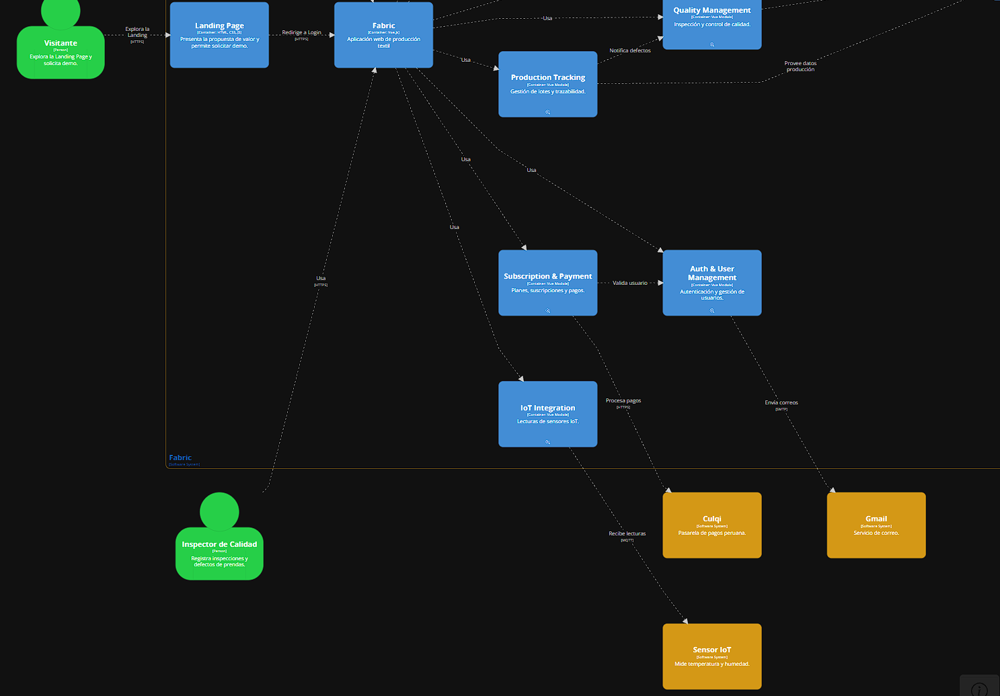

 

    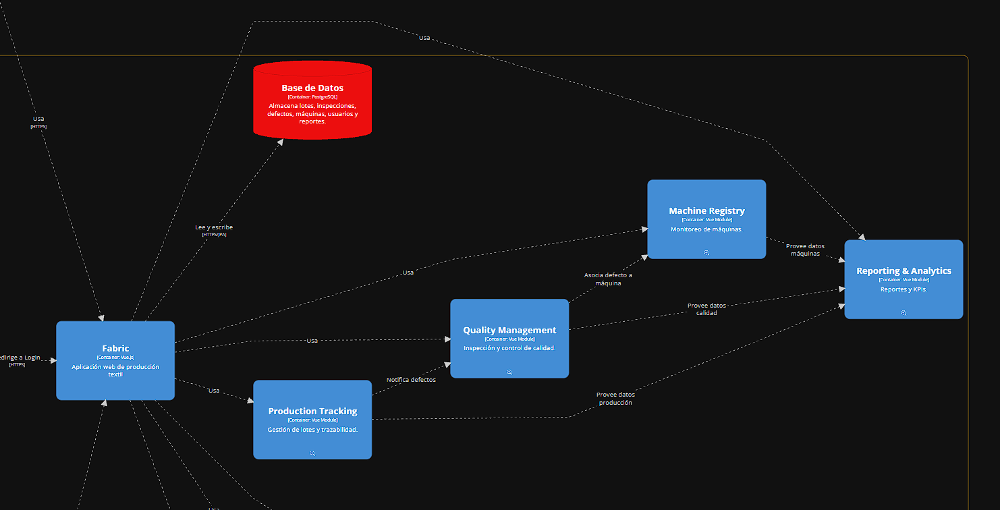

 

### 4.6.4. Software Architecture Component Diagrams

El diagrama de componentes muestra cómo está organizada la aplicación web de Fabric por dentro. Cada bounded context está agrupado y separado en tres capas: un Controller que recibe las peticiones, un Service que aplica las reglas de negocio, y un Repository que se conecta a la base de datos.

**Subscription and Payment**

Visualizamos los componentes internos del bounded context **suscripciones y pagos**, implementado en Vue.js. Se identifican cinco componentes: PlanView, que muestra los planes comerciales disponibles; SubscriptionView, que permite gestionar la suscripción activa de la empresa; SubscriptionStore, que gestiona el estado global de las suscripciones mediante Pinia; SubscriptionService, que consume los endpoints REST de planes y suscripciones; y PaymentService, que se integra con la pasarela de pagos p **"Culqi"** para procesar los pagos mensuales. Este módulo gestiona el modelo de negocio de Fabric, permitiendo a las MYPE textiles contratar, renovar o cancelar su suscripción en nuestra plataforma.

    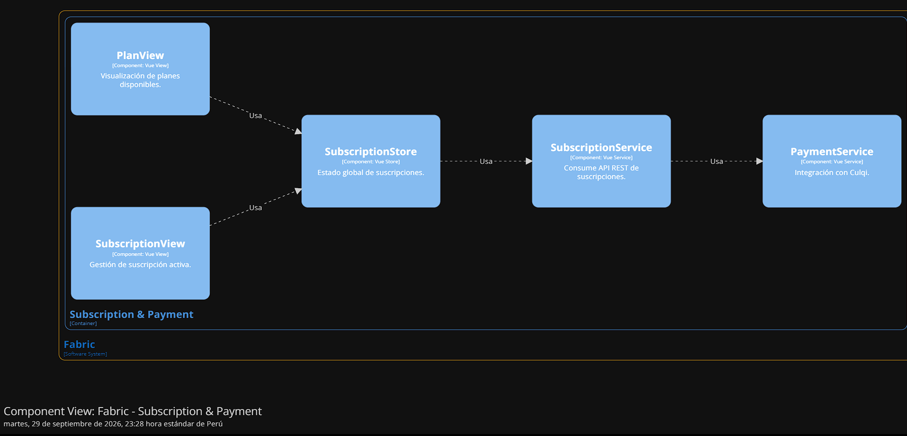

 
 

**Auth and User Management**

Este diagrama detalla los componentes internos del bounded context **autenticación y gestión de usuarios**, implementado en Vue.js. Se identifican cuatro componentes principales: LoginView, que constituye la vista de inicio de sesión y registro; AuthStore, que gestiona el estado global del usuario autenticado con el uso de Pinia; AuthService, que consume los endpoints REST del backend para autenticar y validar credenciales; y AuthRouter, que define las rutas protegidas y los guards de navegación de la aplicación. Este bounded es transversal a los demás bounded contexts, ya que valida la identidad del usuario antes de permitir el acceso a las funcionalidades de producción, calidad, máquinas, suscripciones y reportes.

    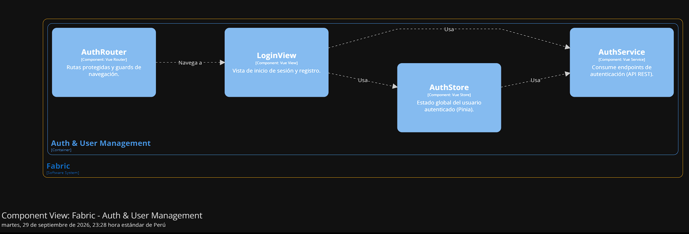

 
 

**Production Tracking**

Visualisamos los componentes internos del bounded context **seguimiento de producción**. Identificamos seis componentes: BatchListView, que muestra el listado de lotes con filtros y búsqueda; BatchDetailView, que presenta el detalle del lote y su historial de movimientos; BatchFormView, que permite crear y editar lotes; BatchStore, que gestiona el estado global de los lotes mediante Pinia; BatchService, que consume los endpoints REST de lotes; y MovementService, que registra las transiciones de etapas del lote. Este módulo permite a los supervisores de producción realizar un seguimiento ordenado y completo de cada lote, conocer su estado actual, identificar retrasos y mantener un historial organizado de toda la producción.

    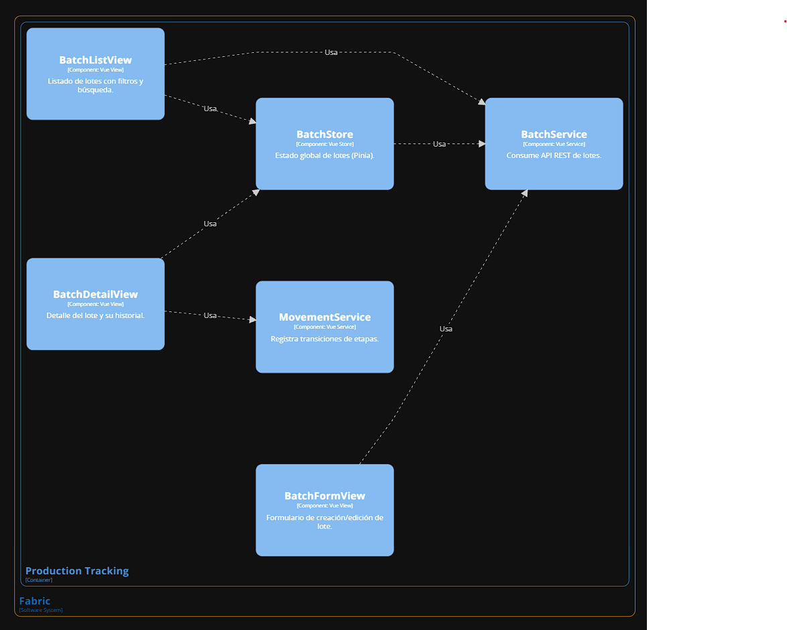

 
 

**Quality Management**

Este diagrama detalla los componentes internos del bounded context **control de calidad**. Se identifican cinco componentes: InspectionView, que permite registrar las inspecciones de los rollos de tela recibidos; DefectView, que permite registrar y clasificar los defectos encontrados en las prendas; QualityStore, que gestiona el estado global de la calidad mediante Pinia; QualityService, que consume los endpoints REST de inspecciones y defectos; y EvidenceUploader, que permite adjuntar evidencias fotográficas (JPG/PNG) a los defectos registrados. Este módulo permite a los encargados de calidad mantener un registro detallado y trazable de todas las inspecciones y defectos, asociándolos a lotes, etapas y máquinas específicas.

    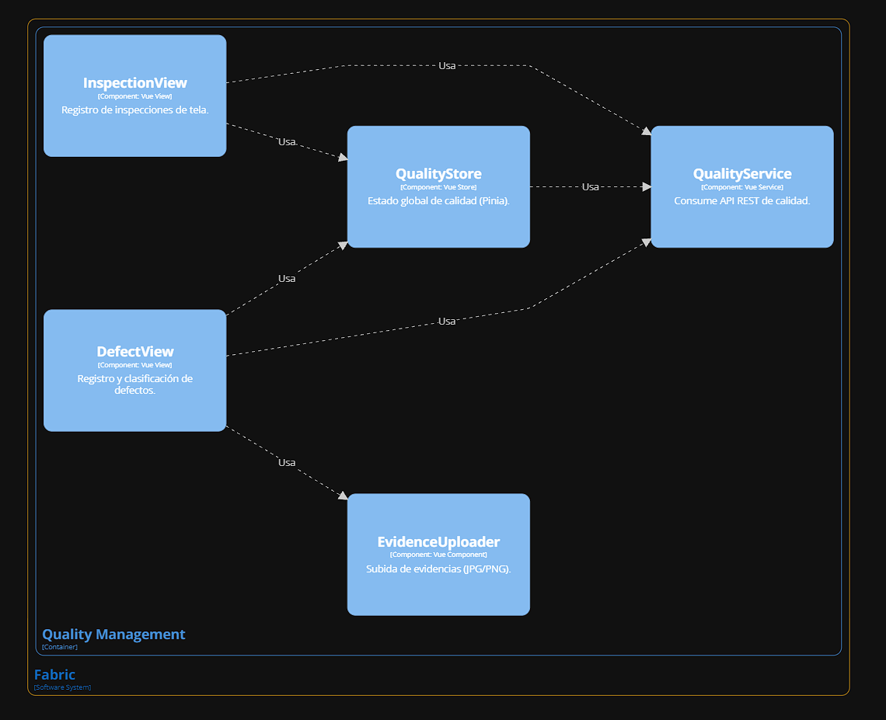

 
 

**Machine Registry**

Este diagrama detalla los componentes internos del bounded context **registro y monitoreo de máquinas**, implementado en Vue.js. Identificamos cuatro componentes: MachineListView, que muestra el listado de máquinas con su estado operativo; MachineDetailView, que presenta el detalle de una máquina, sus paradas y su historial de mantenimiento; MachineStore, que gestiona el estado global de las máquinas usando Pinia; y MachineService, que consume los endpoints REST de máquinas, paradas y mantenimientos. Este módulo permite a los supervisores de producción conocer el estado actual de las máquinas, identificar tiempos muertos acumulados y gestionar el mantenimiento preventivo de los equipos del taller.

    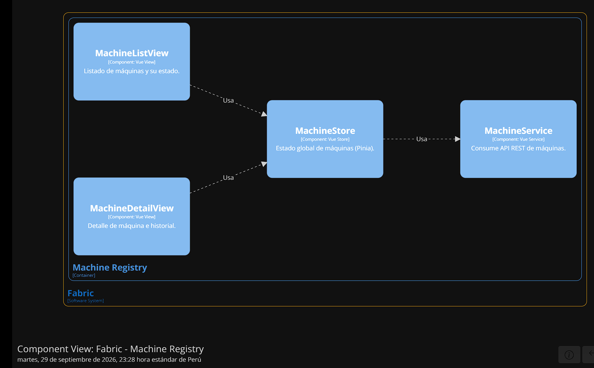

 
 

**Reporting and Analytics**

Este diagrama detalla los componentes internos del bounded context **reportes y analítica**. Se identifican cinco componentes: DashboardView, que muestra el panel principal con los KPIs de producción y calidad; ReportView, que permite generar y exportar reportes en PDF o Excel; ReportStore, que gestiona el estado global de los reportes mediante Pinia; ReportService, que consume los endpoints REST de reportes y métricas; y ChartComponent, que renderiza los gráficos de indicadores utilizando una librería como Chart.js. Este módulo permite a los dueños y administradores de las MYPE textiles visualizar el rendimiento de su negocio, identificar tendencias y tomar decisiones basadas en datos consolidados de producción, calidad y máquinas.

    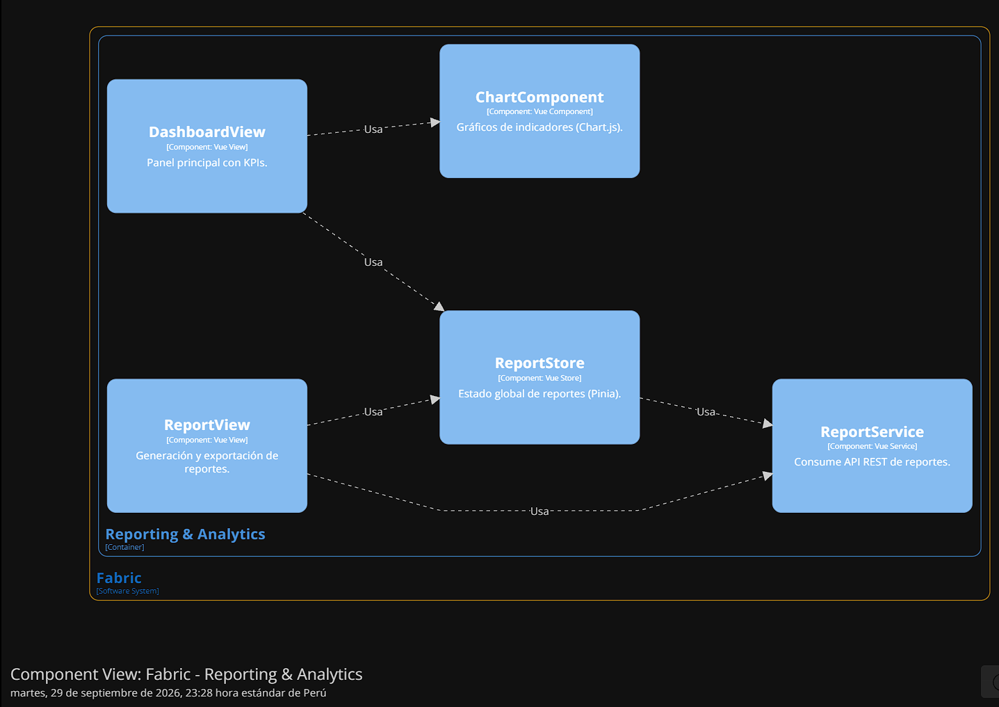

 
 

