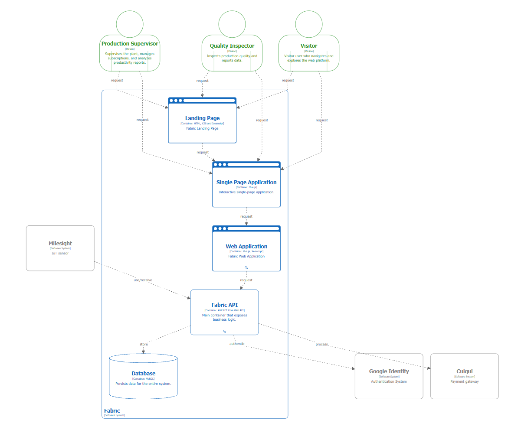
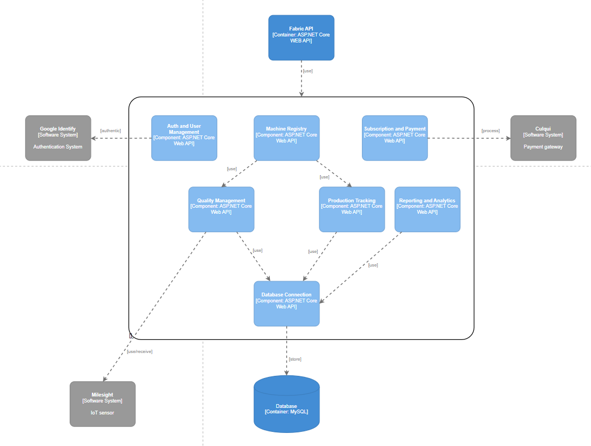

## 4.6. Domain-Driven Software Architecture

### 4.6.1. Design-Level Storming

Se muestra el Design-Level Event Storming de nuestra aplicación. En esta sección se profundizó a mayor detalle nuestro Big Picture Event Storming, enfocandonos en la arquitectura interna, componentes y resultados finales.

**Paso 1: Definition of Commands and Actors**

Identificamos las acciones específicas (Comandos) que disparan los procesos en cada sub-dominio y  a los actores (usuarios o sistemas) responsables de ejecutar dichas acciones.

**Paso 2: Policy Design and Inter-Context Orchestration**

Establecemos con paciencia las Policies para gestionar el comportamiento reactivo y la comunicación entre los Bounded Contexts.

**Paso 3: Aggregate Modeling and Business Logic Rules**

Introducimos los Agregados para definir las fronteras de consistencia, agrupando los comandos y eventos bajo entidades lógicas.

**Paso 4: Identification of External Systems, Read Models and Attribute Refinement**

Por último, integramos los sistemas externos que el actor necesita visualizar antes de ejecutar un comando, asegurando una interfaz informada, incorporamos los Read Models y desglosamos los atributos técnicos dentro de cada aggregate para descartar ambigüedades.

### 4.6.2. Software Architecture Context Diagrams

El diagrama de contexto presenta a Fabric como un sistema central que interactúa con dos actores humanos y tres sistemas externos. En este nivel podemos visualizar el alcance del sistema sin entrar en detalles de implementación, mostrando únicamente las relaciones de alto nivel entre el sistema y su entorno.

    

 

### 4.6.3. Software Architecture Container Diagram

Fabric está compuesto por un solo contenedor monolítico, el cual está conformado por: Landing Page (HTML, CSS y JavaScript) que presenta la propuesta de valor y capta leads; la Web Application (Vue.js) que muestra todas las funcionalidades, Fabric API que concentra la lógica de negocio organizada en seis bounded contexts (Auth, Production Tracking, Quality Management, Machine Registry, Subscription & Payment, Reporting & Analytics); y la Base de Datos. El sistema se integra con tres servicios externos: Culqi (pasarela de pagos peruana), Google Identify (notificaciones por correo) y un Sensor IoT Milesight (lecturas de temperatura y humedad vía MQTT). Los actores acceden al sistema mediante HTTPS, mientras que los módulos internos se comunican entre sí y persisten datos en la base de datos, dando soporte a los procesos de producción y control de calidad de las MYPE textiles.

    

 

### 4.6.4. Software Architecture Component Diagram

La arquitectura interna de Fabric, representada mediante el diagrama de componentes, está estructurada como un conjunto de módulos desarrollados en ASP.NET Core Web API, los cuales residen dentro del contenedor Fabric API y mantienen comunicación con distintos servicios y sistemas externos. En el centro de esta solución, los módulos principales Machine Registry, Quality Management, Production Tracking y Reporting and Analytics se encargan de coordinar la lógica del negocio, interactuando entre sí y apoyándose en un componente compartido de Database Connection que almacena la información en una base de datos MySQL. Por otro lado, el módulo Subscription and Payment establece conexión con la pasarela de pagos Culqui para gestionar las transacciones, mientras Auth and User Management administra la autenticación de los usuarios a través de Google Identify. Finalmente, con el propósito de capturar e integrar datos en tiempo real provenientes de la planta textil, el componente de gestión de calidad se comunica con los sensores IoT de Milesight, permitiendo el envío y la recepción de información operativa.

    

 
 

