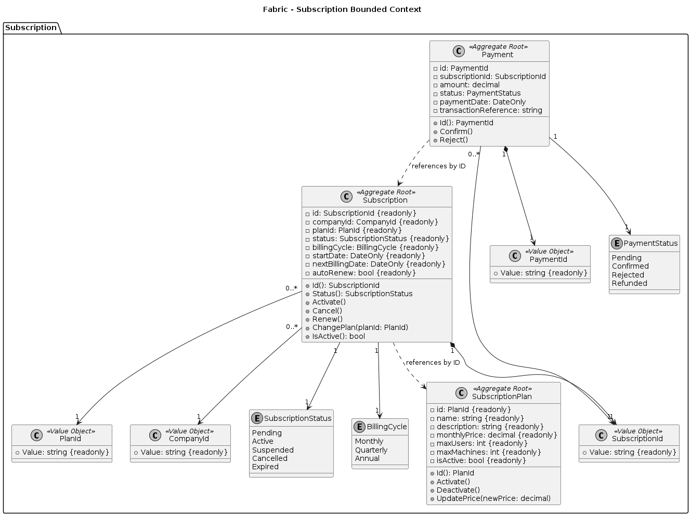
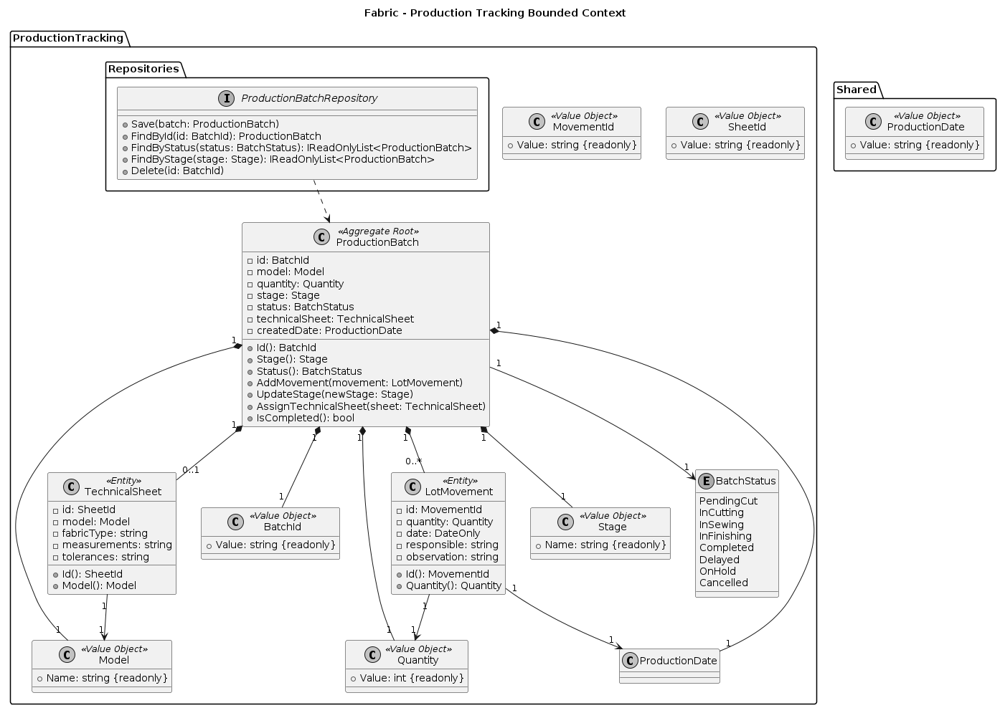
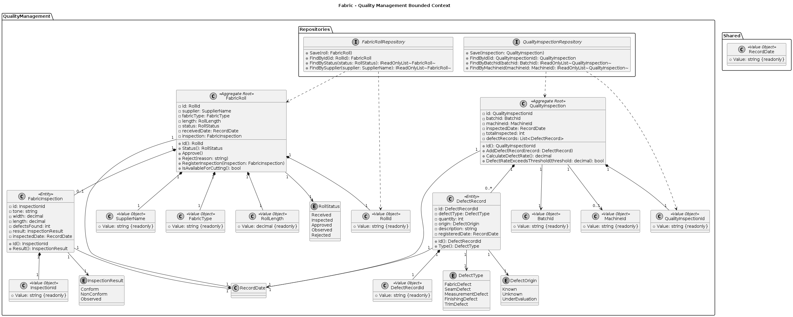
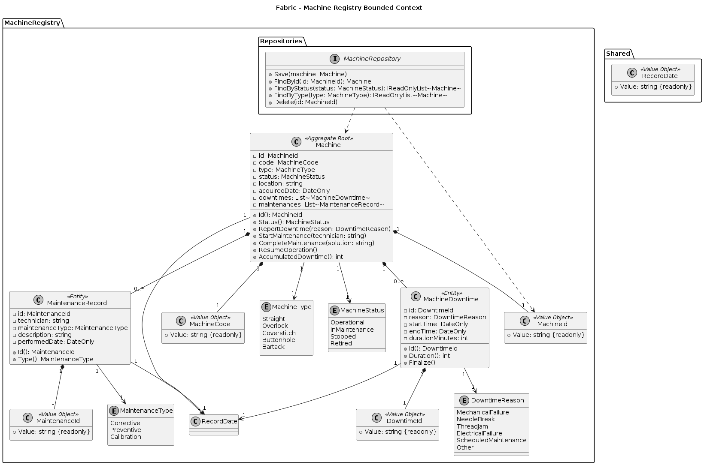
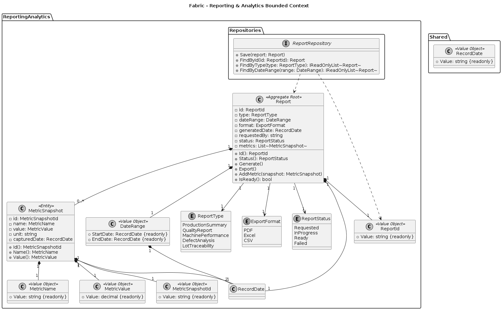

## 4.7. Software Object-Oriented design

### 4.7.1. Class Diagrams

### Subscription Plan Bounded Context

En este contexto se gestiona el modelo de negocio de Fabric: los planes de suscripción que las MYPE textiles contratan para usar la plataforma. Incluye la definición de planes, la suscripción activa de una empresa, los pagos asociados y el estado de facturación.

    

 

**Diccionario de Clases de Dominio**

**Aggregate Roots**
- **Subscription**: suscripción de una compañía a un plan. `id, companyId, planId, status, billingCycle, startDate, nextBillingDate, autoRenew` - `Activate(), Cancel(), Renew(), ChangePlan()`
- **SubscriptionPlan**: plan comercial disponible. `id, name, description, monthlyPrice, maxUsers, maxMachines, isActive` - `Activate(), Deactivate(), UpdatePrice()`
- **Payment**: pago asociado a una suscripción. `id, subscriptionId, amount, status, paymentDate, transactionReference` - `Confirm(), Reject()`

 **Value Objects**
- **SubscriptionId**, **PaymentId**: `Value: string {readonly}` - composición con su agregado dueño
- **PlanId**, **CompanyId**: `Value: string {readonly}` - referencias por ID entre agregados

 

### Production Tracking Bounded Context

En este contexto se controla el seguimiento de lotes de producción de prendas, desde su creación hasta su finalización.

    

 

 **Aggregate Root**
- **ProductionBatch**: lote de producción con su etapa y estado. `id, model, quantity, stage, status, technicalSheet, createdDate` - `Id(), Stage(), Status(), AddMovement(), UpdateStage(), AssignTechnicalSheet(), IsCompleted()`

**Entities**
- **LotMovement**: movimiento registrado sobre un lote. `id, quantity, date, responsible, observation` - `Id(), Quantity()`
- **TechnicalSheet**: ficha técnica asociada al modelo del lote. `id, model, fabricType, measurements, tolerances` - `Id(), Model()`

**Value Objects**
- **BatchId**, **MovementId**, **SheetId**: `Value: string {readonly}` - identificadores únicos
- **Model**, **Stage**: `Name: string {readonly}`
- **Quantity**: `Value: int {readonly}`
- **ProductionDate**: `Value: string {readonly}` - definido en el paquete `Shared`, compartido entre `ProductionBatch` y `LotMovement`

 

### Quality Management Bounded Context

En este contexto se gestiona la inspección de rollos de tela entrantes y la calidad de las prendas producidas, registrando defectos, clasificándolos y vinculándolos a lotes y máquinas. El objetivo es asegurar que tanto la materia prima como el producto final cumplan con los estándares definidos por el taller.

    

 

**Aggregate Roots**
- **FabricRoll**: rollo de tela recibido de un proveedor, con su estado de aprobación. `id, supplier, fabricType, length, status, receivedDate, inspection` — `Id(), Status(), Approve(), Reject(), RegisterInspection(), IsAvailableForCutting()`
- **QualityInspection**: inspección de calidad realizada sobre un lote/máquina, con sus defectos registrados. `id, batchId, machineId, inspectedDate, totalInspected, defectRecords` — `Id(), AddDefectRecord(), CalculateDefectRate(), DefectRateExceedsThreshold()`

**Entities**
- **FabricInspection**: inspección física del rollo de tela (tono, ancho, largo, defectos). `id, tone, width, length, defectsFound, result, inspectedDate` - `Id(), Result()`
- **DefectRecord**: registro individual de un defecto detectado. `id, defectType, quantity, origin, description, registeredDate` - `Id(), Type()`

**Value Objects**
- **RollId**, **InspectionId**, **QualityInspectionId**, **DefectRecordId**: `Value: string {readonly}` - identificadores propios
- **BatchId**, **MachineId**: `Value: string {readonly}` - referencias a agregados externos
- **SupplierName**, **FabricType**: `Value: string {readonly}`
- **RollLength**: `Value: decimal {readonly}`
- **RecordDate**: `Value: string {readonly}` - definido en `Shared`, compartido entre `FabricRoll`, `FabricInspection`, `QualityInspection` y `DefectRecord`

 

### Machine Registry Bounded Context

En este contexto se modela la lógica de negocio que permite a las MYPE textiles registrar y hacer seguimiento al estado operativo de sus máquinas de confección.

    

 

**Aggregate Root**
- **Machine**: máquina registrada, con su estado operativo, paradas y mantenimientos. `id, code, type, status, location, acquiredDate, downtimes, maintenances` - `Id(), Status(), ReportDowntime(), StartMaintenance(), CompleteMaintenance(), ResumeOperation(), AccumulatedDowntime()`

**Entities**
- **MachineDowntime**: registro de una parada de la máquina. `id, reason, startTime, endTime, durationMinutes` - `Id(), Duration(), Finalize()`
- **MaintenanceRecord**: registro de un mantenimiento realizado. `id, technician, maintenanceType, description, performedDate` - `Id(), Type()`

**Value Objects**
- **MachineId**, **DowntimeId**, **MaintenanceId**: `Value: string {readonly}` - identificadores propios
- **MachineCode**: `Value: string {readonly}`
- **RecordDate**: `Value: string {readonly}` - definido en `Shared` (Shared Kernel), compartido entre `Machine`, `MachineDowntime` y `MaintenanceRecord`

 

### Reporting & Analytics Bounded Context

En este contexto se modela la lógica de negocio que permite a las MYPE textiles generar reportes y análisis a partir de los datos de producción, calidad y máquinas.

    

 

**Aggregate Root**
- **Report**: reporte generado a partir de métricas del sistema. `id, type, dateRange, format, generatedDate, requestedBy, status, metrics` - `Id(), Status(), Generate(), Export(), AddMetric(), IsReady()`

**Entity**
- **MetricSnapshot**: captura puntual de una métrica dentro de un reporte. `id, name, value, unit, capturedDate` - `Id(), Name(), Value()`

**Value Objects**
- **ReportId**, **MetricSnapshotId**: `Value: string {readonly}` - identificadores propios
- **DateRange**: `StartDate: RecordDate {readonly}, EndDate: RecordDate {readonly}` - rango de fechas del reporte
- **MetricName**: `Value: string {readonly}`
- **MetricValue**: `Value: decimal {readonly}`
- **RecordDate**: `Value: string {readonly}` - definido en `Shared` (Shared Kernel), compartido entre `Report`, `MetricSnapshot` y `DateRange`

