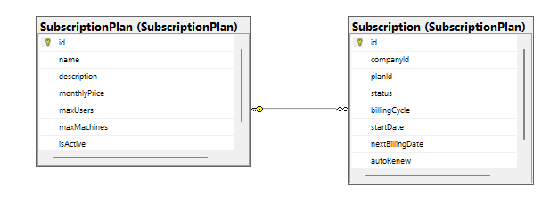
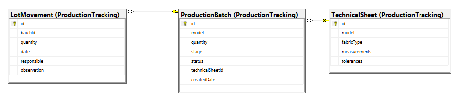
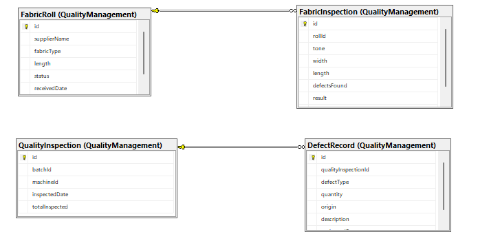

## 4.8. Database design
El diseño de la base de datos resulta fundamental para la construcción de Fabric, ya que establece la estructura necesaria para almacenar de manera consistente la información relacionada con las suscripciones, producción, calidad, maquinaria y generación de reportes de las MYPE textiles. Para ello, se definen las entidades persistentes, sus atributos, llaves primarias, llaves foráneas y restricciones de integridad, buscando mantener la consistencia y evitar redundancias en la información.

La persistencia se organiza de acuerdo con los Bounded Contexts definidos en el dominio de Fabric. Cada contexto mantiene las estructuras correspondientes a sus propias responsabilidades, mientras que las referencias hacia agregados pertenecientes a otros
contextos se manejan mediante sus identificadores. De esta manera, se mantiene el desacoplamiento entre los diferentes contextos y se facilita la evolución independiente de cada uno.

### 4.8.1. Database Diagrams

A continuación, se detalla el esquema relacional correspondiente a cada Bounded Context de Fabric. Se especifican las tablas principales, sus columnas, las restricciones aplicadas y las relaciones existentes entre ellas para garantizar la correcta persistencia de
la información.

#### 1. Bounded Context: Subscription Plan

Este diagrama define la persistencia de los planes comerciales disponibles para las MYPE textiles, así como las suscripciones realizadas por las compañías y los pagos asociados.

**Explicación del esquema:**

*   **Tablas:** `subscription_plan`, `subscription`, `payment`.
*   **Columnas principales:** `name`, `description`, `monthly_price`, `max_users` y `max_machines` en el plan; `company_id`, `plan_id`, `status`, `billing_cycle`, `start_date`, `next_billing_date` y `auto_renew` en la subscripción; `subscription_id`, `amount`, `status`, `payment_day` y `transaction_reference` en los pagos.
*   **Constraints o Relaciones:** Cada tabla posee su identificador `id` configurado como llave primaria (`PK`). La tabla `subscription` utiliza la llave foránea (`FK`) `plan_id` para relacionarse con `subscription_plan`, estableciendo que un plan puede estar asociado a múltiples suscripciones. Asimismo, `payment` utiliza `subscription_id` como llave foránea para relacionarse con la suscripción correspondiente, permitiendo registrar múltiples pagos para una misma suscripción. El atributo `company_id` representa la referencia hacia la compañía mediante su identificador, manteniendo la separación con otros contextos.

#### 2. Bounded Context: Production Tracking

Este diagrama estructura el almacenamiento necesario para realizar el seguimiento de los lotes de producción de prendas, incluyendo sus fichas técnicas y los movimientos registrados durante el proceso productivo.

**Explicación del esquema:**

*   **Tablas:** `production_batch`, `technical_sheet`, `lot_movement`, además de las estructuras correspondientes a los estados de los lotes.
*   **Columnas principales:** `id`, `model`, `quantity`, `stage`, `status`, `technical_sheet_id` y `created_date` en los lotes; `model`, `fabric_type`, `measurements` y `tolerances` en la ficha técnica; `batch_id`, `quantity`, `date`, `responsible` y `observation` en los movimientos.
*    **Constraints o Relaciones:** La tabla `production_batch` utiliza `id` como llave primaria (`PK`) y `technical_sheet_id` como llave foránea (`FK`) hacia `technical_sheet`. Esto permite asociar la información técnica correspondiente a un lote de producción. Asimismo, `lot_movement` utiliza `batch_id` como llave foránea para registrar los diferentes movimientos asociados a un lote. De esta manera, un `production_batch` puede contener múltiples registros de movimiento, manteniendo la trazabilidad del proceso productivo.

#### 3. Bounded Context: Quality Management

Este diagrama define la persistencia de la información relacionada con la recepción e inspección de rollos de tela, las inspecciones de calidad realizadas sobre la producción y los defectos identificados durante dichas inspecciones.

**Explicación del esquema:**

*   **Tablas:** `fabric_roll`, `fabric_inspection`, `quality_inspection` y `defect_record`, además de las estructuras correspondientes a los tipos, estados y resultados de inspección.
*   **Columnas principales:** `supplier`, `fabric_type`, `length`, `status`, `received_date` e `inspection` en los rollos; `tone`, `width`, `length`, `defects_found`, `result` e `inspected_date` en las inspecciones físicas; `batch_id`, `machine_id`, `inspected_date` y `total_inspected` en las inspecciones de calidad; `defect_type`, `quantity`, `origin`, `description` y `registered_date` en los registros de defectos.
*    **Constraints o Relaciones:** Cada agregado posee su identificador configurado como llave primaria (`PK`). La tabla `fabric_inspection` se relaciona con `fabric_roll` mediante `roll_id`, permitiendo registrar la inspección correspondiente a cada rollo. Por otro lado, `defect_record` utiliza `quality_inspection_id` como llave foránea (`FK`) para asociar cada defecto con la inspección en la que fue registrado. Los atributos `batch_id` y `machine_id` representan referencias mediante identificadores hacia agregados pertenecientes a otros Bounded Contexts, manteniendo el desacoplamiento entre los contextos.

