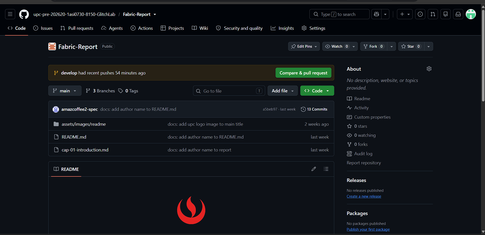
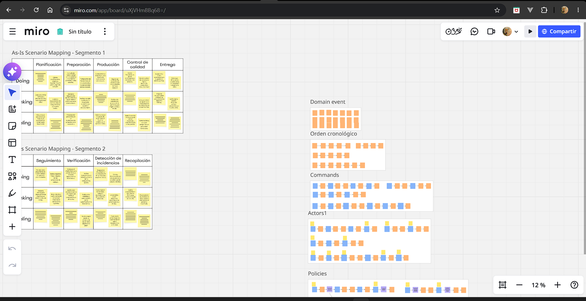
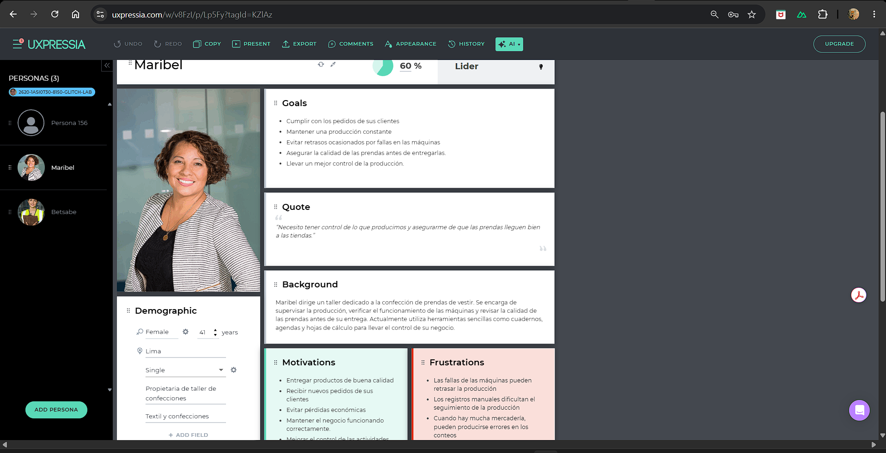
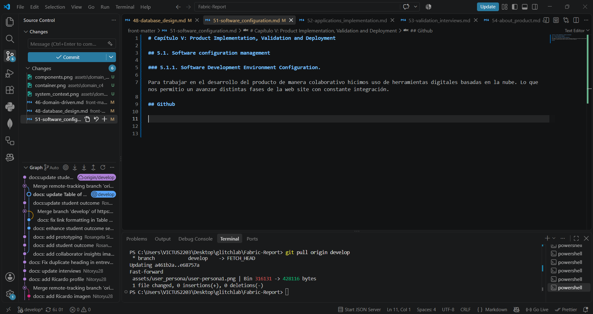
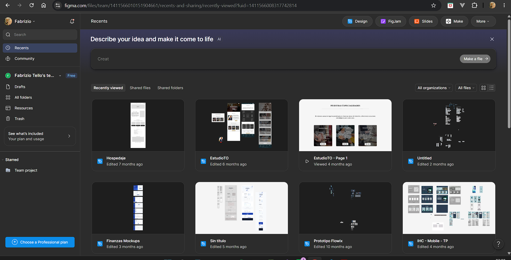
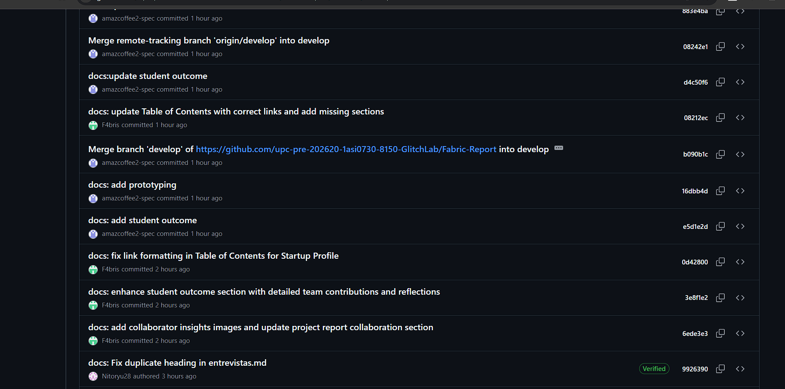
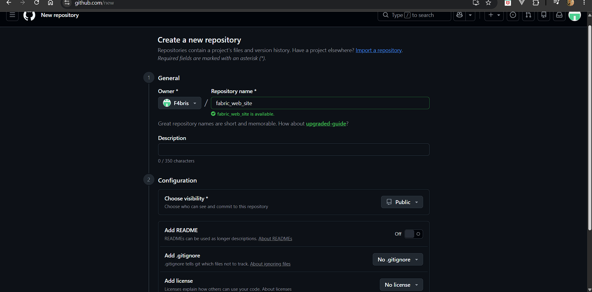
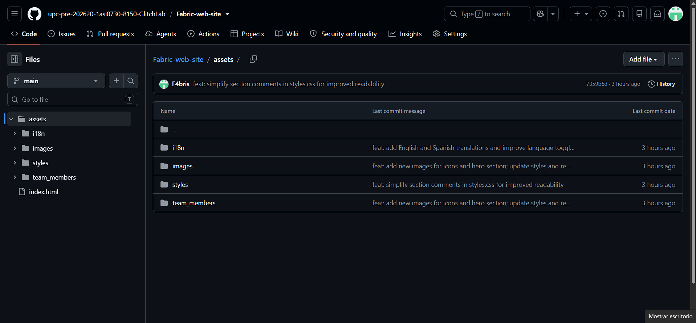
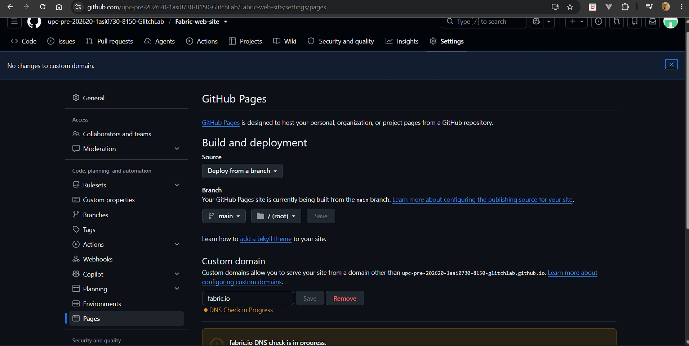

# Capítulo V: Product Implementation, Validation and Deployment

## 5.1. Software configuration management

### 5.1.1. Software Development Environment Configuration.

Para trabajar en el desarrollo del producto de manera colaborativo hicimos uso de herramientas digitales basadas en la nube. Lo que nos permitio un avanzar distintas fases de la web site con constante integración.

## Github

Usado para almacenar el desarrollo y almacenamiento de código fuente y el reporte, nos permite realizar trabajo colaborativo facilitando control de versiones e integración de distintas fases y funciones del desarrollo.

<div align="center">
    
</div>

<br>


## Miro

Espacio colaborativo usado para la organización de ideas, propuestas, definición de alcance del proyecto y brainstorming.

<div align="center">
    
</div>

<br>

## UXpressia

Entorno colaborativo usaso para los entregables UX, es una herramienta muy sencilla y completa para este tipo de gráficos.

<div align="center">
    
</div>

<br>


## VScode

Entorno de trabajo usado para ir avanzando e integrando distintas funciones o versiones de la app y del reporte. 

<div align="center">
    
</div>

<br>

## Figma

Entorno de trabajo usado para diseñar los mockups, wireframes y prototipo del producto final. 

<div align="center">
    
</div>

<br>

### 5.1.2. Source Code Management

El código fuente fue desarrollado y almacenado en github, el cuel nos permitió llevar el control de versiones y dar segumiento a cambios hechos durante el desarrollo.

Actualmente, nuestro proyecto tiene 2 repositorios principales:

- Repositorio del informe: https://github.com/upc-pre-202620-1asi0730-8150-GlitchLab/Fabric-Report

- Repositorio de la Landing Page: https://github.com/upc-pre-202620-1asi0730-8150-GlitchLab/Fabric-web-site

## Gitflow Workflow

Para mantener un desarrollo ordenado y un mejor control de flujo, utilizamos gitflow, para estructurar mejor el trabajo en equipo e integrar funciones organizadamente.

**Ramas usadas**

- main: es la versión realese del producto
- develop: es la versión de etapa temprana para el dearrollo.

**Convención de rama**

Se usó la siguiente convención para el nombramiento de ramas.

 - Future branch: feature/nombre-funcionalidad

ejemplo: feature/user-stories

Estas ramas permiten desarrollar funcionalidades de manera independiente sin afectar la estabilidad del proyecto.

**Semantic versioning**

El Semantic Versioning (SemVer) es un estándar para numerar versiones de software de forma clara y predecible. Se usa el formato MAJOR.MINOR.PATCH, donde cada número tiene un significado específico:

- MAJOR → se incrementa cuando se hacen cambios incompatibles con versiones anteriores.

- MINOR → se incrementa cuando se agrega una funcionalidad nueva de forma compatible.

- PATCH → se incrementa cuando se hacen correcciones de errores compatibles.

<br>

**Conventional Commits**

Los Conventional Commits son una convención para escribir mensajes de commit de forma clara y estructurada. Sirven para que el historial del repositorio sea legible, automatizable y fácil de entender por cualquier miembro del equipo.

Los tipos de commits son:

- feat: nuevas funcionalidades
- docs: cambios en documentación
- fix: corrección de errores
- chore: tareas menores o mantenimiento


A continuación una imagen que muestra algunos ejemplos de conventional commits.


<div align="center">
    
</div>

<br>

### 5.1.3. Source Code Style Guide and Conventions

Para mantener la consistencia y legbilidad del proyecto, definimo un estandar de tecnologias a usar para desarrollar la landing page. 

Esta elección de tecnologías nos permite mantener un código consistente, ordenado y comprensible para todos los miembros del equipo.

### HTML

Para la estructura del documento HTML se establecieron las siguientes convenciones:

- Uso de `button` para acciones y `a` solo para navegación.
- Uso de kebab-case para nombres de clases y IDs (`lot-card`, `no lotCard ni lot_card`).
- Estructura semántica: `header`, `nav`, `main`, `section`, `article`, `footer`.
- Los atributos `data-*` se usan solo para JavaScript (por ejemplo, `data-i18n`, `data-lang`). 
- Inclusión de atributos `alt`en imágenes para mejorar la accesibilidad.

```html
<section>
  <h1>Informacion textil</h1>
  <p>Trazabilidad de produccion</p>
</section>
```
<br>

### CSS

Para los estilos se definieron las siguientes convenciones:

- Los nombres de clases son descriptivos y en inglés (`quality-card`, `no tarjeta`).
- Uso de kebab-case para nombres de clases.
- Los selectores no superan las 3 palabras (`.card__title`, no `.main` `.section` `.card` `.title`).
- Las media queries van al final del archivo, agrupadas por breakpoint.
- Los valores de espaciado siguen una escala definida (4, 8, 16, 24, 32, 48, 64 px).

ejemplo: 

```
.card {
  background: #FFFFFF;
  border-radius: var(--radius);
  padding: var(--space-md);
  box-shadow: var(--shadow-sm);
}
```
<br>

### Javascript

Para la lógica de la landing page y la web application se establecieron las siguientes convenciones:

- Uso de `const` por defecto; `let` solo cuando el valor cambia; `var` nunca.
- Uso de UPPER_SNAKE_CASE para constantes globales (`MAX_RETRIES`, `API_BASE_URL`).
- Uso de dataset para leer atributos `data-*` (`element`.`dataset.i18n`).
- Los nombres de archivos van en kebab-case (`lot-service.js`, `no LotService.js`).

ejemplo:

```
  document.addEventListener('DOMContentLoaded', () => {
  const menuBtn = document.getElementById('mobile-menu-btn');
  const mobileMenu = document.getElementById('mobile-menu');
```
### 5.1.4. Software Deployment Configuration

A continuación, especificaremos la configuración y los pasos necesarios que seguimos para el despliegue de la landing page. 

## Despliegue de Landing Page

1. Dentro de la organización de GlitchLab, se creó un repositorio público para la Landing Page. 

<div align="center">
    
</div>

<br>

2. Publicamos el código de la Landing Page en el repositorio, posteriormente se hizo un release a main para luego ser desplegado. 

<div align="center">
    
</div>

<br>

3. Hosting: Se publica la Landing Page a través de github pages. 

<div align="center">
    
</div>

<br>