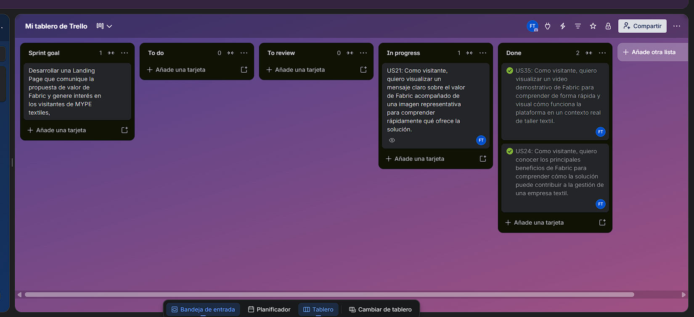

## 5.2. Landing Page, Services & Applications Implementation

### 5.2.1. Sprint 1

Para este primer sprint, nos enfocamos en organizar los requsiitos funcionales de la Landing Page. Con el fin de poder asignar a cada miembro del equipo de a 1 a 3 requisitos funcionales para el desarrollo de la landing page.

#### 5.2.1.1. Sprint Planning 1

Durante esta iteración, la reunión de Sprint Planning nos sirve para revisar la velocidad alcanzada en el sprint anterior y establecer los objetivos técnicos de esta nueva etapa. En este espacio, el equipo prioriza las historias de usuario del backlog, calcula el esfuerzo requerido y distribuye las tareas entre los integrantes. La meta es conservar la coordinación del equipo y asegurar que las nuevas funcionalidades se integren sin contratiempos, dejando definido un plan de trabajo claro para el sprint.

| Campo / Sección | Detalle |
| :--- | :--- |
| Sprint # | Sprint 1 |
| Date | 2026-09-11 |
| Time | 7:30 PM |
| Location | Google meet |
| Prepared By | Tello Palacios, Fabrizio Rafael |
| Attendees (to planning meeting) | Silva Hualpa, Rosángela Karen / Flores Martinez, Ricardo Andres / Estupiñan Olortegui, Juan Sebastián / Reátegui Galarcep, Diego Sebastián / Tello Palacios, Fabrizio Rafael |
| Sprint 1  Review Summary | Como se trata del primer sprint del proyecto, no se cuenta con una revisión de una iteración previa. El equipo arrancó a partir de la aprobación del Product Backlog inicial, centrándose en las Historias de Usuario de mayor prioridad, vinculadas al registro de empresas (Enterprise), la configuración de planes y los aspectos de seguridad. |
| Sprint 1  Retrospective Summary | Al tratarse también del arranque del proyecto, se definieron las pautas de trabajo del equipo: reuniones de seguimiento diarias (Daily Stand-ups) a través de Meet, el uso de herramientas ágiles para el control de tareas, y la importancia de mantener una comunicación constante para evitar bloqueos técnicos durante el desarrollo del backend. |
| Sprint 1 Goal |Nuestro objetivo es dar a conocer la propuesta de valor de la plataforma a quienes visitan la Landing Page. Consideramos que esto dará como resultado una Landing Page atractiva, con información real que capte el interés de los visitantes. Sabremos que lo logramos cuando los visitantes exploren la Landing Page y muestren interés en suscribirse haciendo clic en el botón de Acceso al Dashboard, incluso si este aún no es funcional. |
| Sprint 1 Velocity | El equipo ha establecido un Velocity de 30 Story Points, que representa la capacidad máxima de esfuerzo que los developers pueden aceptar de manera realista para este Sprint 1. |
| Sum of Story Points | 27 |

 

#### 5.2.1.2. Aspect Leaders and Collaborators

En esta sección el equipo presenta el artefacto Leadership-and-Collaboration Matrix (LACX) correspondiente al Sprint 1 de Fabric. El objetivo de esta matriz es identificar, para cada aspecto dentro del alcance del Sprint, quién actúa como líder y quiénes como colaboradores, con el fin de brindar mayor claridad y efectividad en la comunicación interna del equipo.

| Team Member (Last Name, First Name) | GitHub Username | UX/UI Design | Landing Page | Documentation | Modeling |
|------------------------------------|----------------|-------------|-------------|--------------|----------|
| Tello Palacios, Fabrizio Rafael | F4bris | C | L | L | L |
| Flores Martinez, Ricardo Andres | Nitoryu28 | C | C | C | C |
| Estupiñan Olortegui, Juan Sebastián	 | JuanSEstupinan | C | L | C | C |
| Reátegui Galarcep, Diego Sebastián | Diego201101 | L | C | C | C |
| Silva Hualpa, Rosangela Karen | amazcofee2-spec | L | C | C | C |

#### 5.2.1.3. Sprint Backlog 1

Nuestro objetivo para este primer sprint fue el desarrollar la Landing Page para Fabric, nuestra intención es comunicar a los visitantes nuestra propuesta de valor de manera simple y precisa. 

Durante este sprint, se trabajaron las funciones mas escenciales para cumplir con el propósito de landing page.

    

