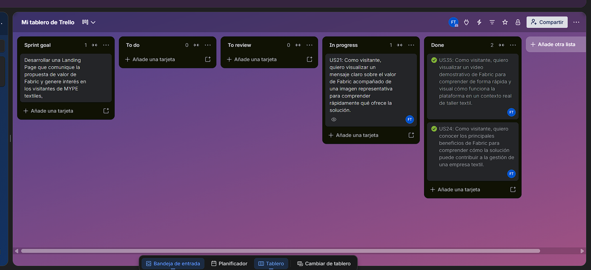

## 5.2. Landing Page, Services & Applications Implementation

### 5.2.1. Sprint 1

Para este primer sprint, nos enfocamos en organizar los requsiitos funcionales de la Landing Page. Con el fin de poder asignar a cada miembro del equipo de a 1 a 3 requisitos funcionales para el desarrollo de la landing page.

#### 5.2.1.1. Sprint Planning 1

Durante esta iteración, la reunión de Sprint Planning nos sirve para revisar la velocidad alcanzada en el sprint anterior y establecer los objetivos técnicos de esta nueva etapa. En este espacio, el equipo prioriza las historias de usuario del backlog, calcula el esfuerzo requerido y distribuye las tareas entre los integrantes. La meta es conservar la coordinación del equipo y asegurar que las nuevas funcionalidades se integren sin contratiempos, dejando definido un plan de trabajo claro para el sprint.

| Campo / Sección | Detalle |
| :--- | :--- |
| Sprint # | Sprint 1 |
| Date | 2026-09-11 |
| Time | 7:30 PM |
| Location | Google meet |
| Prepared By | Tello Palacios, Fabrizio Rafael |
| Attendees (to planning meeting) | Silva Hualpa, Rosángela Karen / Flores Martinez, Ricardo Andres / Estupiñan Olortegui, Juan Sebastián / Reátegui Galarcep, Diego Sebastián / Tello Palacios, Fabrizio Rafael |
| Sprint 1  Review Summary | Como se trata del primer sprint del proyecto, no se cuenta con una revisión de una iteración previa. El equipo arrancó a partir de la aprobación del Product Backlog inicial, centrándose en las Historias de Usuario de mayor prioridad, vinculadas al registro de empresas (Enterprise), la configuración de planes y los aspectos de seguridad. |
| Sprint 1  Retrospective Summary | Al tratarse también del arranque del proyecto, se definieron las pautas de trabajo del equipo: reuniones de seguimiento diarias (Daily Stand-ups) a través de Meet, el uso de herramientas ágiles para el control de tareas, y la importancia de mantener una comunicación constante para evitar bloqueos técnicos durante el desarrollo del backend. |
| Sprint 1 Goal |Nuestro objetivo es dar a conocer la propuesta de valor de la plataforma a quienes visitan la Landing Page. Consideramos que esto dará como resultado una Landing Page atractiva, con información real que capte el interés de los visitantes. Sabremos que lo logramos cuando los visitantes exploren la Landing Page y muestren interés en suscribirse haciendo clic en el botón de Acceso al Dashboard, incluso si este aún no es funcional. |
| Sprint 1 Velocity | El equipo ha establecido un Velocity de 30 Story Points, que representa la capacidad máxima de esfuerzo que los developers pueden aceptar de manera realista para este Sprint 1. |
| Sum of Story Points | 27 |

 

#### 5.2.1.2. Aspect Leaders and Collaborators

En esta sección el equipo presenta el artefacto Leadership-and-Collaboration Matrix (LACX) correspondiente al Sprint 1 de Fabric. El objetivo de esta matriz es identificar, para cada aspecto dentro del alcance del Sprint, quién actúa como líder y quiénes como colaboradores, con el fin de brindar mayor claridad y efectividad en la comunicación interna del equipo.

| Team Member (Last Name, First Name) | GitHub Username | UX/UI Design | Landing Page | Documentation | Modeling |
|------------------------------------|----------------|-------------|-------------|--------------|----------|
| Tello Palacios, Fabrizio Rafael | F4bris | C | L | L | L |
| Flores Martinez, Ricardo Andres | Nitoryu28 | C | C | C | C |
| Estupiñan Olortegui, Juan Sebastián	 | JuanSEstupinan | C | L | C | C |
| Reátegui Galarcep, Diego Sebastián | Diego201101 | L | C | C | C |
| Silva Hualpa, Rosangela Karen | amazcofee2-spec | L | C | C | C |

#### 5.2.1.3. Sprint Backlog 1

Nuestro objetivo para este primer sprint fue el desarrollar la Landing Page para Fabric, nuestra intención es comunicar a los visitantes nuestra propuesta de valor de manera simple y precisa. 

Durante este sprint, se trabajaron las funciones mas escenciales para cumplir con el propósito de landing page.

    

#### 5.2.1.1. Sprint Planning 2

Durante la sesión de planificación del Sprint 2, el equipo evaluó los resultados y lecciones aprendidas de la entrega inicial para dimensionar adecuadamente la capacidad de trabajo y abordar la implementación de la lógica de negocio y persistencia de datos. Se desglosaron y estimaron las User Stories de mayor valor técnico y funcional según el Product Backlog.

| Campo / Sección | Detalle |
| :--- | :--- |
| Sprint # | Sprint 2 |
| Date | 2026-09-28 |
| Time | 8:00 PM |
| Location | Discord |
| Prepared By | Tello Palacios, Fabrizio Rafael |
| Attendees (to planning meeting) | Silva Hualpa, Rosángela Karen / Flores Martinez, Ricardo Andres / Estupiñan Olortegui, Juan Sebastián / Reátegui Galarcep, Diego Sebastián / Tello Palacios, Fabrizio Rafael |
| Sprint 1  Review Summary | Durante el Sprint 1 se concluyó con éxito el diseño, desarrollo y despliegue continuo de la Landing Page pública de Fabric en GitHub Pages, implementando arquitectura i18n, diseño responsive y componentes visuales basados en la style guidelines. El Product Owner validó la presentación de la propuesta de valor dirigida a las MYPE textiles. Se completaron 27 Story Points de los 30 planificados; las observaciones menores sobre ajuste de padding en pantallas ultra-anchas fueron solventadas en la rama develop. |
| Sprint 1  Retrospective Summary | En el Sprint 1 se identificó como acierto la rápida coordinación del prototipo en Figma y el uso de Gitflow y Commits. Como oportunidades de mejora clave, se detectó que la integración de ramas feature a develop se concentró hacia el final de la iteración, generando cuellos de botella al resolver merge conflicts. Para el Sprint 2 se acordó desglosar tareas técnicas más granulares, implementar pull requests con revisión de código obligatoria entre pares y realizar reuniones de sincronización interdiarias para destrabar dependencias de backend/frontend. |
| Sprint 1 Goal | Implementar la arquitectura base y el núcleo funcional de la aplicación web de Fabric, cubriendo la autenticación segura por roles, Production Batch Tracking, Quality Inspection y el registro operativo de máquinas. La métrica de cumplimiento es lograr el 100% de los endpoints REST documentados y probados, la persistencia relacional configurada sin fallas y los flujos de interfaz web conectados permitiendo crear un lote de producción y registrar una inspección de tela sin errores. |
| Sprint 1 Velocity | 32 |
| Sum of Story Points | 32 |

 

#### 5.2.1.2. Aspect Leaders and Collaborators

A continuación se presenta la matriz Leadership-and-Collaboration Matrix (LACX) para el Sprint 2 de Fabric. En esta iteración de desarrollo de software, se definieron cinco aspectos clave del proyecto, asignando un rol de Liderazgo y Colaboración a cada miembro del equipo para asegurar la trazabilidad y la responsabilidad:

| Team Member (Last Name, First Name) | GitHub Username | Backend & REST API (Spring Boot / DDD) | Frontend Web App (UI / Components) | Database & Persistence (SQL / Migrations) | Testing & Software Quality |
|------------------------------------|----------------|-------------|-------------|--------------|----------|
| Tello Palacios, Fabrizio Rafael | F4bris | C | L | C | C |
| Flores Martinez, Ricardo Andres | Nitoryu28 | L | C | C | C |
| Estupiñan Olortegui, Juan Sebastián	 | JuanSEstupinan | C | C | L | C |
| Reátegui Galarcep, Diego Sebastián | Diego201101 | C | C | C | L |
| Silva Hualpa, Rosangela Karen | amazcofee2-spec | C | C | C | C |

#### 5.2.1.3. Sprint Backlog 2

Para el Sprint 2 se seleccionaron 11 User Stories prioritarias del Product Backlog, totalizando 32 Story Points, las cuales fueron desglosadas en tareas de ingeniería de software con estimación en horas, responsable asignado y estado: 

| Sprint # | Sprint 2 | | | | | | |
| :--- | :--- | :--- | :--- | :--- | :---: | :--- | :---: |
| **User Story** | | **Work-Item / Task** | | | | | |
| **Story Id** | **Story Title** | **Task Id** | **Task Title** | **Task Description** | **Estimation (Hours)** | **Assigned To** | **Status** |
| US037 | Registro de nuevo usuario en la aplicación | T-01 | Modelado de entidad User y tabla `usuarios` | Crear la entidad JPA `User`, Value Objects y tabla relacional `usuarios` con hash BCrypt y roles (`Supervisor`, `Calidad`, `Admin`). | 4 | Reátegui Galarcep, Diego Sebastián | Done |
| | | T-02 | Endpoint de registro de usuarios | Implementar `POST /api/v1/auth/register` en `AuthController` con validaciones de email único y fortaleza de contraseña. | 5 | Estupiñan Olortegui, Juan Sebastian | Done |
| | | T-03 | Pantalla de registro de usuario | Desarrollar vista de registro en frontend con validación reactiva de formularios y feedback visual de errores. | 5 | Tello Palacios, Fabrizio Rafael | Done |
| | | T-04 | Pruebas de integración de registro | Diseñar pruebas de integración para validar el registro exitoso, rechazo por correo duplicado y contraseña débil. | 3 | Flores Martinez, Ricardo Andres | Done |
| US038 | Inicio de sesión de usuario registrado | T-05 | Implementación de seguridad y JWT | Configurar Spring Security, `JwtTokenProvider` y filtro de autenticación para generar token en `POST /api/v1/auth/login`. | 6 | Estupiñan Olortegui, Juan Sebastian | Done |
| | | T-06 | Vista de Login y sesión frontend | Construir la vista de Login conectada al servicio de autenticación y almacenar el token en el cliente de forma segura. | 4 | Tello Palacios, Fabrizio Rafael | Done |
| | | T-07 | Validación de intentos fallidos | Implementar control en backend y UI para bloquear temporalmente el acceso tras 5 intentos fallidos consecutivos. | 3 | Flores Martinez, Ricardo Andres | Done |
| US039 | Cierre de sesión de usuario autenticado | T-08 | Mecanismo de Logout | Crear lógica de invalidación y limpieza de token en el almacenamiento local del cliente y control en backend. | 2 | Silva Hualpa, Rosangela Karen | Done |
| | | T-09 | Protección de rutas (Route Guards) | Configurar guardias de navegación en frontend para impedir el acceso a vistas del sistema sin un token activo. | 2 | Tello Palacios, Fabrizio Rafael | Done |
| US043 | Actualización de datos del perfil del usuario | T-10 | Endpoint de perfil de usuario | Implementar `PUT /api/v1/users/{id}` para actualizar nombre y teléfono, restringiendo la edición de roles a usuarios no admin. | 3 | Estupiñan Olortegui, Juan Sebastian | Done |
| | | T-11 | Formulario de perfil de usuario | Maquetar pantalla de perfil en frontend con precarga de datos actuales y validación de formato numérico de teléfono. | 3 | Tello Palacios, Fabrizio Rafael | Done |
| | | T-12 | Pruebas de permisos de perfil | Ejecutar pruebas unitarias para asegurar que usuarios regulares no puedan autoasignarse rol de administrador. | 2 | Flores Martinez, Ricardo Andres | Done |
| US001 | Creación y asignación de ID a lote de producción | T-13 | Agregado `ProductionBatch` en DDD | Modelar en Java el Aggregate Root `ProductionBatch` con Value Objects `BatchId`, `Model`, `Quantity` y estado `PendingCut`. | 6 | Estupiñan Olortegui, Juan Sebastian | Done |
| | | T-14 | Persistencia de `lotes_produccion` | Crear migración de base de datos para la tabla `lotes_produccion` y función de generación de ID único con prefijo anual. | 4 | Reátegui Galarcep, Diego Sebastián | Done |
| | | T-15 | Endpoint `POST /api/v1/batches` | Implementar `BatchController` y servicio para persistir nuevos lotes validando campos requeridos (modelo, cantidad, entrega). | 5 | Estupiñan Olortegui, Juan Sebastian | Done |
| | | T-16 | Interfaz de creación de lote | Construir formulario modal para crear lotes de confección con selección de fechas e ingreso de modelo de prenda. | 6 | Tello Palacios, Fabrizio Rafael | Done |
| | | T-17 | Pruebas de validación de lote | Realizar tests de integración verificando rechazo ante campos incompletos y generación correcta del ID de lote. | 3 | Flores Martinez, Ricardo Andres | Done |
| US002 | Actualización y transición de etapas operativas del lote | T-18 | Lógica de transiciones y `LotMovement` | Implementar entidad `LotMovement` y reglas de cambio de etapa (`Corte`, `Confección`, `Acabado`, `Completado`). | 6 | Estupiñan Olortegui, Juan Sebastian | Done |
| | | T-19 | Endpoint `PUT /api/v1/batches/{id}/stage` | Exponer endpoint para registrar transiciones verificando que la cantidad procesada no supere a la de la etapa previa. | 5 | Estupiñan Olortegui, Juan Sebastian | Done |
| | | T-20 | Componente visual de transición de etapas | Desarrollar stepper interactivo con badges de estado que reflejen el avance operativo del lote en planta. | 5 | Tello Palacios, Fabrizio Rafael | Done |
| | | T-21 | Pruebas de consistencia de cantidades | Validar mediante pruebas automatizadas que el sistema bloquee transiciones con exceso de prendas respecto al paso previo. | 3 | Flores Martinez, Ricardo Andres | Done |
| US040 | Asignación de operarios a lotes de producción | T-22 | Tabla `asignaciones_operario_lote` | Diseñar la estructura de base de datos para la relación de operarios y lotes, vinculando ID de lote, operario y etapa. | 3 | Reátegui Galarcep, Diego Sebastián | Done |
| | | T-23 | Endpoint de asignación de operarios | Crear `POST /api/v1/batches/{id}/operators` validando que un operario no sea duplicado en la misma etapa del lote. | 3 | Estupiñan Olortegui, Juan Sebastian | Done |
| | | T-24 | Modal de asignación de personal | Desarrollar selector de operarios en la vista de detalle de lote permitiendo asignar personal por etapa de costura. | 3 | Tello Palacios, Fabrizio Rafael | Done |
| US003 | Registro e inspección inicial de rollos de tela entrantes | T-25 | Agregado `FabricRoll` y persistencia | Implementar Aggregate Root `FabricRoll` y tabla `rollos_tela` con campos de metraje, proveedor, tono y estado inicial. | 4 | Reátegui Galarcep, Diego Sebastián | Done |
| | | T-26 | Endpoint de recepción de tela | Implementar `POST /api/v1/fabric-rolls` permitiendo calificar el rollo como "Disponible para Corte" u "Observado". | 4 | Estupiñan Olortegui, Juan Sebastian | Done |
| | | T-27 | Pantalla de inspección de tela | Diseñar vista de control de calidad de tela entrante con formulario para registrar metros, proveedor y observaciones. | 4 | Tello Palacios, Fabrizio Rafael | Done |
| | | T-28 | Verificación de bloqueo de rollo | Probar que los rollos marcados como observados queden bloqueados e inaccesibles para el proceso de corte. | 2 | Flores Martinez, Ricardo Andres | Done |
| US004 | Registro de prueba de encogimiento y lavado de muestra de tela | T-29 | Cálculo de encogimiento en backend | Implementar regla de negocio de encogimiento: marcar conforme si variación ≤ 5% y "No Conforme" si supera el umbral. | 3 | Estupiñan Olortegui, Juan Sebastian | Done |
| | | T-30 | Endpoint `POST /api/v1/fabric-rolls/{id}/shrinkage` | Crear servicio para almacenar dimensiones antes y después del lavado de la probeta textil asociadas al rollo. | 3 | Silva Hualpa, Rosangela Karen | Done |
| | | T-31 | Formulario de prueba de lavado | Crear interfaz interactiva con cálculo automático del porcentaje de variación de urdimbre y trama en tiempo real. | 3 | Tello Palacios, Fabrizio Rafael | Done |
| US007 | Reporte de averías e interrupción operativa de máquinas de confección | T-32 | Agregado `Machine` y tabla `maquinas` | Modelar entidad `Machine` y tabla `eventos_maquinas` con tipos (recta, remalladora, recubridora) y estado operativo. | 3 | Reátegui Galarcep, Diego Sebastián | Done |
| | | T-33 | Endpoint de reporte de avería | Crear `POST /api/v1/machines/{id}/downtimes` que cambia el estado a "En Mantenimiento" e inicia el tiempo muerto. | 4 | Estupiñan Olortegui, Juan Sebastian | Done |
| | | T-34 | Botón y modal de reporte de paro | Diseñar componente en frontend para reportar paradas mecánicas seleccionando tipo de falla (aguja, motor, tensión). | 3 | Tello Palacios, Fabrizio Rafael | Done |
| US008 | Reanudación de operatividad y registro del tiempo muerto de máquina | T-35 | Lógica de cierre de tiempo muerto | Implementar método `ResumeOperation()` en el modelo de dominio para calcular duración exacta en minutos del paro técnico. | 4 | Estupiñan Olortegui, Juan Sebastian | Done |
| | | TSK-036 | Endpoint `PUT /api/v1/machines/{id}/resume` | Exponer endpoint para registrar solución técnica aplicada, repuestos y cambiar estado de máquina a "Operativa". | 3 | Silva Hualpa, Rosangela Karen | Done |
| | | T-37 | UI de reanudación y tiempo acumulado | Desarrollar modal de fin de intervención y tarjeta de visualización de minutos inactivos acumulados por máquina. | 3 | Tello Palacios, Fabrizio Rafael | Done |
| | | T-38 | Pruebas de cálculo de tiempo muerto | Ejecutar pruebas unitarias que garanticen el cálculo exacto de tiempos muertos entre fecha de inicio y fin de avería. | 3 | Flores Martinez, Ricardo Andres | Done |
