

</img>

# Universidad Peruana de Ciencias Aplicadas

**Facultad:** Ingeniería

**Ingeniería de Software**

**Ciclo:** 2026-2

1ASI0730 - Aplicaciones Web

**NRC:** 8150

**Profesor:** Velasquez Nuñez, Angel Augusto

### Informe de trabajo final

**Nombre del Startup:** GlitchLab

**Nombre del producto:** Fabric

#### Relación de integrantes

| Integrante                          | Código     |
|-------------------------------------|------------|
| Tello Palacios, Fabrizio Rafael     | U202113310 |
| Flores Martinez, Ricardo Andres     | U202423162 
| Reátegui Galarcep, Diego Sebastián  | U20201F165 |
| Estupiñan Olortegui, Juan Sebastian | U202223405 |
| Silva Hualpa, Rosangela Karen       | U20241B885 |

**Mes y año:** Setiembre 2026

 

# **Registro de Versiones del Informe**

| **Versión** | **Fecha** | **Autor**  |   **Descripción**  |
| ----------- | --------- |----------- |--------------------|
| AV1 | 10/09/2026        12/09/2026| Tello Palacios, Fabrizio Rafael     Flores Martinez, Ricardo Andres , Rafael     Estupiñan Olortegui, Juan Sebastian |  Creacion de estructura de informe en github         Correcion de estructura del informe. |

 

# **Project Report Collaborations Insights**

Nuestro proyecto fue hecho en el repositorio "Fabric-report" dentro de la organización "upc-pre-202620-1asi0730-8150-GlitchLab".

**Enlaze de la organización en GitHub:** https://github.com/upc-pre-202620-1asi0730-8150-GlitchLab

**Enlaze del repositorio:** https://github.com/upc-pre-202620-1asi0730-8150-GlitchLab/Fabric-Report.git

# Avance 1 

Para la entrega del avance 1, se procede a mostrar el análisis de colaboración, el cual representa el número de contribuciones realizadas en el repositorio del informe.

    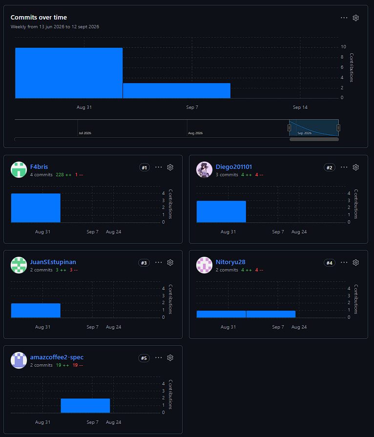

 

La siguiente imagen representa todos los commits realizados en el repositorio a lo largo del mes de setiembre.

    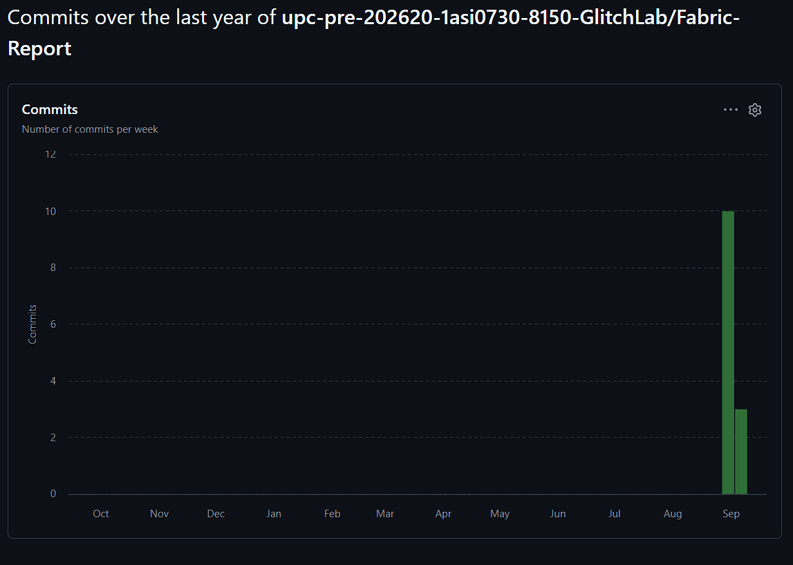

 
 

# Table of Contents
## Capítulo I: Introducción

- [1.1. Startup Profile](/front-matter/11-startup_profile.md).
    - [1.1.1. Descripción de la Startup](/front-matter/11-startup_profile.md/#11-startup-profile).
    - [1.1.2. Perfiles de integrantes del equipo](/front-matter/11-startup_profile.md/#112-perfiles-de-integrantes-del-equipo).
- [1.2. Solution Profile](/front-matter/12-solution_profile.md).
    - [1.2.1. Antecedentes y problemática](/front-matter/12-solution_profile.md/#121-antecedentes-y-problemática).
    - [1.2.2. Lean UX process](/front-matter/12-solution_profile.md/#122-lean-ux-process).
        - [1.2.2.1 Lean UX Problem Statements](/front-matter/12-solution_profile.md/#1221-lean-ux-problem-statement).
        - [1.2.2.2 Lean UX Assumptions](/front-matter/12-solution_profile.md/#1222-lean-ux-assumptions).
        - [1.2.2.3 Lean UX Hypotheses Statements](/front-matter/12-solution_profile.md/#1223-lean-ux-hyphotesis-statement).
        - [1.2.2.4 Lean UX Canvas](/front-matter/12-solution_profile.md/#1224-lean-ux-canvas).
- [1.3. Segmentos Objetivo](/front-matter/13-segmentos.md).
---
## Capítulo II: Requirements Elicitation and Analysis

- [2.1. Competidores](/front-matter/21-competidores.md).
    - [2.1.1. Análisis competitivo](/front-matter/21-competidores.md/#211-análisis-competitivo).
    - [2.1.2. Estrategias y tácticas frente a competidores](/front-matter/21-competidores.md/#estrategias).
- [2.2 Entrevistas](/front-matter/22-entrevistas.md).
    - [2.2.1. Diseño de entrevistas](/front-matter/22-entrevistas.md/#221-diseño-de-entrevistas).
    - [2.2.2. Registro de entrevistas](/front-matter/22-entrevistas.md/#222-registro-de-entrevistas).
    - [2.2.3. Análisis de entrevistas](/front-matter/22-entrevistas.md/#222-registro-de-entrevistas).
- [2.3. Needfinding](/front-matter/23-needfinding.md).
    - [2.3.1. User Personas](/front-matter/23-needfinding.md/#231-user-personas).
    - [2.3.2. User Task Matrix](/front-matter/23-needfinding.md/#232-task-matrix).
    - [2.3.3. User Journey Map](/front-matter/23-needfinding.md/#233-journey-mapping).
    - [2.3.4. User Empathy Mapping](/front-matter/23-needfinding.md/#234-empathy-mapping).
- [2.4. Big Picture EventStorming](/front-matter/24-big_picture_event.md).
- [2.5. Ubiquitous Language](/front-matter/25-ubiquitous_language.mds).
---

## Capítulo III: Requirements Specification

- [3.1. User Stories](/front-matter/31-user_stories.md).
- [3.2. Impact Mapping](/front-matter/32-impact_mapping.md).
- [3.3. Product Backlog](/front-matter/33-product_backlog.md).
---
## Capítulo IV: Product Design

- [4.1. Style Guidelines](/front-matter/41-style_guidelines.md).
    - [4.1.1. General Style Guidelines](/front-matter/41-style_guidelines.md/#411-general-style-guidelines).
    - [4.1.2. Web Style Guidelines](/front-matter/41-style_guidelines.md/#412-web-style-guidelines).
- [4.2. Information Architecture](/front-matter/42-information_arquitechture.md).
    - [4.2.1. Organization Systems](/front-matter/42-information_arquitechture.md/#421-organization-systems).
    - [4.2.2. Labeling Systems](/front-matter/42-information_arquitechture.md/#422-labeling-systems).
    - [4.2.3. SEO Tags and Meta Tags](/front-matter/42-information_arquitechture.md/#423-seo-tags-and-meta-tags).
    - [4.2.4. Searching Systems](/front-matter/42-information_arquitechture.md/#424-searching-systems).
    - [4.2.5. Navigation Systems](/front-matter/42-information_arquitechture.md/#425-navigation-systems).
- [4.3. Landing Page UI Design](/front-matter/43-landing_ui_design.md).
    - [4.3.1. Landing Page Wireframe](/front-matter/43-landing_ui_design.md/#431-landing-page-wireframe).
    - [4.3.2. Landing Page Mock-up](/front-matter/43-landing_ui_design.md/#432-landing-page-mock-up).
- [4.4. Web Applications UX/UI Design](/front-matter/44-web_ui_ux_design.md).
    - [4.4.1. Web Applications Wireframes](/front-matter/44-web_ui_ux_design.md/#441-web-applications-wireframes).
    - [4.4.2. Web Applications Wireflows Diagrams](/front-matter/44-web_ui_ux_design.md/#442-web-applications-wireflow-diagrams).
    - [4.4.3. Web Applications Mock-ups](/front-matter/44-web_ui_ux_design.md/#443-web-applications-mock-ups).
    - [4.4.4. Web Applications User Flow Diagrams](/front-matter/44-web_ui_ux_design.md/#444-web-applications-user-flow-diagrams).
- [4.5. Web Applications Prototyping](/front-matter/45-web_prototyping.md).
- [4.6. Domain-Driven Software Architecture](/front-matter/46-domain-driven.md).
    - [4.6.1. Design-Level EventStorming](/front-matter/46-domain-driven.md).
    - [4.6.2. Software Architecture Context Diagram](/front-matter/46-domain-driven.md).
    - [4.6.3. Software Architecture Container Diagrams]().
    - [4.6.4. Software Architecture Component Diagrams]().
- [4.7. Software Object-Oriented Design](/front-matter/47-software_object_oriented.md).
    - [4.7.1. Class Diagrams](/front-matter/47-software_object_oriented.md/#471-class-diagrams).
- [4.8. DataBase Design](/front-matter/48-database_design.md).
    - [4.8.1. Database Diagrams](/front-matter/48-database_design.md/#database).
---

## Capítulo V: Product Implementation, Validation & Deployment

- [5.1. Software Configuration Management](/front-matter/51-software_configuration.md).
    - [5.1.1. Software Development Environment Configuration](/front-matter/51-software_configuration.md/#51-software-configuration-management).
    - [5.1.2. Source Code Management](/front-matter/51-software_configuration.md/#512-source-code-management).
    - [5.1.3. Source Code Style Guide & Conventions](/front-matter/51-software_configuration.md/#513-source-code-style-guide-and-conventions).
    - [5.1.4. Software Deployment Configuration](/front-matter/51-software_configuration.md/#514-software-deployment-configuration).
- [5.2. Landing Page, Services & Applications Implementation](/front-matter/52-applications_implementation.md).
    - [5.2.1 Sprint 1](/front-matter/52-applications_implementation.md/#521-sprint-1)
        - [5.2.1.1. Sprint Planning 1](/front-matter/52-applications_implementation.md/#5211-sprint-planning-1).
        - [5.2.1.2. Aspect Leaders and Collaborators](/front-matter/52-applications_implementation.md/#5212-aspect-leaders-and-collaborators).
        - [5.2.1.3. Sprint Backlog 1](/front-matter/52-applications_implementation.md/#5213-sprint-backlog-1).
        - [5.2.1.4. Development Evidence for Sprint Review]().
        - [5.2.1.5. Execution Evidence for Sprint Review]().
        - [5.2.1.6. Services Documentation Evidence for Sprint Review]().
        - [5.2.1.7. Software Deployment Evidence for Sprint Review]().
        - [5.2.1.8. Team Collaboration Insights during Sprint]().

        - [5.3. Validation Interviews]().
    - [5.3.1. Diseño de Entrevistas]().
    - [5.3.2. Registro de Entrevistas]().
    - [5.3.3. Evaluaciones según heurísticas]().

- [5.4. Video About the Product]().

 
 
 

# **Student Outcome**

El curso contribuye al cumplimiento del Student Outcome **ABET: ABET – EAC - Student Outcome 5**

Criterio: *La capacidad de funcionar efectivamente en un equipo cuyos miembros juntos proporcionan liderazgo, crean un entorno de colaboración e inclusivo, establecen objetivos, planifican tareas y cumplen objetivos.*

En el siguiente cuadro se describe las acciones realizadas y enunciados de conclusiones por parte del grupo, que permiten sustentar el haber alcanzado el logro del ABET – EAC - Student Outcome 5.

# **Tabla de contenidos**

| **Criterio Específico** | **Acciones realizadas**                                                                                                                                                                                                                                                                                                                                                                                                                                                                                                                                                                                                                                                                                                                                                                                                                                                                                                                                                                                                                                                                                                                                                                                                                                                                                                                                                                                                                                                                                                                                                             | **Conclusiones** |
|--------------------------|-------------------------------------------------------------------------------------------------------------------------------------------------------------------------------------------------------------------------------------------------------------------------------------------------------------------------------------------------------------------------------------------------------------------------------------------------------------------------------------------------------------------------------------------------------------------------------------------------------------------------------------------------------------------------------------------------------------------------------------------------------------------------------------------------------------------------------------------------------------------------------------------------------------------------------------------------------------------------------------------------------------------------------------------------------------------------------------------------------------------------------------------------------------------------------------------------------------------------------------------------------------------------------------------------------------------------------------------------------------------------------------------------------------------------------------------------------------------------------------------------------------------------------------------------------------------------------------|------------------|
| **Trabaja en equipo para proporcionar liderazgo en forma conjunta** | **Tello Palacios, Fabrizio Rafael**  **AV1:** Trabaja en equipo para proporcionar liderazgo en forma conjunta, creando un entorno colaborativo e inclusivo, estableciendo objetivos, planificando tareas y cumpliendo los objetivos del proyecto Fabric.    **Estupiñan Olortegui, Juan Sebastian**  **AV1:** Para el primer avance, junto con mis compañeros, iniciamos el proceso de buscar a los User Personas y los Segmentos objetivos, realizando las entrevistas necesarias para conocer mejor sus necesidades, y brindarnos la información necesaria para hacer los arquetipos. También, me encargue de realizar algunos de los epics y 10 user stories para nuestro proyecto. Y por último, me encargué de realizar los Impact Mapping de ambos segmentos, utilizando los User Personas seleccionadas, y la información brindada en sus respectivas entrevistas, que nos permiten entender el flujo de trabajo.    **Silva Hualpa, Rosangela Karen**  **AV1:** Para el primer avance, junto con mis compañeros, participé en la elaboración de las preguntas para las entrevistas y en el análisis de la información obtenida para conocer mejor las necesidades de los usuarios. También participé en la elaboración de los User Personas y en la definición de los Epics y User Stories del proyecto. Finalmente, contribuí en el desarrollo de los wireframes y en la organización de los requerimientos, buscando que las funcionalidades propuestas respondan a los principales problemas identificados en los segmentos entrevistados.    | El desarrollo de Fabric nos permitió aplicar buenas prácticas de ingeniería de software y diseño centrado en el usuario para resolver un problema real en las MYPE textiles de Gamarra. Como equipo, fortalecimos nuestra colaboración, comunicación y liderazgo, aprendiendo a organizarnos y cumplir objetivos comunes. Concluimos que Fabric aporta valor al negocio al facilitar la trazabilidad, la detección temprana de defectos y la toma de decisiones basada en datos. |
| **Crea un entorno colaborativo e inclusivo, establece metas, planifica tareas y cumple objetivos** | **Tello Palacios, Fabrizio Rafael**  **AV1:** Creo un entorno colaborativo e inclusivo donde todos los integrantes del equipo pueden aportar, establezco metas claras para el proyecto Fabric, organizo las tareas de forma equitativa y me aseguro de cumplir los objetivos planteados junto a mis compañeros.    **Estupiñan Olortegui, Juan Sebastian**  **AV1:** Al iniciar, hemos tenido algunas dificultades con varios puntos, entre ellos la creación de los User Stories y el Sprint Backlog, pero poco a poco hemos podido coordinarnos bien para realizar los trabajos más rápido y sobre todo, colaborando entre todos para alinear los puntos. Y aunque en momentos hemos trabajado bajo presión del tiempo, hemos tomado la situación con calma, y logramos completar gran parte del trabajo en un buen tiempo.   **Silva Hualpa, Rosangela Karen**  **AV1:** Durante el primer avance, participé activamente en la coordinación con mis compañeros para organizar las actividades y cumplir con los entregables establecidos. Nos distribuimos las tareas de acuerdo con lo que cada integrante podía aportar y mantuvimos comunicación constante para revisar nuestros avances y corregir los puntos que no estaban alineados. Esto me permitió aportar al trabajo en equipo, apoyar cuando fue necesario y cumplir con las responsabilidades que tenía asignadas dentro de los tiempos establecidos.                                                                                                                                    |  El equipo logró establecer un entorno de trabajo colaborativo donde cada integrante aportó de acuerdo a sus habilidades. La claridad en los objetivos permitió alcanzar de manera efectiva los resultados planteados para el primer entregable, demostrando una adecuada organización y coordinación entre todos los miembros del grupo. | 

| Integrante                          | Código     |
|-------------------------------------|------------|
| Tello Palacios, Fabrizio Rafael     | U202113310 |
| Flores Martinez, Ricardo Andres     | U202423162 |
| Reátegui Galarcep, Diego Sebastián  | U20201F165 |
| Estupiñan Olortegui, Juan Sebastian | U202223405 |
| Silva Hualpa, Rosangela Karen       | U20241B885 |

 
 
 

# Capitulo I: Introducción

## 1.1. Startup profile

### 1.1.1. Descripción de la StartUp

Somos **GlitchLab**,una startup tecnológica formada por estudiantes de Ingeniería de Software de la UPC, nos enfocamos en el desarrollo de soluciones mediante software para resolver problemas y mejorar diferentes procesos en empresas y organizaciones. Nuestro objetivo es identificar necesidades reales y transformarlas en aplicaciones y herramientas digitales que sean prácticas, accesibles y fáciles de utilizar. Buscamos aprovechar las diferentes tecnologías y metodologías de desarrollo de software para crear soluciones que permitan optimizar procesos, organizar información, reducir tareas manuales y facilitar la toma de decisiones. Actualmente, nuestro primer proyecto es **Fabric**, una aplicación web orientada al sector textil peruano, que busca mejorar la gestión y el seguimiento de los procesos de producción. A largo plazo, GlitchLab busca continuar desarrollando soluciones de software para diferentes sectores, adaptándonos a las necesidades de cada usuario y generando un impacto positivo mediante la tecnología.

### Misión

Desarrollar soluciones tecnológicas innovadoras que ayuden a las empresas y personas a mejorar sus procesos, optimizar sus recursos y tomar mejores decisiones mediante el uso de la tecnología.

### Visión

Ser una startup reconocida por desarrollar productos de software innovadores que impulsen la transformación digital y el crecimiento de diferentes sectores, adaptándonos a las necesidades de nuestros usuarios.

### 1.1.2. Perfiles de integrantes del equipo

| Foto | Apellido y Nombre                                  | Descripción|
|------|----------------------------------------------------|------|
|  | *Tello Palacios, Fabrizio Rafael  u202113310*      |Soy estudiante de la carrera de Ingeniería de Software. Considero que soy una persona comprometida en cada trabajo y tarea y siempre trato de dar lo mejor de mi en cada situación. Tengo experiencia en el desarrollo UX/UI, enfocándome en el diseño de interfaces y prototipos utilizando Figma. Además, cuento con sólidos conocimientos en HTML, CSS y JavaScript, lo que me permite aportar al equipo con el desarrollo de interfaces funcionales e intuitivas.
|  | *Diego Sebastián Reátegui Galarcep u20201f165*     | Soy estudiante de Ingeniería de Software. Tengo habilidades en Python, JavaScript y Diseño de Soluciones de Software, lo cual me permite brindar soluciones sólidas y rápidas. Considero que soy una persona que minuciosa al trabajar y que al trabajar en equipo aumenta mi sentido de responsabilidad.
|  | *Estupiñan Olortegui, Juan Sebastian - U202223405* | Estudiante de Ingeniería de Software, con habilidades en C++, Java, Angular, HTML y Docker, también desarrollo diseño para aplicaciones y plataformas de web design. Soy demasiado dispuesto a trabajar en equipo y coordinar las tareas entre todos.
  | *Flores Martinez, Ricardo Andres - U202423162* | Soy estudiante de la carrera de Ingeniería de Software. Me caracterizo por ser una persona responsable y constante con las actividades que realizo, procurando cumplir con los objetivos establecidos. Tengo experiencia trabajando con C++ y Python, principalmente en proyectos académicos relacionados con programación y estructuras de datos.
|  | Silva Hualpa Rosangela Karen                       |	Mi nombre es Rosangela Silva y estoy cursando la carrera de Ingeniería de Software. Tengo interés en seguir desarrollándome en el área de tecnología y adquirir experiencia a través de la participación en diferentes proyectos. Me gustaría enfocarme en el desarrollo y la creación de soluciones de software, aportando mis conocimientos, aprendiendo junto a mi equipo y asumiendo responsabilidades que contribuyan al cumplimiento de los objetivos del proyecto.

 
 
 

## 1.2. Solution Profile

### 1.2.1. Antecedentes y problemática

Según [Javier Borda (2012)](https://repositorio.uni.edu.pe/handle/20.500.14076/1347?utm_source), las empresas del sector textil y confecciones en el Perú (sobre todo MYPES) enfrentan dificultades para mantener un control eficiente de sus procesos productivos y de calidad, evidenciándose brechas de calidad dentro del sector. La falta de una gestión digital y centralizada de la información puede dificultar el seguimiento de rendimiento de las máquinas, asi como el registro de control de calidad de las telas y trazabilidad de lotes producidos. Esto puede generar dificultades para identificar problemas durante la producción, aumentar los tiempos y costos asociados a errores y limitar la disponibilidad de información para una adecuada toma de decisiones [(INEI, 2023)](chrome-extension://efaidnbmnnnibpcajpcglclefindmkaj/https://www.inei.gob.pe/media/inei_en_los_medios/06-jun-el-peruano-8-9.pdf?utm_source).

Ante esta problemática, proponemos **Fabric**, una aplicación web que centraliza la información de producción y calidad, permitiendo realizar el seguimiento de lotes, registrar controles de calidad de las telas y consultar indicadores relacionados con la productividad de las máquinas de confección.

A continuación, plantearemos la problemática usando la técnica de 5´W´s y 2´h´s.

### What? (¿Cuál es el problema?)

En el sector textil y de confecciones peruano existen dificultades para llevar un control adecuado de los procesos de producción y calidad. Durante la fabricación se genera información sobre las máquinas, los lotes producidos, la cantidad elaborada y los problemas de calidad encontrados, pero estos datos pueden registrarse de forma manual, en diferentes documentos o sin una estructura que facilite su consulta. Esto hace más difícil conocer el estado de la producción y relacionar los problemas encontrados con el lote, la máquina o la etapa en la que ocurrieron.

En consecuencia, los responsables pueden tener dificultades para detectar errores a tiempo, hacer seguimiento de los lotes y conocer qué procesos están generando más problemas. Esto limita el uso de la información para mejorar la producción y puede contribuir a generar desperdicios, reprocesos y mayores costos para la empresa [(Borda, 2012)](https://repositorio.uni.edu.pe/handle/20.500.14076/1347?utm_source).

### Why? (¿Por qué ocurre?)

La problemática ocurre debido a que muchas empresas del sector textil, especialmente las MYPES, todavía presentan un nivel limitado de digitalización y modernización en sus procesos productivos. Esto puede generar que la información relacionada con la producción, el rendimiento de las máquinas y los controles de calidad se registre de manera manual, en diferentes formatos o incluso que no se encuentre centralizada [(Rosales & Urbano, 2020)](http://hdl.handle.net/20.500.12404/19374). Por eso, los responsables de producción y calidad pueden tener dificultades para consultar rápidamente el historial de un lote, identificar los defectos más frecuentes o conocer el rendimiento de las máquinas.

Además, la limitada incorporación de tecnologías de información reduce la capacidad de las empresas para obtener información oportuna y utilizarla como apoyo para la toma de decisiones. Esto resulta especialmente relevante en procesos donde un defecto detectado tardíamente puede generar reprocesos, desperdicio de materiales (mermas), retrasos en la producción y mayores costos.

### Who? (¿A quiénes afecta?)

Esta problemática afecta principalmente las MYPES del sector textil y de confecciones, involucrando directamente a propietarios y administradores, supervisores y responsables de producción, personal encargado del control de calidad y operarios que participan directamente en los procesos productivos. Asimismo, puede agectar a otros actores relacionados con la cadena de suministro, como proveedores, distribuidores y clientes, debido a problemas asociados con retrasos, defectos de calidad o dificultades en el seguimiento de los productos y lotes fabricados.

### Where? (¿Dónde ocurre?)

La problemática se presenta principalmente en las empresas dedicadas a la producción textil y de confecciones, con una mayor concentración en Lima Metropolitana. Esta ubicación resulta importante debido a que Lima concentra el 63.9 % de las empresas formales del sector textil y de confecciones del país, y el 99.4 % de estas empresas corresponde a MYPEs [(PRODUCE, 2026)](https://www.gob.pe/institucion/produce/noticias/1410729-ministro-de-la-produccion-industria-textil-y-de-confecciones-sostiene-411-mil-puestos-de-trabajo-con-participacion-femenina-del-63-7).

Dentro de Lima, uno de los principales puntos de concentración de esta actividad es el **Emporio Comercial de Gamarra**, ubicado en el distrito de La Victoria, reconocido por ser uno de los principales centros de producción y comercialización textil del Perú. En 2024, [PRODUCE](https://www.gob.pe/institucion/produce/noticias/1069804-gobierno-impulsa-campana-navidena-2024-segura-para-reactivar-la-economia-de-gamarra) señaló que Gamarra reunía cerca de 50 000 emprendedores dedicados a la confección y comercialización de productos textiles.

Por ello, **Fabric** se enfocará inicialmente en las MYPE textiles y de confecciones de Lima, tomando como principal contexto de aplicación el Emporio Comercial de Gamarra, donde existe una alta concentración de empresas y una necesidad de mejorar la gestión de los procesos productivos y de calidad.

### When? (¿Cuándo ocurre?)

La problemática se presenta durante el desarrollo y seguimiento de los procesos productivos, especialmente en las etapas donde se requiere controlar la calidad, registrar información de producción y verificar el estado de los productos. Esta necesidad se mantiene durante la operación de las empresas, ya que en 2024 el ITP brindó 2,640 servicios especializados a 891 unidades productivas del sector textil, siendo el control de calidad, el control de inventarios y el planeamiento de la producción [(ITP, 2025)](https://www.gob.pe/institucion/itp/noticias/1091822-durante-el-2024-mas-de-2-600-empresas-del-rubro-indumentaria-fueron-asistidas-por-la-unidad-tecnica-textil-y-confecciones-del-itp), entre algunos de los temas más demandados dentro de la industria.

### How? (¿Cómo?)

 El problema se manifiesta cuando la información relacionada con la producción, el rendimiento de las máquinas y los controles de calidad se registra de manera manual, dispersa o sin una adecuada relación con los lotes y etapas del proceso productivo. Esto dificulta conocer oportunamente el estado de la producción, identificar problemas de rendimiento y determinar dónde y cuándo se originan los defectos.

Como consecuencia, las empresas pueden presentar reprocesos, mermas, retrasos y mayores costos de producción. Además, la falta de información organizada limita la capacidad de analizar los problemas y tomar acciones correctivas oportunamente.

### How Much? (¿Cúanto afecta?)

La problemática puede generar un impacto económico en las MYPE textiles, principalmente por los gastos relacionados con desperdicios y productos que necesitan ser corregidos. Según [Elsie Bonilla (2017)](https://repositorio.ulima.edu.pe/item/8e63e69e-f96c-ce8d-e050-007f0100075d), quien analizó 27 MYPE de confección textil de Lima y Callao, existe una relación entre una mejor gestión de calidad y una reducción de los costos por desechos y desperdicios. Este estudio encontró que por cada 1 % de mejora en la gestión de calidad, los costos de producción podían disminuir aproximadamente 0.08 %.

### 1.2.2. Lean UX Process

#### 1.2.2.1. Lean UX Problem Statement

Actualmente, en el sector textil y de confecciones de Lima, especialmente en las MYPE, el control de la producción y la calidad se centra en registrar información sobre lotes, defectos y rendimiento de las máquinas, pero estos datos pueden encontrarse dispersos o registrarse manualmente, dificultando su seguimiento y análisis. Las soluciones existentes no siempre permiten reunir esta información en un solo lugar y relacionarla para identificar problemas a tiempo. **Fabric** busca cubrir esta necesidad mediante una aplicación web que centralice los registros, permita hacer seguimiento de los lotes, registrar defectos y consultar indicadores para facilitar la toma de decisiones. Nuestro enfoque inicial estará dirigido a MYPE textiles y de confecciones de Lima, especialmente aquellas ubicadas en Gamarra. Sabremos que la solución es exitosa cuando los usuarios registren de forma constante sus procesos y controles de calidad, consulten los indicadores para detectar problemas y logren reducir la cantidad de defectos, desperdicios y reprocesos.

#### 1.2.2.2. Lean UX Assumptions

Business Assumptions:  
> * Creemos que las MYPE textiles de Lima Metropolitana, especialmente las ubicadas en Gamarra, enfrentan problemas operativos relacionados con el seguimiento de producción y control de calidad, y que estarían abiertas a adoptar una solución digital si esta se adapta a sus necesidades y capacidades técnicas.
> * Creemos que un modelo de negocio basado en suscripción mensual es viable para Fabric, siempre que el precio sea accesible para el presupuesto de una MYPE textil y el valor justifique el costo.
> * Creemos que las empresas del sector textil valorarán una herramienta que centralice la información de producción y calidad, reduciendo la dependencia de registros físicos o archivos separados.

Business Outcomes Assumptions: 
> * Creemos que las empresas que utilicen Fabric de manera constante podrán reducir sus costos operativos asociados a desperdicios, reprocesos y retrasos en la producción.
> * Creemos que los usuarios mantendrán un uso activo de la plataforma (al menos 3 veces por semana) si encuentran valor en la información que pueden consultar y registrar.
> * Creemos que una parte de las empresas que prueben Fabric estará dispuesta a contratar una suscripción mensual después de comprobar sus beneficios.
> * Creemos que Fabric permitirá a los equipos de producción reducir el tiempo dedicado a recopilar y organizar información manualmente, liberando tiempo para tareas de mayor valor.

User Assumptions: 
> * Creemos que las MYPE textiles cuentan con al menos una persona responsable de supervisar la producción y otra encargada del control de calidad, quienes son los principales usuarios potenciales de Fabric.
> * Creemos que estos usuarios necesitan acceder a información actualizada sobre el estado de los lotes, el rendimiento de las máquinas y los defectos detectados durante su jornada laboral.
> *  Creemos que actualmente los usuarios registran esta información en formatos físicos (como planillas o cuadernos) o en herramientas digitales no especializadas (como Excel o Google Sheets), lo que dificulta su análisis y seguimiento.
> * Creemos que los usuarios pueden adaptarse a una aplicación web siempre que la interfaz sea simple, clara y fácil de utilizar.

User Outcome and Benefit Assumptions:  
> * Creemos que los usuarios podrán conocer rápidamente el estado de los lotes y detectar retrasos o problemas durante su elaboración.
> * Creemos que podrán identificar los defectos más frecuentes y relacionarlos con los lotes o procesos donde fueron encontrados.
> * Creemos que los usuarios percibirán un impacto positivo en su trabajo diario al contar con un historial claro y consultable de cada lote y sus incidencias.

Feature Assumptions: 
> * Creemos que una funcionalidad que permita crear lotes, registrar cantidades, fechas clave, etapa actual y estado del lote será suficiente para que los supervisores realicen un seguimiento ordenado y completo de la producción.
> * Creemos que una función de consulta y filtrado (por fecha, lote, máquina, etapa o tipo de defecto) permitirá a los usuarios analizar el historial de producción y calidad, identificando patrones o causas raíz de problemas recurrentes.
> * Creemos que la visualización de indicadores clave (como porcentaje de defectos, eficiencia por máquina o cumplimiento de plazos) será útil para que los usuarios tomen decisiones basadas en datos concretos.
> * Creemos que un módulo de control de calidad que permita registrar inspecciones, seleccionar tipos de defecto (falla de material, falla de medida, falla en accesorios), cantidades afectadas y asociarlos a un lote específico ayudará a los encargados a mantener un registro detallado y trazable de los problemas de calidad.

#### 1.2.2.3. Lean UX Hyphotesis Statement

> * Creemos que lograremos una reducción de al menos un 20% en los retrasos de producción y una mejor trazabilidad de los lotes si los supervisores de producción y control de calidad logran conocer el estado actual de cada lote, identificar retrasos o desviaciones en las fechas de entrega, y mantener un registro organizado de todos los lotes de producción con un módulo que permita crear lotes, registrar cantidades, fechas de inicio y entrega, etapa actual y actualizar el estado a lo largo del proceso productivo.
> * Creemos que lograremos un mejor seguimiento de los problemas de calidad y una reducción de los costos por reprocesos si el personal de control de calidad y los supervisores de producción logran registrar inspecciones, asociar defectos a lotes específicos y mantener un historial de calidad trazable con una función de control de calidad que permita registrar inspecciones, seleccionar tipos de defecto y agregar observaciones.
> * Creemos que lograremos la identificación de problemas recurrentes y el análisis de causa raíz si los supervisores de producción y los gerentes de calidad logran consultar registros de producción anteriores, detectar patrones en los defectos, identificar qué máquinas o procesos generan más problemas y analizar el historial para tomar decisiones informadas con una función de consulta y filtrado que permita revisar registros anteriores y filtrar por fecha, lote, etapa o tipo de defecto.
> * Creemos que lograremos una toma de decisiones basada en datos precisos y una detección más rápida de problemas si los gerentes de producción y dueños de negocio logran visualizar indicadores clave de rendimiento y monitorear tendencias de calidad con un dashboard que muestre porcentaje de defectos, eficiencia por máquina y cumplimiento de plazos de entrega. 

#### 1.2.2.4. Lean UX Canvas

|**1. Business Problem**           | **2. Business Outcomes** | 
|:---------------------------------|---------------------------|
|Las MYPE textiles y de confecciones de Lima Metropolitana, especialmente las ubicadas en el Emporio Comercial de Gamarra, enfrentan dificultades para mantener un control eficiente de sus procesos productivos y de calidad. La información que se relaciona con la producción, el rendimiento de las máquinas y los controles de calidad se registra de manera manual, dispersa o sin una estructura que facilite su consulta. | Creemos que Fabric permitirá a las MYPE textiles reducir sus costos operativos generados por desperdicios de tela, productos defectuosos y reprocesos, y sabremos que hemos tenido éxito cuando las empresas usuarias reporten una disminución de al menos el 10% en sus costos por reprocesos y mermas durante los primeros 3 meses de uso de la plataforma, en comparación con el periodo anterior sin la herramienta.   |
| **3. Users and Customers** |  **4. User Benefits** |
| - Creemos que nuestro primer segmento objetivo son los **supervisores de produccion** de MYPE textiles y de confecciones en Lima, quienes actualmente se enfrentan a la dificultad de realizar un seguimiento ordenado de los lotes de producción, ya que la información sobre cantidades, fechas de entrega y etapa actual de producción se registra de manualmente en formatos físicos (cuadernos o planillas), lo que impide reconocer rápidamente el estado de cada lote, identificar retrasos y mantener un historial organizado durante todo el ciclo de producción.      - Creemos que nuestro segundo segmento objetivo son los **encargados de control de calidad**, quienes tienen dificultades para registrar y dar seguimiento a las inspecciones de calidad y los defectos que encuentran en las prendas, ya que esta información se registra de manera dispersa o sin relación con los lotes y etapas de producción, lo que les impide mantener un historial de calidad claro y trazable, identificar los defectos más frecuentes y saber en qué etapa del proceso o en qué máquina se originan los problemas.  |  - Creemos que el **supervisor de producción** lograrán un seguimiento ordenado y completo de cada lote durante el proceso productivo para poder conocer rápidamente el estado actual de cada lote, identificar retrasos o desviaciones en las fechas de entrega, mantener un registro organizado de toda la producción y así poder tomar acciones correctivas oportunas que permitan reducir los retrasos en la entrega de pedidos y optimizar el flujo de trabajo en la planta.   - Creemos que el **encargado de control de calidad** quiere lograr el registro detallado y trazable de todas las inspecciones de calidad y defectos encontrados en las prendas para poder asociar cada defecto al lote, etapa del proceso o máquina específica donde se originó, identificar los defectos más frecuentes, y así poder focalizar acciones correctivas en los problemas que generan mayores pérdidas, reduciendo los costos por reprocesos y evitando que productos defectuosos lleguen al cliente final.|
| **5. Solutions** | **6. Hyphoteses**  |
|- Creemos que contar con un módulo de gestión de lotes que permita crear lotes, registrar cantidades, fechas de inicio y entrega, etapa actual y actualizar el estado a lo largo del proceso productivo permitirá a los supervisores de producción realizar un seguimiento ordenado y completo de cada lote, conocer rápidamente su estado actual, identificar retrasos o desviaciones en las fechas de entrega y mantener un registro organizado de toda la producción.   - Creemos que contar con una función de control de calidad que permita registrar inspecciones, seleccionar tipos de defecto (tela, costura, acabado, medida, avíos), indicar cantidades afectadas, asociar defectos a lotes específicos y agregar observaciones permitirá a los encargados de control de calidad mantener un registro detallado y trazable de todas las inspecciones y defectos. | - Creemos que una reducción de al menos un 20% en los retrasos de producción será alcanzada si los supervisores de producción y control de calidad obtienen la capacidad de conocer el estado actual de cada lote, identificar retrasos o desviaciones en las fechas de entrega, y mantener un registro organizado de todos los lotes de producción.    - Creemos que una toma de decisiones basada en datos precisos y una detección más rápida de problemas, reduciendo el tiempo de respuesta ante desviaciones en al menos un 30%, será alcanzada si los gerentes de producción y dueños de negocio obtienen la capacidad de visualizar el rendimiento de su negocio a través de reportes consolidados que les permitan identificar rápidamente problemas de calidad, máquinas con bajo rendimiento y lotes fuera de plazo. |
| **7. What’s the most important thing we need to learn first?** | **8. What’s the least amount of work we need to do to learn that?**|
|  ¿Estarían las empresas textiles dispuestas a pagar una suscripción mensual por Fabric y usarla diariamente para gestionar su producción y calidad?     ¿Las funcionalidades de gestión de lotes, registro de inspecciones, consulta de historial y panel de control son suficientes y útiles para que los usuarios resuelvan sus problemas operativos? |  Realizar entrevistas a supervisores de producción, encargados de control de calidad y dueños de MYPE textiles para validar su disposición a pagar y el valor percibido de las funcionalidades. Además, desarrollar un prototipo navegable (mockup) de las funcionalidades clave y probarlo con los usuarios para recoger feedback temprano sobre su usabilidad y utilidad.   | 

 
 
 

## 1.3. Segmentos Objetivo

Nuestra aplicación esta dirigida a las micro y pequeñas empresas textiles en el emporio comercial de Gamarra. Esta decisión se justifica por las siguientes razones. 

En el emporio comercial de Gamarra se concentran mas de 49,000 unidades productivas del sector textil y confecciones, generando más de 75,000 empleos directos. De estos empleos, el 80% se dedica al rubro textil o manufacturero. Además, Gamarra representa el 0.4% del Producto Bruto Interno (PBI) nacional, lo que evidencia su importancia económica en el país  [(Andina, 2023)](https://andina.pe/agencia/noticia-gamarra-genera-mas-75000-empleos-y-produccion-representa-04-del-pbi-1026269.aspx#google_vignette). Actualmente, muchos jóvenes se hacen cargo de los negocios familiares dentro de este rubro, profesionalizando la gestión de sus empresas a largo plazo, mejorando así la productividad y los estándares de calidad en la confección, como el rendimiento de la tela y los acabados en los estampados. Esta nueva generación de empresarios presenta una mayos disposición a adoptar herramientas digitales que optimicen sus procesos, lo que convierte a Gamarra en el mercado objetivo ideal para nuestra solución **Fabric**.

### Segmemto objetivo 1: Supervisores de producción
**Perfil demográfico y operativo**: Personal con experiencia en el sector textil, con conocimiento del proceso productivo y liderazgo de equipos de operarios en la fabricación de productos textiles. Sus responsabilidades dentro de la empresa son la planificación y control de producción, la supervisión de los procesos de fabricación, la gestión de recursos y el mantenimiento de los equipos, además de coordinar con distintas áreas para resolver problemas durante la producción. 

Estadísticas del sustento:

* El 57.14% de los microempresarios del sector textil tienen educación secundaria superior, y los empresarios de Gamarra presentan competencias relacionadas con el emprendimiento y la autoeficacia para enfrentar situaciones adversas.
* El 62.7% de los microempresarios de Gamarra son de género masculino, con edades concentradas entre 41 y 50 años .
* La mayoría son emprendedores que iniciaron sus negocios por necesidad y han desarrollado competencias empresariales a lo largo del tiempo.

**Oportunidad:**

Los supervisores de producción necesitan conocer rápidamente el estado actual de cada lote, identificar retrasos o desviaciones en las fechas de entrega y mantener un registro organizado de toda la producción para poder tomar acciones correctivas oportunas y optimizar el flujo de trabajo en la planta.

### Segmento objetivo 2: Encargados de control de calidad

**Perfil demográfico y operativo:** Es el personal responsable de realizar inspecciones y verificar la calidad de las prendas. Para cumplir este rol, se requiere de 2 a 3 años de experiencia  en control de calidad en confecciones o industria textil, y debe conocer fichas técnicas del producto y control de producto terminado. Las responsabilidades principales de este segmento son el de definir y ejecutar el plan de auditorías de producción de los talleres, documentar cada incidencia detectada en las visitas de auditoría y reducir las fallas de calidad detectadas tardíamente anticipando el control durante el proceso.

Estadísticas del sustento:

* El 60% de empleos en talleres y fábricas textiles en Gamarra son ocupados por personal femenino, mayormente en tiendas de puntos de venta. Además, tambien participan en labores de control de calidad y el acabado de prendas.

* El 80% de las unidades productivas de Gamarra se dedica al rubro textil o manufacturero, lo que evidencia la alta demanda de personal especializado en control de calidad de telas y acabados de prendas.

* Los principales problemas de calidad en la confección textil están relacionados con la costura, acabado y medidas, lo que requiere de personal capacitado para su detección y corrección oportuna.

**Oportunidad :**

 Los encargados de control de calidad necesitan registrar inspecciones, identificar los defectos más frecuentes y mantener un historial de calidad detallado y trazable para focalizar acciones correctivas en los problemas que generan mayores pérdidas y reducir los costos por reprocesos.

  
  
  

 # Capítulo II: Requirements Elicitation and Analysis

## 2.1. Competidores

* **SI-TEXT Perú (competidor directo):** Es una plataforma ERP peruana especializada en la industria textil y de confecciones que permite gestionar inventarios, órdenes de producción, fichas técnicas, insumos, mermas, ventas y reportes. Está orientada principalmente a talleres de confección, fábricas de ropa, marcas y servicios textiles. Su propuesta busca centralizar la información de la empresa y mejorar el control de la producción mediante una solución Cloud/SaaS.

* **Datatex - CAMS (competidor directo):** Es una solución internacional especializada en la gestión de producción para empresas textiles y de confecciones. Su sistema CAMS permite recopilar información del proceso productivo, registrar cantidades producidas, monitorear máquinas, detectar tiempos de inactividad, registrar defectos y analizar la productividad de operarios y procesos.

* **Coats Digital - FastReactPlan (competidor directo):** Es una solución de software especializada en la planificación y control de la producción de prendas de vestir. Permite gestionar la capacidad productiva, órdenes, materiales y líneas de confección, además de comparar la producción planificada con la producción real y visualizar indicadores mediante reportes y dashboards.

### 2.1.1. Análisis competitivo

Para este análisis competitivo se realizó un benchmark parcial enfocado en identificar soluciones digitales orientadas a la gestión, monitoreo y control de los procesos productivos dentro de la industria textil y de confecciones. La evaluación considera tres competidores directos: SI-TEXT Perú, como solución local enfocada en talleres y empresas textiles; Datatex - CAMS, como solución internacional especializada en el monitoreo de información de producción; y Coats Digital - FastReactPlan, como solución internacional especializada en la planificación y control de la producción de prendas.

Las métricas analizadas incluyen el perfil del producto, mercado objetivo, estrategias de marketing, productos y servicios, precios, canales de distribución y análisis FODA. Se seleccionaron estos competidores debido a que presentan diferentes enfoques para resolver problemas relacionados con el control de la producción textil. Esto permite identificar oportunidades de diferenciación para **Fabric**, principalmente mediante una plataforma orientada a las necesidades de las MYPES textiles y de confecciones de Lima que facilite el seguimiento de la producción, rendimiento de las máquinas, trazabilidad de lotes y registro de incidencias de calidad.

<table style="border-collapse: collapse; width: 100%;">
<tr>
<th colspan="6" style="vertical-align: top;">Competitive Analysis Landscape</th>
</tr>

<tr>
<td colspan="2" style="vertical-align: top;">¿Por qué llevar a cabo este análisis?</td>
<td colspan="4" style="vertical-align: top;">El objetivo de este análisis es identificar las características de los competidores y encontrar maneras de diferenciarnos.</td>
</tr>

<tr>
<td colspan="2" rowspan="2" style="vertical-align: top;">Startup y Competidores</td>
<td style="vertical-align: top;">Nuestra Startup</td>
<td style="vertical-align: top;">SI-TEXT Perú</td>
<td style="vertical-align: top;">Datatex - CAMS</td>
<td style="vertical-align: top;">Trama</td>
</tr>

<tr>
<td style="vertical-align: top;">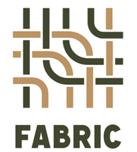</td>
<td style="vertical-align: top;">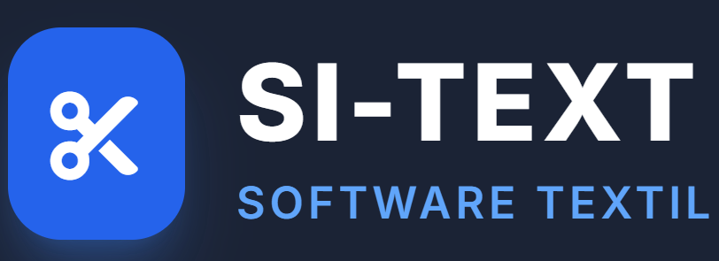</td>
<td style="vertical-align: top;">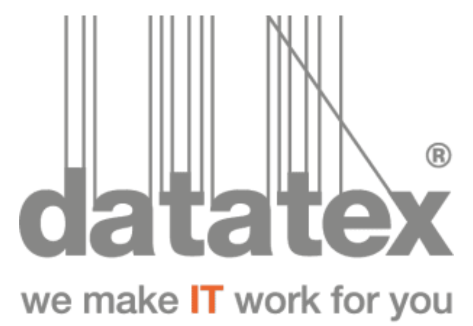</td>
<td style="vertical-align: top;"></td>
</tr>

<tr>
<td rowspan="2" style="vertical-align: top;">Perfil</td>
<td style="vertical-align: top;">Overview</td>
<td style="vertical-align: top;">Fabric es una aplicación web orientada a las MYPES textiles y de confecciones de Lima que busca centralizar información relacionada con la producción, rendimiento de máquinas, trazabilidad de lotes y controles de calidad.</td>
<td style="vertical-align: top;">SI-TEXT Perú es un ERP especializado en la industria textil y de confecciones peruana que permite centralizar información de producción, inventarios, ventas, fichas técnicas, insumos y reportes.</td>
<td style="vertical-align: top;">Datatex - CAMS es una solución especializada en la gestión del piso de producción que permite recopilar y analizar información relacionada con máquinas, operarios y procesos productivos textiles.</td>
<td style="vertical-align: top;">Trama es una plataforma ERP especializada en empresas de confecciones y maquila que integra la gestión de producción, calidad, inventarios y fichas técnicas.</td>
</tr>

<tr>
<td style="vertical-align: top;">Ventaja competitiva ¿Qué valor ofrece a los clientes?</td>
<td style="vertical-align: top;">Fabric busca ofrecer una solución sencilla y adaptada a las MYPES textiles y de confecciones de Lima, integrando el seguimiento de la producción, rendimiento de máquinas, trazabilidad de lotes y registro de incidencias de calidad.</td>
<td style="vertical-align: top;">Su principal ventaja es su adaptación al mercado textil peruano y la integración de diferentes procesos empresariales dentro de una plataforma Cloud/SaaS.</td>
<td style="vertical-align: top;">Destaca por su capacidad para recopilar información del proceso productivo y monitorear máquinas, cantidades producidas, tiempos de inactividad, defectos y productividad.</td>
<td style="vertical-align: top;">Su principal valor es integrar la gestión de producción y calidad dentro de una solución especializada para empresas de confecciones.</td>
</tr>

<tr>
<td rowspan="2" style="vertical-align: top;">Perfil de Marketing</td>
<td style="vertical-align: top;">Mercado objetivo</td>
<td style="vertical-align: top;">MYPES textiles y de confecciones de Lima, especialmente aquellas que requieren mejorar el control de sus procesos productivos y de calidad.</td>
<td style="vertical-align: top;">Talleres de confección, fábricas de ropa, marcas y empresas de servicios textiles del mercado peruano.</td>
<td style="vertical-align: top;">Empresas fabricantes del sector textil y de confecciones que requieren monitorear y controlar sus operaciones productivas.</td>
<td style="vertical-align: top;">Empresas de confecciones y maquila que requieren gestionar sus procesos productivos y controles de calidad.</td>
</tr>

<tr>
<td style="vertical-align: top;">Estrategias de marketing</td>
<td style="vertical-align: top;">Marketing digital, acercamiento directo a MYPES textiles, demostraciones de la plataforma y enfoque inicial en empresas ubicadas en Lima y Gamarra.</td>
<td style="vertical-align: top;">Contacto comercial directo, demostraciones personalizadas y promoción digital de sus soluciones para empresas textiles.</td>
<td style="vertical-align: top;">Marketing B2B, demostraciones de soluciones empresariales y promoción de herramientas especializadas para la industria textil.</td>
<td style="vertical-align: top;">Promoción digital de su plataforma y contacto con empresas del sector de confecciones interesadas en digitalizar sus procesos.</td>
</tr>

<tr>
<td rowspan="3" style="vertical-align: top;">Perfil de Producto</td>
<td style="vertical-align: top;">Productos & Servicios</td>
<td style="vertical-align: top;">Seguimiento de producción, monitoreo del rendimiento de máquinas, trazabilidad de lotes, registro de defectos de calidad e indicadores para apoyar la toma de decisiones.</td>
<td style="vertical-align: top;">Inventarios, órdenes de producción, fichas técnicas, telas e insumos, mermas, ventas y reportes.</td>
<td style="vertical-align: top;">Seguimiento de producción, cantidades producidas, máquinas, operarios, tiempos de inactividad, defectos y parámetros relacionados con el proceso productivo.</td>
<td style="vertical-align: top;">Gestión de producción, órdenes de trabajo, fichas técnicas, inventarios, controles de calidad, revisión de prendas y registro de defectos.</td>
</tr>

<tr>
<td style="vertical-align: top;">Precios & Costos</td>
<td style="vertical-align: top;">Fabric plantea un modelo de suscripción accesible orientado a las MYPES textiles y de confecciones, sujeto a validación durante el desarrollo del modelo de negocio.</td>
<td style="vertical-align: top;">Ofrece diferentes planes de suscripción mensual de acuerdo con las funcionalidades y necesidades de la empresa.</td>
<td style="vertical-align: top;">No presenta públicamente una tarifa estándar; el acceso a la solución requiere contacto comercial.</td>
<td style="vertical-align: top;">No presenta públicamente una tarifa estándar; requiere contacto con la empresa para conocer sus planes y costos.</td>
</tr>

<tr>
<td style="vertical-align: top;">Canales de distribución (Web y/o Móvil)</td>
<td style="vertical-align: top;">Aplicación web accesible mediante dispositivos con conexión a Internet.</td>
<td style="vertical-align: top;">Plataforma Cloud/SaaS accesible desde computadora, tablet y dispositivos móviles.</td>
<td style="vertical-align: top;">Plataforma empresarial integrada con sistemas de gestión y dispositivos utilizados dentro del proceso productivo.</td>
<td style="vertical-align: top;">Plataforma digital orientada a la gestión de empresas de confecciones.</td>
</tr>

<tr>
<td rowspan="4" style="vertical-align: top;">Análisis SWOT</td>
<td style="vertical-align: top;">Fortalezas</td>
<td style="vertical-align: top;">Enfoque específico en MYPES textiles y de confecciones de Lima, facilidad de uso propuesta e integración del seguimiento de producción, máquinas, lotes y calidad.</td>
<td style="vertical-align: top;">Conocimiento del mercado peruano, variedad de funcionalidades y especialización en empresas textiles y de confecciones.</td>
<td style="vertical-align: top;">Monitoreo detallado de producción, máquinas, operarios, tiempos de inactividad y defectos.</td>
<td style="vertical-align: top;">Integración de producción y control de calidad dentro de una plataforma especializada en confecciones.</td>
</tr>

<tr>
<td style="vertical-align: top;">Debilidades</td>
<td style="vertical-align: top;">Producto nuevo, sin posicionamiento inicial en el mercado y con funcionalidades que todavía deben ser validadas con los usuarios objetivo.</td>
<td style="vertical-align: top;">Su amplitud como ERP puede incluir funcionalidades que una MYPE pequeña no necesariamente requiere para controlar únicamente sus procesos productivos.</td>
<td style="vertical-align: top;">Su alcance empresarial y variedad de funcionalidades pueden implicar una implementación más compleja para pequeñas empresas.</td>
<td style="vertical-align: top;">Su enfoque amplio de gestión empresarial puede incorporar funcionalidades adicionales frente a una solución enfocada específicamente en producción, máquinas, lotes y calidad.</td>
</tr>

<tr>
<td style="vertical-align: top;">Oportunidades</td>
<td style="vertical-align: top;">Alta concentración de MYPES textiles y de confecciones en Lima y creciente necesidad de digitalizar procesos productivos actualmente registrados de manera manual o dispersa.</td>
<td style="vertical-align: top;">Crecimiento de la digitalización de talleres y empresas textiles peruanas.</td>
<td style="vertical-align: top;">Mayor adopción de tecnologías para digitalizar y automatizar los procesos de producción textil.</td>
<td style="vertical-align: top;">Crecimiento de la digitalización y necesidad de mejorar la trazabilidad y el control de calidad en empresas de confecciones.</td>
</tr>

<tr>
<td style="vertical-align: top;">Amenazas</td>
<td style="vertical-align: top;">Presencia de competidores especializados ya establecidos y resistencia al cambio tecnológico por parte de algunas MYPES.</td>
<td style="vertical-align: top;">Ingreso de nuevas soluciones especializadas y de menor costo dirigidas a pequeñas empresas textiles.</td>
<td style="vertical-align: top;">Aparición de soluciones locales más sencillas y económicas orientadas específicamente a MYPES.</td>
<td style="vertical-align: top;">Aparición de soluciones especializadas con mayor automatización del seguimiento de producción y calidad.</td>
</tr>

</table>

El análisis competitivo realizado ha permitido identificar las principales fortalezas, debilidades, oportunidades y amenazas del mercado, lo que nos ha llevado a definir las siguientes estrategias y tácticas para posicionar a Fabric de manera competitiva frente a SI-TEXT Perú, Datatex y Trama.

#### 2.1.2. Estrategias

1. **Reducción de incidencias durante la producción:** Posicionar a Fabric como una herramienta que permita identificar oportunamente problemas durante el proceso productivo, estableciendo como objetivo contribuir a reducir en un 20% las incidencias asociadas a máquinas y procesos mediante el seguimiento de indicadores y registros de producción.

2. **Reducción de defectos y reprocesos:** Facilitar el registro, clasificación y seguimiento de defectos de calidad, con el objetivo de contribuir a reducir en un 15% la cantidad de productos que requieren reprocesos por problemas detectados durante la producción.

3. **Mejora de la trazabilidad de la producción:** Centralizar la información de producción y calidad para lograr que el 100% de los lotes registrados en Fabric puedan ser rastreados, permitiendo consultar su estado, incidencias de calidad y procesos relacionados.

4. **Optimización del control de producción:** Facilitar a los supervisores el acceso a indicadores sobre producción, máquinas y calidad, buscando reducir en un 30% el tiempo empleado en consultar y analizar información relacionada con el proceso productivo.

#### Tácticas

1. **Dashboard centralizado de producción:** Implementar un panel que concentre indicadores de producción, rendimiento de máquinas, defectos e incidencias, permitiendo que los supervisores consulten la información desde un único lugar y buscando reducir en un 30% el tiempo destinado a recopilar y analizar información.

2. **Pruebas piloto con MYPES textiles:** Realizar pruebas piloto gratuitas con al menos 5 MYPES textiles y de confecciones de Lima durante un periodo de 30 días, permitiendo evaluar el funcionamiento de Fabric en procesos reales y medir cambios en incidencias, reprocesos y tiempos de consulta de información.

3. **Interfaz sencilla para supervisores:** Diseñar la aplicación web con una interfaz en español, tipografía mínima de 16 px, formularios simplificados y alertas visuales mediante colores rojo, amarillo y verde, facilitando su utilización por supervisores y responsables de producción y calidad.

4. **Registro y clasificación de defectos:** Implementar formularios que permitan registrar y clasificar los defectos encontrados durante la producción según su tipo, asociándolos con el lote, proceso y máquina correspondiente, con el objetivo de identificar defectos recurrentes y contribuir a reducir en un 15% los reprocesos.

5. **Trazabilidad digital de lotes:** Asignar un identificador único a cada lote registrado en Fabric, permitiendo consultar su historial de producción, controles de calidad, incidencias y procesos relacionados, con el objetivo de alcanzar una trazabilidad del 100% de los lotes gestionados mediante la plataforma.

 
  
  

 ## 2.2. Entrevistas

### 2.2.1. Diseño de entrevistas

**Segmento Objetivo 1: MYPES textiles y de confecciones de Lima**

1. ¿A qué tipo de actividad textil o de confección se dedica actualmente su empresa y qué productos elaboran?

2. ¿Cómo está organizado actualmente el proceso de producción dentro de su empresa?

3. ¿Cómo registran y hacen seguimiento a la cantidad de productos que se encuentran en producción y los que ya fueron terminados?

4. ¿Cómo controlan actualmente los lotes u órdenes de producción desde que inicia el proceso hasta que finaliza?

5. ¿De qué manera realizan el seguimiento del rendimiento y funcionamiento de las máquinas utilizadas durante la producción?

6. ¿Cuáles son los principales problemas o incidencias que suelen presentarse con las máquinas durante el proceso productivo?

7. ¿Cómo realizan actualmente los controles de calidad de los productos durante y al finalizar la producción?

8. ¿Qué tipos de defectos o problemas de calidad se presentan con mayor frecuencia?

9. Cuando detectan un producto defectuoso, ¿cómo identifican en qué lote, proceso o máquina pudo haberse originado el problema?

10. ¿Qué impacto generan actualmente los productos defectuosos, desperdicios o reprocesos en su empresa?

11. ¿Qué herramientas utilizan actualmente para registrar información de producción y calidad, por ejemplo, cuadernos, hojas de cálculo o algún software?

12. ¿Qué dificultades encuentran al momento de consultar o reunir información sobre producción, máquinas, lotes y calidad?

13. ¿Qué información o indicadores consideran más importantes para conocer si su proceso de producción está funcionando adecuadamente?

14. ¿Qué aspectos considerarían importantes antes de implementar una plataforma digital para gestionar la producción y el control de calidad de su empresa?

15. ¿Qué funcionalidades les gustaría encontrar en una plataforma que les permita gestionar mejor la producción, las máquinas, los lotes y los controles de calidad?
    
**Segmento Objetivo 2: Supervisores y responsables de producción y calidad**

1. ¿Cuál es su función dentro del proceso de producción o control de calidad y cuáles son sus principales responsabilidades?

2. ¿Cómo realiza actualmente el seguimiento del estado de la producción durante su jornada de trabajo?

3. ¿Qué información necesita revisar con mayor frecuencia para saber si la producción se está desarrollando correctamente?

4. ¿Cómo supervisa actualmente el rendimiento y funcionamiento de las máquinas involucradas en el proceso productivo?

5. ¿Cómo identifica cuando una máquina o proceso está presentando problemas que pueden afectar la producción?

6. ¿Cómo registran actualmente los defectos o incidencias de calidad que encuentran durante la producción?

7. ¿Qué tipos de defectos encuentra con mayor frecuencia y cómo los clasifican actualmente?

8. Cuando encuentra un defecto, ¿cómo determina a qué lote, proceso o máquina está relacionado?

9. ¿Qué procedimiento sigue después de detectar un defecto o problema durante la producción?

10. ¿Cuánto tiempo suele tomarle recopilar la información necesaria para investigar un problema de producción o calidad?

11. ¿Qué herramientas utiliza actualmente para registrar y consultar información sobre producción, máquinas, lotes y controles de calidad?

12. ¿Qué dificultades encuentra al trabajar con estas herramientas o registros?

13. ¿Qué indicadores considera más importantes para tomar decisiones sobre la producción y el control de calidad?

14. ¿De qué manera le ayudaría contar con alertas e información centralizada sobre incidencias, defectos y rendimiento de las máquinas?

15. ¿Qué funciones considera indispensables en una plataforma digital para facilitar su trabajo como supervisor o responsable de producción y calidad?

### 2.2.2. Registro de entrevistas

**Segmento Objetivo 1**

**Nombre:** Maribel
**Edad:** 41
**Ciudad:** Lima

**Minuto Inicio:** 00:00
**Minuto Final:** 04:53

Entrevista completa: [https://shorturl.at/pI0QC](https://shorturl.at/pI0QC)

**Resumen de la entrevista:**
Maribel, encargada de la empresa Creaciones Flores, dedicada a la confección de prendas de vestir como poleras, polos, pantalonetas y shorts, explicó que su proceso productivo inicia con el corte de las telas, continúa con la confección mediante las máquinas y finaliza con la distribución de las prendas a las tiendas.

Actualmente, el seguimiento de la producción se realiza principalmente mediante agendas, cuadernos y hojas de cálculo, donde registran la cantidad de prendas producidas y las que salen hacia las tiendas. El mantenimiento de las máquinas se realiza aproximadamente cada seis meses e incluye cambio de aceite y revisiones generales. Cuando una máquina presenta una falla, se contacta a un técnico para evitar retrasos en la producción.

Entre los principales problemas identificados se encuentran las fallas en el garfio, motores y agujas, además de problemas ocasionados por una incorrecta manipulación de las máquinas. En cuanto al control de calidad, se cuenta con una persona encargada de revisar las costuras, puntadas y estado de las prendas. Los defectos más frecuentes son las telas manchadas y las costuras incorrectas, como puntadas abiertas o demasiado cerradas. Las prendas defectuosas son separadas y no se incluyen en la venta, lo que representa una pérdida económica para la empresa.

Una de las principales dificultades es el manejo de grandes cantidades de producción y mercadería, especialmente cuando no se cuenta con suficiente personal para realizar los conteos. Esto puede ocasionar diferencias entre las cantidades registradas y las que finalmente llegan a las tiendas. Para evaluar el funcionamiento de la producción, consideran importantes los pedidos y opiniones de los clientes, ya que una buena calidad permite recibir nuevos pedidos y aumentar la producción.

Maribel considera que una plataforma digital podría facilitar la gestión de la producción y el control de calidad, siempre que sea sencilla de utilizar. También considera importante contar con información clara y un manual que explique cómo acceder y utilizar correctamente el software dentro del taller.

**Nombre:** José del Carmen
**Edad:** 40
**Ciudad:** Lima

**Minuto Inicio:** 04:54
**Minuto Final:** 08:24

Entrevista completa: [https://shorturl.at/pI0QC](https://shorturl.at/pI0QC)

**Resumen de la entrevista:**
José del Carmen, indicó que su empresa se dedica principalmente a la confección de pantalones de vestir. El proceso de producción se encuentra organizado de manera familiar y el seguimiento de los productos se realiza de acuerdo con los pedidos que reciben de los clientes. Del mismo modo, las órdenes de producción se gestionan según las cantidades solicitadas.

Antes de iniciar la producción, se revisan las máquinas con el objetivo de prevenir fallas y asegurar que el proceso se desarrolle correctamente. Sin embargo, se señaló que en algunas ocasiones pueden presentarse fallas mecánicas debido a que no se realiza el mantenimiento necesario antes de comenzar a trabajar.

El control de calidad se realiza principalmente de manera interna y con apoyo de los integrantes de la familia, quienes revisan las prendas para verificar que se encuentren en buenas condiciones antes de ser entregadas. José indica que actualmente no se presentan muchos problemas de calidad debido a que los productos son revisados antes de su entrega. Cuando se identifica algún defecto, este se atribuye principalmente a errores del personal y no necesariamente a fallas de las máquinas o de las telas.

Respecto al impacto de los productos defectuosos, desperdicios o reprocesos, se indicó que actualmente no representa un problema frecuente, aunque anteriormente podían presentarse casos relacionados con trabajadores aprendices. Para registrar información de la producción utilizan ocasionalmente calculadoras. Asimismo, no se identificaron dificultades importantes relacionadas con la consulta de información sobre lotes.

Como principal indicador para verificar que el proceso funciona adecuadamente, consideran la revisión completa de los productos antes de realizar la entrega. Finalmente, antes de implementar una plataforma digital, consideran importante tener en cuenta las características y condiciones de las telas que adquieren para la producción.

**Nombre:** Julio Sanchez
**Edad:** 43
**Ciudad:** Lima

**Minuto Inicio:** 08:24
**Minuto Final:** 11:56

Entrevista completa:  [https://shorturl.at/pI0QC](https://shorturl.at/pI0QC)

**Resumen de la entrevista:**
Julio Sánchez, encargado de la empresa Decoración en Marimelo, dedicada a la decoración textil mediante la elaboración de fundas para mesas, sillas y otros productos, explicó que su proceso productivo está organizado de manera familiar y se desarrolla de acuerdo con los pedidos de los clientes.

Actualmente, el seguimiento de la producción se realiza mediante el conteo de productos y considerando las cantidades solicitadas en cada pedido. Los lotes u órdenes de producción son identificados mediante códigos. Para realizar el seguimiento del rendimiento y funcionamiento de las máquinas, se toma como referencia el trabajo realizado por el personal.

Entre los principales problemas identificados se encuentran la falta de personal y situaciones en las que se altera el orden del proceso productivo. En cuanto al control de calidad, los productos son revisados antes de ser entregados. Jorge indicó que normalmente no se presentan defectos, aunque algunos problemas pueden estar relacionados con fallas de las máquinas o con la utilización de colores similares.

Cuando se presentan problemas de calidad, uno de los principales impactos para la empresa son las devoluciones de productos. Actualmente, la información de producción y calidad se registra mediante un cuaderno. Sin embargo, Julio no identifica dificultades importantes para consultar o reunir la información, debido a que considera que actualmente el proceso se encuentra conforme.

Para evaluar el funcionamiento de la producción, considera importante conocer la cantidad producida diariamente por cada trabajador. Antes de implementar una plataforma digital, considera necesario verificar que las telas utilizadas se encuentren en buen estado y que no presenten fallas.

**Segmento Objetivo 2**

**Entrevistas completas:** [Video completo](https://upcedupe-my.sharepoint.com/:v:/g/personal/u202223405_upc_edu_pe/IQDTb8o_i89yTqbE9f67aJlzAf_eIL71NuT22ra5DxwZz7U?nav=eyJyZWZlcnJhbEluZm8iOnsicmVmZXJyYWxBcHAiOiJPbmVEcml2ZUZvckJ1c2luZXNzIiwicmVmZXJyYWxBcHBQbGF0Zm9ybSI6IldlYiIsInJlZmVycmFsTW9kZSI6InZpZXciLCJyZWZlcnJhbFZpZXciOiJNeUZpbGVzTGlua0NvcHkifX0&e=ZNMYwu)

**Nombre:** Betsabé
**Edad:** 52
**Ciudad:** Chancay

Entrevista completa: [https://shorturl.at/mHlW6](https://shorturl.at/mHlW6)

**Resumen de la entrevista:**
Betsabé, supervisora de planta y encargada del control de calidad en un taller de confecciones, coordina las labores de confección, acabados y operarios, además de verificar que las prendas cumplan con las medidas y fichas técnicas. Para el seguimiento de la producción utiliza hojas de control, pizarras acrílicas y registros manuales, junto con recorridos periódicos por las estaciones para revisar el avance, detectar operaciones críticas y verificar el estado de las máquinas.

Entre las principales dificultades destacan la dependencia de registros físicos, la información desactualizada, la pérdida o deterioro de documentos y la necesidad de recopilar datos de distintas fuentes para investigar problemas. La detección de fallas en las máquinas se apoya principalmente en la observación visual, la comunicación con los operarios y la revisión de los defectos producidos. Ante una incidencia, recopilar la información necesaria puede tomar entre 40 minutos y 2 horas, debido a la búsqueda de hojas de corte, archivadores y consultas al personal.

Betsabé considera clave indicadores como el porcentaje de merma y reproceso por lote, las prendas aprobadas por hora y el tiempo muerto por fallas mecánicas. Por ello, estima que una herramienta digital debería permitir registrar rápidamente fallas asociadas a máquinas o lotes, hacer seguimiento visual de las incidencias, recibir alertas tempranas sobre cuellos de botella y paradas de máquinas, y consultar métricas claras del día. Para ella, la herramienta debe ser rápida, sencilla y funcionar bien en las computadoras disponibles en el piso de planta.

**Nombre:** Luciana
**Edad:** 19
**Ciudad:** Lima

Entrevista completa: [https://shorturl.at/ZPY8m](https://shorturl.at/ZPY8m)

**Resumen de la entrevista:**
Luciana, supervisora de calidad en un taller de confecciones de Lima, participa en el control del proceso desde la recepción de los rollos de tela hasta el empaque final. Entre sus responsabilidades están revisar el tono y encogimiento de las telas, auditar las primeras piezas de cada lote, verificar las medidas de las fichas técnicas y aprobar las prendas antes del planchado y despacho. Para supervisar la producción realiza rondas continuas por las mesas de trabajo y zonas de acabado, usando hojas de ruta y registros físicos para verificar el avance de las órdenes y detectar acumulaciones.

Actualmente, gran parte del seguimiento se hace de forma manual. Los defectos se registran en hojas de auditoría físicas y se identifican con etiquetas adhesivas, mientras que la trazabilidad depende de tarjetas de lote y fichas de corte que acompañan los paquetes. Para consultar información utiliza cuadernos, fotografías por WhatsApp y hojas compartidas en Google Sheets. Esto genera desfases de información, errores de conteo, documentos extraviados o ilegibles y dificultades para ubicar dónde se produjo una desviación. Investigar un problema puede tomar entre una y dos horas debido a la revisión de archivos, muestras, fichas técnicas y consultas a distintos trabajadores.

Los indicadores que considera más relevantes son el porcentaje de reprocesos por lote, la merma irrecuperable de tela y el tiempo de inactividad de las máquinas críticas, ya que permiten medir el impacto de los problemas en la rentabilidad del lote. Luciana considera que una plataforma digital permitiría pasar de una reacción posterior a un control preventivo, sobre todo mediante alertas cuando una máquina o rollo acumula múltiples prendas observadas. Entre las funciones indispensables están el registro de inspecciones de tela, la trazabilidad entre rollos y lotes, el registro rápido de fallas, un tablero visual con el avance de las órdenes y la información sobre las paradas de máquinas.

**Nombre:** Luis
**Edad:** 54
**Ciudad:** Huaral

Entrevista completa: [aquí](https://upcedupe-my.sharepoint.com/:v:/g/personal/u202223405_upc_edu_pe/IQDNMJo77aYGSod5zZJzMReOAffpojMVnzjg39E7u8k452w?nav=eyJyZWZlcnJhbEluZm8iOnsicmVmZXJyYWxBcHAiOiJPbmVEcml2ZUZvckJ1c2luZXNzIiwicmVmZXJyYWxBcHBQbGF0Zm9ybSI6IldlYiIsInJlZmVycmFsTW9kZSI6InZpZXciLCJyZWZlcnJhbFZpZXciOiJNeUZpbGVzTGlua0NvcHkifX0&e=e5wIca)

**Resumen de la entrevista:**
Luis refleja la tensión operativa del supervisor que lucha a diario con la confección de telas técnicas y la dependencia de servicios tercerizados como estampado y bordado sin trazabilidad digital. Aquí subraya la urgencia de contar con una herramienta ágil que frene el extravío de piezas entre talleres externos y alerte a tiempo sobre fallas mecánicas en maquinaria especializada, evitando que los retrasos y mermas terminen liquidando el margen del pedido.

 
 
 

## 2.3. Needfinding

En esta sección se presentan los artefactos obtenidos a partir del análisis de la información recolectada mediante las entrevistas realizadas a los segmentos objetivo de Fabric. Este proceso permite identificar las principales necesidades, dificultades, comportamientos y expectativas de los usuarios respecto al control de la producción y la calidad dentro de los talleres textiles y de confecciones. A continuación, se presentan los User Personas, User Task Matrix, User Journey Maps, Empathy Mapping y As-Is Scenario Maps.

### 2.3.1. User Personas

En esta sección se presentan los User Personas elaborados a partir de los principales hallazgos obtenidos durante las entrevistas. Estos arquetipos representan las características, necesidades, objetivos y dificultades de los usuarios involucrados en la gestión y supervisión de los procesos productivos textiles.

Se ha desarrollado un User Persona representativo para cada uno de los segmentos objetivo de Fabric: las MYPES textiles y de confecciones, y los supervisores o encargados de producción y calidad.

#### Segmento 1: MYPES textiles y de confecciones de Lima

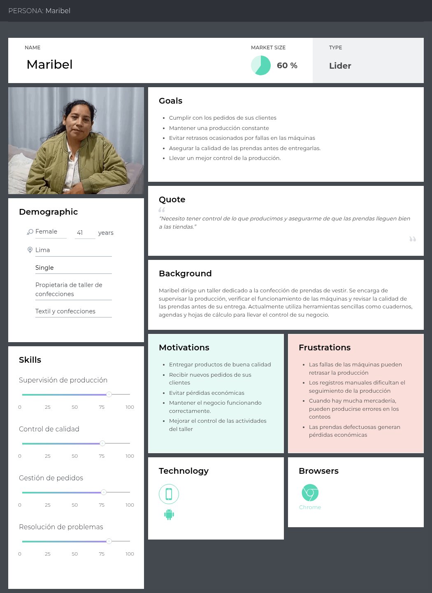

#### Segmento 2: Supervisores y responsables de producción y calidad

### 2.3.2. Task Matrix
A continuación, se presenta el User Task Matrix, el cual reúne las principales tareas realizadas por los usuarios de los dos segmentos objetivo identificados para Fabric. La matriz permite comparar la frecuencia e importancia de cada actividad entre Maribel, representante de las MYPES textiles y de confecciones de Lima, y Betsabé, supervisora y encargada del control de calidad.

| Tareas (Tasks) | Maribel (Segmento 1) - Frecuencia | Maribel (Segmento 1) - Importancia | Betsabé (Segmento 2) - Frecuencia | Betsabé (Segmento 2) - Importancia |
| :--- | :---: | :---: | :---: | :---: |
| Seguimiento del avance de producción | Alta | Muy Alta | Muy alta | Muy alta |
| Verificación de calidad de prendas | Alta | Muy Alta | Muy alta | Muy alta |
| Verificación de medidas y fichas técnicas | Media | Alta | Alta | Muy alta |
| Coordinación de labores y operarios | Alta | Alta | Alta | Alta |
| Detección de operaciones críticas | Media | Alta | Alta | Muy alta |
| Verificación y detección de fallas en máquinas | Media | Alta | Alta | Muy alta |
| Recopilación de información ante incidencias | Media | Alta | Media | Muy alta |

### 2.3.3. Journey Mapping
En esta sección se presentan los User Journey Maps en su versión "As-Is", elaborados para cada User Persona. Estos mapas representan las actividades que realizan actualmente los usuarios y permiten identificar sus principales necesidades, dificultades y puntos de fricción durante los procesos de producción y control de calidad.

#### User Persona 1: 

#### User Persona 2: Betsabé
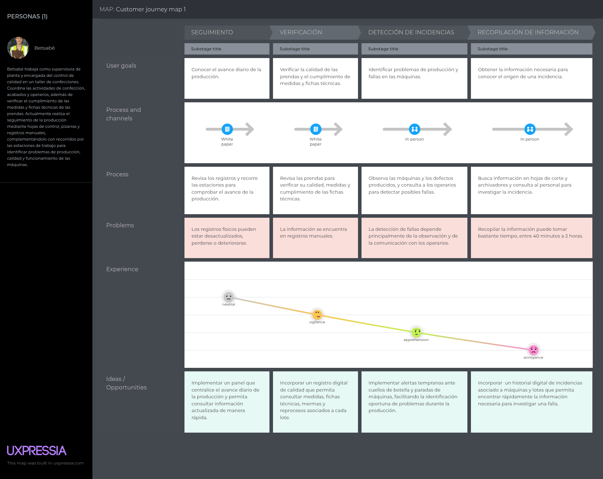

### 2.3.4. Empathy Mapping
Para la elaboración de los Empathy Maps, se analizaron las entrevistas de cada User Persona considerando qué piensa y siente, qué oye, qué ve y qué dice y hace durante sus actividades. A partir de este análisis, se identificaron sus principales Pains, relacionados con los registros manuales, la información desactualizada y la dificultad para detectar incidencias, así como sus Gains, enfocados en mejorar el acceso a la información y el seguimiento de la producción.
#### User Persona 1:
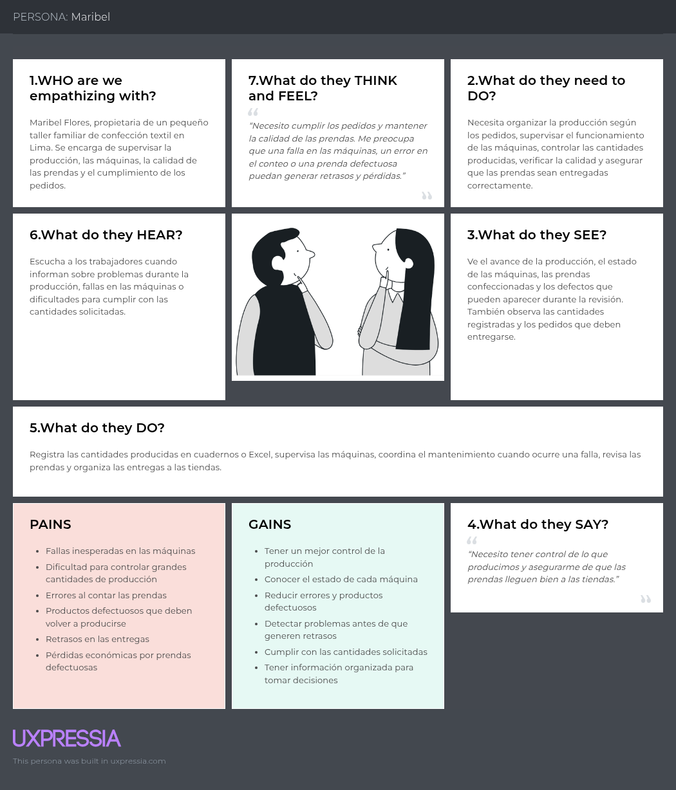

#### User Persona 2: Betsabé
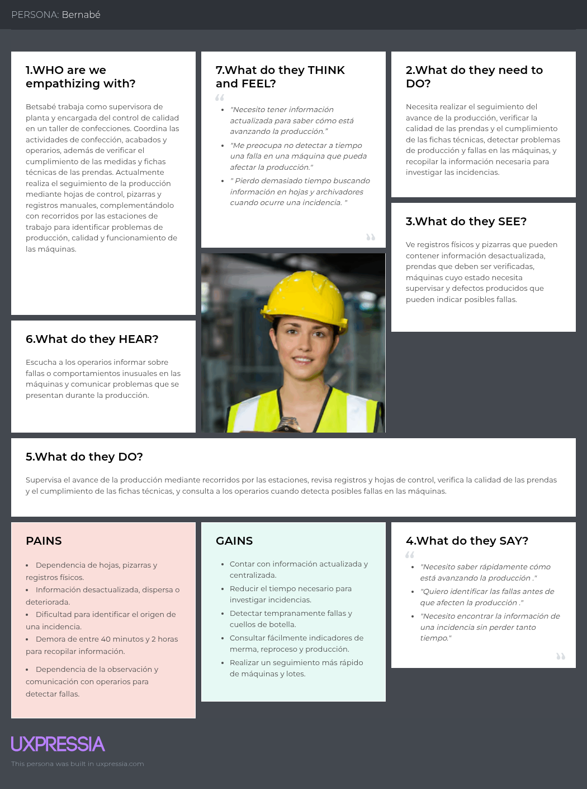

### 2.3.5. As-Is Scenario Mapping

#### User Persona 1: 

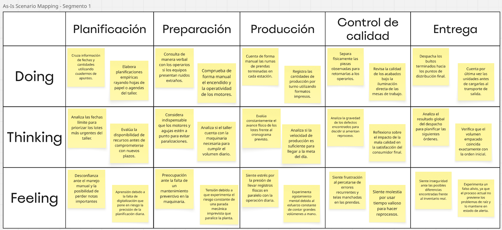

#### User Persona 2:

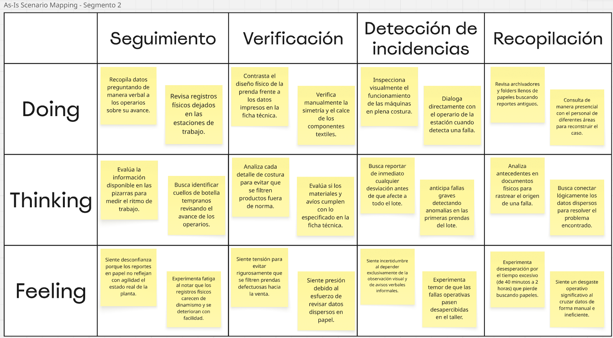
 
  
  
  

 # 2.4. Big picture event storming

En esta sección presentamos el Big Picture Event Storming, es una sesión colaborativa que tuvimos como equipo para enfocarnos en entender el dominio del negocio en general, anotando eventos significativos relacionados al proceso de corte y confección y sus relaciones. Todo este proceso fue hecho en Miro, por su facilidad de uso colaborativo y comrensión de los procesos de dominio. A continuación, se evidencia el proceso realizado por el equipo.

 

**1. Domain events**

    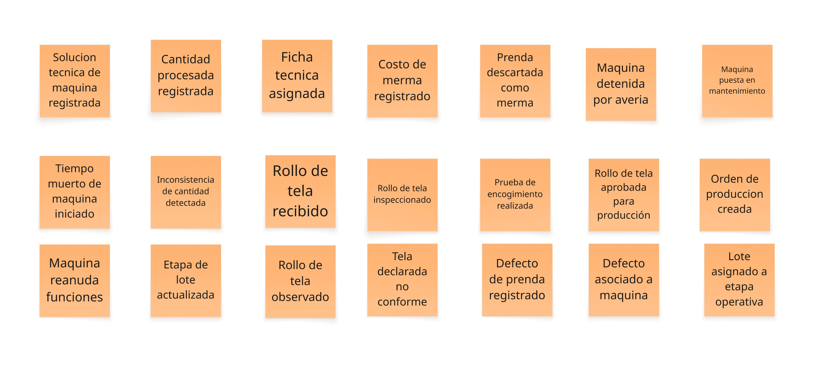

 

En esta primera parte, nos reunimos para identificar los principales eventos que conforman todos los procesos de confección, teniendo en cuenta situaciones en las que el proceso se finaliza con éxito y cuando se presentan incovenientes con máquinas o mala calidad de tela que afectan a la producción textil. Estos eventos fueron revisados por el equipo y corroborados por personas que trabajan en el sector para así conservar los eventos que realmente impactan en el proceso de confección. 

 

**2. Orden Cronológico de Domain Events**

    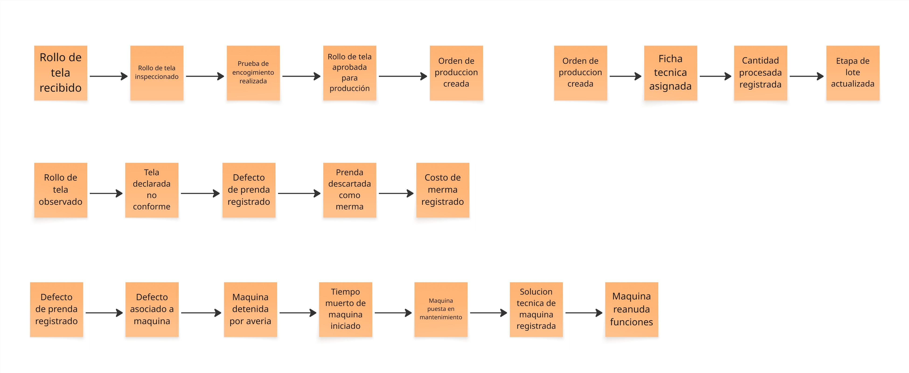

 

Luego, ordenamos los procesos que se siguen según el protocolo de producción en confección de telas. Formando así cuatro bloques principales que representan la **recepción e inspección de telas**, **Creación y ejecución del lote**, **Control de calidad y defectos en máquinas o rollos** y la **gestión de máquinas**.

 

**3. Incorporación de Commands**

    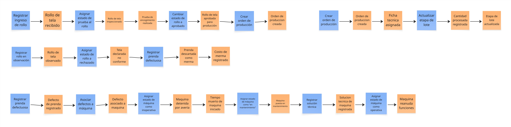

 

Una vez ordenados los domain events cronológicamente, identificamos los Commands que los disparan. Un Command representa una acción explícita que un actor del negoci o acción del sistema ejecuta, y que tiene como consecuencia uno o más domain events. En el tablero de flujo, los Commands se representan con post-its azules y se colocan antes de los eventos que producen, con una flecha que indica la relación causal. 

 

**4. Incorporación de Actors**

    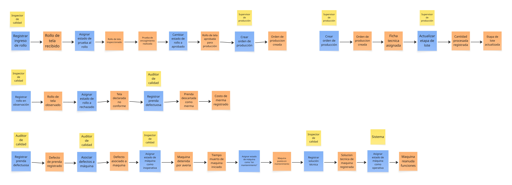

 

En esta etapa identificamos a los actores que son responsables de la ejecución de los principales Commands.Los Actors están representados por posts-its de color amarillo y ubicados sobre los commands correspondientes, de esta manera podemos visualizar con precisión a los actores que intervienen en cada uno de los procesos.

**5. Incorporación de Business Policies**

    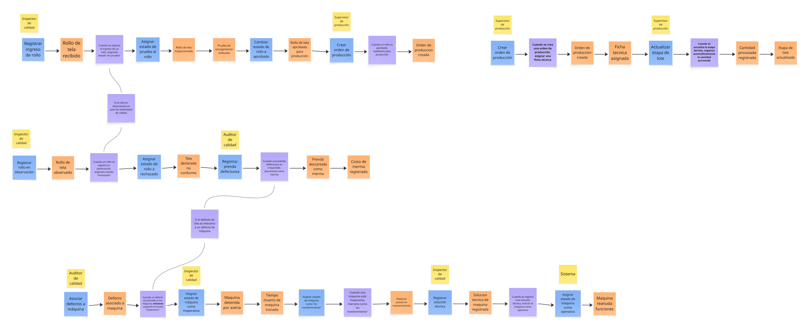

 

Por último, incluimos los business policies, estan representadas por post-its morados. En conjunto, estas policies garantizan que el flujo de creación y actualización de lotes sea consistente, trazable y validado, reduciendo la dependencia de verificaciones manuales y evitando que se ejecuten transiciones con información incompleta o inconsistente.

## 2.5. Ubiquitous language

En esta sección reuniremos los términos del dominio textil y de confecciones que se usan de manera recurrente en Fabric, tanto de la documentación como de la interfaz del producto. El propósito es que todos los miembros del equipo, stakeholders y usuarios comprendan el vocabulario y asi evitar ambiguedades al referirse a procesos u objetos de negocio.

 

| Término (EN) | Término (ES) | Definición |
|---|---|---|
| **Batch** | Lote | Conjunto de prendas que se producen juntas a partir de una misma orden, con un identificador único, un modelo definido y una cantidad proyectada. Es la unidad principal de trazabilidad en Fabric. |
| **Batch Status** | Estado del lote | Situación actual de un lote dentro del proceso productivo. Los estados válidos son: Pending Cut, In Cutting, In Sewing, In Finishing, Completed, Delayed, On Hold, Cancelled. |
| **Bottleneck** | Cuello de botella | Etapa del proceso productivo donde se acumula trabajo y se retrasa el flujo normal de producción, generalmente por capacidad limitada o por fallas recurrentes. |
| **Cutting** | Corte | Etapa del proceso productivo en la que se cortan las piezas de tela según el patrón del modelo, a partir de los rollos previamente aprobados. |
| **Defect** | Defecto | Imperfección detectada en una prenda durante o después de su confección. Los tipos considerados en Fabric son: fabric defect, seam defect, measurement defect, finishing defect, trim defect. |
| **Defect Rate** | Tasa de defectos | Porcentaje de prendas con defectos respecto al total de prendas producidas en un lote o período. |
| **Downtime** | Tiempo muerto | Tiempo durante el cual una máquina permanece inoperativa por falla, mantenimiento o intervención técnica. |
| **Fabric Roll** | Rollo de tela | Unidad de tela recibida del proveedor que se inspecciona antes de su uso en corte. Cada rollo tiene un identificador, un proveedor y una longitud determinada. |
| **Fabric Inspection** | Inspección de tela | Proceso mediante el cual se verifican las condiciones de un rollo de tela (tono, ancho, longitud, defectos) antes de autorizar su uso en corte. |
| **Finishing** | Acabado | Etapa final del proceso productivo en la que se realizan los detalles finales de la prenda (planchado, revisión, empaquetado). |
| **Garment** | Prenda | Producto textil terminado o en proceso de confección. Es el resultado final del proceso productivo del lote. |
| **Inspection** | Inspección | Verificación formal de las condiciones de un rollo de tela o de una prenda. Puede ser de tela (fabric inspection) o de calidad (quality inspection). |
| **Lot Movement** | Movimiento de lote | Registro de la transición de un lote entre etapas del proceso productivo, incluyendo cantidad, fecha, hora y responsable. |
| **Machine** | Máquina | Equipo de confección utilizado en el proceso productivo (recta, remalladora, recubridora, etc.). Cada máquina tiene un código único y un estado operativo. |
| **Machine Status** | Estado de máquina | Situación operativa actual de una máquina. Los estados válidos son: Operational, In Maintenance, Stopped. |
| **Maintenance** | Mantenimiento | Intervención técnica realizada sobre una máquina para restablecer su operatividad o prevenir fallas. Puede ser correctivo o preventivo. |
| **MYPE** | MYPE | Micro y Pequeña Empresa. En Fabric, se refiere al segmento objetivo principal: talleres textiles y de confecciones de Lima Metropolitana, especialmente de Gamarra. |
| **Operator** | Operario | Persona que participa directamente en el proceso productivo (corte, confección, acabado). Puede ser asignado a uno o más lotes. |
| **Pattern** | Patrón | Molde o plantilla que define las piezas de tela que deben cortarse para un modelo específico. |
| **Production Batch** | Lote de producción | Sinónimo de Batch. Conjunto de prendas producidas bajo una misma orden, con un ID único. |
| **Quality Control** | Control de calidad | Conjunto de actividades destinadas a verificar que las prendas cumplan con los estándares definidos. Incluye inspecciones, registro de defectos y dictámenes. |
| **Reprocess** | Reproceso | Acción de corregir una prenda defectuosa que puede ser reparada, en lugar de descartarla como merma. |
| **Scrap** | Merma | Prenda o material descartado definitivamente por no poder ser reparado. Genera una pérdida económica para el taller. |
| **Seam** | Costura | Unión de dos o más piezas de tela mediante puntadas. Es una de las etapas más críticas del proceso de confección. |
| **Sewing** | Confección | Etapa del proceso productivo en la que se cosen las piezas cortadas para formar la prenda. |
| **Technical Sheet** | Ficha técnica | Documento que describe las especificaciones de un modelo, como: tipo de tela, medidas, tolerancias, avíos y procesos. |
| **Traceability** | Trazabilidad | Capacidad de seguir el historial de un lote desde su creación hasta su entrega, identificando cada etapa, cantidad, fecha y responsable. |
| **Trim** | Avío | Elemento complementario de una prenda (botones, cierres, etiquetas, hilos). Los defectos asociados se registran como trim defect. |
| **Waste** | Desperdicio | Material sobrante del proceso productivo (retazos de tela, hilos) que no puede reutilizarse. Se diferencia de la merma porque no corresponde a una prenda defectuosa. |
| **Weaving** | Tejido | Estructura de la tela formada por el cruce de hilos (urdimbre y trama). Su calidad influye directamente en la calidad final de la prenda. |

# Capítulo III: Requirements Specification

## 3.1. User Stories

| Epic | Título | Descripción |
|---|---|---|
| EP001 | Production Batch Tracking and Traceability | Como supervisor, quiero generar IDs únicos para cada lote y monitorear su avance en todas las etapas para mantener la trazabilidad y evitar descuadres de mercadería. |
| EP002 | Quality Inspection | Como inspector de calidad, quiero registrar las inspecciones de los rollos de tela que recibimos antes del tendido y corte para asegurar la calidad de los materiales. |
| EP003 | Quality Assurance and Defect Management | Como supervisor de calidad, quiero registrar, clasificar y vincular los defectos encontrados en las prendas a lotes, máquinas y operarios para agilizar la búsqueda de problemas y evitar rehacer los productos. |
| EP004 | Sewing Machinery Tracking | Como supervisor de producción, quiero registrar las fallas en la maquinaria y calcular los tiempos muertos acumulados para evitar cuellos de botella y gestionar los mantenimientos preventivos de forma adecuada. |
| EP005 | Dashboard and Alerts | Como dueño o supervisor, quiero contar con un dashboard con parámetros clave y alertas visuales para detectar desviaciones a tiempo y facilitar la toma de decisiones en el momento. |
| EP006 | Landing Page | Como visitante, quiero conocer la propuesta de valor, funcionalidades y beneficios de Fabric, para comprender cómo la plataforma puede ayudar a mejorar la gestión de producción y calidad de una empresa textil. |
| EP007 | User Management and Authentication | Como usuario, quiero registrarme, iniciar sesión y gestionar mi cuenta para acceder a las funcionalidades de Fabric según mi rol dentro del taller. |
| EP008 | RESTful API | Como developer, quiero exponer endpoints REST para que el frontend y otros clientes consuman la información de Fabric de forma segura y estandarizada. |

 

| Story ID | Título | Descripción | Criterios de Aceptación | Relacionado con (Epic ID) |
|---|---|---|---|---|
| US001 | Creación y asignación de ID a lote de producción | Como supervisor, quiero crear un nuevo lote de producción ingresando el modelo de prenda, cantidad proyectada y ficha técnica para asignarle un ID único y dar inicio a su trazabilidad en el taller. | **Escenario 1:** Dado que el supervisor completa los campos obligatorios del lote (modelo, cantidad estimada y fecha de entrega), cuando confirma la creación del lote, entonces el sistema genera un ID único, registra el lote en estado "Pendiente de Corte" y confirma la operación.  **Escenario 2:** Dado que el supervisor omite uno o más campos obligatorios, cuando intenta crear el lote, entonces el sistema rechaza la operación e indica los campos faltantes. | EP001 |
| US002 | Actualización y transición de etapas operativas del lote | Como supervisor de producción, quiero registrar la transición del lote entre etapas indicando las cantidades procesadas para monitorear el avance real y detectar retenciones. | **Escenario 1:** Dado que un lote se encuentra en la etapa "Corte" con 500 piezas finalizadas, cuando el supervisor registra su paso a la etapa "Confección" indicando la cantidad recibida, entonces el sistema actualiza la etapa del lote y registra la fecha y hora del cambio.  **Escenario 2:** Dado que el supervisor ingresa una cantidad de piezas superior a la registrada en la etapa anterior, cuando confirma la transición, entonces el sistema advierte la inconsistencia y solicita rectificar el conteo antes de autorizar el cambio. | EP001 |
| US003 | Registro e inspección inicial de rollos de tela entrantes | Como inspector de calidad, quiero registrar los datos de cada rollo de tela recibido para verificar su conformidad inicial antes de autorizar su tendido en la mesa de corte. | **Escenario 1:** Dado que el inspector verifica que un rollo de tela cumple con la muestra del cliente, cuando registra los datos del rollo y lo declara conforme, entonces el sistema lo marca como "Disponible para Corte".  **Escenario 2:** Dado que el inspector detecta variaciones severas de matiz o huecos en la trama, cuando marca el rollo como observado e ingresa el motivo, entonces el sistema bloquea su asignación a lotes de corte y registra la observación asociada al rollo. | EP002 |
| US004 | Registro de prueba de encogimiento y lavado de muestra de tela | Como supervisor de calidad, quiero registrar los resultados de las pruebas de encogimiento porcentual de una muestra de tejido para asegurar que cumple con las tolerancias de la ficha técnica antes de cortar. | **Escenario 1:** Dado que el inspector registra las dimensiones previas y posteriores al lavado de una probeta, cuando el sistema calcula un encogimiento menor o igual al 5%, entonces la prueba se marca como "Aprobada" y el rollo queda habilitado para patronaje.  **Escenario 2:** Dado que el encogimiento calculado supera el margen definido en la ficha técnica, cuando el inspector registra el resultado, entonces el sistema marca la tela como "No Conforme" y registra la observación correspondiente. | EP002 |
| US005 | Registro y clasificación de defectos en prendas confeccionadas | Como auditor de calidad, quiero registrar las prendas con fallas detectadas en línea vinculándolas al lote y máquina responsable para identificar rápidamente la causa del defecto. | **Escenario 1:** Dado que el auditor identifica una prenda con puntadas abiertas en el lote activo, cuando registra el tipo de defecto, la máquina asociada y la cantidad de prendas observadas, entonces el sistema descuenta la cantidad observada del total de prendas aprobadas del lote y actualiza su tasa de defectos.  **Escenario 2:** Dado que el auditor detecta una mancha de origen impreciso, cuando registra la prenda marcando "Origen Desconocido", entonces el sistema guarda el registro con la etiqueta "En Evaluación" para su posterior revisión. | EP003 |
| US006 | Destino de prendas defectuosas a reproceso o merma definitiva | Como supervisor de calidad, quiero dictaminar si una prenda observada puede ser reparada o queda para descarte para cuantificar los costos de corrección y ajustar la liquidación final del lote. | **Escenario 1:** Dado que la prenda tiene una costura remediable, cuando el supervisor registra la prenda para reproceso e indica la estación de corrección asignada, entonces el sistema agrega la prenda a la cola de pendientes de ajuste sin darla de baja del inventario final proyectado.  **Escenario 2:** Dado que la tela sufrió un rasgado irreparable durante la costura, cuando el supervisor registra la prenda como descartada, entonces el sistema descuenta la prenda del saldo comercializable del lote y registra su costo en el total de mermas acumuladas. | EP003 |
| US007 | Reporte de averías e interrupción operativa de máquinas de confección | Como supervisor de producción, quiero registrar la detención de una máquina de coser especificando el código de máquina, tipo de falla y hora de paro para solicitar asistencia técnica inmediata. | **Escenario 1:** Dado que una máquina presenta rotura de aguja o traba mecánica, cuando el supervisor registra su código, selecciona el tipo de falla y confirma la parada, entonces el sistema cambia el estado de la máquina a "En Mantenimiento", activa el contador de tiempo muerto y notifica al área técnica.  **Escenario 2:** Dado que el supervisor intenta registrar la detención sin especificar el origen de la avería, cuando confirma el registro, entonces el sistema impide la acción y exige seleccionar al menos una categoría de falla técnica. | EP004 |
| US008 | Reanudación de operatividad y registro del tiempo muerto de máquina | Como supervisor, quiero registrar la reanudación de actividades de una máquina intervenida indicando las piezas sustituidas o calibradas para calcular el tiempo muerto acumulado y evaluar el rendimiento mecánico. | **Escenario 1:** Dado que el técnico concluye la calibración y prueba la máquina, cuando el supervisor registra la reanudación e ingresa la solución aplicada, entonces el sistema detiene el temporizador, guarda los minutos de inactividad y restablece la máquina al estado "Operativa".  **Escenario 2:** Dado que el supervisor accede al detalle de una máquina con fallas recurrentes, cuando solicita su histórico semanal, entonces el sistema lista cronológicamente las paradas, la causa de cada falla y el total acumulado de horas no productivas. | EP004 |
| US009 | Visualización de métricas de avance y productividad diaria en Dashboard | Como administrador del taller o supervisor general, quiero visualizar en un panel centralizado las prendas producidas por hora, el avance de lotes y el porcentaje de cumplimiento diario para tomar decisiones operativas sin recurrir a cuadernos o conteos físicos. | **Escenario 1:** Dado que el usuario accede al dashboard de Fabric, cuando la vista carga, entonces el sistema muestra los indicadores: total de prendas elaboradas en el día, promedio de prendas por hora y cantidad de lotes por etapa operativa.  **Escenario 2:** Dado que el usuario necesita analizar el rendimiento de un lote o de un día anterior, cuando aplica los filtros de búsqueda, entonces el sistema recalcula los indicadores y muestra únicamente los datos seleccionados. | EP005 |
| US010 | Alertas visuales de mermas y cuellos de botella | Como supervisor de planta, quiero recibir alertas cuando la tasa de reprocesos, mermas o tiempos muertos supere los umbrales de tolerancia para intervenir a tiempo en la línea productiva. | **Escenario 1:** Dado que el porcentaje acumulado de prendas defectuosas en un lote supera el umbral máximo tolerado (mayor al 5%), cuando se registra una nueva prenda defectuosa, entonces el sistema marca el lote como crítico y genera una alerta en el panel.  **Escenario 2:** Dado que un lote mantiene una tasa de reprocesos menor al 2%, cuando el supervisor consulta su ficha en el panel de control, entonces el sistema lo muestra con indicador de flujo óptimo. | EP005 |
| US011 | Consulta del historial de trazabilidad del lote | Como supervisor de producción, quiero consultar el historial de movimientos de un lote junto con las fechas, cantidades y responsables involucrados, para identificar dónde y cuándo se produce una diferencia durante el proceso productivo. | **Escenario 1:** Dado que el lote tiene movimientos registrados en diferentes etapas de producción, cuando el supervisor consulta su historial de trazabilidad, entonces el sistema retorna los movimientos asociados indicando etapa, cantidad, fecha, hora y responsable.  **Escenario 2:** Dado que existen diferencias entre las cantidades registradas en dos etapas consecutivas, cuando el supervisor consulta el historial del lote, entonces el sistema identifica la diferencia y relaciona las cantidades registradas en ambas etapas.  **Escenario 3:** Dado que el lote no tiene movimientos registrados, cuando el supervisor consulta su historial de trazabilidad, entonces el sistema indica que el lote no posee movimientos registrados. | EP001 |
| US012 | Búsqueda y filtrado de lotes de producción | Como supervisor de producción, quiero buscar y filtrar los lotes registrados por diferentes criterios para localizar rápidamente una orden específica y revisar su información operativa. | **Escenario 1:** Dado que existen múltiples lotes registrados, cuando el supervisor consulta un identificador de lote válido, entonces el sistema retorna únicamente el lote asociado a dicho identificador.  **Escenario 2:** Dado que existen lotes con diferentes estados, fechas y modelos de prenda, cuando el supervisor establece uno o más criterios de búsqueda, entonces el sistema retorna únicamente los lotes que cumplen con dichos criterios.  **Escenario 3:** Dado que ningún lote cumple con los criterios de búsqueda establecidos, cuando el supervisor realiza la consulta, entonces el sistema retorna un conjunto vacío de resultados. | EP001 |
| US013 | Registro de resultados y parámetros de inspección del rollo | Como inspector de calidad, quiero registrar los parámetros evaluados durante la inspección de un rollo de tela para conservar evidencia de las condiciones en las que fue recibido el material. | **Escenario 1:** Dado que el rollo está registrado y los parámetros obligatorios de inspección son válidos, cuando el inspector registra los resultados de tono, ancho, longitud y defectos, entonces el sistema almacena los valores asociados al rollo.  **Escenario 2:** Dado que uno o más parámetros obligatorios no están registrados, cuando el inspector intenta completar la inspección, entonces el sistema rechaza el registro y no almacena la inspección incompleta.  **Escenario 3:** Dado que el inspector registra un valor de longitud o ancho igual o menor que cero, cuando intenta completar la inspección, entonces el sistema rechaza el registro y no almacena los valores inválidos. | EP002 |
| US014 | Consulta de resultados históricos de inspecciones de tela | Como supervisor de calidad, quiero consultar los resultados históricos de las inspecciones realizadas a los rollos de tela para identificar materiales que presentan problemas recurrentes. | **Escenario 1:** Dado que existen inspecciones registradas para diferentes rollos, cuando el supervisor consulta el historial, entonces el sistema retorna los resultados asociados a cada inspección, incluyendo fecha, rollo y observaciones.  **Escenario 2:** Dado que existen inspecciones correspondientes a diferentes proveedores, lotes y resultados, cuando el supervisor establece uno o más criterios de búsqueda, entonces el sistema retorna únicamente las inspecciones que cumplen con dichos criterios.  **Escenario 3:** Dado que ninguna inspección cumple con los criterios establecidos, cuando el supervisor realiza la consulta, entonces el sistema retorna un conjunto vacío de resultados. | EP002 |
| US015 | Asociación de evidencias a defectos de calidad | Como auditor de calidad, quiero asociar evidencias a los defectos encontrados en las prendas para facilitar su revisión y respaldar las acciones correctivas tomadas. | **Escenario 1:** Dado que existe un defecto registrado, cuando el auditor asocia un archivo en formato JPG o PNG de máximo 5 MB como evidencia, entonces el sistema almacena la evidencia vinculada al defecto correspondiente.  **Escenario 2:** Dado que existe un defecto que no tiene evidencias asociadas, cuando el supervisor consulta su información, entonces el sistema indica que el defecto no posee evidencias registradas.  **Escenario 3:** Dado que el auditor proporciona un archivo cuyo formato o tamaño no corresponde a los permitidos, cuando intenta asociarlo al defecto, entonces el sistema rechaza el archivo y no lo almacena. | EP003 |
| US016 | Identificación de defectos recurrentes por lote y máquina | Como supervisor de calidad, quiero consultar los defectos registrados agrupados por tipo, lote y máquina para identificar patrones recurrentes y priorizar acciones correctivas. | **Escenario 1:** Dado que existen múltiples defectos registrados, cuando el supervisor consulta los defectos de un período determinado, entonces el sistema calcula y retorna la cantidad de incidencias agrupadas por tipo de defecto.  **Escenario 2:** Dado que existen defectos asociados a diferentes máquinas y lotes, cuando el supervisor consulta los defectos correspondientes a una máquina determinada, entonces el sistema retorna únicamente las incidencias asociadas a dicha máquina y sus tipos de defecto.  **Escenario 3:** Dado que no existen defectos asociados a los criterios de búsqueda establecidos, cuando el supervisor realiza la consulta, entonces el sistema retorna un conjunto vacío de resultados. | EP003 |
| US017 | Consulta del estado actual de las máquinas de confección | Como supervisor de producción, quiero consultar el estado operativo de las máquinas de confección para identificar cuáles se encuentran disponibles, detenidas o en mantenimiento. | **Escenario 1:** Dado que existen máquinas registradas, cuando el supervisor consulta su estado operativo, entonces el sistema retorna el estado actual de cada máquina registrada.  **Escenario 2:** Dado que una máquina tiene una interrupción operativa registrada, cuando el supervisor consulta su estado, entonces el sistema retorna dicha máquina como detenida y la relaciona con la incidencia correspondiente.  **Escenario 3:** Dado que no existe una máquina asociada al código consultado, cuando el supervisor realiza la consulta, entonces el sistema indica que no existe una máquina registrada con dicho código. | EP004 |
| US018 | Registro y consulta del historial de mantenimiento | Como supervisor de producción, quiero registrar y consultar los mantenimientos realizados a cada máquina para conocer las intervenciones efectuadas y apoyar la planificación del mantenimiento preventivo. | **Escenario 1:** Dado que una máquina está registrada y requiere una intervención, cuando el supervisor registra el mantenimiento realizado, entonces el sistema almacena la intervención asociada a la máquina, incluyendo fecha y observaciones.  **Escenario 2:** Dado que una máquina posee intervenciones de mantenimiento registradas, cuando el supervisor consulta su historial, entonces el sistema retorna las intervenciones ordenadas cronológicamente con sus fechas y observaciones.  **Escenario 3:** Dado que el registro de mantenimiento no contiene la máquina o la fecha de intervención, cuando el supervisor intenta registrar el mantenimiento, entonces el sistema rechaza el registro y no almacena información incompleta. | EP004 |
| US019 | Visualización de indicadores de defectos, reprocesos y merma | Como supervisor de calidad, quiero consultar indicadores relacionados con defectos, reprocesos y merma para evaluar el comportamiento de la calidad de los lotes y detectar áreas que requieren atención. | **Escenario 1:** Dado que existen registros de defectos, reprocesos y merma durante un período determinado, cuando el supervisor consulta los indicadores, entonces el sistema calcula y retorna los valores correspondientes al período.  **Escenario 2:** Dado que existen registros asociados a diferentes lotes, cuando el supervisor establece un lote como criterio de consulta, entonces el sistema calcula y retorna únicamente los indicadores correspondientes a dicho lote.  **Escenario 3:** Dado que no existen registros de defectos, reprocesos o merma para el período o lote consultado, cuando el supervisor solicita los indicadores, entonces el sistema indica que no existen datos disponibles para realizar el cálculo. | EP005 |
| US020 | Generación de alertas por acumulación de tiempo muerto | Como supervisor de producción, quiero recibir alertas cuando una máquina acumule un tiempo muerto superior al límite establecido para identificar posibles problemas recurrentes y tomar acciones preventivas. | **Escenario 1:** Dado que una máquina tiene un límite máximo de tiempo muerto configurado, cuando el tiempo muerto acumulado supera dicho límite, entonces el sistema genera una alerta asociada a la máquina e identifica el tiempo acumulado.  **Escenario 2:** Dado que una máquina mantiene su tiempo muerto acumulado dentro del límite establecido, cuando el sistema evalúa su tiempo muerto, entonces no genera una alerta por exceso de tiempo.  **Escenario 3:** Dado que una máquina no posee registros de paradas o tiempos muertos, cuando el sistema evalúa su tiempo muerto, entonces no genera una alerta y determina que no existen datos suficientes para la evaluación. | EP005 |
| US021 | Visualización de Hero Section | Como visitante, quiero visualizar un mensaje claro sobre el valor de Fabric acompañado de una imagen representativa para comprender rápidamente qué ofrece la solución. | **Escenario 1:** Dado que el visitante ingresa a la Landing Page, cuando la página carga, entonces se muestra el nombre de Fabric y una frase que resume su propuesta de valor.  **Escenario 2:** Dado que el visitante visualiza el Hero Section, cuando la página carga, entonces se muestra una imagen representativa del producto junto al mensaje principal.  **Escenario 3:** Dado que la imagen representativa no está disponible, cuando la página carga, entonces se muestra un fondo alternativo y el mensaje principal se mantiene visible. | EP006 |
| US022 | Visualización de la propuesta de valor general | Como visitante, quiero conocer la propuesta de valor general de Fabric para comprender qué problema resuelve y a quién está dirigida la solución. | **Escenario 1:** Dado que el visitante accede a la Landing Page de Fabric, cuando visualiza la sección principal, entonces la página muestra el nombre de Fabric y una frase que resume su propuesta de valor.  **Escenario 2:** Dado que el visitante revisa la propuesta de valor, cuando continúa explorando el contenido, entonces la página indica a qué tipo de empresas está dirigida la solución (MYPE textiles). | EP006 |
| US023 | Visualización de funcionalidades | Como visitante, quiero conocer las principales funcionalidades de Fabric para identificar las herramientas que ofrece la plataforma para la gestión de los procesos textiles. | **Escenario 1:** Dado que el visitante llega a la sección de funcionalidades, cuando visualiza su contenido, entonces se muestran las funcionalidades: gestión de lotes, control de calidad, registro de defectos, seguimiento de máquinas, dashboard y alertas.  **Escenario 2:** Dado que el visitante revisa las funcionalidades, cuando visualiza cada una, entonces se muestra su nombre acompañado de una breve descripción.  **Escenario 3:** Dado que una funcionalidad no tiene descripción disponible, cuando el visitante la visualiza, entonces se muestra solo su nombre sin bloquear el resto del contenido. | EP006 |
| US024 | Visualización de beneficios | Como visitante, quiero conocer los principales beneficios de Fabric para comprender cómo la solución puede contribuir a la gestión de una empresa textil. | **Escenario 1:** Dado que el visitante llega a la sección de beneficios, cuando visualiza su contenido, entonces se muestran los beneficios: reducción de mermas, trazabilidad de lotes, detección temprana de defectos y mejora en la toma de decisiones.  **Escenario 2:** Dado que el visitante se encuentra en la sección de beneficios, cuando revisa la información presentada, entonces cada beneficio se muestra acompañado de un ícono o imagen representativa que facilite su comprensión. | EP006 |
| US025 | Navegación por la Landing Page | Como visitante, quiero navegar fácilmente por las secciones de la Landing Page para encontrar rápidamente la información que deseo conocer sobre Fabric. | **Escenario 1:** Dado que el visitante se encuentra en la Landing Page, cuando selecciona una opción del menú de navegación, entonces la página lo dirige a la sección correspondiente.  **Escenario 2:** Dado que el visitante se encuentra visualizando una sección, cuando selecciona otra opción del menú, entonces la página se desplaza hacia la sección seleccionada.  **Escenario 3:** Dado que el visitante accede a una sección inexistente o con enlace roto, cuando selecciona la opción, entonces la página muestra un mensaje indicando que el contenido no está disponible. | EP006 |
| US026 | Visualización del equipo | Como visitante, quiero conocer al equipo detrás de Fabric para identificar a las personas responsables del desarrollo de la solución. | **Escenario 1:** Dado que el visitante llega a la sección del equipo, cuando visualiza su contenido, entonces se muestran los integrantes de GlitchLab.  **Escenario 2:** Dado que el visitante revisa la sección del equipo, cuando visualiza a cada integrante, entonces se muestra su nombre acompañado de la información definida para su presentación. | EP006 |
| US027 | Envío de formulario de solicitud de demo | Como visitante, quiero completar un formulario para solicitar una demostración y recibir información personalizada sobre Fabric. | **Escenario 1:** Dado que el visitante accede al formulario de solicitud de demo, cuando completa los campos obligatorios (Nombre, Correo electrónico, Teléfono y Empresa) y confirma el envío, entonces el sistema registra la solicitud y muestra un mensaje de confirmación.  **Escenario 2:** Dado que el visitante se encuentra en el formulario de solicitud de demo, cuando intenta enviarlo sin completar uno o más campos obligatorios, entonces el sistema no permite el envío e indica los campos requeridos.  **Escenario 3:** Dado que el visitante ingresa un correo electrónico con formato inválido, cuando intenta enviar el formulario, entonces el sistema rechaza el envío y solicita un correo válido. | EP006 |
| US028 | Acceso a Términos y Condiciones | Como visitante, quiero acceder a los Términos y Condiciones de Fabric para conocer las condiciones de uso de la plataforma. | **Escenario 1:** Dado que el visitante se encuentra en la Landing Page, cuando llega al Footer, entonces visualiza el enlace "Términos y Condiciones" disponible para su acceso.  **Escenario 2:** Dado que el visitante visualiza el enlace "Términos y Condiciones" en el Footer, cuando hace clic en él, entonces se muestra el contenido completo de los Términos y Condiciones de Fabric. | EP006 |
| US029 | Visualización de la sección de problema para el segmento supervisores de producción | Como visitante del segmento supervisores de producción, quiero conocer la problemática que enfrentan las MYPE textiles en el seguimiento de producción para entender por qué Fabric es una solución relevante para mi rol. | **Escenario 1:** Dado que el visitante del segmento supervisores de producción accede a la sección de problema, cuando visualiza su contenido, entonces la página describe la problemática del seguimiento manual de lotes y la falta de trazabilidad.  **Escenario 2:** Dado que el visitante del segmento supervisores de producción revisa la sección de problema, cuando continúa leyendo, entonces la página presenta datos o contexto sobre la situación del sector textil en Lima. | EP006 |
| US030 | Visualización de la sección de solución para el segmento encargados de calidad | Como visitante del segmento encargados de calidad, quiero conocer cómo Fabric resuelve la problemática del control de calidad en el sector textil para evaluar si la plataforma se adapta a mi rol. | **Escenario 1:** Dado que el visitante del segmento encargados de calidad accede a la sección de solución, cuando visualiza su contenido, entonces la página describe cómo Fabric centraliza el registro de inspecciones y la clasificación de defectos.  **Escenario 2:** Dado que el visitante del segmento encargados de calidad revisa la sección de solución, cuando compara el contenido con la sección de problema, entonces la página muestra la relación entre la problemática descrita y la solución propuesta. | EP006 |
| US031 | Visualización de la Landing Page para el segmento supervisores de producción | Como visitante del segmento supervisores de producción, quiero conocer cómo Fabric facilita el seguimiento de lotes y la detección de retrasos para evaluar si la plataforma se adapta a mi rol. | **Escenario 1:** Dado que el visitante del segmento supervisores de producción accede a la Landing Page, cuando visualiza el contenido, entonces la página presenta información relacionada con el seguimiento de lotes y la detección de retrasos.  **Escenario 2:** Dado que el visitante del segmento supervisores de producción revisa los beneficios, cuando visualiza su contenido, entonces la página muestra beneficios asociados a la trazabilidad y al control de la producción. | EP006 |
| US032 | Visualización de la Landing Page para el segmento encargados de calidad | Como visitante del segmento encargados de calidad, quiero conocer cómo Fabric facilita el registro de inspecciones y la identificación de defectos para evaluar si la plataforma se adapta a mi rol. | **Escenario 1:** Dado que el visitante del segmento encargados de calidad accede a la Landing Page, cuando visualiza el contenido, entonces la página presenta información relacionada con el registro de inspecciones y la clasificación de defectos.  **Escenario 2:** Dado que el visitante del segmento encargados de calidad revisa los beneficios, cuando visualiza su contenido, entonces la página muestra beneficios asociados a la reducción de reprocesos y mermas. | EP006 |
| US033 | Visualización de la Landing Page para el segmento dueños de MYPE | Como visitante del segmento dueños de MYPE, quiero conocer cómo Fabric contribuye a reducir costos operativos y mejorar la toma de decisiones para evaluar si la plataforma se adapta a mi negocio. | **Escenario 1:** Dado que el visitante del segmento dueños de MYPE accede a la Landing Page, cuando visualiza el contenido, entonces la página presenta información relacionada con la reducción de costos y la mejora en la toma de decisiones.  **Escenario 2:** Dado que el visitante del segmento dueños de MYPE revisa los beneficios, cuando visualiza su contenido, entonces la página muestra beneficios asociados al ahorro económico y a la eficiencia operativa. | EP006 |
| US034 | Solicitud de demo desde el CTA final | Como visitante, quiero acceder al formulario de solicitud de demo desde el CTA final de la Landing Page para iniciar el contacto con el equipo de Fabric. | **Escenario 1:** Dado que el visitante llega al final de la Landing Page, cuando selecciona la opción de solicitar una demo, entonces la página lo dirige al formulario de solicitud.  **Escenario 2:** Dado que el visitante se encuentra en cualquier sección de la Landing Page, cuando selecciona la opción de solicitar una demo, entonces la página lo dirige al formulario de solicitud. | EP006 |
| US035 | Visualización de video about the product | Como visitante, quiero visualizar un video demostrativo de Fabric para comprender de forma rápida y visual cómo funciona la plataforma en un contexto real de taller textil. | **Escenario 1:** Dado que el visitante llega a la sección de video, cuando la sección carga, entonces el sistema muestra un reproductor de video con el contenido demostrativo de Fabric.  **Escenario 2:** Dado que el visitante visualiza el video, cuando selecciona la opción de reproducir, entonces el sistema reproduce el video demostrativo.  **Escenario 3:** Dado que el video no está disponible, cuando el visitante accede a la sección, entonces el sistema muestra un mensaje indicando que el contenido no está disponible y ofrece un enlace alternativo al video en YouTube. | EP006 |
| US036 | Soporte de internacionalización | Como visitante, quiero que la Landing Page esté disponible en idiomas como inglés y español, teniendo el idioma inglés por defecto, para comprender el contenido de Fabric en el idioma que mejor manejo. | **Escenario 1:** Dado que el visitante accede a la Landing Page por primera vez, cuando la página carga, entonces el sistema muestra el contenido en inglés como idioma por defecto.  **Escenario 2:** Dado que el visitante desea cambiar el idioma, cuando selecciona un idioma disponible (español o inglés), entonces el sistema actualiza todo el contenido de la Landing Page al idioma seleccionado.  **Escenario 3:** Dado que el visitante ya seleccionó un idioma en una visita anterior, cuando vuelve a acceder a la Landing Page, entonces el sistema muestra el contenido en el idioma previamente seleccionado.  **Escenario 4:** Dado que una traducción no está disponible para un texto específico, cuando el visitante accede a esa sección, entonces el sistema muestra el contenido en inglés como idioma de respaldo. | EP006 |
| US037 | Registro de nuevo usuario en la aplicación | Como usuario nuevo, quiero registrarme en Fabric proporcionando mis datos básicos y el rol que desempeño en el taller para acceder a las funcionalidades correspondientes a mi perfil. | **Escenario 1:** Dado que el usuario nuevo completa los campos obligatorios (nombre, correo electrónico, contraseña y rol), cuando confirma el registro, entonces el sistema crea la cuenta, asigna el rol seleccionado y confirma la operación.  **Escenario 2:** Dado que el usuario intenta registrarse con un correo electrónico ya existente, cuando confirma el registro, entonces el sistema rechaza la operación e indica que el correo ya está en uso.  **Escenario 3:** Dado que el usuario ingresa una contraseña que no cumple con los requisitos mínimos de seguridad, cuando confirma el registro, entonces el sistema rechaza la operación e indica los requisitos de contraseña. | EP007 |
| US038 | Inicio de sesión de usuario registrado | Como usuario registrado, quiero iniciar sesión con mis credenciales para acceder a las funcionalidades de Fabric según mi rol. | **Escenario 1:** Dado que el usuario ingresa credenciales válidas (correo y contraseña), cuando confirma el inicio de sesión, entonces el sistema autentica al usuario y muestra la vista principal según su rol.  **Escenario 2:** Dado que el usuario ingresa una contraseña incorrecta, cuando confirma el inicio de sesión, entonces el sistema rechaza el acceso e indica que las credenciales son inválidas.  **Escenario 3:** Dado que el usuario intenta iniciar sesión más de 5 veces con credenciales incorrectas, cuando confirma el intento, entonces el sistema bloquea temporalmente el acceso a la cuenta. | EP007 |
| US039 | Cierre de sesión de usuario autenticado | Como usuario registrado, quiero cerrar sesión de forma segura para evitar que terceros accedan a mi cuenta en el mismo dispositivo. | **Escenario 1:** Dado que el usuario tiene una sesión activa, cuando selecciona la opción de cerrar sesión, entonces el sistema invalida la sesión y redirige al usuario a la vista de inicio de sesión.  **Escenario 2:** Dado que el usuario cerró sesión previamente, cuando intenta acceder a una vista protegida, entonces el sistema redirige al usuario a la vista de inicio de sesión. | EP007 |
| US040 | Asignación de operarios a lotes de producción | Como supervisor de producción, quiero asignar operarios a un lote específico indicando la etapa del proceso para registrar responsabilidades y facilitar la trazabilidad. | **Escenario 1:** Dado que un lote está en una etapa activa y existen operarios registrados en el taller, cuando el supervisor asigna uno o más operarios al lote indicando la etapa, entonces el sistema registra la asignación con fecha y hora.  **Escenario 2:** Dado que el supervisor intenta asignar un operario que ya está asignado al mismo lote en la misma etapa, cuando confirma la asignación, entonces el sistema rechaza la operación e indica que el operario ya está asignado.  **Escenario 3:** Dado que el supervisor consulta el detalle de un lote, cuando visualiza las asignaciones, entonces el sistema lista los operarios asignados por etapa con sus fechas. | EP001 |
| US041 | Registro de observaciones en lote | Como supervisor de producción, quiero registrar observaciones o notas en un lote durante su proceso para documentar incidencias o acuerdos que no corresponden a un defecto formal. | **Escenario 1:** Dado que un lote está registrado y el supervisor ingresa una observación con texto, cuando confirma el registro, entonces el sistema almacena la observación asociada al lote con fecha y usuario.  **Escenario 2:** Dado que el supervisor intenta registrar una observación vacía o solo con espacios, cuando confirma el registro, entonces el sistema rechaza la operación e indica que la observación no puede estar vacía.  **Escenario 3:** Dado que el supervisor consulta el detalle de un lote, cuando visualiza las observaciones, entonces el sistema lista las observaciones ordenadas por fecha descendente. | EP001 |
| US042 | Exportación de reportes de producción y calidad | Como supervisor o dueño de MYPE, quiero exportar reportes de producción y calidad en formato PDF o Excel para compartirlos con otros responsables o conservarlos como respaldo. | **Escenario 1:** Dado que el usuario se encuentra en la vista de reportes y existen datos disponibles para el período consultado, cuando selecciona la opción de exportar en formato PDF, entonces el sistema genera el archivo y permite su descarga.  **Escenario 2:** Dado que el usuario selecciona la exportación en formato Excel, cuando confirma la acción, entonces el sistema genera el archivo con los datos correspondientes y permite su descarga.  **Escenario 3:** Dado que no existen datos disponibles para el período seleccionado, cuando el usuario intenta exportar el reporte, entonces el sistema rechaza la acción e indica que no hay información para exportar. | EP005 |
| US043 | Actualización de datos del perfil del usuario | Como usuario registrado, quiero actualizar mis datos personales (nombre, teléfono y rol) para mantener mi información vigente en el sistema. | **Escenario 1:** Dado que el usuario accede a su perfil y modifica uno o más campos permitidos (nombre o teléfono), cuando confirma los cambios, entonces el sistema actualiza la información y confirma la operación.  **Escenario 2:** Dado que el usuario ingresa un número de teléfono con formato inválido, cuando confirma los cambios, entonces el sistema rechaza la actualización e indica el formato esperado.  **Escenario 3:** Dado que el usuario intenta modificar su rol sin permisos de administrador, cuando confirma los cambios, entonces el sistema rechaza la operación e indica que no tiene autorización. | EP007 |

## 3.2. Impact Mapping

Para esta sección, se presenta el Impact Mapping desarrollado para Fabric, elaborado mediante la herramienta UXPressia. Esto nos permite conectar y sincronizar los esfuerzos de desarrollo del software con los objetivos comerciales de las MYPE textiles y de confecciones.

Para construir este mapa, se definieron metas de negocio bajo criterios SMART enfocadas en la productividad del taller, tales como "Alcanzar un 92% de órdenes entregadas a tiempo (On-Time Delivery) reduciendo en un 75% el tiempo administrativo de consolidación de datos" y "Reducir el índice de prendas defectuosas a menos del 4% junto con una disminución del 40% en el tiempo de inactividad de maquinaria durante los primeros seis meses de adopción"

Con estas metas, se estructuró el mapa identificando actores clave, que son nuestros User Personas: Maribel y Betsabé, cuyo desempeño hace viable el logro de los objetivos. Se delimitaron los impactos esperados en el flujo de trabajo, los entregables funcionales que provee el sistema para materializar las mejoras, y los User Stories bajo el formato "Como... quiero... para...".

### User Persona 1: Maribel

  

### User Persona 2: Betsabé

  

### 3.3. Product Backlog

| N° de Orden (Rank) | Story ID | Título | Descripción | Story Points (1 / 2 / 3 / 5 / 8) |
| :---: | :---: | :--- | :--- | :---: |
| 1 | US021 | Visualización de Hero Section | Como visitante, quiero visualizar un mensaje claro sobre el valor de Fabric acompañado de una imagen representativa para comprender rápidamente qué ofrece la solución. | 1 |
| 2 | US022 | Visualización de la propuesta de valor general | Como visitante, quiero conocer la propuesta de valor general de Fabric para comprender qué problema resuelve y a quién está dirigida la solución. | 2 |
| 3 | US023 | Visualización de funcionalidades | Como visitante, quiero conocer las principales funcionalidades de Fabric para identificar las herramientas que ofrece la plataforma para la gestión de los procesos textiles. | 3 |
| 4 | US024 | Visualización de beneficios | Como visitante, quiero conocer los principales beneficios de Fabric para comprender cómo la solución puede contribuir a la gestión de una empresa textil. | 2 |
| 5 | US025 | Navegación por la Landing Page | Como visitante, quiero navegar fácilmente por las secciones de la Landing Page para encontrar rápidamente la información que deseo conocer sobre Fabric. | 3 |
| 6 | US026 | Visualización del equipo | Como visitante, quiero conocer al equipo detrás de Fabric para identificar a las personas responsables del desarrollo de la solución. | 1 |
| 7 | US027 | Envío de formulario de solicitud de demo | Como visitante, quiero completar un formulario para solicitar una demostración y recibir información personalizada sobre Fabric. | 3 |
| 8 | US028 | Acceso a Términos y Condiciones | Como visitante, quiero acceder a los Términos y Condiciones de Fabric para conocer las condiciones de uso de la plataforma. | 1 |
| 9 | US029 | Visualización de la sección de problema para el segmento supervisores de producción | Como visitante del segmento supervisores de producción, quiero conocer la problemática que enfrentan las MYPE textiles en el seguimiento de producción para entender por qué Fabric es una solución relevante para mi rol. | 2 |
| 10 | US030 | Visualización de la sección de solución para el segmento encargados de calidad | Como visitante del segmento encargados de calidad, quiero conocer cómo Fabric resuelve la problemática del control de calidad en el sector textil para evaluar si la plataforma se adapta a mi rol. | 2 |
| 11 | US031 | Visualización de la Landing Page para el segmento supervisores de producción | Como visitante del segmento supervisores de producción, quiero conocer cómo Fabric facilita el seguimiento de lotes y la detección de retrasos para evaluar si la plataforma se adapta a mi rol. | 2 |
| 12 | US032 | Visualización de la Landing Page para el segmento encargados de calidad | Como visitante del segmento encargados de calidad, quiero conocer cómo Fabric facilita el registro de inspecciones y la identificación de defectos para evaluar si la plataforma se adapta a mi rol. | 2 |
| 13 | US033 | Visualización de la Landing Page para el segmento dueños de MYPE | Como visitante del segmento dueños de MYPE, quiero conocer cómo Fabric contribuye a reducir costos operativos y mejorar la toma de decisiones para evaluar si la plataforma se adapta a mi negocio. | 2 |
| 14 | US034 | Solicitud de demo desde el CTA final | Como visitante, quiero acceder al formulario de solicitud de demo desde el CTA final de la Landing Page para iniciar el contacto con el equipo de Fabric. | 1 |
| 15 | US035 | Visualización de video about the product | Como visitante, quiero visualizar un video demostrativo de Fabric para comprender de forma rápida y visual cómo funciona la plataforma en un contexto real de taller textil. | 3 |
| 16 | US036 | Soporte de internacionalización | Como visitante, quiero que la Landing Page esté disponible en idiomas como inglés y español, teniendo el idioma inglés por defecto, para comprender el contenido de Fabric en el idioma que mejor manejo. | 5 |
| 17 | US037 | Registro de nuevo usuario en la aplicación | Como usuario nuevo, quiero registrarme en Fabric proporcionando mis datos básicos y el rol que desempeño en el taller para acceder a las funcionalidades correspondientes a mi perfil. | 3 |
| 18 | US038 | Inicio de sesión de usuario registrado | Como usuario registrado, quiero iniciar sesión con mis credenciales para acceder a las funcionalidades de Fabric según mi rol. | 3 |
| 19 | US039 | Cierre de sesión de usuario autenticado | Como usuario registrado, quiero cerrar sesión de forma segura para evitar que terceros accedan a mi cuenta en el mismo dispositivo. | 1 |
| 20 | US043 | Actualización de datos del perfil del usuario | Como usuario registrado, quiero actualizar mis datos personales (nombre, teléfono y rol) para mantener mi información vigente en el sistema. | 2 |
| 21 | US001 | Creación y asignación de ID a lote de producción | Como supervisor, quiero crear un nuevo lote de producción ingresando el modelo de prenda, cantidad proyectada y ficha técnica para asignarle un ID único y dar inicio a su trazabilidad en el taller. | 5 |
| 22 | US002 | Actualización y transición de etapas operativas del lote | Como supervisor de producción, quiero registrar la transición del lote entre etapas indicando las cantidades procesadas para monitorear el avance real y detectar retenciones. | 5 |
| 23 | US040 | Asignación de operarios a lotes de producción | Como supervisor de producción, quiero asignar operarios a un lote específico indicando la etapa del proceso para registrar responsabilidades y facilitar la trazabilidad. | 2 |
| 24 | US003 | Registro e inspección inicial de rollos de tela entrantes | Como inspector de calidad, quiero registrar los datos de cada rollo de tela recibido para verificar su conformidad inicial antes de autorizar su tendido en la mesa de corte. | 3 |
| 25 | US004 | Registro de prueba de encogimiento y lavado de muestra de tela | Como supervisor de calidad, quiero registrar los resultados de las pruebas de encogimiento porcentual de una muestra de tejido para asegurar que cumple con las tolerancias de la ficha técnica antes de cortar. | 3 |
| 26 | US005 | Registro y clasificación de defectos en prendas confeccionadas | Como auditor de calidad, quiero registrar las prendas con fallas detectadas en línea vinculándolas al lote y máquina responsable para identificar rápidamente la causa del defecto. | 5 |
| 27 | US006 | Destino de prendas defectuosas a reproceso o merma definitiva | Como supervisor de calidad, quiero dictaminar si una prenda observada puede ser reparada o queda para descarte para cuantificar los costos de corrección y ajustar la liquidación final del lote. | 3 |
| 28 | US007 | Reporte de averías e interrupción operativa de máquinas de confección | Como supervisor de producción, quiero registrar la detención de una máquina de coser especificando el código de máquina, tipo de falla y hora de paro para solicitar asistencia técnica inmediata. | 2 |
| 29 | US008 | Reanudación de operatividad y registro del tiempo muerto de máquina | Como supervisor, quiero registrar la reanudación de actividades de una máquina intervenida indicando las piezas sustituidas o calibradas para calcular el tiempo muerto acumulado y evaluar el rendimiento mecánico. | 3 |
| 30 | US011 | Consulta del historial de trazabilidad del lote | Como supervisor de producción, quiero consultar el historial de movimientos de un lote junto con las fechas, cantidades y responsables involucrados, para identificar dónde y cuándo se produce una diferencia durante el proceso productivo. | 3 |
| 31 | US012 | Búsqueda y filtrado de lotes de producción | Como supervisor de producción, quiero buscar y filtrar los lotes registrados por diferentes criterios para localizar rápidamente una orden específica y revisar su información operativa. | 3 |
| 32 | US013 | Registro de resultados y parámetros de inspección del rollo | Como inspector de calidad, quiero registrar los parámetros evaluados durante la inspección de un rollo de tela para conservar evidencia de las condiciones en las que fue recibido el material. | 2 |
| 33 | US014 | Consulta de resultados históricos de inspecciones de tela | Como supervisor de calidad, quiero consultar los resultados históricos de las inspecciones realizadas a los rollos de tela para identificar materiales que presentan problemas recurrentes. | 3 |
| 34 | US015 | Asociación de evidencias a defectos de calidad | Como auditor de calidad, quiero asociar evidencias a los defectos encontrados en las prendas para facilitar su revisión y respaldar las acciones correctivas tomadas. | 3 |
| 35 | US016 | Identificación de defectos recurrentes por lote y máquina | Como supervisor de calidad, quiero consultar los defectos registrados agrupados por tipo, lote y máquina para identificar patrones recurrentes y priorizar acciones correctivas. | 5 |
| 36 | US017 | Consulta del estado actual de las máquinas de confección | Como supervisor de producción, quiero consultar el estado operativo de las máquinas de confección para identificar cuáles se encuentran disponibles, detenidas o en mantenimiento. | 2 |
| 37 | US018 | Registro y consulta del historial de mantenimiento | Como supervisor de producción, quiero registrar y consultar los mantenimientos realizados a cada máquina para conocer las intervenciones efectuadas y apoyar la planificación del mantenimiento preventivo. | 3 |
| 38 | US041 | Registro de observaciones en lote | Como supervisor de producción, quiero registrar observaciones o notas en un lote durante su proceso para documentar incidencias o acuerdos que no corresponden a un defecto formal. | 2 |
| 39 | US009 | Visualización de métricas de avance y productividad diaria en Dashboard | Como administrador del taller o supervisor general, quiero visualizar en un panel centralizado las prendas producidas por hora, el avance de lotes y el porcentaje de cumplimiento diario para tomar decisiones operativas sin recurrir a cuadernos o conteos físicos. | 5 |
| 40 | US010 | Alertas visuales de mermas y cuellos de botella | Como supervisor de planta, quiero recibir alertas cuando la tasa de reprocesos, mermas o tiempos muertos supere los umbrales de tolerancia para intervenir a tiempo en la línea productiva. | 3 |
| 41 | US019 | Visualización de indicadores de defectos, reprocesos y merma | Como supervisor de calidad, quiero consultar indicadores relacionados con defectos, reprocesos y merma para evaluar el comportamiento de la calidad de los lotes y detectar áreas que requieren atención. | 5 |
| 42 | US020 | Generación de alertas por acumulación de tiempo muerto | Como supervisor de producción, quiero recibir alertas cuando una máquina acumule un tiempo muerto superior al límite establecido para identificar posibles problemas recurrentes y tomar acciones preventivas. | 3 |
| 43 | US042 | Exportación de reportes de producción y calidad | Como supervisor o dueño de MYPE, quiero exportar reportes de producción y calidad en formato PDF o Excel para compartirlos con otros responsables o conservarlos como respaldo. | 5 |

 

# Captura de pantalla de Product Backlog hecho en Jira

    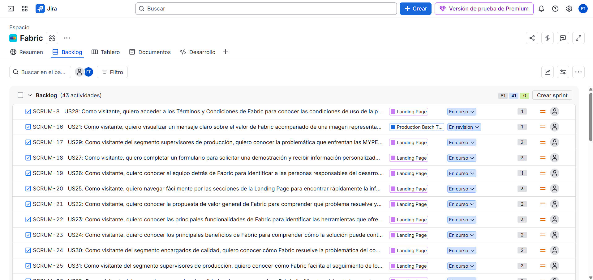

 

**Link de Jira:** https://colmop1548.atlassian.net/jira/software/projects/SCRUM/boards/1/backlog?atlOrigin=eyJpIjoiNzE0ZGM3NTQwYTdmNDY3ZGJlNzBkY2YxNGMzYTZjOWIiLCJwIjoiaiJ9

# Capítulo IV: Product Design

## 4.1. Style Guidelines

Un **Style Guideline** es un conjunto de reglas y recomendaciones que definen como deben presentarse, escribirse o diseñarse algo dentro de un contexto determinado, con el fin de garantizar consistencia, claridad y calidad. Esto no se limita solo a código, sino también al diseño visual, documentación o estructura de un software.

A continuación, definiremos los estándares de diseño de nuestro producto.

### 4.1.1. General Style Guidelines

 **Branding**

 La identidad de **Fabric** nace del concepto **"Trazabilidad textil inteligente"**. Buscamos proyectar una imagen de tecnología aplicada directamente a la realidad operativa del taller textil. El logo es la materialización de este concepto: la fusión del hilo (producción/artesanía) y el nodo (tecnología/centralización).

 **Principios de diseño**

 - **Tecno-Artesanal:** Los componentes visuales deben equilibrar lo orgánico (formas de la tela) con lo geométrico (precisión de los datos).

 - **Claridad Operativa:** La interfaz debe priorizar la legibilidad de métricas críticas sobre la ornamentación.

 - **Cercanía:** Reflejar la realidad de las MYPE textiles de Gamarra en la presentación de la información.

  
 

    
 

  

**Tipogragía**

La tipografía de **Fabric** con tres condiciones: ser legible en pantallas pequeñas y en la planta **(donde hay poca luz y mucho ruido visual)**, transmitir estructura y orden, y ser cercana sin ser informal **(nos dirigimos a supervisores y operarios, no a gerentes corporativos)**. 

**Fuentes elegidas**

- **Poppins SemiBold:** para titulos, encabezados y números grandes de indicadores. Es un tipo de letra geométrica, redonda, moderna, con buena presencia visual. Se puede leer bien en tamaños grandes y no se confunden con tipografías genéricas de software.

- **Inter Regular:** para cuerpo de texto, formularios, tablas y menús. Nuestro producto esta diseñado para ser usado muchas horas al dia, por lo que este tipo de letra es la idea. Es una tipografía que no cansa la vista y se puede leer en tamaños pequeños o en poca luz. Además, Fabric maneja datos, tablas, formularios y estados que deben ser claros de un vistazo, y Inter Regular tiene letras rectas y bien definidas que evitan confusiones entre caracteres parecidos.

- **JetBrains Mono:** para códigos de lote, IDs, fechas y cifras técnicas. Es un tipo de letra monoespaciada: todos los caracteres ocupan el mismo ancho. Eso permite alinear bien los números en tablas, códigos de lote y fechas, y además evita confusiones entre caracteres parecidos como el 0 y la O, o el 1 y la l. Por eso se usa solo para códigos, IDs y cifras técnicas, donde la precisión es clave.
 
 

    

 

**Colores**

**Colores principales**

El color verde oliva `(#4B5320)` es el color principal de Fabric.Se eligió porque es un tono sobrio, industrial y fácil de leer en pantalla, y porque no se asocia a ninguna marca tecnológica conocida. Se usa en el logotipo, en los encabezados y en los botones principales.

El beige arena `(#C9A87C)` es el color secundario. Representa la tela cruda y el trabajo del taller. Se usa en fondos suaves, íconos secundarios y detalles del logo.

**Colores funcionales**

Estos colores no forman parte de la identidad de marca, pero sí del lenguaje visual del producto. Se usan exclusivamente para comunicar estados operativos:

- **Verde éxito (#27AE60)** - lote completado, inspección aprobada, indicador en rango.

- **Amarillo alerta (#F2C94C)** - lote en riesgo, advertencia, desviación leve.

- **Rojo error (#EB5757)** - lote retrasado, defecto crítico, incidencia grave.

 

    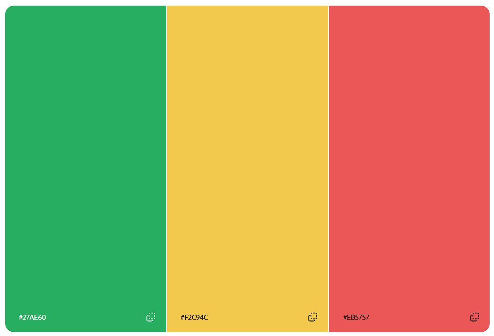

 

**Colores neutros**

Los colores neutros son la base visual de toda la interfaz de Fabric. Se eligieron tonos con una ligera inclinación al frío (levemente azulados) para dar sensación de orden, limpieza y calma visual, algo importante en una herramienta que se usa durante toda la jornada laboral en planta.

    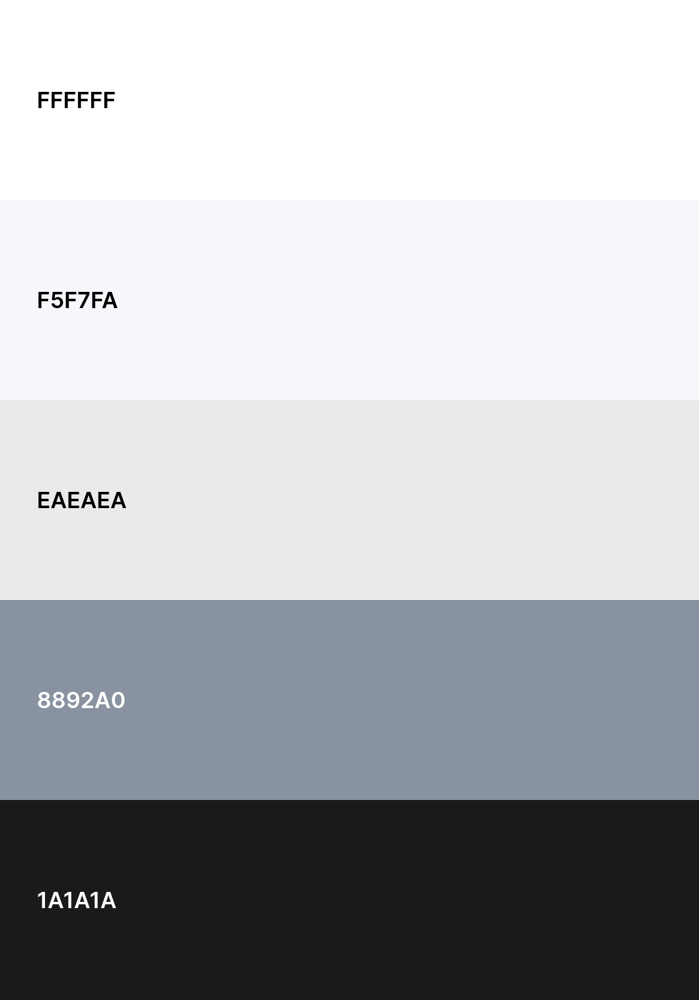

 

- **White (#FFFFFF):**  Es el fondo por defecto de la aplicación. Se usa en pantallas principales y como color de texto cuando va sobre fondos oscuros. No se debe usar en bloques grandes dentro de tarjetas; para eso está el color **Platinum**.

- **Platinum (#F5F7FA):** Se usa en tarjetas, filas alternas de tabla, paneles laterales y cualquier bloque que necesite diferenciarse del fondo principal sin usar bordes. Será el color más usado después del blanco.

- **Alabaster Grey (#EAEAEA):** Se usa para separadores finos entre secciones, fondos de estado inactivo (botones deshabilitados) y zonas donde se necesita un contraste muy suave.

- **Cool Steel (#8892A0):** Se usa para textos de apoyo, placeholders, íconos inactivos, bordes de inputs, líneas divisorias.

- **Carbon Black (#1A1A1A):** Es el color del texto principal y los títulos. Se eligió en lugar del **Negro Puro (#000000)** porque reduce la fatiga visual en pantallas y genera un contraste más natural y menos agresivo.

 

**Espaciado**

Nos regimos por un espaciado funcional y no decorativo. Como la aplicación web se usará en planta y por muchas horas continuas, entonces el espaciado debe separar sin confundir, ordenar la información sin saturar la vista del usuario.

**Sistema base**

En la aplicación usamos un sistema de espaciado basado en múltiplos de **8px**. Es el estándar más usado en diseño de interfaces porque facilita la consistencia y evita medidas arbitrarias.

| Token | Valor | Uso |
|---|---|---|
| `xs` | 4 px | Espacio entre ícono y texto |
| `sm` | 8 px | Padding interno de botones pequeños |
| `md` | 16 px | Separación entre campos de formulario |
| `lg` | 24 px | Padding de tarjetas, separación entre secciones |
| `xl` | 32 px | Separación entre bloques grandes |
| `2xl` | 48 px | Márgenes de página |
| `3xl` | 64 px | Separación entre secciones principales |

**Como usar**

- Todo espaciado debe ser múltiplo de **8 px** (excepto detalles como bordes o íconos inline, que pueden ser de 4 px).
- El espacio entre elementos relacionados debe ser menor que el espacio entre grupos distintos. 
- Los formularios usan `md` entre campos y `lg` entre secciones.
- Las tarjetas usan `lg` de padding interno.
- Las tablas usan `sm` entre celdas y `md` entre filas.
- Nunca usar espaciados aleatorios (13 px, 17 px, 22 px). Siempre múltiplos de 8.

**Tono de comunicación**

El tono de Fabric es cercano, claro y directo. Hablamos como uno más del taller, no como un sistema corporativo. El usuario no es **"el cliente"** ni **"el usuario final"**: es el supervisor, el encargado de calidad, el operario. Personas reales, con prisa, en un entorno ruidoso, que necesitan respuestas rápidas.

> Principios de comunicación:
> - **Claridad antes que simpatia:** Decimos "Registrar lote" en vez de "Registremos tu lote".
> - **Frases cortas:** Maximo 12 palabras por oración en la interfaz.
> - **Tuteo:** "Tus lotes" en vez de "Sus lotes".
> - **Verbos imperativos para acciones:** "Guardar", "Crear lote", "Ver historial".
> - **Consistencia total:** Si el boton dice "Crea lote", el mensaje de éxito dice "Lote creado" y no "Lote registrado" o "Lote guardado".

### 4.1.2. Web Style Guidelines

A continuación definiremos los estándares de diseño visual y estructura de la Aplicación Web. 

**Tipografía**

Como mencionamos anteriormente en **General Style Guidelines**, la tipografía que se usa para la interfaz de Fabric será **Poppins SemiBold** para títulos y subtítulos porque tiene presencia y se lee bien en tamaños grandes, **Inter Regular** para el texto, formulario, tablas y menús porque tiene una buena legibilidad en textos pequeños, por último usaremos **JetBrains Mono** para los códigos de lote, IDs, fechas y cifras técnicas porque al ser monoespaciada alinea los números en columnas y evita confusiones entre caracteres parecidos como el `0` y `o`.

En la siguiente tabla se especificará a detalle el correcto uso de cada tipografía y su propósito.

| Uso | Fuente | Peso| 
|-----------|--------|-------------|
|Títulos |   Poppins | SemiBold (600)|
|Subtítulos  | Poppins | Medium (500)|
|Texto |  Inter | Regular (400)|
|Énfasis en texto | Inter | SemiBold (600)|
|Datos numéricos/IDs | JetBrains Mono | Regular (400)|

Usamos esta tipografía porque ofrece facilidad de leer la interfaz. En Fabric, el usuario trabaja muchas horas frente a la pantalla, y una tipografía mal elegida cansa la vista y genera errores de lectura.

**Paleta de colores**

 La paleta de colores que usaremos en la interfaz está dividida en tres grupos con funciones distintas. Los colores de marca (verde oliva y beige arena) dan identidad y evocan el taller textil; los colores funcionales (verde, amarillo, rojo) comunican estados operativos de un vistazo, sin que el usuario tenga que leer; y los colores neutros sostienen toda la interfaz, desde los fondos hasta los textos, con una ligera inclinación al frío para dar sensación de orden y limpieza.

 **Colores de marca**

 

    

 

| Color | HEX | Uso |
|---|---|---|
| Verde oliva | `#4B5320` | Logo, encabezados, botones primarios |
| Beige arena | `#C9A87C` | Acentos, íconos secundarios |

 

**Colores funcionales**

    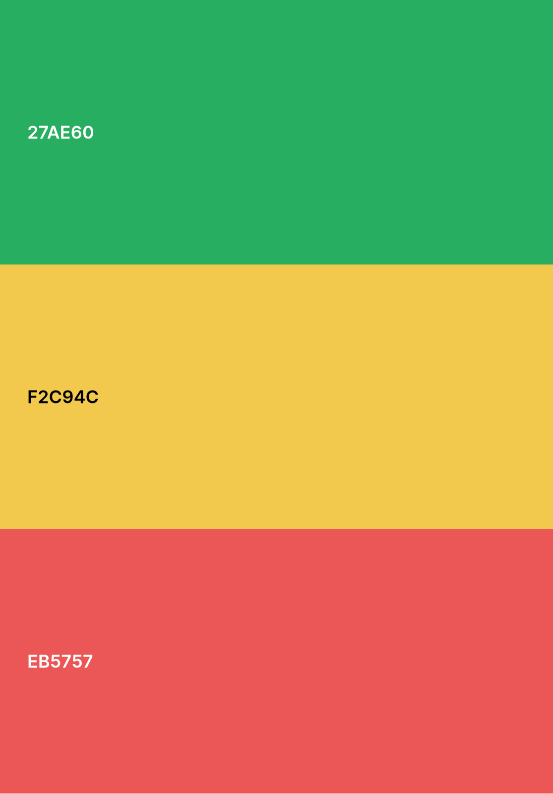

 

| Color | HEX | Uso |
|---|---|---|
| Verde éxito | `#27AE60` | Lote completado, inspección aprobada |
| Amarillo alerta | `#F2C94C` | Lote en riesgo |
| Rojo error | `#EB5757` | Cancelar, defectos críticos |

 

**Colores neutros**

    

 

| Color | HEX | Uso |
|---|---|---|
| Blanco | `#FFFFFF` | Fondos principales |
| Platinum | `#F5F7FA` | Fondos alternos, tarjetas |
| Alabaster Grey | `#EAEAEA` | Separadores, estados inactivos |
| Cool Steel | `#8892A0` | Texto secundario, bordes |
| Carbon Black | `#1A1A1A` | Texto principal |

 

**Grid y Layout**

El layout de Fabric se construye sobre una grilla de 12 columnas porque permite dividir el espacio en mitades, tercios, cuartos y sextos sin cálculos complicados. Todo el contenido se alinea a esa grilla, con un ancho máximo de 1280 px para que las líneas de texto no se vuelvan incómodas de leer en pantallas muy anchas, y márgenes laterales que se adaptan al tamaño del dispositivo. Esto garantiza que una misma pantalla se vea ordenada en un celular, en una tablet y en un monitor grande, sin que el equipo tenga que inventar medidas nuevas cada vez.

**Grilla Base**

| Elemento  | Valor  |
|----|---|
|  Columnas| 12|
| Ancho Máximo | 1280px|
|Espacio entre columnas | 24 px (`lg`)
|  Margen lateral desktop  |  48 px (`2xl`) |
| Margen lateral tablet  | 32 px (`xl`) |
|  Margen lateral movil|   16 px (`md`)|

 

**Breakpoints**

|  Token |  Ancho   |  Dispositivo  |  Columnas activas |
|-------|-------|----|---|
|  `sm`|  640 px  | Movil horizontal  |   4  |
| `md`  | 768 px  | Tablet vertical  |    8 |
| `lg`  | 1024 px  |  Laptop  |  12 |
| `xl`  | 1280 px  | Desktop  |  12 |
| `2xl`  | 1536 px  | Desktop grande  | 12  |

 

**Distribucion de columnas**

| Uso | Columnas | Resultado visual |
|---|---|---|
| Contenido principal | 8 | Ocupa dos tercios del ancho |
| Panel lateral | 4 | Ocupa un tercio del ancho |
| Tres tarjetas | 4 + 4 + 4 | Tres bloques iguales |
| Cuatro tarjetas | 3 + 3 + 3 + 3 | Cuatro bloques iguales |
| Contenido centrado | 6 | Con 3 columnas de margen a cada lado |
| Formulario | 6 a 8 | Centrado, sin estirarse demasiado |
| Dashboard | 12 | Ocupa todo el ancho |
| Login | 4 | Tarjeta centrada y compacta |

 

**Componentes UI**

Estas son las piezas reutilizables con las que se construye toda la interfaz de **Fabric**. Cada uno está definido con sus variantes, estados, tokens aplicados y reglas de uso, para que cualquier miembro del equipo pueda construir pantallas nuevas sin reinventar nada ni romper la coherencia visual. Todos los componentes consumen los tokens definidos en el general style guideline (colores, tipografía, espaciado).

**1. Botones**

En la aplicación web hay cinco tipos de botón, cada uno con un rol definido, y todos comparten los mismos estados (hover, focus, activo, deshabilitado) para que el usuario sepa en todo momento que la interfaz está respondiendo. Los CTA importantes siempre usan el verde oliva como color principal, porque es el color de la marca y el que el usuario aprende a reconocer como "acción principal".

| Tipo | Fondo | Texto | Uso |
|---|---|---|---|
| Primario | `#4B5320` | Blanco | Acción principal |
| Secundario | Borde `#4B5320` | `#4B5320` | Acción alternativa |
| Texto | Sin fondo | `#4B5320` | Acción terciaria |
| Peligro | `#EB5757` | Blanco | Eliminar, cancelar |
| Deshabilitado | `#EAEAEA` | `#8892A0` | No disponible |

 

**Estados:**

| Estado | Comportamiento |
|---|---|
| Normal | Color base |
| Hover | Oscurecer 10% |
| Focus | Borde 2 px `#C9A87C` |
| Active | Oscurecer 15% |
| Disabled | 40% de opacidad |

 

**Tokens aplicados:**

| Propiedad | Token | Valor |
|---|---|---|
| Padding horizontal | `lg` | 24 px |
| Padding vertical | `sm` | 8 px |
| Radio de borde | ninguno | 8 px |
| Tipografía | ninguno | Inter SemiBold 14 px |

 

**2. Inputs y formularios**

 Todos los campos siguen la misma estructura: etiqueta arriba, input en el centro y un mensaje debajo cuando algo falla.

 **Elementos:**

| Elemento | Descripción |
|---|---|
| Label | Encima del input, Inter Regular 14 px, `#1A1A1A` |
| Input | 40 px de alto, borde `#EAEAEA`, radio 8 px |
| Placeholder | Texto de ayuda, `#8892A0` |
| Mensaje de error | Debajo, `#EB5757`, 12 px |
| Texto de ayuda | Debajo, `#8892A0`, 12 px |

 

**Estados:**

| Estado | Comportamiento |
|---|---|
| Normal | Borde `#EAEAEA` |
| Focus | Borde 2 px `#4B5320` |
| Error | Borde 2 px `#EB5757` |
| Disabled | Fondo `#F5F7FA`, texto `#8892A0` |

 

**Tokens aplicados:**

| Propiedad | Token | Valor |
|---|---|---|
| Separación entre campos | `md` | 16 px |
| Separación entre secciones | `lg` | 24 px |
| Padding interno | `md` | 16 px |

 

Los inputs recibiran información tanto de registro de datos sobre lotes como del Login principal. En la vista móvil, cada campo ocupará el ancho completo de la pantalla.

 

**3. Badges y estados**

Los badges comunican el estado de un lote o inspección en un solo vistazo. Siempre tienen un texto, nunca solo color.

**Estados:**

| Estado | Fondo | Texto |
|---|---|---|
| En producción | `#4B5320` | Blanco |
| Completado | `#27AE60` | Blanco |
| Retrasado | `#EB5757` | Blanco |
| En riesgo | `#F2C94C` | `#1A1A1A` |
| En pausa | `#EAEAEA` | `#8892A0` |

 

**4. Sidebar**

Es la columna de navegación fija que acompaña al usuario en todas las pantallas.

**Elementos:**

| Elemento | Descripción |
|---|---|
| Logo | Arriba, altura 64 px |
| Navegación | Lista con ícono + texto |
| Sección activa | Fondo `#4B5320`, texto blanco |
| Sección inactiva | Texto `#8892A0`, hover `#F5F7FA` |
| Footer | Usuario, rol, cerrar sesión |

 

**Dimensiones:**

| Contexto | Ancho |
|---|---|
| Desktop expandido | 240 px |
| Desktop colapsado | 64 px |
| Tablet | 64 px |
| Móvil | Oculto (menú overlay) |

## 4.2. Information Arquitechture

En esta sección planteamos las decisiones y el sustento que dirigen la manera como se organizará el contenido en las experiencias web de Fabric, incluyendo la Landing Page y la Aplicación Web. Estas propuestas están orientadas a que los visitantes y usuarios se adapten con facilidad a la funcionalidad del producto y puedan encontrar todo lo que necesiten sin esfuerzo.

### 4.2.1. Organization Systems

En Fabric, la información se organiza de acuerdo con los principales procesos de producción y control de calidad de los talleres textiles, permitiendo que los usuarios accedan rápidamente a la información necesaria para sus actividades:

> * Esquema Jerárquico: La aplicación dispone de un Sidebar como nivel principal de navegación, desde el cual el usuario puede acceder a los módulos Dashboard, Production Batches, Quality, Machinery y Alerts. Dentro de cada módulo se encuentran las vistas y funcionalidades específicas correspondientes.
> * Estructura por Procesos: La información se agrupa según las principales actividades operativas del taller: seguimiento de lotes de producción, control de calidad de telas y prendas, monitoreo de maquinaria y gestión de alertas.
> * Organización Cronológica: Los movimientos de los lotes, inspecciones de tela y eventos de maquinaria mantienen registros asociados a fechas y horas para conservar la trazabilidad de las operaciones.

### 4.2.2. Labeling Systems

El sistema de etiquetado utiliza terminología relacionada directamente con las actividades realizadas dentro de los talleres textiles, manteniendo consistencia entre los diferentes módulos de Fabric:

> * Etiquetas de Navegación: Términos directos como "Dashboard", "Production Batches", "Quality", "Machinery" y "Alerts".
> * Etiquetas de Producción: Términos como "Batch ID", "Garment Model", "Projected Quantity", "Current Stage", "Processed Quantity", "Progress" y "Delivery Date".
> * Etiquetas de Calidad: Términos como "Fabric Inspections", "Garment Defects", "Inspection Result", "Defect Type", "Observed Quantity", "Rework" y "Permanent Discard".
> * Etiquetas de Estado: Estados como "Pending Cutting", "In Production", "At Risk", "Completed", "Delayed", "Available for Cutting", "Under Evaluation", "Under Maintenance" y "Operational", dependiendo del proceso correspondiente.

### 4.2.3. SEO Tags and Meta Tags

Para favorecer el posicionamiento de la Landing Page de Fabric y su relevancia en búsquedas relacionadas con la gestión de producción textil:

> * Indexado y Crawling: Uso de la etiqueta `<meta name="robots" content="index, follow">` para permitir que los motores de búsqueda rastreen e indexen el contenido público de la Landing Page.
> * Meta Title: "Fabric | Gestión y Trazabilidad para la Producción Textil".
> * Meta Description: "Plataforma web para el seguimiento de lotes, control de calidad y monitoreo operativo en talleres textiles. Centraliza la información de producción y facilita la detección de defectos, retrasos y mermas".
> * Palabras Clave: Gestión de producción textil, control de calidad textil, trazabilidad de lotes, MYPE textil Lima, seguimiento de producción, defectos textiles, gestión de talleres textiles, Fabric, GlitchLab UPC.

### 4.2.4. Searching Systems

Los sistemas de búsqueda de Fabric están diseñados para permitir que los usuarios localicen rápidamente lotes, inspecciones y registros relacionados con las operaciones del taller:

> * Búsqueda de Lotes: En "Production Batches", el usuario puede buscar directamente un lote mediante su "Batch ID".
> * Filtros de Lotes: Los registros pueden filtrarse utilizando criterios como "Status", "Date" y "Garment Model", permitiendo combinar diferentes criterios de búsqueda.
> * Filtros de Inspecciones: En el módulo "Quality", los registros históricos de inspecciones pueden consultarse utilizando criterios como rollo, proveedor, fecha y resultado de inspección.
> * Filtros Operativos: Los registros relacionados con defectos pueden segmentarse por lote, máquina, tipo de defecto o periodo, según la información disponible.
> * Visualización de Resultados: Cuando ningún registro coincide con los criterios establecidos, el sistema muestra un estado de "No results found", permitiendo al usuario modificar los filtros utilizados.

### 4.2.5. Navigation Systems

El sistema de navegación de Fabric permite que el usuario mantenga el control sobre su ubicación dentro de la plataforma y acceda directamente a los diferentes procesos disponibles:

> * Navegación Global de la Landing Page (Header): Barra superior con acceso a las secciones "Home", "Problem", "Solution", "Benefits" y "Features", además de las acciones "Log In" y "Request a Demo".
> * Navegación Principal de la Aplicación (Sidebar): Menú lateral persistente con acceso directo a "Dashboard", "Production Batches", "Quality", "Machinery" y "Alerts".
> * Navegación Local: Algunos módulos incorporan opciones internas para organizar sus funcionalidades. Por ejemplo, "Quality" permite diferenciar entre "Fabric Inspections" y "Garment Defects".
> * Navegación Contextual: Las vistas de registro y detalle incluyen opciones como "Back to Production Batches" o "Back to Fabric Inspections", permitiendo regresar a la vista principal del módulo correspondiente.
> * Navegación de Sesión: El Sidebar incluye el perfil del usuario y las opciones "View Profile" y "Log Out". Al cerrar sesión, el sistema redirige al usuario hacia la vista de inicio de sesión.
> * Navegación de Salida (Footer): La Landing Page incluye accesos complementarios como "Terms & Conditions" e información relacionada con Fabric y GlitchLab.

## 4.3. Landing Page UI Design

El diseño de la Landing Page de Fabric es importante porque será el primer contacto de los usuarios con nuestra plataforma. Buscamos mostrar de forma clara el problema que queremos resolver, nuestra solución y sus principales beneficios, generando interés en los usuarios para que conozcan más sobre Fabric.

### 4.3.1. Landing Page Wireframe

El wireframe de la Landing Page de Fabric inicia con un encabezado que contiene el logo, el menú de navegación, la opción de idioma y el botón para solicitar una demostración. Luego, se presenta una sección principal o Hero con la propuesta de valor de Fabric, enfocada en gestionar la producción, calidad y trazabilidad textil desde una sola plataforma. Además, se incluye un botón de “Request a Demo” como principal llamado a la acción.

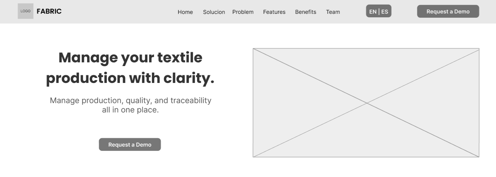

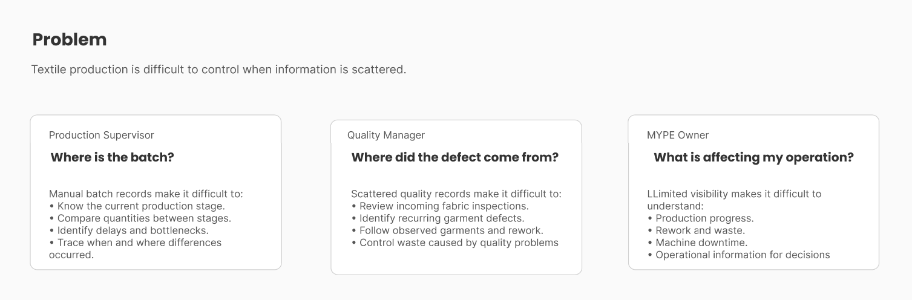

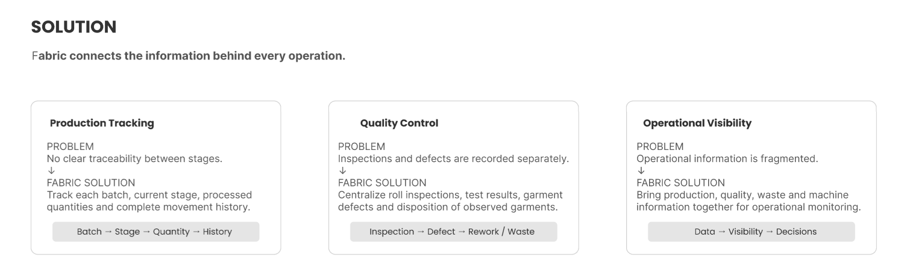

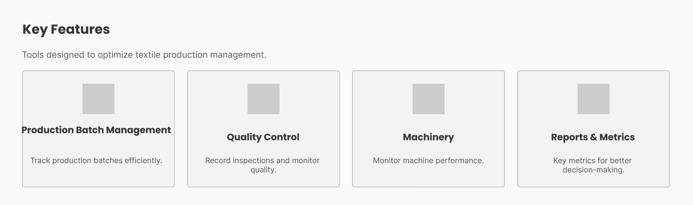

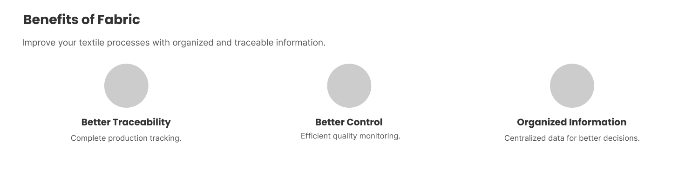

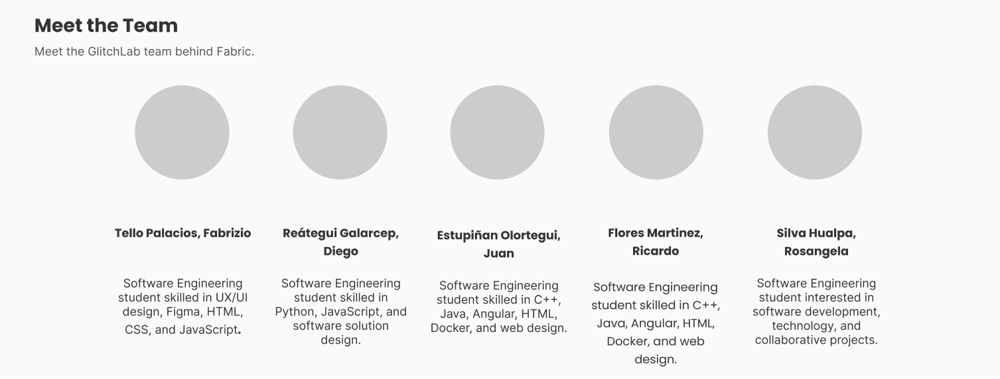

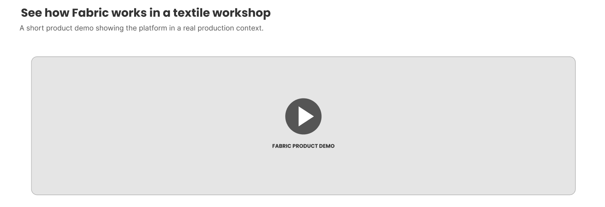

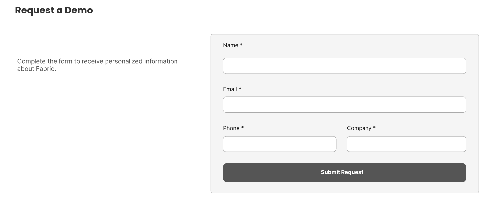

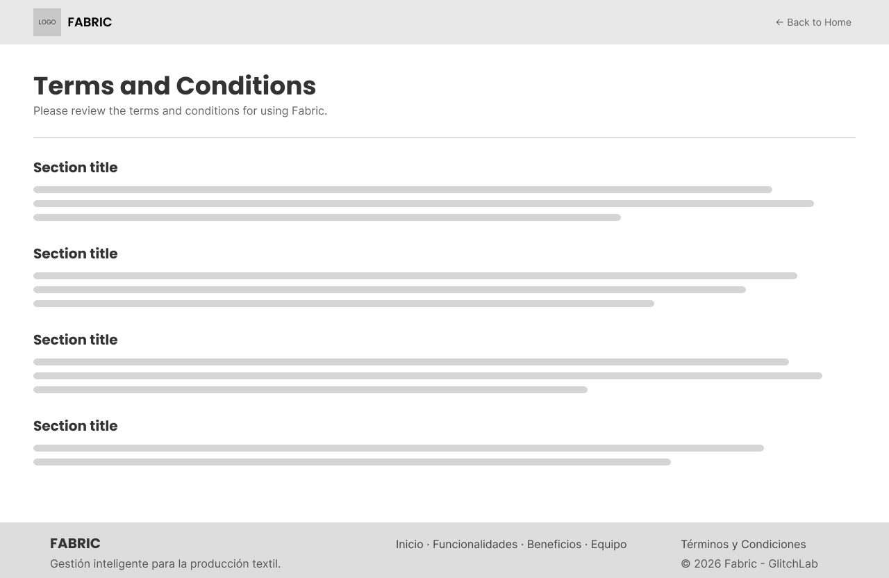

### 4.3.2. Landing Page Mock-up

El mockup de la Landing Page de Fabric muestra el diseño final de la página a partir de los wireframes realizados previamente. Se utilizan los colores, tipografías y componentes visuales definidos para la marca Fabric. La página presenta de forma ordenada el problema, la solución, los beneficios y las principales funcionalidades de la plataforma. Además, incluye botones de acción como "Request a Demo" para facilitar la interacción del usuario y mantener una navegación clara tanto en desktop como en mobile.

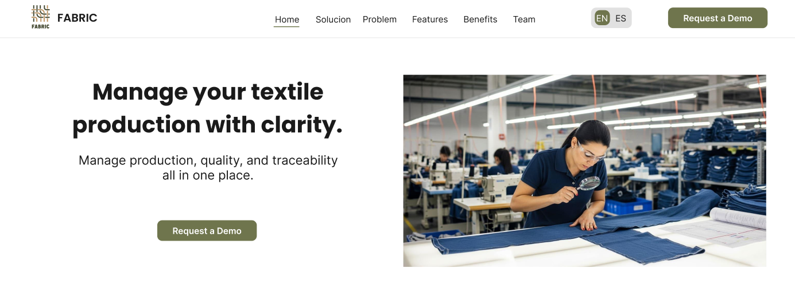

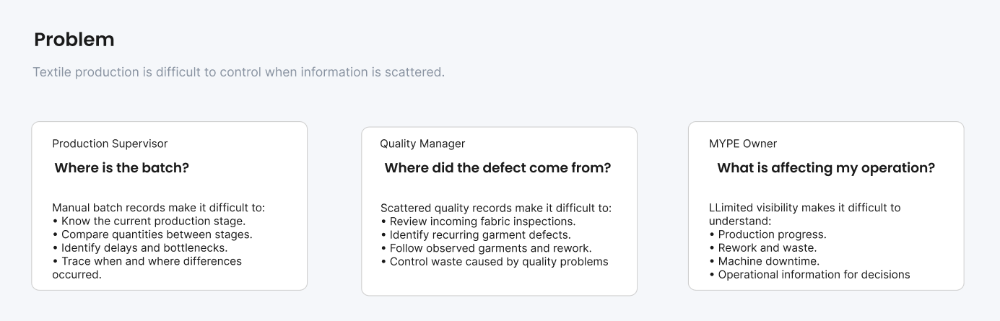

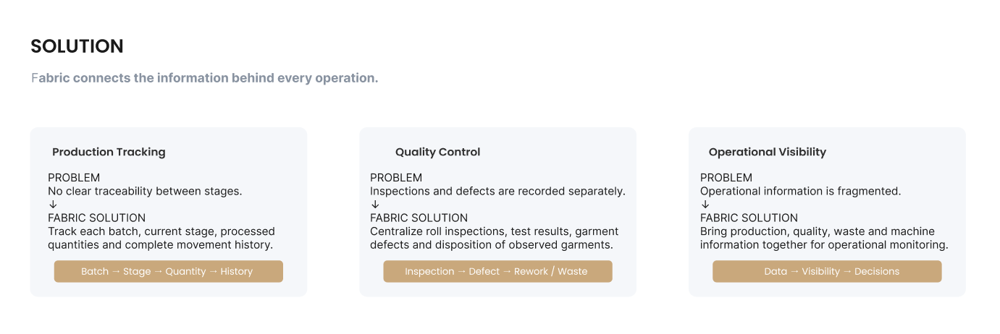

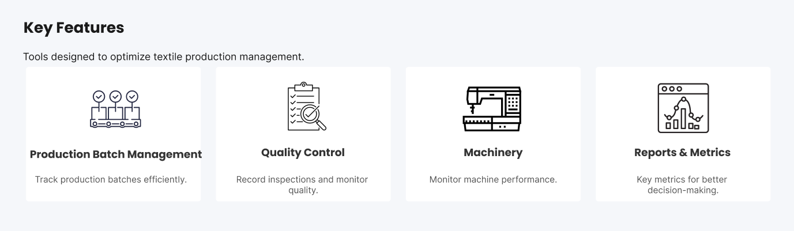

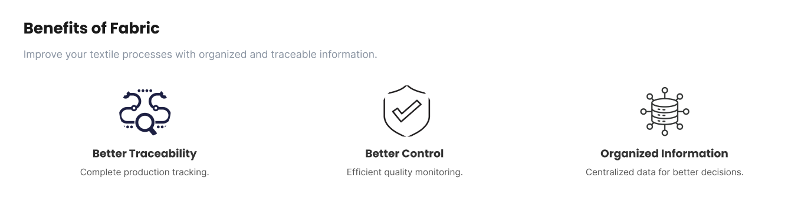

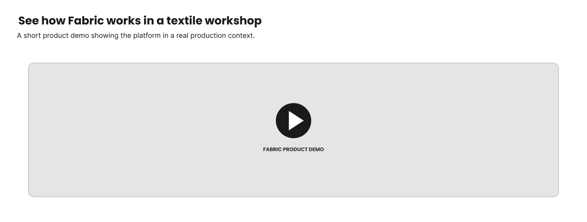

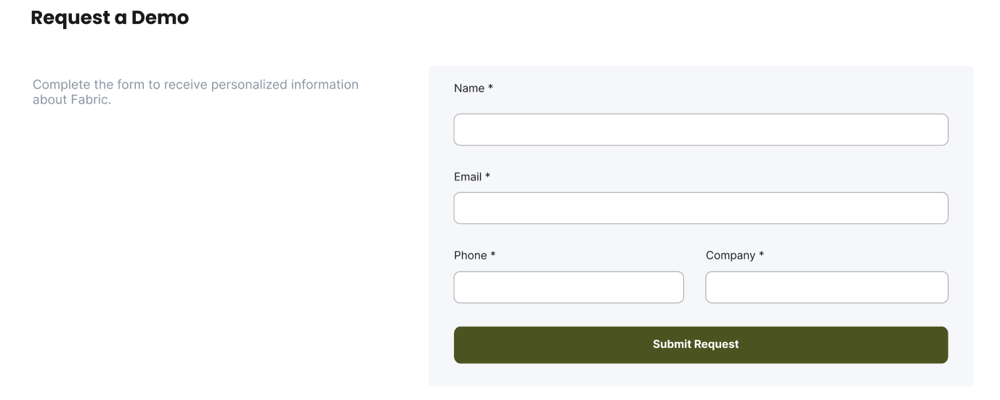

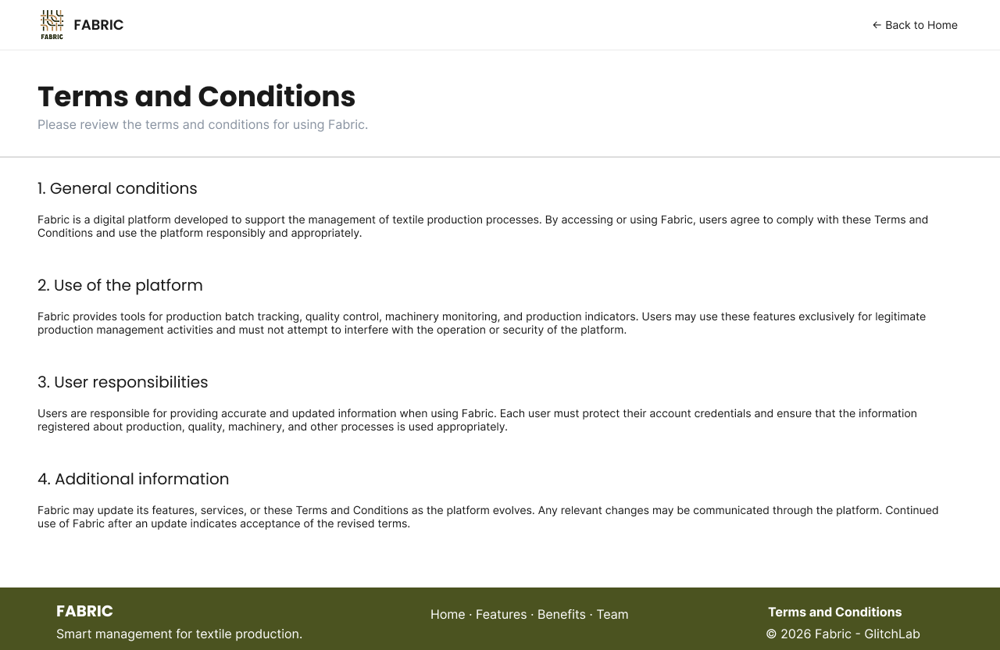

## 4.4. Web Applications UX/UI Design

El diseño UX/UI de la aplicación web de Fabric se enfoca en ofrecer una experiencia clara y sencilla para la gestión de los procesos de producción y calidad en talleres textiles. Desde la perspectiva UX, se prioriza que los usuarios puedan consultar el estado de los lotes, realizar su trazabilidad, registrar inspecciones, controlar defectos, revisar el estado de las máquinas y detectar alertas de manera rápida.
En cuanto al diseño UI, Fabric utiliza una interfaz limpia y organizada, con un menú lateral para acceder a las principales secciones del sistema, además de tablas, formularios, indicadores, filtros y alertas que facilitan la visualización de la información.
En conjunto, el diseño busca centralizar la información del proceso productivo y facilitar las tareas de supervisores de producción, encargados de calidad y responsables de la MYPE.

### 4.4.1. Web Applications Wireframes
[Link de Figma](https://www.figma.com/design/dBUhuELHlr1YLn7S28kDqH/Fabric?node-id=0-1&t=gC1lj7cIPNrExaGH-1)

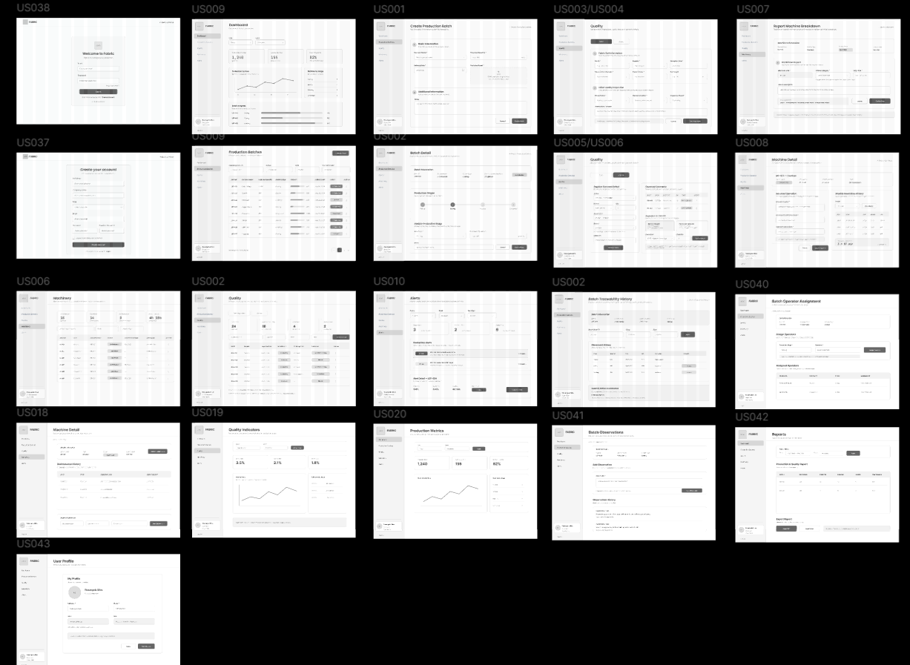

### 4.4.2. Web Applications Wireflow Diagrams
[Link de Wireflow]([https://www.figma.com/design/dBUhuELHlr1YLn7S28kDqH/Fabric?node-id=0-1&t=gC1lj7cIPNrExaGH-1](https://lucid.app/lucidchart/0932971e-c99b-417f-bea5-05ea62a1004b/edit?viewport_loc=6274%2C-1786%2C5993%2C3657%2C0_0&invitationId=inv_04f70535-68df-4dd4-bf22-c20333b45160))

Los Wireflow Diagrams de Fabric representan de forma visual la navegación entre las principales interfaces de la aplicación web. Para ello, se utilizan los wireframes desarrollados previamente y se conectan mediante flechas que muestran las acciones y recorridos que puede realizar el usuario.
El wireflow inicia desde el acceso al sistema y continúa hacia el Dashboard, desde donde el usuario puede ingresar a módulos como Production Batches, Quality, Machinery y Alerts. A partir de estas vistas se muestran los accesos a funcionalidades específicas, como la trazabilidad de lotes, inspecciones de calidad, registro de defectos, historial de mantenimiento y gestión de alertas.

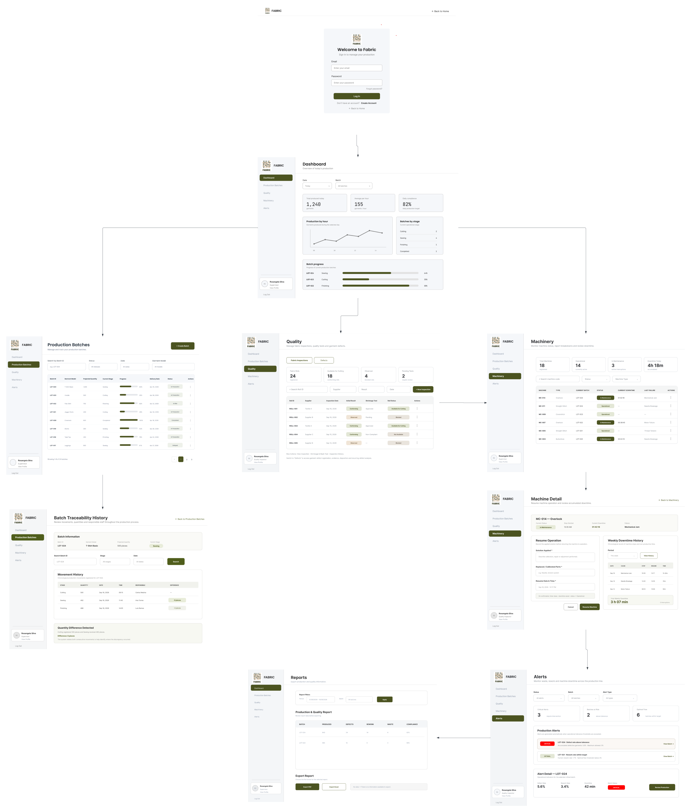

### 4.4.3. Web Applications Mock-ups

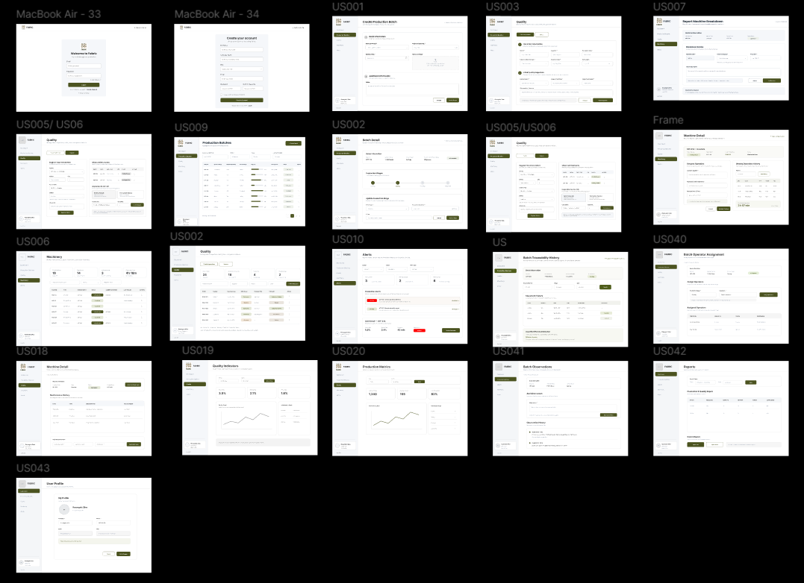

### 4.4.4. Web Applications User Flow Diagrams
#### User Flow 1: Registro de inspección de tela

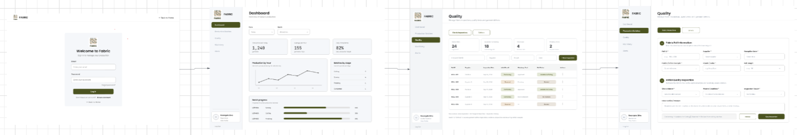

#### User Flow 2: Consulta de trazabilidad de lote

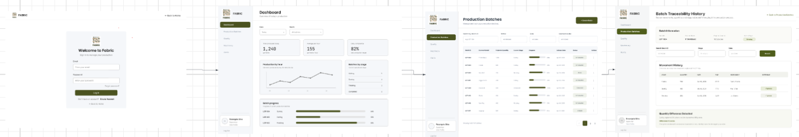

## 4.5. Web Applications Prototyping

Se desarrolló un prototipo interactivo que simula los flujos principales de la aplicación.
La siguiente figura muestra una vista previa del prototipo:

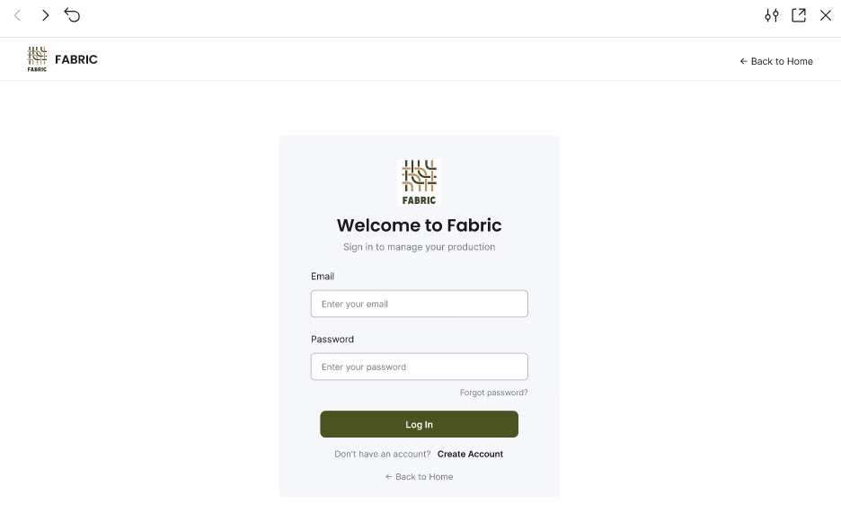

## 4.5. Web Applications Prototyping

Se desarrolló un prototipo interactivo que simula los flujos principales de la aplicación.
La siguiente figura muestra una vista previa del prototipo:

